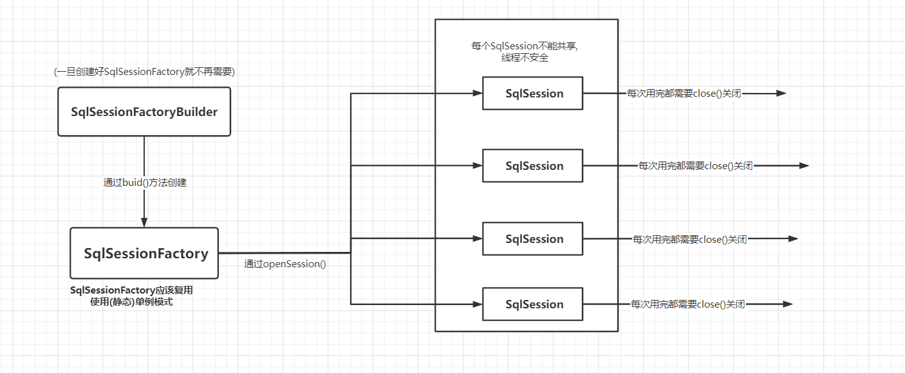
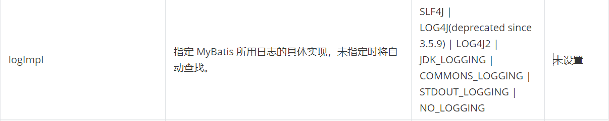

# Mybatis

## 简介

> 官网地址:[mybatis – MyBatis 3 | 简介](https://mybatis.org/mybatis-3/zh/index.html)

MyBatis 是一款优秀的**持久层框架**，它支持自定义 SQL、存储过程以及高级映射。MyBatis 免除了几乎所有的 JDBC 代码以及设置参数和获取结果集的工作。MyBatis 可以通过简单的 XML 或注解来配置和映射原始类型、接口和 Java POJO（Plain Old Java Objects，普通老式 Java 对象）为数据库中的记录。MyBatis本是apache的一个[开源项目](https://baike.baidu.com/item/开源项目/3406069)iBatis，2010年这个[项目](https://baike.baidu.com/item/项目/477803)由apache software foundation迁移到了[google code](https://baike.baidu.com/item/google code/2346604)，并且改名为MyBatis。2013年11月迁移到[Github](https://baike.baidu.com/item/Github/10145341)。

iBATIS一词来源于“internet”和“abatis”的组合，是一个基于Java的[持久层](https://baike.baidu.com/item/持久层/3584971)框架。iBATIS提供的持久层框架包括SQL Maps和Data Access Objects（DAOs）。

**导入mybatis:**

- maven

  ```xml
  <!-- https://mvnrepository.com/artifact/org.mybatis/mybatis -->
  <dependency>
      <groupId>org.mybatis</groupId>
      <artifactId>mybatis</artifactId>
      <version>3.5.7</version>
  </dependency>
  ```

**优点:**

**简化了JDBC的操作**


## 入门案例

1. **需要的依赖包有: mybatis依赖, 数据库驱动依赖包**

如下所示使用maven导入:

```xml
<!-- https://mvnrepository.com/artifact/org.mybatis/mybatis -->
<dependency>
    <groupId>org.mybatis</groupId>
    <artifactId>mybatis</artifactId>
    <version>3.5.7</version>
</dependency>

<!-- mysql链接驱动,注意,请选高一点的版本-->
<dependency>
            <groupId>mysql</groupId>
            <artifactId>mysql-connector-java</artifactId>
            <version>8.0.21</version>
</dependency>

<!-- maven的测试工具-->
 <dependency>
            <groupId>junit</groupId>
            <artifactId>junit</artifactId>
            <version>4.13</version>
            <scope>test</scope>
</dependency>
```

2. **编写核心配置文件**

   在resoures文件夹下创建配置文件`mybatis-config.xml`内容如下(来自官网):

   ```xml
   <?xml version="1.0" encoding="UTF-8" ?>
   <!DOCTYPE configuration
           PUBLIC "-//mybatis.org//DTD Config 3.0//EN"
           "http://mybatis.org/dtd/mybatis-3-config.dtd">
   <configuration>
       <environments default="development">
           <environment id="development">
               <transactionManager type="JDBC"/>
               <dataSource type="POOLED">
                   <property name="driver" value="com.mysql.cj.jdbc.Driver"/>
   <!--注意: 由于xml中无法直接使用 & ,所以需要使用 转义字符 &amp; , 此外高版本的mysql驱动还需要设置时区-->
                   <property name="url" value="jdbc:mysql://localhost:3306/mybatis?useSSL=true&amp;serverTimezone=Asia/Shanghai&amp;useUnicode=true&amp;characterEncoding=UTF-8"/>
                   <property name="username" value="root"/>
                   <property name="password" value="123456"/>
               </dataSource>
           </environment>
       </environments>
       <mappers>
           <!--        注意:这里的路径下一级用 / 表示,可以注册多个映射器          -->
           <mapper resource="dao/UserMapper.xml"/>
       </mappers>
   </configuration>
   ```

   

3. **编写获取SqlSession的mybatis工具类**

   ```java
   import org.apache.ibatis.io.Resources;
   import org.apache.ibatis.session.SqlSession;
   import org.apache.ibatis.session.SqlSessionFactory;
   import org.apache.ibatis.session.SqlSessionFactoryBuilder;
   import java.io.IOException;
   import java.io.InputStream;
   
   public class MybatisUtiles {
       static SqlSessionFactory sqlSessionFactory;
       static {
           String resource = "mybatis-config.xml";    // mybatis核心配置文件名
           InputStream inputStream = null;    
           try {
               inputStream = Resources.getResourceAsStream(resource);    // 从 resources
           } catch (IOException e) {
               e.printStackTrace();
           }
           // 使用SqlSession工常构造器构建 SqlSession工厂
           sqlSessionFactory = new SqlSessionFactoryBuilder().build(inputStream);   
       }
       static SqlSession getSqlSession(){
           return sqlSessionFactory.openSession();
       }
   }
   ```

   4. **编写持久层接口, 并且还有实体类, 以及对应的映射配置文件**

   持久层接口 `UserDao.java`

   ```java
   package dao;
   
   import pojo.User;
   import java.util.LinkedList;
   
   public interface UserDao {
       LinkedList<User> getUser();
   }
   
   ```

   实体类:`User.java`

   ```java
   package pojo;
   
   public class User {
       private int uid;
       private String name;
       private String pwd;
   
       public int getUid() {
           return uid;
       }
   
       public void setUid(int uid) {
           this.uid = uid;
       }
   
       public String getName() {
           return name;
       }
   
       public void setName(String name) {
           this.name = name;
       }
   
       public String getPwd() {
           return pwd;
       }
   
       public void setPwd(String pwd) {
           this.pwd = pwd;
       }
   
       @Override
       public String toString() {
           return "User{" +
                   "uid=" + uid +
                   ", name='" + name + '\'' +
                   ", pwd='" + pwd + '\'' +
                   '}';
       }
   }
   
   ```

   

   对应的映射文件: `UserMapper.xml`

   ```xml
   <?xml version="1.0" encoding="UTF-8" ?>
   <!DOCTYPE mapper
           PUBLIC "-//mybatis.org//DTD Mapper 3.0//EN"
           "http://mybatis.org/dtd/mybatis-3-mapper.dtd">
   <!--命名空间作用是绑定 Dao/Mapper接口,相当于编写了一个类实现了该接口-->
   <mapper namespace="UserDao">
       <!-- id就当于Dao/Mapper接口的方法,相当于实现了接口重写了接口里的方法,方法体内容就是sql,
      返回类型和参数类型应该与重写的方法保持一致
   -->
       <select id="getUser" resultType="dao.UserDao" >
           select * from mytatistest.user;  
       </select>
   </mapper>
   ```

   #### 使用maven的测试工具测试
   
   ```java
   import dao.UserDao;
   import org.apache.ibatis.session.SqlSession;
   import pojo.User;
   import utlis.MybatisUtiles;
   
   import java.util.LinkedList;
   
   public class Test {
   
       @org.junit.Test
       public void test(){
           SqlSession sqlSession = MybatisUtiles.getSqlSession();
   
           UserDao userDao =  sqlSession.getMapper(UserDao.class);
           LinkedList<User> list = userDao.getUser();
   
           for (User user:list) {
               System.out.println(user);
           }
           sqlSession.close();
   
       }
   }
   
   ```
   
   

## 增删改查

### 注意点:

- ==增删改操作需要(sqlSession.commit())提交事务,不然无法生效==
- ==sql需要用到参数的时候, 参数用占位符#{字段名或参数名}表示 , 此外如果参数类型是对象,则可以直接使用对象的属性(字段)==

mybatis的核心配置文件(**注意! 如果涉及到多个映射器,就需要在核心配置文件中配置**)

```xml
<?xml version="1.0" encoding="UTF-8" ?>
<!DOCTYPE configuration
        PUBLIC "-//mybatis.org//DTD Config 3.0//EN"
        "http://mybatis.org/dtd/mybatis-3-config.dtd">
<configuration>
    <environments default="development">
        <environment id="development">
            <transactionManager type="JDBC"/>
            <dataSource type="POOLED">
                <property name="driver" value="com.mysql.cj.jdbc.Driver"/>
<!--               注意: 由于xml中无法直接使用 & ,所以需要使用 转义字符 &amp; , 此外高版本的mysql驱动还需要设置时区-->
                <property name="url" value="jdbc:mysql://localhost:3306/mybatis?useSSL=true&amp;serverTimezone=Asia/Shanghai&amp;useUnicode=true&amp;characterEncoding=UTF-8"/>
                <property name="username" value="root"/>
                <property name="password" value="123456"/>
            </dataSource>
        </environment>
    </environments>
    <mappers>
        <!--        注意:这里的路径下一级用 / 表示          -->
        <mapper resource="dao/UserMapper.xml"/>
        <mapper resource="dao/UserDao.xml"/>
    </mappers>
</configuration>
```

实体类与入门案例一样

**持久层接口**

```java
package dao;

import pojo.User;

import java.util.LinkedList;

public interface UserMapper {
//    根据id 获取用户
    LinkedList<User> getUser(int id);

    int addUser(User user);

    int updateUser(User user);

    int deleteUser(int id);
}
```

**映射器Mapper配置文件**

```xml
<?xml version="1.0" encoding="UTF-8" ?>
<!DOCTYPE mapper
        PUBLIC "-//mybatis.org//DTD Mapper 3.0//EN"
        "http://mybatis.org/dtd/mybatis-3-mapper.dtd">
<mapper namespace="dao.UserMapper">

<!--    注意,当参数类型是对象后, 对象的字段可以直接使用-->
    <insert id="addUser" parameterType="pojo.User">
        insert into `user` values(#{id},#{name},#{pwd}) ;
    </insert>

    <delete id="deleteUser" parameterType="int">
        delete from `user` where id = #{id}
    </delete>

    <update id="updateUser" parameterType="pojo.User">
        update `user` set `name` = #{name} , pwd = #{pwd} where id = #{id}
    </update>

    <!-- 标签的id属性相当于绑定了对应接口的方法名, 用#{}表示参数占位符, 参数名要和方法名一致 -->
    <select id="getUser" resultType="pojo.User" parameterType="int">
        select * from mybatis.user where id = #{id}
    </select>
</mapper>
```


### 使用maven工具进行测试

```java
import dao.UserDao;
import dao.UserMapper;
import org.apache.ibatis.session.SqlSession;
import pojo.User;
import utlis.MybatisUtiles;

import java.util.LinkedList;

public class Test {

    //根据 id 查询用户
    @org.junit.Test
    public void getUserById(){
//        获取 sql会话
        SqlSession sqlSession = MybatisUtiles.getSqlSession();
//        获取 持久层接口的映射
        UserMapper userMapper = sqlSession.getMapper(UserMapper.class);

        LinkedList<User> link = userMapper.getUser(2);

        for (User user:link) {
            System.out.println(user);
        }
    }

    // 添加用户
    @org.junit.Test
    public void addUser(){
        SqlSession sqlSession = MybatisUtiles.getSqlSession();
        UserMapper userMapper = sqlSession.getMapper(UserMapper.class);
        int res_n = 0 ;
        try{
            res_n = userMapper.addUser(new User(0,"北北","171771"));
//      增删改操作一定要提交事务
            sqlSession.commit();
        }
        catch (Exception e){
            System.err.println(e.getMessage());
        }

        if (res_n>0) {
            System.out.println("插入成功!");
        }
        else {
            System.out.println("插入失败!");
        }
        sqlSession.close();
    }

    //修改用户
    @org.junit.Test
    public void updateUser(){
        SqlSession sqlSession = MybatisUtiles.getSqlSession();
        UserMapper userMapper = sqlSession.getMapper(UserMapper.class);

        int res_n = 0 ;
       try{
          res_n = userMapper.updateUser(new User(1,"小有","010101"));
          sqlSession.commit();
       }
       catch (Exception e){
           System.err.println(e.getMessage());
       }
       if (res_n>0){
           System.out.println("更新成功!");
       }
       else{
           System.out.println("更新失败!");
       }
       sqlSession.close();


    }

	// 删除y
    @org.junit.Test
    public void deleteUser(){
        SqlSession sqlSession = MybatisUtiles.getSqlSession();
        UserMapper userMapper = sqlSession.getMapper(UserMapper.class);

        int res_n = 0;
        try{
            res_n = userMapper.deleteUser(0);
            sqlSession.commit();
        }
        catch (Exception e){
            System.err.println(e.getMessage());
        }

        if (res_n>0){
            System.out.println("删除成功!");
        }
        else{
            System.out.println("删除失败!");
        }
        sqlSession.close();
    }
}

```

### map作为结果集

对于上述例子, 再进行修改操作时, 需要`重复创建实体类对象,很明显效率不高且浪费内存`,讲map作为参数类型,则灵活很多

==并且参数是map的时候可以直接用占位符获取到键值,如: #{键名}  , ${键名}==

持久层接口

```java
public interface UserMapper {
//    根据id 获取用户
    LinkedList<User> getUser(int id);

    int addUser(User user);

    int updateUser(User user);

    int deleteUser(int id);

//    使用map作为结果可以使 修改 更为灵活
    int updateUser2(Map<String,Object> map);
}

```

UserMapper.xml 映射器配置文件

```xml
<?xml version="1.0" encoding="UTF-8" ?>
<!DOCTYPE mapper
        PUBLIC "-//mybatis.org//DTD Mapper 3.0//EN"
        "http://mybatis.org/dtd/mybatis-3-mapper.dtd">
<mapper namespace="dao.UserMapper">

<!--使用map作为结果集,这样就不必再重复写实体类的属性名,可直接使用占位符获得map的键值对的值
请注意! 这里参数类型不需要写包名是因为mybatis为我们常用的类起了别名
-->
    <update id="updateUser2" parameterType="map">
        update `user` set pwd = #{value} where id = #{uid}
    </update>
</mapper>
```

maven测试方法:

```java
 @org.junit.Test
    public void updateByMap(){
        SqlSession sqlSession = MybatisUtiles.getSqlSession();
        UserMapper userMapper = sqlSession.getMapper(UserMapper.class);

        Map<String,Object> map = new HashMap();
        map.put("uid",1);
        map.put("value","000000");

        userMapper.updateUser2(map);
        sqlSession.commit();

        sqlSession.close();
    }
```


## 配置解析

>  [MyBatis 3 | 配置](https://mybatis.org/mybatis-3/zh/configuration.html#environments)

**注意! 编写mybatis-config.xml配置文件时,对于元素的编写位置顺序有要求**


### Property (属性)

属性也就是**设置链接数据的驱动类名,url,用户名,密码等**,配置的方式有很多

***注意: 所有property元素都必须放在dataSource元素中***

方式一: 在核心配置文件中使用property元素属性来配置

```xml
   <dataSource type="POOLED">
                <property name="driver" value="com.mysql.cj.jdbc.Driver"/>
<!--               注意: 由于xml中无法直接使用 & ,所以需要使用 转义字符 &amp; , 此外高版本的mysql驱动还需要设置时区-->
                <property name="url" value="jdbc:mysql://localhost:3306/mybatis?useSSL=true&amp;serverTimezone=Asia/Shanghai&amp;useUnicode=true&amp;characterEncoding=UTF-8"/>
                <property name="username" value="root"/>
                <property name="password" value="123456"/>
              
            </dataSource>
```

方式二: 通过properties元素的resource或者url属性引入配置文件

```xml
 <properties resource="db.properties">
<!--        这里的property元素是声明的,不放到dataSource元素里并不会使用-->
    </properties>
    <environments default="development">
        <environment id="development">
            <transactionManager type="JDBC"/>
            <dataSource type="POOLED">
            <!-- ${keyname}表示属性占位符,引用db.properties文件的key   -->
                <property name="driver" value="${driver}"/>
                <property name="url" value="${url}"/>
                <property name="username" value="${username}"/>
                <property name="password" value="${pwd}"/>
            </dataSource>
        </environment>
```

db.properties文件内容如下所示:

```properties
driver = com.mysql.cj.jdbc.Driver
url=jdbc:mysql://localhost:3306/mybatis?useSSL=true&serverTimezone=Asia/Shanghai&useUnicode=true&characterEncoding=UTF-8
username=root
pwd=123456
```


方式三: 还是通过方式二引入properties文件,不过在创建SqlSession对象时候在使用properties文件的参数

```java
SqlSessionFactory factory = new SqlSessionFactoryBuilder().build(reader, props);

// ... 或者 ...

SqlSessionFactory factory = new SqlSessionFactoryBuilder().build(reader, environment, props);
```


#### 优先级问题:

如果一个属性在不只一个地方进行了配置，那么，MyBatis 将按照下面的顺序来加载：

- 首先读取在 properties 元素体内指定的属性。
- 然后根据 properties 元素中的 resource 属性读取类路径下属性文件，或根据 url 属性指定的路径读取属性文件，并覆盖之前读取过的同名属性。
- 最后读取作为方法参数传递的属性，并覆盖之前读取过的同名属性。

因此，通过**方法参数传递的属性具有最高优先级(不灵活)，resource/url 属性中指定的配置文件次之，最低优先级的则是 properties 元素中指定的属性。**


### Setting (设置)

**一个配置完整的 settings 元素的示例如下：**

```xml
<settings>
  <setting name="cacheEnabled" value="true"/>
  <setting name="lazyLoadingEnabled" value="true"/>
  <setting name="multipleResultSetsEnabled" value="true"/>
  <setting name="useColumnLabel" value="true"/>
  <setting name="useGeneratedKeys" value="false"/>
  <setting name="autoMappingBehavior" value="PARTIAL"/>
  <setting name="autoMappingUnknownColumnBehavior" value="WARNING"/>
  <setting name="defaultExecutorType" value="SIMPLE"/>
  <setting name="defaultStatementTimeout" value="25"/>
  <setting name="defaultFetchSize" value="100"/>
  <setting name="safeRowBoundsEnabled" value="false"/>
  <setting name="mapUnderscoreToCamelCase" value="false"/>
  <setting name="localCacheScope" value="SESSION"/>
  <setting name="jdbcTypeForNull" value="OTHER"/>
  <setting name="lazyLoadTriggerMethods" value="equals,clone,hashCode,toString"/>
</settings>
```


简略(详见官网[mybatis – MyBatis 3 | 配置](https://mybatis.org/mybatis-3/zh/configuration.html))

| 设置名                                | 描述                                                         | 有效值                                                       | 默认值                                            |
| :------------------------------------ | :----------------------------------------------------------- | :----------------------------------------------------------- | :------------------------------------------------ |
| **cacheEnabled**                      | 全局性地开启或关闭所有映射器配置文件中已配置的任何缓存。     | true \| false                                                | true                                              |
| **lazyLoadingEnabled**                | 延迟加载的全局开关。当开启时，所有关联对象都会延迟加载。<br/> 特定关联关系中可通过设置 `fetchType` 属性来覆盖该项的开关状态。 | true \| false                                                | false                                             |
| aggressiveLazyLoading                 | 开启时，任一方法的调用都会加载该对象的所有延迟加载属性。<br/> 否则，每个延迟加载属性会按需加载（参考 `lazyLoadTriggerMethods`)。 | true \| false                                                | false <br> （在 3.4.1 及之前的版本中默认为 true） |
| **multipleResultSetsEnabled**         | 是否允许单个语句返回多结果集（需要数据库驱动支持）。         | true \| false                                                | true                                              |
| useColumnLabel                        | 使用列标签代替列名。实际表现依赖于数据库驱动，<br/>具体可参考数据库驱动的相关文档，或通过对比测试来观察。 | true \| false                                                | true                                              |
| useGeneratedKeys                      | 允许 JDBC 支持自动生成主键，需要数据库驱动支持。<br/>如果设置为 true，将强制使用自动生成主键。尽管一些数据库驱动不支持此特性，但仍可正常工作（如 Derby）。 | true \| false                                                | False                                             |
| autoMappingBehavior                   | 指定 MyBatis 应如何自动映射列到字段或属性。<br/> NONE 表示关闭自动映射；PARTIAL 只会自动映射<br/>没有定义嵌套结果映射的字段。 FULL 会自动映射任何复杂的结果集<br/>（无论是否嵌套）。 | NONE, PARTIAL, FULL                                          | PARTIAL                                           |
| autoMappingUnkn<br/>ownColumnBehavior | 指定发现自动映射目标未知列（或未知属性类型）的行为。<br/>`NONE`: 不做任何反应`WARNING`: 输出警告日志（`'org.apache.ibatis.session.<br/>AutoMappingUnknownColumnBehavior'` 的日志等级必须设置为 `WARN`）`FAILING`: 映射失败 (抛出 `SqlSessionException`) | NONE, WARNING, FAILING                                       | NONE                                              |
| defaultExecutorType                   | 配置默认的执行器。SIMPLE 就是普通的执行器；REUSE 执行器会重用预处理语句（PreparedStatement）； BATCH 执行器不仅重用语句还会执行批量更新。 | SIMPLE REUSE BATCH                                           | SIMPLE                                            |
| defaultStatementTimeout               | 设置超时时间，它决定数据库驱动等待数据库响应的秒数。         | 任意正整数                                                   | 未设置 (null)                                     |
| defaultFetchSize                      | 为驱动的结果集获取数量（fetchSize）设置一个建议值。此参数只可以在查询设置中被覆盖。 | 任意正整数                                                   | 未设置 (null)                                     |
| defaultResultSetType                  | 指定语句默认的滚动策略。（新增于 3.5.2）                     | FORWARD_ONLY \| SCROLL_SENSITIVE \| SCROLL_INSENSITIVE \| DEFAULT（等同于未设置） | 未设置 (null)                                     |
| safeRowBoundsEnabled                  | 是否允许在嵌套语句中使用分页（RowBounds）。如果允许使用则设置为 false。 | true \| false                                                | False                                             |
| safeResultHandlerEnabled              | 是否允许在嵌套语句中使用结果处理器（ResultHandler）。如果允许使用则设置为 false。 | true \| false                                                | True                                              |
| **mapUnderscoreToCamelCase**          | 是否开启驼峰命名自动映射，即从经典数据库列名 A_COLUMN 映射到经典 Java 属性名 aColumn。 | true \| false                                                | False                                             |
| localCacheScope                       | MyBatis 利用本地缓存机制（Local Cache）防止循环引用和加速重复的嵌套查询。 默认值为 SESSION，会缓存一个会话中执行的所有查询。 若设置值为 STATEMENT，本地缓存将仅用于执行语句，对相同 SqlSession 的不同查询将不会进行缓存。 | SESSION \| STATEMENT                                         | SESSION                                           |
| jdbcTypeForNull                       | 当没有为参数指定特定的 JDBC 类型时，空值的默认 JDBC 类型。 某些数据库驱动需要指定列的 JDBC 类型，多数情况直接用一般类型即可，比如 NULL、VARCHAR 或 OTHER。 | JdbcType 常量，常用值：NULL、VARCHAR 或 OTHER。              | OTHER                                             |
| callSettersOnNulls                    | 指定当结果集中值为 null 的时候是否调用映射对象的 setter（map 对象时为 put）方法，这在依赖于 Map.keySet() 或 null 值进行初始化时比较有用。注意基本类型（int、boolean 等）是不能设置成 null 的。 | true \| false                                                | false                                             |
| returnInstanceForEmptyRow             | 当返回行的所有列都是空时，MyBatis默认返回 `null`。 当开启这个设置时，MyBatis会返回一个空实例。 请注意，它也适用于嵌套的结果集（如集合或关联）。（新增于 3.4.2） | true \| false                                                | false                                             |
| logPrefix                             | 指定 MyBatis 增加到日志名称的前缀。                          | 任何字符串                                                   | 未设置                                            |
| logImpl                               | 指定 MyBatis 所用日志的具体实现，未指定时将自动查找。        | SLF4J \| LOG4J(deprecated since 3.5.9) \| LOG4J2 \| JDK_LOGGING \| COMMONS_LOGGING \| STDOUT_LOGGING \| NO_LOGGING | 未设置                                            |
| proxyFactory                          | 指定 Mybatis 创建可延迟加载对象所用到的代理工具。            | CGLIB \| JAVASSIST                                           | JAVASSIST                                         |
| vfsImpl                               | 指定 VFS 的实现                                              | 自定义 VFS 的实现的类全限定名，以逗号分隔。                  | 未设置                                            |
| useActualParamName                    | 允许使用方法签名中的名称作为语句参数名称。 为了使用该特性，你的项目必须采用 Java 8 编译，并且加上 `-parameters` 选项。（新增于 3.4.1） | true \| false                                                | true                                              |
| configurationFactory                  | 指定一个提供 `Configuration` 实例的类。 这个被返回的 Configuration 实例用来加载被反序列化对象的延迟加载属性值。 这个类必须包含一个签名为`static Configuration getConfiguration()` 的方法。（新增于 3.2.3） | 一个类型别名或完全限定类名。                                 | 未设置                                            |
| shrinkWhitespacesInSql                | 从SQL中删除多余的空格字符。请注意，这也会影响SQL中的文字字符串。 (新增于 3.5.5) | true \| false                                                | false                                             |
| defaultSqlProviderType                | Specifies an sql provider class that holds provider method (Since 3.5.6). This class apply to the `type`(or `value`) attribute on sql provider annotation(e.g. `@SelectProvider`), when these attribute was omitted. | A type alias or fully qualified class name                   | Not set                                           |
| nullableOnForEach                     | Specifies the default value of 'nullable' attribute on 'foreach' tag. (Since 3.5.9) | true \| false                                                | false                                             |


### typeAliases（类型别名）

类型别名可为 Java 类型设置一个缩写名字。 它仅用于 XML 配置，意在降低冗余的全限定类名书写。例如：

```xml
<typeAliases>
  <typeAlias alias="Author" type="domain.blog.Author"/>
  <typeAlias alias="Blog" type="domain.blog.Blog"/>
  <typeAlias alias="Comment" type="domain.blog.Comment"/>
  <typeAlias alias="Post" type="domain.blog.Post"/>
  <typeAlias alias="Section" type="domain.blog.Section"/>
  <typeAlias alias="Tag" type="domain.blog.Tag"/>
</typeAliases>
```

当这样配置时，`Blog` 可以用在任何使用 `domain.blog.Blog` 的地方。

也可以指定一个包名，MyBatis 会在包名下面搜索需要的 Java Bean，比如：

```xml
<typeAliases>
  <package name="domain.blog"/>
</typeAliases>
```

每一个在包 `domain.blog` 中的 Java Bean，在没有注解的情况下，**会使用 Bean 的首字母小写的非限定类名来作为它的别名。** 比如 `domain.blog.Author` 的别名为 `author`；若有注解，则别名为其注解值。见下面的例子：

```java
@Alias("author")
public class Author {
    ...
}
```

#### 内置别名

下面是一些为常见的 Java 类型内建的类型别名。**(即不需要声明包名了)它们都是不区分大小写的，注意，为了应对原始类型的命名重复，采取了特殊的命名风格。**

| 别名       | 映射的类型 |
| :--------- | :--------- |
| _byte      | byte       |
| _long      | long       |
| _short     | short      |
| _int       | int        |
| _integer   | int        |
| _double    | double     |
| _float     | float      |
| _boolean   | boolean    |
| string     | String     |
| byte       | Byte       |
| long       | Long       |
| short      | Short      |
| int        | Integer    |
| integer    | Integer    |
| double     | Double     |
| float      | Float      |
| boolean    | Boolean    |
| date       | Date       |
| decimal    | BigDecimal |
| bigdecimal | BigDecimal |
| object     | Object     |
| map        | Map        |
| hashmap    | HashMap    |
| list       | List       |
| arraylist  | ArrayList  |
| collection | Collection |
| iterator   | Iterator   |


### Evironments(环境配置)

MyBatis 可以配置成适应多种环境，这种机制有助于将 SQL 映射应用于多种数据库之中， 现实情况下有多种理由需要这么做。例如，开发、测试和生产环境需要有不同的配置；或者想在具有相同 Schema 的多个生产数据库中使用相同的 SQL 映射。还有许多类似的使用场景。

==**不过要记住：尽管可以配置多个环境，但每个 SqlSessionFactory 实例只能选择一种环境。**==

所以，如果你想连接两个数据库，就需要创建两个 SqlSessionFactory 实例，每个数据库对应一个。而如果是三个数据库，就需要三个实例，依此类推，

#### 添加环境:

可以使用Evironment元素添加配置环境

```xml
<environments default="development">
  <environment id="development">
    <transactionManager type="JDBC">
      <property name="..." value="..."/>
    </transactionManager>
    <dataSource type="POOLED">
      <property name="driver" value="${driver}"/>
      <property name="url" value="${url}"/>
      <property name="username" value="${username}"/>
      <property name="password" value="${password}"/>
    </dataSource>
  </environment>
    
    <!-- 第二个环境 -->
    <environment id="demo">
    <transactionManager type="JDBC">
      <property name="..." value="..."/>
    </transactionManager>
    <dataSource type="POOLED">
      <property name="driver" value="${driver}"/>
      <property name="url" value="${url}"/>
      <property name="username" value="${username}"/>
      <property name="password" value="${password}"/>
    </dataSource>
  </environment>
</environments>
```

注意一些关键点:

- 默认使用的环境 ID（比如：default="development"）。
- 每个 environment 元素定义的环境 ID（比如：id="development"）。
- 事务管理器的配置（比如：type="JDBC"）。
- 数据源的配置（比如：type="POOLED"）。

默认环境和环境 ID 顾名思义。 环境可以随意命名，但**务必保证默认的环境 ID 要匹配其中一个环境 ID。**

#### 使用环境:

为了指定创建哪种环境，**只要将它作为可选的参数传递给 SqlSessionFactoryBuilder 即可。**可以接受环境配置的两个方法签名是：

```java
SqlSessionFactory factory = new SqlSessionFactoryBuilder().build(reader, environment);
SqlSessionFactory factory = new SqlSessionFactoryBuilder().build(reader, environment, properties);
```

如果忽略了环境参数，那么将会加载默认环境，如下所示：

```java
SqlSessionFactory factory = new SqlSessionFactoryBuilder().build(reader);
SqlSessionFactory factory = new SqlSessionFactoryBuilder().build(reader, properties);
```


#### 事务管理器

在 MyBatis 中有两种类型的事务管理器（也就是 type="[JDBC|MANAGED]"）：

*`提示`*:  如果你正在使用 Spring + MyBatis，则没有必要配置事务管理器，因为 Spring 模块会使用自带的管理器来覆盖前面的配置。

- **JDBC(常用)** – 这个配置直接使用了 JDBC 的提交和回滚设施，它依赖从数据源获得的连接来	管理事务作用域。

- MANAGED – 这个配置几乎没做什么。它从不提交或回滚一个连接，而是让容器来管理事务的整个生命周期（比如 JEE 应用服务器的上下文）。 默认情况下它会关闭连接。然而一些容器并不希望连接被关闭，因此需要将 closeConnection 属性设置为 false 来阻止默认的关闭行为。例如:

  ```xml
  <transactionManager type="MANAGED">
    <property name="closeConnection" value="false"/>
  </transactionManager>
  ```

  这两种事务管理器类型都不需要设置任何属性。它们其实是类型别名，换句话说，你可以用 TransactionFactory 接口实现类的全限定名或类型别名代替它们。

  ```java
  public interface TransactionFactory {
    default void setProperties(Properties props) { // 从 3.5.2 开始，该方法为默认方法
      // 空实现
    }
    Transaction newTransaction(Connection conn);
    Transaction newTransaction(DataSource dataSource, TransactionIsolationLevel level, boolean autoCommit);
  }
  ```

  在事务管理器实例化后，所有在 XML 中配置的属性将会被传递给 setProperties() 方法。你的实现还需要创建一个 Transaction 接口的实现类，这个接口也很简单：

  ```java
  public interface Transaction {
    Connection getConnection() throws SQLException;
    void commit() throws SQLException;
    void rollback() throws SQLException;
    void close() throws SQLException;
    Integer getTimeout() throws SQLException;
  }
  ```

  使用这两个接口，你可以完全自定义 MyBatis 对事务的处理。


#### **数据源（dataSource）**

dataSource 元素使用标准的 JDBC 数据源接口来配置 JDBC 连接对象的资源。

- 大多数 MyBatis 应用程序会按示例中的例子来配置数据源。虽然数据源配置是可选的**，但如果要启用延迟加载特性，就必须配置数据源。**

有三种内建的数据源类型（也就是 type="[UNPOOLED|POOLED|JNDI]"）： *pool 池的意思*

##### UNPOOLED(不使用连接池)

 这个数据源的**实现会每次请求时打开和关闭连接。虽然有点慢，但对那些数据库连接可用性要求不高的简单应用程序来说，是一个很好的选择。 性能表现则依赖于使用的数据库，**对某些数据库来说，使用连接池并不重要，这个配置就很适合这种情形。UNPOOLED 类型的数据源仅仅需要配置以下 5 种属性：

- `driver` – 这是 JDBC 驱动的 Java 类全限定名（并不是 JDBC 驱动中可能包含的数据源类）。
- `url` – 这是数据库的 JDBC URL 地址。
- `username` – 登录数据库的用户名。
- `password` – 登录数据库的密码。
- `defaultTransactionIsolationLevel` – 默认的连接事务隔离级别。
- `defaultNetworkTimeout` – 等待数据库操作完成的默认网络超时时间（单位：毫秒）。查看 `java.sql.Connection#setNetworkTimeout()` 的 API 文档以获取更多信息。

作为可选项，你也可以传递属性给数据库驱动。只需在属性名加上“driver.”前缀即可，例如：

##### POOLED (使用链接池)

**这种数据源的实现利用“池”的概念将 JDBC 连接对象组织起来，避免了创建新的连接实例时所必需的初始化和认证时间。 这种处理方式很流行，能使并发 Web 应用快速响应请求。**

除了上述提到 UNPOOLED 下的属性外，还有更多属性用来配置 POOLED 的数据源：

- `poolMaximumActiveConnections` – 在任意时间可存在的活动（正在使用）连接数量，默认值：10
- `poolMaximumIdleConnections` – 任意时间可能存在的空闲连接数。
- `poolMaximumCheckoutTime` – 在被强制返回之前，池中连接被检出（checked out）时间，默认值：20000 毫秒（即 20 秒）
- `poolTimeToWait` – 这是一个底层设置，如果获取连接花费了相当长的时间，连接池会打印状态日志并重新尝试获取一个连接（避免在误配置的情况下一直失败且不打印日志），默认值：20000 毫秒（即 20 秒）。
- `poolMaximumLocalBadConnectionTolerance` – 这是一个关于坏连接容忍度的底层设置， 作用于每一个尝试从缓存池获取连接的线程。 如果这个线程获取到的是一个坏的连接，那么这个数据源允许这个线程尝试重新获取一个新的连接，但是这个重新尝试的次数不应该超过 `poolMaximumIdleConnections` 与 `poolMaximumLocalBadConnectionTolerance` 之和。 默认值：3（新增于 3.4.5）
- `poolPingQuery` – 发送到数据库的侦测查询，用来检验连接是否正常工作并准备接受请求。默认是“NO PING QUERY SET”，这会导致多数数据库驱动出错时返回恰当的错误消息。
- `poolPingEnabled` – 是否启用侦测查询。若开启，需要设置 `poolPingQuery` 属性为一个可执行的 SQL 语句（最好是一个速度非常快的 SQL 语句），默认值：false。
- `poolPingConnectionsNotUsedFor` – 配置 poolPingQuery 的频率。可以被设置为和数据库连接超时时间一样，来避免不必要的侦测，默认值：0（即所有连接每一时刻都被侦测 — 当然仅当 poolPingEnabled 为 true 时适用）。

##### JNDI

 这个数据源实现是为了能在如 EJB 或应用服务器这类容器中使用，容器可以集中或在外部配置数据源，然后放置一个 JNDI 上下文的数据源引用。 详情见官网.[MyBatis 3 | 配置](https://mybatis.org/mybatis-3/zh/configuration.html#environments)


### Mapper(映射器)

既然 MyBatis 的行为已经由上述元素配置完了，我们现在就要来定义 SQL 映射语句了。 但首先，我们需要告诉 MyBatis 到哪里去找到这些语句。 在自动查找资源方面，Java 并没有提供一个很好的解决方案，所以最好的办法是直接告诉 MyBatis 到哪里去找映射文件。 你可以使用**相对于类路径的资源引用**，或**完全限定资源定位符**（包括 `file:///` 形式的 URL），或**类名和包名**等。

注册Mapper引入Mapper文件的方式:

*注:  maven项目中的 resources文件夹就相当于类的资源的引用*

```xml
<!-- 使用相对于类路径的资源引用 -->
<mappers>
  <!--注意:这里的路径下一级用 / 表示,可以注册多个映射器-->
  <mapper resource="dao/UserMapper.xml"/>
  <!-- 倘若文件在Resources文件夹,可以直接检测到,也就是说UserMapperxml文件若在Resources文件夹,可以这样 -->
  <mapper resource="UserMapper.xml"/>
</mappers>
```

```xml
<!-- 使用完全限定资源定位符（URL） -->
<mappers>
  <mapper url="file:///var/mappers/AuthorMapper.xml"/>
  <mapper url="file:///var/mappers/BlogMapper.xml"/>
  <mapper url="file:///var/mappers/PostMapper.xml"/>
</mappers>
```

**以下两种方式有一些注意点:**

- 引入的映射器配置文件必须要和**所绑定的接口同名同包**

```xml
<!-- 将包内的映射器接口实现全部注册为映射器 -->
<mappers>
  <package name="org.mybatis.builder"/>
</mappers>
```

```xml
<!-- 使用映射器接口实现类的完全限定类名 -->
<mappers>
    <!-- 文件名要和实现的接口同名, 且在同一个包下 -->
  <mapper class="org.mybatis.builder.AuthorMapper"/>
  <mapper class="org.mybatis.builder.BlogMapper"/>
  <mapper class="org.mybatis.builder.PostMapper"/>
</mappers>
```


#### 使用注解映射

对于像 BlogMapper 这样的映射器类来说，还有另一种方法来完成语句映射。 它们映射的语句可以不用 XML 来配置，而可以使用 Java 注解来配置。比如，上面的 XML 示例可以被替换成如下的配置：

```java
package org.mybatis.example;
public interface BlogMapper {
  @Select("SELECT * FROM blog WHERE id = #{id}")
  Blog selectBlog(int id);
}
```

使用注解来映射简单语句会使代码显得更加简洁，但对于稍微复杂一点的语句，Java 注解不仅力不从心，还会让你本就复杂的 SQL 语句更加混乱不堪。 因此，如果你需要做一些很复杂的操作，最好用 XML 来映射语句。

选择何种方式来配置映射，以及认为是否应该要统一映射语句定义的形式，完全取决于你和你的团队。 换句话说，**永远不要拘泥于一种方式，你可以很轻松的在基于注解和 XML 的语句映射方式间自由移植和切换。**


#### 映射的SQL

##### 字符串替换

默认情况下，使用 `#{}` 参数语法时，MyBatis 会创建 `PreparedStatement` 参数占位符，并通过**占位符安全地设置参数（就像使用 ? 一样）。 这样做更安全，更迅速，通常也是首选做法，**不过有时你就是想直接在 SQL 语句中直接插入一个不转义的字符串(即**直接替换字符串不做处理)可以使用 `${}`。** 比如 ORDER BY 子句，这时候你可以：

```sql
ORDER BY ${columnName}
```

这样，MyBatis 就不会修改或转义该字符串了。

**(当方法里有多个参数的时候, 可以在方法中在参数前面加上注解@Param生命, 被注解的参数可以直接被占位符使用)**

当 SQL 语句中的元数据（如表名或列名）是动态生成的时候，字符串替换将会非常有用。 举个例子，如果你想 `select` 一个表任意一列的数据时，不需要这样写：

```java
@Select("select * from user where id = #{id}")
User findById(@Param("id") long id);

@Select("select * from user where name = #{name}")
User findByName(@Param("name") String name);

@Select("select * from user where email = #{email}")
User findByEmail(@Param("email") String email);

// 其它的 "findByXxx" 方法
```

而是可以只写这样一个方法：

```java
@Select("select * from user where ${column} = #{value}")
User findByColumn(@Param("column") String column, @Param("value") String value);
```

其中 `${column}` 会被直接替换，而 `#{value}` 会使用 `?` 预处理。 这样，就能完成同样的任务：

```java
User userOfId1 = userMapper.findByColumn("id", 1L);
User userOfNameKid = userMapper.findByColumn("name", "kid");
User userOfEmail = userMapper.findByColumn("email", "noone@nowhere.com");
```

这种方式也同样适用于替换表名的情况。

**提示** 用这种方式接受用户的输入，并用作语句参数是不安全的，会导致潜在的 SQL 注入攻击。因此，要么不允许用户输入这些字段，要么自行转义并检验这些参数。


## 生命周期与作用域（Scope）

理解我们之前讨论过的不同作用域和生命周期类别是至关重要的，因为错误的使用会导致非常严重的**并发问题。**

`提示: `依赖注入框架可以创建线程安全的、基于事务的 SqlSession 和映射器，并将它们直接注入到你的 bean 中，因此可以直接忽略它们的生命周期。 如果对如何通过依赖注入框架使用 MyBatis 感兴趣，可以研究一下 MyBatis-Spring 或 MyBatis-Guice 两个子项目。




### SqlSessionFactoryBuilder

这个类可以被实例化、使用和丢弃，**一旦创建了 SqlSessionFactory，就不再需要它了**。 因此 SqlSessionFactoryBuilder 实例的最佳作用域是**方法作用域（也就是局部方法变量）**。 你可以重用 SqlSessionFactoryBuilder 来创建多个 SqlSessionFactory 实例，但最好还是不要一直保留着它，以保证所有的 XML 解析资源可以被释放给更重要的事情。


### SqlSessionFactory

SqlSessionFactory **一旦被创建就应该在应用的运行期间一直存在**，没有任何理由丢弃它或重新创建另一个实例。 使用 SqlSessionFactory 的最佳实践是在应用运行期间**不要重复创建多次**，多次重建 SqlSessionFactory 被视为一种代码“坏习惯”。因此 SqlSessionFactory 的最佳作用域是**应用作用域。** 有很多方法可以做到，最简单的就是使用**单例模式或者静态单例模式**。


### SqlSession

**==每个线程都应该有它自己的 SqlSession 实例。==SqlSession 的实例不是线程安全的，因此是==不能被共享的==**，所以它的最佳的**作用域是请求或方法作用域。** 绝对不能将 SqlSession 实例的引用放在一个类的静态域，甚至一个类的实例变量也不行。 也绝不能将 SqlSession 实例的引用放在任何类型的托管作用域中，比如 Servlet 框架中的 HttpSession。 如果你现在正在使用一种 Web 框架，考虑将 SqlSession 放在一个和 HTTP 请求相似的作用域中。 换句话说，每次收到 HTTP 请求，就可以打开一个 SqlSession，返回一个响应后，就关闭它。 这个关闭操作很重要，为了确保每次都能执行关闭操作，**你应该把这个关闭操作放到 finally 块中。**


## 结果映射 resultMap

`ResultMap` 的设计思想是，对简单的语句做到零配置，对于复杂一点的语句，只需要描述语句之间的关系就行了。

`resultMap` 元素是 MyBatis 中最重要最强大的元素。它可以让你从 90% 的 JDBC `ResultSets` 数据提取代码中解放出来，并在一些情形下允许你进行一些 JDBC 不支持的操作。实际上，在为一些比如连接的复杂语句编写映射代码的时候，一份 `resultMap` 能够代替实现同等功能的数千行代码。下面演示了一个简单的例子:

实体类:

```java
package com.someapp.model;
public class User {
  private int id;
  private String username;
  private String hashedPassword;

  public int getId() {
    return id;
  }
  public void setId(int id) {
    this.id = id;
  }
  public String getUsername() {
    return username;
  }
  public void setUsername(String username) {
    this.username = username;
  }
  public String getHashedPassword() {
    return hashedPassword;
  }
  public void setHashedPassword(String hashedPassword) {
    this.hashedPassword = hashedPassword;
  }
}
```

基于 JavaBean 的规范，上面这个类有 3 个属性：id，username 和 hashedPassword。这些属性会对应到 select 语句中的列名。

这样的一个 JavaBean 可以被映射到 `ResultSet`，就像映射到 `HashMap` 一样简单。

```xml
<select id="selectUsers" resultType="com.someapp.model.User">
  select id, username, hashedPassword
  from some_table
  where id = #{id}
</select>
```

类型别名是你的好帮手。使用它们，你就可以不用输入类的全限定名了。比如：

```xml
<!-- mybatis-config.xml 中 -->
<typeAlias type="com.someapp.model.User" alias="User"/>

<!-- SQL 映射 XML 中 -->
<select id="selectUsers" resultType="User">
  select id, username, hashedPassword
  from some_table
  where id = #{id}
</select>
```

在这些情况下，MyBatis 会在幕后自动创建一个 `ResultMap`，再根据属性名来映射列到 JavaBean 的属性上。**如果列名和属性名不能匹配上，可以在 SELECT 语句中设置列别名（这是一个基本的 SQL 特性）来完成匹配。**比如：

```xml
<select id="selectUsers" resultType="User">
  select
    user_id             as "id",
    user_name           as "userName",
    hashed_password     as "hashedPassword"
  from some_table
  where id = #{id}
</select>
```

在学习了上面的知识后，你会发现上面的例子没有一个需要显式配置 `ResultMap`，这就是 `ResultMap` 的优秀之处——你完全可以不用显式地配置它们。 虽然上面的例子不用显式配置 `ResultMap`。 但为了讲解，我们来看看如果在刚刚的示例中，显式使用外部的 `resultMap` 会怎样，==这也是解决列名不匹配的另外一种方式。==

```xml
<resultMap id="userResultMap" type="User">
  <!-- propery属性代表绑定的实体类(User)的属性,column表示查询的字段名,两者建立关系 -->
 <result property="password" column="hashed_password"/>
  <result property="username" column="user_name"/>
     	<!-- id标出主键,能提高效率 -->
  <id property="id" column="user_id" />
</resultMap>
```

然后在引用它的语句中设置 `resultMap` 属性就行了**（注意我们去掉了 `resultType` 属性**）。比如:

```xml
<select id="selectUsers" resultMap="userResultMap">
  select user_id, user_name, hashed_password
  from some_table
  where id = #{id}
</select>
```

> 如果这个世界总是这么简单就好了。

### 高级结果映射

`resultMap` 元素有很多子元素和一个值得深入探讨的结构。 下面是`resultMap` **元素的概念视图。**

- `constructor`\- 用于在实例化类时，注入结果到构造方法中

  - `idArg` - ID 参数；标记出作为 ID 的结果可以帮助提高整体性能
  - `arg` - 将被注入到构造方法的一个普通结果

- `id` – 一个 ID 结果；标记出作为 ID 的结果可以帮助提高整体性能

- `result` – 注入到字段或 JavaBean 属性的普通结果

- `association` - 一个复杂类型的关联；许多结果将包装成这种类型

  - 嵌套结果映射 – 关联可以是 `resultMap` 元素，或是对其它结果映射的引用

- `collection`– 一个复杂类型的集合

  - 嵌套结果映射 – 集合可以是 `resultMap` 元素，或是对其它结果映射的引用

- `discriminator`– 使用结果值来决定使用哪个 `resultMap`

  - `case`– 使用结果值来决定使用哪个
    - 嵌套结果映射 – `case` 也是一个结果映射，因此具有相同的结构和元素；或者引用其它的结果映射

  


#### constructor(构造方法)

通过修改对象属性的方式，可以满足大多数的数据传输对象（Data Transfer Object, DTO）以及绝大部分领域模型的要求。但有些情况下你想使用不可变类。 一般来说，很少改变或基本不变的包含引用或数据的表，很适合使用不可变类。 构造方法注入允许你在初始化时为类设置属性的值，而不用暴露出公有方法。MyBatis 也支持私有属性和私有 JavaBean 属性来完成注入，但有一些人更青睐于通过构造方法进行注入。 *constructor* 元素就是为此而生的。

看看下面这个构造方法:

```java
public class User {
   //...
   public User(Integer id, String username, int age) {
     //...
  }
//...
}
```

**为了将结果注入构造方法，MyBatis 需要通过某种方式定位相应的构造方法。** 在下面的例子中，MyBatis 搜索一个声明了三个形参的构造方法，参数类型以 `java.lang.Integer`, `java.lang.String` 和 `int` 的顺序给出。

```xml
<constructor>
   <idArg column="id" javaType="int"/>
   <arg column="username" javaType="String"/>
    <!-- 注意: mybatis内置别名讲 int 设置成了_int, int表示Integer-->
   <arg column="age" javaType="_int"/>
</constructor>
```

当你在处理一个带有多个形参的构造方法时，很容易搞乱 arg 元素的顺序。 从版本 3.4.3 开始，可以在指定参数名称的前提下，以任意顺序编写 arg 元素。 为了通过名称来引用构造方法参数，你可以添加 `@Param` 注解，或者使用 '-parameters' 编译选项并启用 `useActualParamName` 选项（默认开启）来编译项目。下面是一个等价的例子，尽管函数签名中第二和第三个形参的顺序与 constructor 元素中参数声明的顺序不匹配。

```xml
<constructor>
   <idArg column="id" javaType="int" name="id" />
   <arg column="age" javaType="_int" name="age" />
   <arg column="username" javaType="String" name="username" />
</constructor>
```

如果存在名称和类型相同的属性，那么可以省略 `javaType` 。

剩余的属性和规则和普通的 id 和 result 元素是一样的。


#### association(关联)

**主要是用来解决多表链接查询问题,也包括了实体类属性与数据库字段不同名的问题**

关联（association）元素处理“有一个”类型的关系。 比如，在我们的示例中，一个博客有一个用户。关联结果映射和其它类型的映射工作方式差不多。 你需要指定目标属性名以及属性的`javaType`（很多时候 MyBatis 可以自己推断出来），在必要的情况下你还可以设置 JDBC 类型，如果你想覆盖获取结果值的过程，还可以设置类型处理器。

```xml
<association property="author" column="blog_author_id" javaType="Author">
  <id property="id" column="author_id"/>
  <result property="username" column="author_username"/>
</association>
```

首先，先让我们来看看这个元素的属性。你将会发现，和普通的结果映射差不多，**只是它多了select或者resultMap属性**,对应两种关联方式:

- **嵌套 Select 查询：**通过执行另外一个 SQL 映射语句来加载期望的复杂类型。
- **嵌套结果映射：**使用嵌套的结果映射来处理连接结果的重复子集。


##### 关联的嵌套 Select 查询

| 属性     | 描述                                                         |
| :------- | :----------------------------------------------------------- |
| `column` | 数据库中的列名，或者是列的别名。一般情况下，这和传递给 `resultSet.getString(columnName)` 方法的参数一样。 注意：在使用复合主键的时候，你可以使用 `column="{prop1=col1,prop2=col2}"` 这样的语法来指定多个传递给嵌套 Select 查询语句的列名。这会使得 `prop1` 和 `prop2` 作为参数对象，被设置为对应嵌套 Select 语句的参数。 |
| `select` | 用于加载复杂类型属性的映射语句的 ID，它会从 column 属性指定的列中检索数据，作为参数传递给目标 select 语句。 具体请参考下面的例子。注意：在使用复合主键的时候，你可以使用 `column="{prop1=col1,prop2=col2}"` 这样的语法来指定多个传递给嵌套 Select 查询语句的列名。这会使得 `prop1` 和 `prop2` 作为参数对象，被设置为对应嵌套 Select 语句的参数。 |

示例：

```xml
<!--建立了一个结果映射,关联了selectAuthor这个查询 -->
<resultMap id="blogResult" type="Blog">
  <association property="author" column="author_id" javaType="Author" select="selectAuthor"/>
</resultMap>

<!--使用了blog的结果映射,进行查询,注意这里的id是实体类author对象的id -->
<select id="selectBlog" resultMap="blogResult">
  SELECT * FROM BLOG WHERE ID = #{id}
</select>

<!-- 查询数据库中author表,随后讲将结果映射成实体类author,
并且被上面的结果映射引用,提供给selectBlog查询语句的使用
-->
<select id="selectAuthor" resultType="Author">
  SELECT * FROM AUTHOR WHERE ID = #{id}
</select>
```

就是这么简单。我们有两个 select 查询语句：一个用来加载博客（Blog），另外一个用来加载作者（Author），而且博客的结果映射描述了应该使用 `selectAuthor` 语句加载它的 author 属性。

这种方式虽然很简单，但在**大型数据集或大型数据表上表现不佳。这个问题被称为“N+1 查询问题”。** 概括地讲，N+1 查询问题是这样子的：

- 你执行了一个单独的 SQL 语句来获取结果的一个列表（就是“+1”）。
- 对列表返回的每条记录，你执行一个 select 查询语句来为每条记录加载详细信息（就是“N”）。

这个问题会导致成百上千的 SQL 语句被执行。有时候，我们不希望产生这样的后果。

好消息是，MyBatis 能够对这样的查询进行延迟加载，因此可以将大量语句同时运行的开销分散开来。 然而，如果你加载记录列表之后立刻就遍历列表以获取嵌套的数据，就会触发所有的延迟加载查询，性能可能会变得很糟糕。

所以还有另外一种方法。

##### 关联的嵌套结果映射

| 属性           | 描述                                                         |
| :------------- | :----------------------------------------------------------- |
| `resultMap`    | 结果映射的 ID，可以将此关联的嵌套结果集映射到一个合适的对象树中。 它可以作为使用额外 select 语句的替代方案。它可以将多表连接操作的结果映射成一个单一的 `ResultSet`。这样的 `ResultSet` 有部分数据是重复的。 为了将结果集正确地映射到嵌套的对象树中, MyBatis 允许你“串联”结果映射，以便解决嵌套结果集的问题。使用嵌套结果映射的一个例子在表格以后。 |
| `columnPrefix` | 当连接多个表时，你可能会不得不使用列别名来避免在 `ResultSet` 中产生重复的列名。指定 columnPrefix 列名前缀允许你将带有这些前缀的列映射到一个外部的结果映射中。 详细说明请参考后面的例子。 |

下面的例子则是一个非常简单的例子，用于演示嵌套结果映射如何工作。 现在我们将博客表和作者表连接在一起，而不是执行一个独立的查询语句，就像这样：

```xml
<select id="selectBlog" resultMap="blogResult">
  select
    B.id            as blog_id,
    B.title         as blog_title,
    B.author_id     as blog_author_id,
    A.id            as author_id,
    A.username      as author_username,
    A.password      as author_password,
    A.email         as author_email,
    A.bio           as author_bio
  from Blog B left outer join Author A on B.author_id = A.id
  where B.id = #{id}
</select>
```

注意查询中的连接，以及为确保结果能够拥有唯一且清晰的名字，我们设置的别名。 这使得进行映射非常简单。现在我们可以映射这个结果：

```xml
<resultMap id="blogResult" type="Blog">
  <id property="id" column="blog_id" />
  <result property="title" column="blog_title"/>
    <!-- 引用了下面的作者信息结果映射 -->
  <association property="author" column="blog_author_id" javaType="Author" resultMap="authorResult"/>
</resultMap>

<!-- 作者信息的结果映射 -->
<resultMap id="authorResult" type="Author">
  <id property="id" column="author_id"/>
  <result property="username" column="author_username"/>
  <result property="password" column="author_password"/>
  <result property="email" column="author_email"/>
  <result property="bio" column="author_bio"/>
</resultMap>
```

在上面的例子中，你可以看到，博客（Blog）作者（author）的关联元素委托名为 “authorResult” 的结果映射来加载作者对象的实例。

==非常重要:== id 元素在嵌套结果映射中扮演着非常重要的角色。**你应该总是指定一个或多个可以唯一标识结果的属性。** 虽然，即使不指定这个属性，MyBatis 仍然可以工作，但**是会产生严重的性能问题。** 只需要指定可以唯一标识结果的最少属性。显然，你可以选择主键（复合主键也可以）。

现在，上面的示例使用了外部的结果映射元素来映射关联。这使得 Author 的结果映射可以被重用。 然而，如果你不打算重用它，或者你更喜欢将你所有的结果映射放在一个具有描述性的结果映射元素中。 你可以直接将**结果映射作为子元素嵌套在内。**这里给出使用这种方式的等效例子：

```xml
<resultMap id="blogResult" type="Blog">
  <id property="id" column="blog_id" />
  <result property="title" column="blog_title"/>
   <!-- 将结果映射作作为子元素,实际上与上例的authorResult一致,只能这个不能在其他地方使用而已(重用) -->
  <association property="author" javaType="Author">
    <id property="id" column="author_id"/>
    <result property="username" column="author_username"/>
    <result property="password" column="author_password"/>
    <result property="email" column="author_email"/>
    <result property="bio" column="author_bio"/>
  </association>
</resultMap>
```

那如果博客（blog）有一个共同作者（co-author）该怎么办？select 语句看起来会是这样的：

```xml
<select id="selectBlog" resultMap="blogResult">
  select
    B.id            as blog_id,
    B.title         as blog_title,
    A.id            as author_id,
    A.username      as author_username,
    A.password      as author_password,
    A.email         as author_email,
    A.bio           as author_bio,
    CA.id           as co_author_id,
    CA.username     as co_author_username,
    CA.password     as co_author_password,
    CA.email        as co_author_email,
    CA.bio          as co_author_bio
  from Blog B
  left outer join Author A on B.author_id = A.id
  left outer join Author CA on B.co_author_id = CA.id
  where B.id = #{id}
</select>
```

回忆一下，Author 的结果映射定义如下：

```xml
<resultMap id="authorResult" type="Author">
  <id property="id" column="author_id"/>
  <result property="username" column="author_username"/>
  <result property="password" column="author_password"/>
  <result property="email" column="author_email"/>
  <result property="bio" column="author_bio"/>
</resultMap>
```

由于结果中的列名与结果映射中的列名不同。你需要指定 `columnPrefix` 以便重复使用该结果映射来映射 co-author 的结果。

```xml
<resultMap id="blogResult" type="Blog">
  <id property="id" column="blog_id" />
  <result property="title" column="blog_title"/>
   <!-- 关联 作者信息结果映射  -->
  <association property="author"
    resultMap="authorResult" />
    <!-- 关联作者信息结果映射,并且引入一个新名称(coAuthor),与 作者信息结果映射不同的是给原理的列名加了前缀 co_ -->
  <association property="coAuthor"
    resultMap="authorResult"
    columnPrefix="co_" />
</resultMap>
```

#### 关联的多结果集（ResultSet）<待学>

| 属性            | 描述                                                         |
| :-------------- | :----------------------------------------------------------- |
| `column`        | 当使用多个结果集时，该属性指定结果集中用于与 `foreignColumn` 匹配的列（多个列名以逗号隔开），以识别关系中的父类型与子类型。 |
| `foreignColumn` | 指定外键对应的列名，指定的列将与父类型中 `column` 的给出的列进行匹配。 |
| `resultSet`     | 指定用于加载复杂类型的结果集名字。                           |

从版本 3.2.3 开始，MyBatis 提供了另一种解决 N+1 查询问题的方法。

某些数据库允许存储过程返回多个结果集，或一次性执行多个语句，每个语句返回一个结果集。 我们可以利用这个特性，在不使用连接的情况下，只访问数据库一次就能获得相关数据。

在例子中，存储过程执行下面的查询并返回两个结果集。第一个结果集会返回博客（Blog）的结果，第二个则返回作者（Author）的结果。

```sql
SELECT * FROM BLOG WHERE ID = #{id}

SELECT * FROM AUTHOR WHERE ID = #{id}
```

在映射语句中，必须通过 `resultSets` 属性为每个结果集指定一个名字，多个名字使用逗号隔开。

```xml
<select id="selectBlog" resultSets="blogs,authors" resultMap="blogResult" statementType="CALLABLE">
  {call getBlogsAndAuthors(#{id,jdbcType=INTEGER,mode=IN})}
</select>
```

现在我们可以指定使用 “authors” 结果集的数据来填充 “author” 关联：

```xml
<resultMap id="blogResult" type="Blog">
  <id property="id" column="id" />
  <result property="title" column="title"/>
    
  <association property="author" javaType="Author" resultSet="authors" column="author_id" foreignColumn="id">
    <id property="id" column="id"/>
    <result property="username" column="username"/>
    <result property="password" column="password"/>
    <result property="email" column="email"/>
    <result property="bio" column="bio"/>
  </association>
    
</resultMap>
```


#### collection(集合) <待学>


#### discriminator <待学>


## 分页

为了减少数据处理量

### 通过SQL中的limit实现分页

**补充sql分页知识:**

```sql
-- startindex,n都是整型,startIndex代表查询到的结果集从哪里开始分页(默认第一行为0),pageSize代表每页多少多少行数据 
select * from user limit startindex,
-- 也可以将startindex 省略不写,将默认将startindex为0 , 如希望每页十行数据
select * from user limit 10
```


### 通过RowBounds分页

使用org.apache.ibatis.session包下的RowBounds类实现

```java
SqlSession sqlSession = MyBatisTool.getSqlSession();
	// 构造方法的两个参数,分别是 starIndex , pageSize
RowBounds rowBounds = new RowBounds(1,4);
		// 直接调用 sqlSession对象的方法进行查询不需要在UserMapper.xml里配置sql语句了
        users = sqlSession.selectList("dao.UserMapper.getAllUser",null,rowBounds);
        for (Object user:users) {
            System.out.println(user);
        }
```


## LomBok(快速生成JavaBean)

>  [Project Lombok官网](https://projectlombok.org/)
>

Project Lombok是一个java库，它会自动插入到你的编辑器和构建工具中，为你的java增添色彩。
再也不用编写另一个 getter 或 equals 方法，只需一个注释，您的类就会有一个功能齐全的构建器，自动执行日志记录变量等等。

### 使用步骤:

#### 1. maven依赖包:

```xml
<!-- https://mvnrepository.com/artifact/org.projectlombok/lombok -->
<dependency>
    <groupId>org.projectlombok</groupId>
    <artifactId>lombok</artifactId>
    <version>1.18.22</version>
    <scope>provided</scope>
</dependency>
```

#### 2.在IDE中下载对应插件


#### 3.在需要添加getter,setter等方法的类声明语句上加上注解

> [官方文档-注解)](https://projectlombok.org/features/all)

- @Data 注解在类上；提供类所有属性的 getting 和 setting 方法，此外还提供了equals、canEqual、hashCode、toString 方法
- @Setter ：注解在属性上；为属性提供 setting 方法
- @Setter ：注解在属性上；为属性提供 getting 方法
- @Log4j ：注解在类上；为类提供一个 属性名为log 的 log4j 日志对象
- @NoArgsConstructor ：注解在类上；为类提供一个无参的构造方法
- @AllArgsConstructor ：注解在类上；为类提供一个全参的构造方法
- @Cleanup : 可以关闭流
- @Builder ： 被注解的类加个构造者模式
- @Synchronized ： 加个同步锁
- @SneakyThrows : 等同于try/catch 捕获异常
- @NonNull : 如果给参数加个这个注解 参数为null会抛出空指针异常
- @Value : 注解和@Data类似，区别在于它会把所有成员变量默认定义为private final修饰，并且不会生成set方法。

### 大佬的使用心得

> [为什么要放弃 Lombok ？ - 知乎](https://zhuanlan.zhihu.com/p/146659383)

Lombok本身是一个优秀的Java代码库，它采用了一种取巧的语法糖，简化了Java的编码，为Java代码的精简提供了一种方式，但在使用此代码库时，需要了解到Lombok并非一个标准的Java库。使用Lombok，会增加团队的技术债务，降低代码的可读性，增大代码的耦合度和调式难度。虽然在一定程度上Lombok减少了样板代码的书写，但也带来了一些未知的风险。如果你正在参与一个团队项目（或大型项目）,考虑到后续的升级与扩展，是否使用Lombok，请与你的团队多沟通和三思。


## 动态SQL

**动态SQL:根据不同的条件生成不同的sql**

动态 SQL 是 MyBatis 的强大特性之一。如果你使用过 JDBC 或其它类似的框架，你应该能理解根据不同条件拼接 SQL 语句有多痛苦，例如拼接时要确保不能忘记添加必要的空格，还要注意去掉列表最后一个列名的逗号。利用动态 SQL，可以彻底摆脱这种痛苦。

使用动态 SQL 并非一件易事，但借助可用于任何 SQL 映射语句中的强大的动态 SQL 语言，MyBatis 显著地提升了这一特性的易用性。

如果你之前用过 JSTL 或任何基于类 XML 语言的文本处理器，你对动态 SQL 元素可能会感觉似曾相识。在 MyBatis 之前的版本中，需要花时间了解大量的元素。借助功能强大的基于 OGNL 的表达式，MyBatis 3 替换了之前的大部分元素，大大精简了元素种类，现在要学习的元素种类比原来的一半还要少。

- if
- choose (when, otherwise)
- trim (where, set)
- foreach

### if 元素

使用动态 SQL 最常见情景是根据条件包含 where 子句的一部分。比如：

```xml
<select id="findActiveBlogWithTitleLike"
     resultType="Blog">
  SELECT * FROM BLOG
  WHERE state = ‘ACTIVE’
  <if test="title != null">
    AND title like #{title}
  </if>
</select>
```

这条语句提供了可选的查找文本功能。如果不传入 “title”，那么所有处于 “ACTIVE” 状态的 BLOG 都会返回；如果传入了 “title” 参数，那么就会对 “title” 一列进行模糊查找并返回对应的 BLOG 结果（细心的读者可能会发现，“title” 的参数值需要包含查找掩码或通配符字符）。

如果希望通过 “title” 和 “author” 两个参数进行可选搜索该怎么办呢？首先，我想先将语句名称修改成更名副其实的名称；接下来，只需要加入另一个条件即可。

```xml
<select id="findActiveBlogLike"
     resultType="Blog">
  SELECT * FROM BLOG WHERE state = ‘ACTIVE’
   <!--使用技巧: 当不需要筛选状态时,state = ‘ACTIVE’,可衔接一个永真式如 1=1 -->
  <if test="title != null">
    AND title like #{title}
  </if>
  <if test="author != null and author.name != null">
    AND author_name like #{author.name}
  </if>
</select>
```


### choose ,when ,otherwise 元素

有时候，我们不想使用所有的条件，而只是想从多个条件中选择一个使用。针对这种情况，MyBatis 提供了 choose 元素，**它有点像 Java 中的 switch 语句,并且只匹配一个条件,相当于swtich 的case 加了break**

还是上面的例子，但是策略变为：传入了 “title” 就按 “title” 查找，传入了 “author” 就按 “author” 查找的情形。若两者都没有传入，就返回标记为 featured 的 BLOG（这可能是管理员认为，与其返回大量的无意义随机 Blog，还不如返回一些由管理员精选的 Blog）。

```xml
<select id="findActiveBlogLike"
     resultType="Blog">
  SELECT * FROM BLOG WHERE state = ‘ACTIVE’
  <choose>
    <when test="title != null">
      AND title like #{title}
    </when>
    <when test="author != null and author.name != null">
      AND author_name like #{author.name}
    </when>
    <otherwise>
      AND featured = 1
    </otherwise>
  </choose>
</select>
```


### where、set、trim

**为了解决臭名昭著的sql动态问题，引入了 where ,和 set 元素,并且可以自定义元素**

#### where

例如:

```xml
<select id="findActiveBlogLike"
     resultType="Blog">
  SELECT * FROM BLOG
  WHERE
  <if test="state != null">
    state = #{state}
  </if>
  <if test="title != null">
    AND title like #{title}
  </if>
  <if test="author != null and author.name != null">
    AND author_name like #{author.name}
  </if>
</select>
```

如果没有匹配的条件会怎么样？最终这条 SQL 会变成这样：

```sql
SELECT * FROM BLOG
WHERE
```

这会导致查询失败。如果匹配的只是第二个条件又会怎样？这条 SQL 会是这样:

```sql
SELECT * FROM BLOG
WHERE
AND title like ‘someTitle’
```

**这时可以将where 作为元素引入** , **`where` 元素只会在子元素返回任何内容的情况下才插入 “WHERE” 子句。而且，若子句的开头为 “AND” 或 “OR”，*where* 元素也会将它们去除。**

```xml
<select id="findActiveBlogLike"
     resultType="Blog">
  SELECT * FROM BLOG
  <where>
    <if test="state != null">
         state = #{state}
    </if>
    <if test="title != null">
        AND title like #{title}
    </if>
    <if test="author != null and author.name != null">
        AND author_name like #{author.name}
    </if>
  </where>
</select>
```

如果 `where` 元素与你期望的不太一样，你也可以通过trim 元素来自定义元素元素来个性化功能.(覆盖前缀后缀),比如:和 *where* 元素等价的自定义 trim 元素为：

```xml
<!-- 与where元素的功能等价,相当于where标签 -->
<trim prefix="WHERE" prefixOverrides="AND |OR ">
  ...
</trim>
```

***prefixOverrides* 属性会忽略通过管道符( | )分隔的文本序列（注意此例中的空格是必要的）。**上述例子会移除所有 *prefixOverrides* 属性中指定的内容，并且插入 *prefix* 属性中指定的内容。

#### set

用于动态更新语句的类似解决方案叫做 *set*。*set* 元素可以用于动态包含需要更新的列，忽略其它不更新的列。比如：

```xml
<update id="updateAuthorIfNecessary">
  update Author
    <set>
      <if test="username != null">username=#{username},</if>
      <if test="password != null">password=#{password},</if>
      <if test="email != null">email=#{email},</if>
        <!-- 注意!最后一句不能加逗号 -->
      <if test="bio != null">bio=#{bio}</if>
    </set>
  where id=#{id}
</update>
```

与 *set* 元素等价的自定义 *trim* 元素吧：

```xml
<!-- 若有子元素生效,则插入前缀 set 并且覆盖掉后缀的都好,也就是说但凡后缀有逗号,就擦除  -->
<trim prefix="SET" suffixOverrides=",">
  ...
</trim>
```

注意，我们覆盖了后缀值设置，并且自定义了前缀值。

#### trim

mybatis允许我们使用`trim`元素自定义类似*where* 或 *set* 的元素

```xml
<trim prefix="前缀" prefixOverrides="需要擦除的后缀内容" suffixOverrides="需要擦除的后缀内容">
  ...
</trim>
```

当trim的存在内容(如where元素的子元素返回内容时)会在trim元素的位置加上设置好的前缀(例如 where ,set) , 此外会检测trim元素中拼接好的sql 是否需要擦除前缀或者后缀内容


### foreach

动态 SQL 的另一个**常见使用场景是对集合进行遍历（尤其是在构建 IN 条件语句的时候）。**

```xml
<select id="selectPostIn" resultType="domain.blog.Post">
  SELECT *
  FROM POST P
  <where>
    <foreach item="item" index="index" collection="list"
        open="ID in (" separator="," close=")" nullable="true">
          #{item}
    </foreach>
  </where>
</select>
```

*foreach* 元素的功能非常强大，它允许你指定一个集合，声明可以在元素体内使用的集合项（item）和索引（index）变量。它也允许你指定开头与结尾的字符串以及集合项迭代之间的分隔符( separator )。

==**也就是遍历一个集合, 拼接出一个字符串**==

**提示** 你可以将任何可迭代对象（如 List、Set 等）、Map 对象或者数组对象作为集合参数传递给 *foreach*。当使用可迭代对象或者数组时，**index 是当前迭代的序号，item 的值是本次迭代获取到的元素。(可以通过占位符使用)**当使用 Map 对象（或者 Map.Entry 对象的集合）时，**index 是键，item 是值。**

如下例子将演示拼接如下sql语句

```sql
select * from blog 
where (blog_id = ? or blog_id = ? blog_id = ? .....)
```

持久层接口:

```java
public interface BlogMapper {
//    演示 forEach 元素
    ArrayList<Blog> queryBlogsForEach(Map<String,Object> map);
}
```

映射器配置

```xml
<?xml version="1.0" encoding="UTF-8" ?>
<!DOCTYPE mapper
        PUBLIC "-//mybatis.org//DTD Config 3.0//EN"
        "http://mybatis.org/dtd/mybatis-3-mapper.dtd">
<mapper namespace="dao.BlogMapper">
    <select id="queryBlogsForEach" parameterType="map" resultMap="blogMap">
        select * from blog
        <where>
<!-- ids 是我们通过参数map传过来的集合(其实也可将集合作为参数直接传进来),注意! 这里必须写实参名, xml里是不识别形参的
id 是集合每次遍历到的元素(相当于把每次遍历到的值赋值给这个名为id的参数),值可以被使用占位符引用(即 #{} )
-->
            <foreach collection="ids" item="id" open="( " separator="or" close=")" >
                    blog_id = #{id}
            </foreach>
        </where>

    </select>
</mapper>
```

测试程序:

```java
 @org.junit.Test
    public void queryBlogsForEach(){
        SqlSession sqlSession = MybatisUtils.getSqlSession();
        BlogMapper blogMapper = sqlSession.getMapper(BlogMapper.class);

        Map<String,Object> map = new HashMap();
        ArrayList list = new ArrayList();
//        向集合添加我们需要遍历的元素
        list.add("1001");
        list.add("1003");
        list.add("1005");
        list.add("1007");
        list.add("1009");
//        将集合放入键值对里, 因为我们是参数是键值对,其实也可以直接将集合作为参数传进去
        map.put("ids",list);

        ArrayList<Blog> blogs =  blogMapper.queryBlogsForEach(map);
        for (Blog blog : blogs) {
            System.out.println(blog);
        }

    }
```

### sql (复用sql代码片段)

这个元素可以用来定义可重用的 SQL 代码片段，以便在其它语句中使用。 参数可以静态地（在加载的时候）确定下来，并且可以在不同的 include 元素中定义不同的参数值。比如：

```xml-dtd
<sql id="userColumns"> ${alias}.id,${alias}.username,${alias}.password </sql>
```

这个 SQL 片段可以在其它语句中使用，例如：

```xml-dtd
<select id="selectUsers" resultType="map">
  select
    <include refid="userColumns"><property name="alias" value="t1"/></include>,
    <include refid="userColumns"><property name="alias" value="t2"/></include>
  from some_table t1
    cross join some_table t2
</select>
```

也可以在 include 元素的 refid 属性或内部语句中使用属性值，例如：

```xml
<sql id="sometable">
  ${prefix}Table
</sql>

<sql id="someinclude">
  from
    <include refid="${include_target}"/>
</sql>

<select id="select" resultType="map">
  select
    field1, field2, field3
  <include refid="someinclude">
    <property name="prefix" value="Some"/>
    <property name="include_target" value="sometable"/>
  </include>
</select>
```

至此，我们已经完成了与 XML 配置及映射文件相关的讨论。完结撒花 ! 🌸🌸🌸 


### script (sql注解脚本)

要在带注解的映射器接口类中使用动态 SQL，可以使用 *script* 元素。比如:

```xml
    @Update({"<script>",
      "update Author",
      "  <set>",
      "    <if test='username != null'>username=#{username},</if>",
      "    <if test='password != null'>password=#{password},</if>",
      "    <if test='email != null'>email=#{email},</if>",
      "    <if test='bio != null'>bio=#{bio}</if>",
      "  </set>",
      "where id=#{id}",
      "</script>"})
    void updateAuthorValues(Author author);
```

### bind

`bind` 元素允许你在 OGNL 表达式以外创建一个变量，并将其绑定到当前的上下文。比如：

```xml
<select id="selectBlogsLike" resultType="Blog">
  <bind name="pattern" value="'%' + _parameter.getTitle() + '%'" />
  SELECT * FROM BLOG
  WHERE title LIKE #{pattern}
</select>
```


## 缓存

MyBatis 内置了一个强大的事务性查询缓存机制，它可以非常方便地配置和定制。 为了使它更加强大而且易于配置，我们对 MyBatis 3 中的缓存实现进行了许多改进。

### 一级缓存(默认缓存,会话级缓存)

**默认情况下，只启用了本地的会话缓存，它仅仅对一个会话中(SqlSession)的数据进行缓存**。** 

**只有以下行为才会导致缓存更新:**

- 执行了增删改语句
- 手动清理缓存

```java
// 手动清理缓存
sqlSession.clearCache();
```


### 二级缓存(接口级,命名空间级缓存)

要启用全局的二级缓存(在配置配置文件中,已经默认开启了全局缓存)，

```xml
<!-- 默认开启 -->
<settings>
  <setting name="cacheEnabled" value="true"/>
<settings>    
```

只需要在你的 SQL 映射文件中添加一行：

```xml
<cache/>
```

基本上就是这样。这个简单语句的效果如下:

- 映射语句文件中的所有 select 语句的结果将会被缓存。
- 映射**语句文件中的所有 insert、update 和 delete 语句会刷新缓存**。
- 缓存会使用最近最少使用算法（LRU, Least Recently Used）算法来清除不需要的缓存。
- 缓存不会定时进行刷新（也就是说，没有刷新间隔）。
- 缓存会保存列表或对象（无论查询方法返回哪种）的 1024 个引用。
- 缓存会被视为读/写缓存，这意味着获取到的对象并不是共享的，可以安全地被调用者修改，而不干扰其他调用者或线程所做的潜在修改。

**提示:** **缓存只作用于 cache 标签所在的映射文件中的语句。**如果你混合使用 Java API 和 XML 映射文件，在共用接口中的语句将不会被默认缓存。你需要使用 @CacheNamespaceRef 注解指定缓存作用域。

这些属性可以通过 cache 元素的属性来修改。比如：

```xml
<cache
  eviction="FIFO"
  flushInterval="60000"
  size="512"
  readOnly="true"/>
<!-- 可读写的缓存,映射的实体类需要可序列化 -->
```

这个更高级的配置创建了一个 FIFO 缓存，每隔 60 秒刷，最多可以存储结果对象或列表的 512 个引用，而且返回的对象被认为是只读的，因此对它们进行修改可能会在不同线程中的调用者产生冲突。

可用的清除策略有：

- `LRU` – 最近最少使用：移除最长时间不被使用的对象。
- `FIFO` – 先进先出：按对象进入缓存的顺序来移除它们。
- `SOFT` – 软引用：基于垃圾回收器状态和软引用规则移除对象。
- `WEAK` – 弱引用：更积极地基于垃圾收集器状态和弱引用规则移除对象。

默认的清除策略是 LRU。

**flushInterval**（刷新间隔）属性可以被设置为任意的正整数，设置的值应该是一个以毫秒为单位的合理时间量。 默认情况是不设置，也就是没有刷新间隔，缓存仅仅会在调用语句时刷新。

**size**（引用数目）属性可以被设置为任意正整数，要注意欲缓存对象的大小和运行环境中可用的内存资源。默认值是 1024。

**readOnly**（只读）属性可以被设置为 true 或 false。只读的缓存会给所有调用者返回缓存对象的相同实例。 因此这些对象不能被修改。这就提供了可观的性能提升。**而可读写的缓存会（通过序列化）返回缓存对象的拷贝。** 速度上会慢一些，但是更安全，因此默认值是 false。

**提示** 二级缓存是事务性的。这意味着，当 SqlSession 完成并提交时，或是完成并回滚，但没有执行 flushCache=true 的 insert/delete/update 语句时，缓存会获得更新。

### 读取缓存原则

本节只针对一级缓存与二级缓存:

1. **在SqlSession关闭后,一级缓存消失,若开启二级缓存则会在会话关闭后保存至二级缓存**
2. **当另一个会话在查找时 , 会先去二级缓存查找,没有再去一级缓存查找,最后都没有才去查询数据库**


### 使用自定义缓存

除了上述自定义缓存的方式，你也可以通过实现你自己的缓存，或为其他第三方缓存方案创建适配器，来完全覆盖缓存行为。


## 日志

ybatis 通过使用内置的日志工厂提供日志功能。内置日志工厂将会把日志工作委托给下面的实现之一：

- SLF4J
- Apache Commons Logging
- Log4j 2
- Log4j  (常用日志工具)
- JDK logging

MyBatis 内置日志工厂基于运行时自省机制选择合适的日志工具。它会使用第一个查找得到的工具（按上文列举的顺序查找）。如果一个都未找到，日志功能就会被禁用。

**不少应用服务器（如 Tomcat 和 WebShpere）的类路径中已经包含 Commons Logging，所以在这种配置环境下的 MyBatis 会把它作为日志工具，**记住这点非常重要。这将意味着，在诸如 WebSphere 的环境中，它提供了 Commons Logging 的私有实现，你的 Log4J 配置将被忽略。MyBatis 将你的 Log4J 配置忽略掉是相当令人郁闷的（事实上，正是因为在这种配置环境下，MyBatis 才会选择使用 Commons Logging 而不是 Log4J）。**如果你的应用部署在一个类路径已经包含 Commons Logging 的环境中，而你又想使用其它日志工具，你可以通过在 MyBatis 配置文件 mybatis-config.xml 里面添加一项 setting 来选择别的日志工具。**

```xml
<configuration>
  <settings>
    ...
    <setting name="logImpl" value="LOG4J"/>
    ...
  </settings>
</configuration>
```

关于 SLF4J、Apache Commons Logging、Apache Log4J 和 JDK Logging 的 API 介绍不在本文档介绍范围内。不过，下面的例子可以作为一个快速入门。关于这些日志框架的更多信息，可以参考以下链接：

- [SLF4J](http://www.slf4j.org/)
- [Apache Commons Logging](http://commons.apache.org/logging)
- [Apache Log4j 1.x and 2.x](http://logging.apache.org/log4j/)
- [JDK Logging API](https://docs.oracle.com/javase/8/docs/technotes/guides/logging/overview.html)


### 日志配置:

在 `mybatis-config.xml`文件中的settings元素里设置:



配置项:

- SLF4J  
- LOG4J
- LOG4J2 
-  JDK_LOGGING  java自带的日志
- COMMONS_LOGGING
- STDOUT_LOGGING  标准日志输出(不需要导包)
- NO_LOGGING 不使用日志

例如:当设置了STDOUT_LOGGING后,执行查询语句后的控制台输出:

```
Logging initialized using 'class org.apache.ibatis.logging.stdout.StdOutImpl' adapter.
PooledDataSource forcefully closed/removed all connections.
PooledDataSource forcefully closed/removed all connections.
PooledDataSource forcefully closed/removed all connections.
PooledDataSource forcefully closed/removed all connections.
Class not found: org.jboss.vfs.VFS
JBoss 6 VFS API is not available in this environment.
Class not found: org.jboss.vfs.VirtualFile
VFS implementation org.apache.ibatis.io.JBoss6VFS is not valid in this environment.
Using VFS adapter org.apache.ibatis.io.DefaultVFS
Find JAR URL: file:/E:/Code/Java_idea/mybatis/%e5%8a%a8%e6%80%81sql/target/classes/dao
Not a JAR: file:/E:/Code/Java_idea/mybatis/%e5%8a%a8%e6%80%81sql/target/classes/dao
Reader entry: BlogMapper.class
Reader entry: BlogMapper.xml
Listing file:/E:/Code/Java_idea/mybatis/%e5%8a%a8%e6%80%81sql/target/classes/dao
Find JAR URL: file:/E:/Code/Java_idea/mybatis/%e5%8a%a8%e6%80%81sql/target/classes/dao/BlogMapper.class
Not a JAR: file:/E:/Code/Java_idea/mybatis/%e5%8a%a8%e6%80%81sql/target/classes/dao/BlogMapper.class
Reader entry: ����   4    
Find JAR URL: file:/E:/Code/Java_idea/mybatis/%e5%8a%a8%e6%80%81sql/target/classes/dao/BlogMapper.xml
Not a JAR: file:/E:/Code/Java_idea/mybatis/%e5%8a%a8%e6%80%81sql/target/classes/dao/BlogMapper.xml
Reader entry: <?xml version="1.0" encoding="UTF-8" ?>
Checking to see if class dao.BlogMapper matches criteria [is assignable to Object]
Opening JDBC Connection
Created connection 1990098664.
Setting autocommit to false on JDBC Connection [com.mysql.cj.jdbc.ConnectionImpl@769e7ee8]
==>  Preparing: select * from blog limit 0,5
==> Parameters: 
<==    Columns: blog_id, blog_title, blog_author, blog_create_time, blog_views
<==        Row: 1001, c语言其实很简单, 小友, 2020-10-10, 100
<==        Row: 1002, c语言与指针, 南城, 2020-12-03, 98
<==        Row: 1003, 面向对象编程, 小友, 2021-12-03, 1010
<==        Row: 1004, Java程序设计, 南枫, 2020-02-03, 354
<==        Row: 1005, Java之旅, 小岛, 2022-01-15, 231
<==      Total: 5
Blog{id='1001', title='c语言其实很简单', author='小友', createTime='2020-10-10', views=100}
Blog{id='1002', title='c语言与指针', author='南城', createTime='2020-12-03', views=98}
Blog{id='1003', title='面向对象编程', author='小友', createTime='2021-12-03', views=1010}
Blog{id='1004', title='Java程序设计', author='南枫', createTime='2020-02-03', views=354}
Blog{id='1005', title='Java之旅', author='小岛', createTime='2022-01-15', views=231}

进程已结束，退出代码为 0
```


### Log4j

Log4j是[Apache](https://baike.baidu.com/item/Apache/8512995)的一个开源项目，通过使用Log4j，我们可以控制日志信息输送的目的地是[控制台](https://baike.baidu.com/item/控制台/2438626)、文件、[GUI](https://baike.baidu.com/item/GUI)组件，甚至是套接口服务器、[NT](https://baike.baidu.com/item/NT/3443842)的事件记录器、[UNIX](https://baike.baidu.com/item/UNIX) [Syslog](https://baike.baidu.com/item/Syslog)[守护进程](https://baike.baidu.com/item/守护进程/966835)等；我们也可以控制每一条日志的输出格式；通过定义每一条日志信息的级别，我们能够更加细致地控制日志的生成过程。最令人感兴趣的就是，这些可以通过一个[配置文件](https://baike.baidu.com/item/配置文件/286550)来灵活地进行配置，而不需要修改应用的代码。

#### 使用步骤:

1. 导包
2. 新建配置文件,**放入maven项目的resources目录**(classPath类路径)下
3. 在mybatis的配置文件中进行设置即可

#### 配置文件详解

```xml
<?xml version="1.0" encoding="UTF-8"?>
 <!--日志级别以及优先级排序: OFF > FATAL > ERROR > WARN > INFO > DEBUG > TRACE > ALL -->
 <!--Configuration后面的status，这个用于设置log4j2自身内部的信息输出，可以不设置，当设置成trace时，你会看到log4j2内部各种详细输出-->
 <!--monitorInterval：Log4j能够自动检测修改配置 文件和重新配置本身，设置间隔秒数-->
 <configuration status="WARN" monitorInterval="30">
     <!--先定义所有的appender-->
     <appenders>
     <!--这个输出控制台的配置-->
         <console name="Console" target="SYSTEM_OUT">
         <!--输出日志的格式-->
             <PatternLayout pattern="[%d{HH:mm:ss:SSS}] [%p] - %l - %m%n"/>
         </console>
     <!--文件会打印出所有信息，这个log每次运行程序会自动清空，由append属性决定，这个也挺有用的，适合临时测试用-->
     <File name="log" fileName="log/test.log" append="false">
        <PatternLayout pattern="%d{HH:mm:ss.SSS} %-5level %class{36} %L %M - %msg%xEx%n"/>
     </File>
     <!-- 这个会打印出所有的info及以下级别的信息，每次大小超过size，则这size大小的日志会自动存入按年份-月份建立的文件夹下面并进行压缩，作为存档-->
         <RollingFile name="RollingFileInfo" fileName="${sys:user.home}/logs/info.log"
                      filePattern="${sys:user.home}/logs/$${date:yyyy-MM}/info-%d{yyyy-MM-dd}-%i.log">
             <!--控制台只输出level及以上级别的信息（onMatch），其他的直接拒绝（onMismatch）-->        
             <ThresholdFilter level="info" onMatch="ACCEPT" onMismatch="DENY"/>
             <PatternLayout pattern="[%d{HH:mm:ss:SSS}] [%p] - %l - %m%n"/>
             <Policies>
                 <TimeBasedTriggeringPolicy/>
                 <SizeBasedTriggeringPolicy size="100 MB"/>
             </Policies>
         </RollingFile>
         <RollingFile name="RollingFileWarn" fileName="${sys:user.home}/logs/warn.log"
                      filePattern="${sys:user.home}/logs/$${date:yyyy-MM}/warn-%d{yyyy-MM-dd}-%i.log">
             <ThresholdFilter level="warn" onMatch="ACCEPT" onMismatch="DENY"/>
             <PatternLayout pattern="[%d{HH:mm:ss:SSS}] [%p] - %l - %m%n"/>
             <Policies>
                 <TimeBasedTriggeringPolicy/>
                 <SizeBasedTriggeringPolicy size="100 MB"/>
             </Policies>
         <!-- DefaultRolloverStrategy属性如不设置，则默认为最多同一文件夹下7个文件，这里设置了20 -->
             <DefaultRolloverStrategy max="20"/>
         </RollingFile>
         <RollingFile name="RollingFileError" fileName="${sys:user.home}/logs/error.log"
                      filePattern="${sys:user.home}/logs/$${date:yyyy-MM}/error-%d{yyyy-MM-dd}-%i.log">
             <ThresholdFilter level="error" onMatch="ACCEPT" onMismatch="DENY"/>
             <PatternLayout pattern="[%d{HH:mm:ss:SSS}] [%p] - %l - %m%n"/>
             <Policies>
                 <TimeBasedTriggeringPolicy/>
                 <SizeBasedTriggeringPolicy size="100 MB"/>
             </Policies>
         </RollingFile>
     </appenders>
     <!--然后定义logger，只有定义了logger并引入的appender，appender才会生效-->
     <loggers>
         <!--过滤掉spring和mybatis的一些无用的DEBUG信息-->
         <logger name="org.springframework" level="INFO"></logger>
         <logger name="org.mybatis" level="INFO"></logger>
         <root level="all">
             <appender-ref ref="Console"/>
             <appender-ref ref="RollingFileInfo"/>
             <appender-ref ref="RollingFileWarn"/>
             <appender-ref ref="RollingFileError"/>
         </root>
     </loggers>
 </configuration>
   
```

#### 配置说明:

(1). 输出方式appender一般有5种： 

​       org.apache.log4j.RollingFileAppender(滚动文件，自动记录最新日志) 
​       org.apache.log4j.ConsoleAppender (控制台) 
​       org.apache.log4j.FileAppender (文件) 
​       org.apache.log4j.DailyRollingFileAppender (每天产生一个日志文件) 
​       org.apache.log4j.WriterAppender (将日志信息以流格式发送到任意指定的地方) 

(2). 日记记录的优先级priority，优先级由高到低分为 
      OFF ,FATAL ,ERROR ,WARN ,INFO ,DEBUG ,ALL。 
      Log4j建议只使用FATAL ,ERROR ,WARN ,INFO ,DEBUG这五个级别。 

(3). 格式说明layout中的参数都以%开始，后面不同的参数代表不同的格式化信息（参数按字母表顺序列出）： 
        %c    输出所属类的全名，可在修改为 %d{Num} ,Num类名输出的维（如："org.apache.elathen.ClassName",%C{2}将输出elathen.ClassName） 
        %d    输出日志时间其格式为 %d{yyyy-MM-dd HH:mm:ss,SSS}，可指定格式 如 %d{HH:mm:ss} 
        %l    输出日志事件发生位置，包括类目名、发生线程，在代码中的行数 
        %n    换行符 
        %m   输出代码指定信息，如info(“message”),输出message 
        %p    输出优先级，即 FATAL ,ERROR 等 
        %r    输出从启动到显示该log信息所耗费的毫秒数 
        %t    输出产生该日志事件的线程名


## 插件快速开发

通过MyBatisCodeHelper-Pro插件,我们可以为我们编写Mybatis提供便利

> 破解方法: [MyBatisCodeHelper-Pro插件破解版[2.9.7\] – 知了 (zhile.io)](https://zhile.io/2019/04/23/mybatis-code-helper-pro-crack.html)
