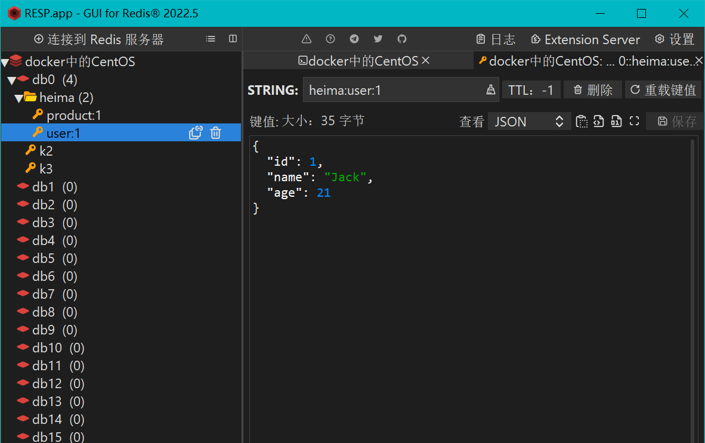

# 非关系型数据库(NoSQL)

## 初识NoSQL

大数据时代对数据存储的挑战,对于**实时性、动态性要求**较高的的社交网站，如论坛、微博等，往往需要达到每秒上万次的读写请求，这种很高的并发性对数据库的并发负载相当大，特别是对与**传统关系数据库的硬盘I/O是个很大的负担**。**关系型数据库是很难水平扩展的，当数据量和访问量多到需要增加硬件和服务器节点来扩大容量和负载量，关系型数据库往往需要停机维护和数据迁移**，这对一个需要24小时不停服务的网站是非常不可取。 动态交互网站Web2.0每天产生的数据量是巨大的，如果采用传统的关系型数据库将海量数据存放到具有固定结构的二维表格中，不管是查询还是更新操作效率都是非常低。

- **高并发读写需求**
- **高扩展性**
- **高效率存储和访问需求**
- **高可用**

NoSQL是Not Only SQL的缩写，它的含义为“不仅仅是SQL”。NoSQL是一种非**关系型、分布式、无需遵循ACID原则、不提供SQL功能的数据库**，是**对关系型数据库在灵活性和扩展性上的补充**。


## 与关系型数据库的区别

### 存储方式:

- 关系型数据库采用**表的格式(结构化数据)**进行存储，数据以行和列的方式进行存储，读取和查询都十分方便。
- 非关系型数据库是以**数据集**的方式进行存储，即将大量数据都集中在一起存储，类似于**键值对、图结构或者文档**。

### 查询方式:

- 关系型数据库是采用结构化查询语言（即 **SQL**）来对数据库进行查询，SQL支持数据库的CRUD操作，具有非常强大的功能。
- ​     非关系型数据库使用的是非结构化查询语言（UnQL），UnQL以数据集（如文档）为单位来管理和操作数据，由于**没有统一的标准**，所以**每个数据库厂商提供产品标准是不一样的**。

### 读写性能:

- 关系型数据库强调数据的一致性，为此降低了数据的读写性能。虽然关系型数据库可以很好的存储和处理数据，但是处理海量数据时效率会变得很低，尤其是**遇到高并发读写时，性能会很快的下降**。
- 非关系型数据库**可以很好的应对海量数据**，也就是说，它可以**很好的读写每天产生的非结构化数据**。由于非关系型数据库是以数据集的方式进行存储的，因此**扩展和读写都是非常容易的**。

### 事务性:

- 关系型数据库强调ACID规则，可满足对事务性要求较高或需要进行复杂数据查询的数据操作，也可充分满足数据库操作的高性能和稳定性要求。同时也强调数据的强一致性，对事务操作有很好的支持
- 非关系型数据库**强调BASE原则**，它可以减少了对数据的强一致性支持，**不能很好地支持事务操作**。

### 存储结构:

-    关系型数据库按照**结构化的方法存储**数据，在插入数据前需定义好存储数据的表结构，这使得整张数据表的**可靠性和稳定性都比较高**，但数据表存储数据后，若要**修改数据表的结构就会十分困难**。
-    非关系型数据库采用的是**动态结构**，如果面对大量非结构化数据的存储，它可以**非常轻松的适应数据类型和结构的改变**，也可以根据**数据存储的需要灵活的改变数据库的结构**。

### 存储规范:

- 关系型数据库为了规范化数据、避免重复数据以及充分利用存储空间，将数据按照最小关系表的形式进行存储，这使得数据管理变得很清晰、一目了然。不过随着表数量的增加，表之间的关系会导致数据的管理变   得越来越复杂。

- 非关系型数据库采用用平面数据集的方式集中存放数据，虽然会出现数据被重复存储造成浪费存储空间的情况。但是通常单个数据库都是采用单独存储的形式，很少采用分割存储的方式，因此**数据往往被存储成一个整体对数据的读写提供了极大的方便**。

### 拓展方式:

-    关系型数据库**主要通过提高计算机自身性能缓解存储与读写压力**，即所谓的纵向扩展。因为数据表之间存在着各种关系，所以采用横向扩展的方式会较为复杂，需要**保证具有关联的数据表在同一服务器**

-    非关系型数据库采用数据集存储数据，这使得**数据之间无关联性，可以分布式存储**，因此可以**采用横向扩展方式来扩展数据库**，也就是说，可以添加更多数据库服务器到资源池来缓解存储与读取压力。

## NoSQL理论

### CAP原则

CAP原则又称CAP定理，它包括**一致性（Consistency）**、**可用性（Availability）**和**分区容错性（Partition Tolerance）**这三大要素。

- **一致性:**系统在执行过某项操作后，仍然处于一致的状态。
- **可用性:**系统的结果必须在给定的时间内返回，若超时，则被认为是不可用。
- **分区容错性:**分区容错性可理解为系统对节点动态加入和离开的处理能力（**集群一直处于可用状态）**，因为节点的加入和离开可认为是集群内部的网络分区。

CAP原则**一个分布式系统最多可以同时实现两个要素**，即AP或CP或AC。选择AC策略，意味着放弃P，也就是说，保证了系统的一致性和可用性，却违背了分布式系统的分区容错性；选择CP策略，意味着放弃A，也就是说，保证了系统的一致性和分区容错性，但用户的体验较差，即当系统宕机时，需要等待所有节点的数据一致时，用户才可访问系统；选择AP策略，意味着放弃C，也就是说，保证了系统的可用性和分区容错性，但是节点之间的数据会出现不一致的现象。因此，**我们可以根据自己的需求，选择对应的策略**

| **取舍策略**             | **应用场景**                     |
| ------------------------ | -------------------------------- |
| CA（一致性和可用性）     | Oracle、SQLServer以及MySQL等     |
| CP（一致性和分区容错性） | MongoDB、HBase以及Redis等        |
| AP（可用性和分区容错性） | CouchDB、Cassandra以及DynamoDB等 |

### BASE理论

BASE理论是**对CAP原则中一致性和可用性权衡的结果**，也是对CAP原则的延伸。BASE理论的核心思想是即使无法保证系统的强一致性（Strong Consistency，即CAP的一致性就是强一致性），但**每个应用都可以根据自身的业务特点，采用适当的方式来使系统达到最终一致性（Eventual consistency）**。

 BASE理论与CAP原则类似，它也包含三大要素即:

- **基本可用（Basically Available）**:分布式系统在出现不可预知故障的时候，**允许损失部分可用性，保证系统的核心可用即可**。
- **软状态（Soft-State）:**    **允许系统在不同节点**的数据副本之间进行数据**同步的过程存在延时**。
- **最终一致性（Eventually Consistent）:**系统中的所有数据副本经过一定时间后，**最终能够达到一致的状态，不需要实时保证系统数据的强一致性**。


**BASE理论与关系型数据库中的ACID理论是两种截然相反的理论。**

| **区别** | BASE理论         | ACID理论       |
| -------- | ---------------- | -------------- |
| 一致性   | 弱一致性         | 强一致性       |
| 可用性   | 可用性优先       | 可用性不作要求 |
| 灵活性   | 变化速度快、灵活 | 难以变化       |


## NoSQL数据库分类


| **分类**         | **数据类型**                                             | **常见数据库**                                               | **应用场景示例**                     |
| ---------------- | -------------------------------------------------------- | ------------------------------------------------------------ | ------------------------------------ |
| 键值对存储数据库 | Key指向Value  的键值对                                   | **Redis**、  Tokyo  Cabinet/Tyrant、Voldemort、  Oracle  BDB | 会话存储、  网站购物车等             |
| 文档存储数据库   | BSON类型（全称Binary  JSON，即二进制JSON），也称为类JSON | **MongoDB**、  CouchDB、RavenDB                              | 内容管理应用程序、电子商务应用程序等 |
| 列式存储数据库   | 以列进行存储，将同列数据存储到一起                       | **HBase**、Cassandra、Riak、HyperTable                       | 日志记录、  博客网站等               |
| 图形存储数据库   | 图结构                                                   | **Neo4j**、FlockDB、AllegroGrap、GraphDB                     | 欺诈检测、  推荐应用等               |


### 键值对数据库

键值对存储数据库是NoSQL数据库中的一种类型，也是最简单的NoSQL数据库。键值对存储数据库中的数据是以键值对的形式来存储的。常见的键值对存储数据库有**Redis**、Tokyo Cabinet/Tyrant、Voldemort以及Oracle BDB等数据库。键值对存储数据库的结构示意图如下。 

键值对存储数据库的结构实际上是一个映射，即Key是查找每条数据的唯一标识符，Value是该数据实际存储的内容。键值对存储数据库结构是采用哈希函数来实现键到值的映射，当查询数据时，基于Key的哈希值会直接定位到数据所在的位置，**实现快速查询，并支持海量数据的高并发查询。**

#### 应用场景:

- **会话存储应用场景:** 会话存储指的是一个面向会话的应用程序（如Web应用程序）在**用户登录时启动会话，并保持活动状态直到用户注销或会话超时，在此期间，应用程序将所有与会话相关的数据存储在内存或键值对存储数据库中。**会话数据包括用户资料信息、消息、个性化数据和主题、建议、有针对性的促销和折扣。每个用户会话具有唯一的标识符，除了主键之外，任何其他键都无法查询会话数据，因此键值对存储数据库更适合于存储会话数据。

- **购物车应用场景:**  购物车指的是电子商务网站中的购物车功能。在假日购物季，电子商务网站可能会在几秒钟内收到数十亿的订单，**键值对存储数据库可以处理海量数据的扩展和极高的状态变化，同时通过分布式处理和存储为数百万并发用户提供服务。**此外，**键值对存储数据库还具有内置冗余的功能，可以处理丢失的存储节点**。

### 文档存储数据库

文档存储数据库是用于存储和管理文档，其中**文档是结构化的数据（如JSON格式）**。文档存储数据库存储的文档可以是不同结构的，即JSON、XML以及BSON等格式。

常见的文档存储数据库有**MongoDB**、CouchDB以及RavenDB等数据库。文档存储数据库的结构示意图如下。


##### 应用场景:

- **内容管理应用程序**:内容管理应用程序存储数据，首选的就是文档存储数据库，例如**博客和视频平台主要使用的数据库**就是文档存储数据库。通过文档存储数据库，内容管理应用程序所跟踪的每个实体都可存储为单个文档。随着需求的发展，对于开发人员来说，可以使用文档存储数据库更直观地更新应用程序。此外，如果需要更改数据模型，则只需要更新受影响的文档即可，而不需要更新架构，也不需要等到数据库停机时进行更改。
- **电子商务应用程序**:在电子商务应用程序中，文档存储数据库可以高效且有效的**存储商品的信息**。例如，在电子商务应用程序中，不同的产品具有不同数量的属性。若是在关系型数据库中管理数千个属性，则效率比较低，并且阅读的性能会受到影响；若是使用文档存储数据库的话，可以在单个文档中描述每个产品的属性，既可以方便管理，又可以加快阅读产品的速度，并且更改一个产品的属性不会影响其他的产品。


### 列式存储数据库

列式存储数据库是**以列为单位存储数据**，然后将列值顺序地存入数据库中，这种数据存储方法不同于基于行式存储的传统关系型数据库。列式存储数据库可以高效地存储数据，也可以**快速地处理批量数据实时查询数据**。常见的列式存储数据库有**HBase**、Cassandra、Riak以及HyperTable等数据库。列式存储数据库的结构示意图如下。


在列式存储数据库中，如果**列值不存在，则不需要存储**（阴影部分为列值不存在），这样的话，**遇到Null值，就不需要存储，可以减少I/O操作和避免内存空间的浪费。**

#### 应用场景:

- **事件应用记录**:在事件记录中，使用列式存储数据库来**存储应用程序的状态以及应用程序遇到错误等事件信息。**由于列式存储数据库具有高扩展性，因此**可高效地存储应用程序源源不断产生的事件记录。**
- 博客网站应用:在博客网站中，列式存储数据库可以**将博客的“标签”、“类别”、“连接”及“引用通告”等内容存放在不同的列中，便于进行数据分析。**


### 图形存储数据库

图形存储数据库不是网络数据库，它是NoSQL数据库的一种类型，其主要是**应用图形理论来存储实体之间的关系信息**，其中，**实体被视为图形的“节点”**，**关系被视为图形的“边”**，“边”按照关系将“节点”按进行连接。常见的图形存储数据库有**Neo4j**、FlockDB、AllegroGrap以及GraphDB等数据库。图形存储数据库的结构示意图如下。


​    利用图形存储数据库存储的数据，可以很清晰知道两个实体之间的关系，即A和D是朋友，C是A朋友的朋友。

#### 应用场景:

**欺诈检测应用**:在欺诈检测中，图形存储数据库能够有效地防范复杂的欺诈行为。在现代欺诈及各种类型的金融犯罪中，例如银行欺诈、信用卡欺诈、电子商务欺诈以及保险欺诈等，欺诈者通过使用改变自己身份等的手段逃避风控规则，从而达到欺诈目的。尽管欺诈者是可以改变所有涉及网络的关联关系，也可以在所有涉及网络的群体中同步执行相同操作来躲避风控，但我们可以通过图形存储数据库建立跟踪全局用户的跟踪视角，实时利用图形存储数据库来分析具有欺诈行为的离散数据，从而识别欺诈环节，这样的话，最大程度上快速有效地防范和解决欺诈行为。

**推荐应用**: 在推荐应用中，我们可以**借助图形存储数据库存储购物网站中客户的购买记录、客户兴趣等信息，然后根据客户当前浏览的商品结合已存储的购物信息，从而推荐相关的商品。**


## MongoDB使用

> [MongoDB中文手册|官方文档中文版 - MongoDB-CN-Manual (mongoing.com)](https://docs.mongoing.com/)

==注意:本文档所写时使用版本为 4.4==

MongoDB最大的特点是支持的查询语言非常强大，而且支持对数据建立索引，从而**提高数据查询速度**。

### 简介

#### 优势:

**高可用性**: MongoDB**副本所组成的一个集群，称为副本集**，它**提供了自动故障转移和数据冗余功能，以防止数据丢失**，从而提高数据的可用性

**易扩展性**: MongoDB的设计**采用横向扩展，可通过分片将数据分布在集群机器中**。MongoDB**能够自动处理跨集群的数据和负载，自动重新分配文档，并将用户的请求路由到正确的机器上**。

**多种存储引擎**: MongoDB**支持多个存储引擎**包括WiredTiger存储引擎、内存存储引擎（n-Memory）和MMAPv1存储引擎。


#### 体系结构

MongoDB的逻辑结构是体系结构的一种形式，它是一种层次结构，主要由文档(Document)、集合(Collection)、数据库(DataBase)这三部分组成。MongoDB的逻辑结构是面向用户的。


MongoDB概念与关系型数据库（RDBMS）非常类似：


数据库（database）：最外层的概念，可以理解为逻辑上的名称空间，一个数据库包含多个不同名 称的集合。 

集合（collection）：相当于SQL中的表，一个集合可以存放多个不同的文档。 

文档（document）：一个文档相当于数据表中的一行，由多个不同的字段组成。 

字段（field）：文档中的一个属性，等同于列（column）。 

索引（index）：独立的检索式数据结构，与SQL概念一致。

 id：每个文档中都拥有一个唯一的id字段，相当于SQL中的主键（primary key）。 

视图（view）：可以看作一种虚拟的（非真实存在的）集合，与SQL中的视图类似。

从MongoDB 3.4版本开始提供了视图功能，其通过聚合管道技术实现。 

**聚合操作**（$lookup）：MongoDB用于实现**“类似”表连接**（tablejoin）的聚合操作符。

尽管这些概念大多与SQL标准定义类似，但MongoDB与传统RDBMS仍然存在不少差异，包括： **半结构化，在一个集合中，文档所拥有的字段并不需要是相同的**，而且**也不需要对所用的字段进行声明**。因此，MongoDB具有很明显的半结构化特点。除了松散的表结构，文档还可以支持多级的 嵌套、数组等灵活的数据类型，非常契合面向对象的编程模型。 弱关系，MongoDB**没有外键的约束，也没有非常强大的表连接能力。类似的功能需要使用聚合管道技术来弥补。**


MongoDB默认提供admin、local、config以及test数据库四个数据库，具体介绍如下：

- admin数据库，主要存储数据库账号的相关信息。

- local数据库，可以用于存储限于本地单台服务器的任意集合，如oplog日志就存储在local数据库中，该数据库的数据不会被复制到从节点上。

- config数据库，用于存储分片集群中与分片相关的元数据信息。

- test数据库，是MongoDB默认创建的一个测试库，当连接mongod服务时，如果不指定连接的具体数据库，默认就会连接到test数据库。

**文档是以键值对的形式存储在集合中**，其中，**键用于唯一标识一个文档，为字符串类型**，而**值则可以是各种复杂的文件类型，我们称这种存储形式为BSON**（BSON是类JSON的一种二进制形式的存储格式，简称BinaryJSON，它和JSON一样，支持内嵌的文档对象和数组对象，但是BSON有JSON没有的一些数据类型，如Date和BinData类型）。

**文档中不能有重复的键，每个文档都有一个默认的_id键，它相当于关系型数据库中的主键，这个键的值在同一个集合中必须是唯一的，_id键值默认是ObjectId类型**，在插入文档的时候，**如果用户不设置文档的_id值，MongoDB会自动生成一个唯一的ObjectId值进行填充**。


#### 数据类型:

文档的键是字符串类型，而值除字符串类型外，还可以为内嵌文档、数组、Date等类型，文档内容具体如下


| **数据类型**        | **相关说明**                                              |
| ------------------- | --------------------------------------------------------- |
| Double              | 双精度浮点型，用于存储浮点值                              |
| String              | 字符串，是常用的数据类型，MongoDB仅支持UTF-8 编码的字符串 |
| **Object**          | **对象类型，存储嵌入式文档**                              |
| Array               | 数组类型，用于将数组或列表或多个值存储为一个键            |
| **Binary  data**    | **二进制数据：用于存储二进制数据**                        |
| Undefined           | 已弃用                                                    |
| **ObjectId**        | 对象ID类型，用于存储文档的ID                              |
| Boolean             | 布尔类型，用于存储布尔（true/false）值                    |
| Date                | 日期类型，以UNIX时间格式存储标准时间的毫秒数，不存储时区  |
| Null                | 空值类型，用于创建空值                                    |
| Regular  Expression | 正则表达式类型，用于存储正则表达式                        |

| **数据类型**  | **相关说明**                                                 |
| ------------- | ------------------------------------------------------------ |
| Symbol        | 已弃用                                                       |
| Int32         | 整型，用于存储32位整型数值                                   |
| **Timestamp** | **时间戳类型，用于记录文档修改或添加的具体时间**             |
| Int64         | 整型，存储64位整型数值                                       |
| Decimal128    | Decimal类型，用于记录、处理货币数据，例如：财经数据、税率数据等 |
| Min  key      | 将一个值与  BSON元素的最低值相对比                           |
| Max  key      | 将一个值与  BSON元素的最高值相对比                           |
| DBPointer     | 已弃用                                                       |
| **Code**      | **代码类型，用于将JavaScript代码存储到文档中**               |


#### 使用规范


### 安装配置和启动


#### Mongodb for windows

##### 安装启动:

直接下载无脑安装(推荐压缩包解压安装)

**默认安装启动:**[MongoDB 手册 -windos下安装](https://www.mongodb.com/docs/v4.4/tutorial/install-mongodb-on-windows/)

配置文件启动, 在默认安装启动的基础上:

**在解压目录\bin目录中，新建`mongod.cfg` ，内如参考如下：**

> 官方配置文件文档: [Configuration File Options — MongoDB Manual](https://www.mongodb.com/docs/v4.4/reference/configuration-options/)

```yaml
storage:
#The directory where the mongod instance stores its data.Default Value is "\data\db" on Windows.
	dbPath: D:\Environment\Mongodb\data
```

对于大多数独立服务器，这是一个足够的基础配置。它做了几个假设，但请考虑 以下解释：

- [`fork`](https://www.mongodb.com/docs/v4.4/reference/configuration-options/#mongodb-setting-processManagement.fork)是 ，它启用`true`[守护进程](https://www.mongodb.com/docs/v4.4/reference/glossary/#std-term-daemon)模式[`mongod`](https://www.mongodb.com/docs/v4.4/reference/program/mongod/#mongodb-binary-bin.mongod)，分离（即“叉子”） 来自当前会话的 MongoDB，并允许您运行数据库作为常规服务器。
- [`bindIp`](https://www.mongodb.com/docs/v4.4/reference/configuration-options/#mongodb-setting-net.bindIp)是 ，它强制 服务器，以仅侦听本地主机 IP 上的请求。仅绑定到 应用程序级系统可以访问的安全接口 系统网络过滤提供的访问控制 （即”`localhost`[防火墙](https://www.mongodb.com/docs/v4.4/reference/glossary/#std-term-firewall)").
- [`port`](https://www.mongodb.com/docs/v4.4/reference/configuration-options/#mongodb-setting-net.port)是 ，这是默认值 用于数据库实例的 MongoDB 端口。MongoDB可以绑定到任何 港口。您还可以使用网络根据端口过滤访问 过滤工具。`27017`

windos基础配置参考: 

*注 :Linux与windos文件**路径表示方式不一样**,采用反斜杠这种形式 :`/etc/mongod.conf`*

```yaml
# mongod.conf

# for documentation of all options, see:
#   http://docs.mongodb.org/manual/reference/configuration-options/

# Where and how to store data.
storage:
  dbPath: D:\Environment\Mongodb\data
  journal:
    enabled: true
#  engine:
#  mmapv1:
#  wiredTiger:

# where to write logging data.
systemLog:
  destination: file
  logAppend: true
  path: D:\Environment\Mongodb\log\mongod.log

# network interfaces
net:
  port: 27017
  # 默认绑定本地ip即只有本机能访问,一般设置成0.0.0.0所有主机都可访问
  bindIp: 127.0.0.1

#设置进程为后台启动
processManagement:
   fork: true
#security:

#operationProfiling:

#replication:

#sharding:

## Enterprise-Only Options:

#auditLog:

#snmp:

```

**【注意】**

- 配置文件中如果使用双引号，比如路径地址，自动会将双引号的内容转义。如果不转义，则会报错：

  ```sh
  error-parsing-yaml-config-file-yaml-cpp-error-at-line-3-column-15-unknown-escape-character-d
  ```

  - 解决：
    a. 对 \ 换成 / 或 \
    b. 如果路径中没有空格，则无需加引号。

- 配置文件是以`yaml`格式写的,所以在具体配置前**不要添加`tab`键**,否则会报如下错误`Unrecognized option: storage`

- 配置文件中不能以Tab分割字段

服务启动方式：`mongod --config mongod.cfg`


#### Mangodb for CentOS 7

##### 安装启动

```sh
# 下载安装包
wget https://fastdl.mongodb.org/linux/mongodb-linux-x86_64-rhel70-4.4.9.tgz
# 解压
tar -zxvf mongodb-linux-x86_64-rhel70-4.4.9.tgz
#创建dbpath和logpath
mkdir -p /mongodb/data /mongodb/log /mongodb/conf
#进入mongodb解压目录的bin目录下,启动mongodb服务
mongod --port=27017 --dbpath=/mongodb/data --logpath=/mongodb/log/mongodb.log
--bind_ip=0.0.0.0 --fork
```

命令参数:

`--dbpath` :指定数据文件存放目录
`--logpath` :指定日志文件，注意是指定文件不是目录
`--logappend` :使用追加的方式记录日志
`--port`:指定端口，默认为27017
`--bind_ip`:默认只监听localhost网卡
`--fork`: 后台启动
`--auth`: 开启认证模式

**添加环境变量:**

修改/etc/profile，添加环境变量,方便执行MongoDB命令

```sh
vim /etc/profile
```

添加内容:

```in
export MONGODB_HOME=/usr/local/soft/mongodb
PATH=$PATH:$MONGODB_HOME/bin 
```

然后执行`source /etc/profile` 重新加载环境变量

##### 配置文件启动

新建编辑`/etc/mongod.conf`文件，内容如下：

```yaml
systemLog:
  destination: file
  path: /mongodb/log/mongod.log # log path
  logAppend: true
storage:
  dbPath: /mongodb/data # data directory
  engine: wiredTiger  #存储引擎
  journal:       #是否启用journal日志
  enabled: true
net:
  bindIp: 0.0.0.0
  port: 27017 # port
processManagement:
  fork: true
```

配置文件格式为 `yaml`格式

**以配置文件启动:**

```sh
mongod --config /etc/mongod.conf
mongod -f /etc/mongod.conf
```

关闭服务:

方式一:

```sh
mongod --port=27017 --dbpath=/mongodb/data --shutdown
```

方式二:

进入mongodb shell:

```sh
use admin
db.shutdownServer()
```

#### 配置文件

> 官方文档: [Run-time Database Configuration — MongoDB Manual](https://www.mongodb.com/docs/v4.4/administration/configuration/#std-label-base-config)

注: Windows的配置文件与Linux的配置**部分配置项目有所不同**,具体参考文档


### 连接与交互:

#### shell方式:

- **windos :**

​	在`安装目录\bin\`目录启动`mongo.exe`或者cmd 直接输入`mongo`(*注: 这样需要配置环境变量*)

- Linux:

注意: 如果没配置环境变量请在``安装目录\bin\`目录中使用命令

```sh
mongo --port=27017
```

命令参数:

`--port`:指定端口，默认为27017
`--host`:连接的主机地址，默认127.0.0.1

##### javaScript支持:

**mongo shell是基于JavaScript语法的**，MongoDB使用了SpiderMonkey作为其内部的JavaScript解释器
引擎，这是由Mozilla官方提供的JavaScript内核解释器，该解释器也被同样用于大名鼎鼎的Firefox浏览
器产品之中。SpiderMonkey对ECMA Script标准兼容性非常好，可以支持ECMA Script 6。

​	

#### 使用Nvicat连接

像MySQL一样连接即可


#### 安全认证:

mongodb默认是没有不需要登陆的,我们可以设置安全认证方式:

创建管理员账号:

```sh
# 设置管理员用户名密码需要切换到admin库
use admin 
#创建管理员
db.createUser({user:"xxx",pwd:"123456",roles:["root"]})
# 查看所有用户信息
show users
#删除用户
db.dropUser("xxx")
```

默认情况下，MongoDB不会启用鉴权 : 

```sh
# 以鉴权模式启动MongoDB
mongod -f /mongodb/conf/mongo.conf --auth
# 连接时需要提供用户密码
mongo 192.168.65.174:27017 -u 用户名 -p 密码 --authenticationDatabase=admin
```


##### 常用权限:

| 权限名               | 描述                                                         |
| -------------------- | ------------------------------------------------------------ |
| **root**             | 只在admin数据库中可用。超级账号，超级权限                    |
| readWrite            | 允许用户读写指定数据库                                       |
| dbAdmin              | 允许用户在指定数据库中执行管理函数，如索引创建、删除，查看统计或访问system.profile |
| dbOwner              | 允许用户在指定数据库中执行任意操作，增、删、改、查等         |
| userAdmin            | 允许用户向system.users集合写入，可以在指定数据库里创建、删除和管理用户 |
| clusterAdmin         | 只在admin数据库中可用，赋予用户所有分片和复制集相关函数的管理权限 |
| readAnyDatabase      | 只在admin数据库中可用，赋予用户所有数据库的读权限            |
| readWriteAnyDatabase | 只在admin数据库中可用，赋予用户所有数据库的读写权限          |
| userAdminAnyDatabase | 只在admin数据库中可用，赋予用户所有数据库的userAdmin权限     |
| dbAdminAnyDatabase   | 只在admin数据库中可用，赋予用户所有数据库的dbAdmin权限       |


### 基本命令操作

> 参考教程: [哔哩哔哩_bilibili](https://www.bilibili.com/video/BV1QF411W7u3?p=11&spm_id_from=pageDriver&vd_source=a67b19bba4b2eebaa16b72d8dfcfc061)

| 命令                         | 说明                                 |
| ---------------------------- | ------------------------------------ |
| show dbs或show databases     | 显示数据库列表                       |
| **use 数据库名**             | 切换数据库，**如果不存在创建数据库** |
| **load("xxx.js")**           | 执行一个JavaScript脚本文件           |
| db.dropDatabase()            | 删除数据库                           |
| show collections,show tables | 显示当前数据库的集合列表             |
| db.集合名.stats()            | 查看集合详情                         |
| db.集合名.drop()             | 删除集合                             |
| **show users**               | **显示当前数据库的用户列表**         |
| **show roles**               | **显示当前数据库的角色列表**         |
| show profile                 | 显示最近发生的操作                   |
| exit, quit()                 | 退出当前shell                        |
| help                         | 查看mongodb支持哪些命令              |
| db.help()                    | 查询当前数据库支持的方法             |
| db.集合名.help()             | 显示集合的帮助信息                   |
| db.version()                 | 查看数据库版本                       |


#### 数据库操作

```sql
# 切换数据库,不存在则会创建数据库(插入数据后才会真正创建)
use 数据库名称
# 查看所有的数据库
show databases 或 show dbs
# 查看正在使用的数据库
db
# 删除当前数据库 
db.dropDatabase()
```

- **MongoDB 中默认的数据库为 test，如果你没有选择数据库，集合将存放在 test 数据库中,一般**。

- 数据库名可以是满足以下条件的任意UTF-8字符串。

- 不能是空字符串（“”)。

- 不得含有’ '**（空格)**、.、**$**、/、\和\0 (空字符)。

- 应全部小写。

- 最多64字节。

- 有一些数据库名是保留的，可以直接访问这些有特殊作用的数据库。
  - **admin**： 从权限的角度来看，这是"root"数据库。**要是将一个用户添加到这个数据库，这个用户自动继承所有数据库的权限**。**一些特定的服务器端命令也只能从这个数据库运行，比如列出所有的数据库或者关闭服务器.**
  - **local**: 这个数据永远不会被复制，可以用来**存储限于本地单台服务器的任意集合**
  - **config**: 当Mongo用于分片设置时，config数据库在内部使用，用于**保存分片的相关信息**。

#### 集合(表)操作

由于mongodb的集合很类似关系型数据库表,故以下所说的表是指 集合的意思

```sh
#查看所有集合
show collections
show tables
#删除集合
db.集合名.drop()
#简单创建集合
db.createCollection("集合名")
```

 **注意: 当集合不存在时，向集合中插入文档也会创建集合**

创建集合还可以添加配置项options: `db.createCollection(name, options)`

options参数解释:

| 字段   | 类型 | 描述                                                         |
| ------ | ---- | ------------------------------------------------------------ |
| capped | 布尔 | （可选）如果为true，则创建固定集合。固定集合是指有着固定大小的集合，**当达到最大值时，它会自动覆盖最早的文档。** |
| size   | 数值 | （可选）为固定集合指定一个最大值（以字节计）。**如果 capped 为 true，也需要指定该字段。** |
| max    | 数值 | （可选）指定固定集合中包含文档的最大数量。                   |


#### 文档操作CURD:

注意: mongodb shell 是支持 javaScript 的, 下面不再赘述

==此外: 文档对象操作支持嵌套操作,如 对象.属性,但这样必须加双引号, 即: “对象”.属性==

##### 插入文档:

3.2 版本之后新增了 `db.collection.insertOne()` 和 `db.collection.insertMany()`。

注意: 添加文档操作要切换到对应的数据库下操作

`insertOne():` 

只插入一个文档

```js
db.集合名.insertOne(
 json对象,
 options:{
    writeConcern: 值
 }
)
// 例如: 创建一个学生 集合并插入一个数据
db.students.insertOne({
   stu_id:"001",
	 name:"张三",
	 age: 18
 }
// insertOne函数插入成功提示:
{
        "acknowledged" : true, 
        "insertedId" : ObjectId("63a2d990e809659ecfa63084")
}                      
                      
// 使用 insert()函数:
db.students.insert({
   stu_id:"001",
	 name:"张三",
	 age: 18
 }                                        
// 使用 insert()函数插入成功提示: 
WriteResult({ "nInserted" : 1 })            
```

*其中 options 配置项目是可选的,属性值:*

`writeConcern`: 决定一个写操作落到多少个节点上才算成功。writeConcern 的取值包括：

- 0：发起写操作，不关心是否成功
- majority：写操作需要被复制到大多数节点上才算成功
- 1~ n (n 为集群最大数据节点数)：写操作需要被复制到指定节点数才算成功；

下文同样如此

**还可以使用**`save()`来插入数据,如果 _id 主键存在则更新数据，如果不存在就插入数据。

**批量插入:**

实际上`insert()` , `save()`方法也能插入多个文档(json数组)

```js
db.collection.insertMany(
    // json数组
 [ json对象1 , json对象2, ... ],
 //options 配置对象
  {
      writeConcern: 数字,
   	  ordered: 布尔值 
  }
)
```

ordered：指定是否按顺序写入，**默认 true，按顺序写入。**

writeConcern：和上面插入单个文档一样,写入策略，默认为 1，即要求确认写操作，0 是不要求。

**此外还可以通过加载js脚本实现批量插入**

`book.js`内容

```js
var tags = ["nosql","mongodb","document","developer","popular"];
var types = ["technology","sociality","travel","novel","literature"];
var books=[];
for(var i=0;i<50;i++){
  var typeIdx = Math.floor(Math.random()*types.length);
  var tagIdx = Math.floor(Math.random()*tags.length);
  var favCount = Math.floor(Math.random()*100);
  var book = {
    title: "book-"+i,
    type: types[typeIdx],
    tag: tags[tagIdx],
    favCount: favCount,
    author: "xxx"+i
 };
  books.push(book)
}

db.books.insertMany(books);
```

随后执行在mongo shell 中执行

**注意: 如果使用默认的数据库test ,无法执行脚本**

```js
load("books.js") // 使用的是相对路径,执行成功后返回 true
// 如果不知道命令行在当前哪个路径,可使用 pwd()查看
```


##### 查询文档

集合对象的find()方法可以查询集合中的若干文档。语法格式如下:

```sh
db.集合名.find(query, projection)
```

- `query` ：可选,只为json对象，使用**查询操作符指定查询条件**,省略则查询所有文档

- `projection` ：可选，使用**投影操作符指定返回的键。**省略该参数会返回所有键（默认省略）。**投影时，可通过设置指定的键值为1或者0来决定是否返回 , **如 : `{key1:1,key5:1}`,不过需要注意一下几点:

  - **id会默认自动返回,并且id为1的时候，只能设置选择哪些其他字段为1**

  - id是0的时候，其他字段可以是0；**如果没有_id字段约束，多个其他字段必须同为0或同为1。**

如果查询返回的条目数量较多，mongo shell则会自动实现分批显示。默认情况下每次只显示20条，可
以输入it命令读取下一批。

`findOne()`方法查询集合中的第一个文档。语法格式如下：

```js
db.集合名.findOne(query, projection)
```

**条件查询实例:**

```sh
#查询带有nosql标签的book文档：
db.books.find({tag:"nosql"})
#按照id查询单个book文档：
db.books.find({_id:ObjectId("61caa09ee0782536660494d9")})
#查询分类为“travel”、收藏数>60个的book文档：
db.books.find({type:"travel",favCount:{$gt:60}})
```

**投影查询实例**：

注意: 投影时object_id是默认返回的, 

```sh
# 查询所有的文档,但是只返回 title , author 这个两个键
db.books.find({},{title:1,author:1})
# 查询 favCount 大于60的书籍,并且不返回他们的_id ,类型和作者
db.books.find({
    favCount: {
        $gt: 60
    }
}, {
    _id: 0,
    type: 0,
    author: 0
})
```


###### 查询条件对照表:

| SQL              | MQL                |
| ---------------- | ------------------ |
| a = 1            | {a: 1}             |
| a <> 1 即 a != 1 | **{a: {$ne: 1}}**  |
| a > 1            | **{a: {$gt: 1}}**  |
| a >= 1           | **{a: {$gte: 1}}** |
| a < 1            | **{a: {$lt: 1}}**  |
| a <= 1           | **{a: {$lte: 1}}** |

查询逻辑对照表:

| SQL             | MQL                                    |
| --------------- | -------------------------------------- |
| a = 1 AND b = 1 | {a: 1, b: 1}或{$and: [{a: 1}, {b: 1}]} |
| a = 1 OR b = 1  | {**$or:** [{a: 1}, {b: 1}]}            |
| a IS NULL       | {a: {**$exists: false**}}              |
| a IN (1, 2, 3)  | {a: {**$in**: [1, 2, 3]}}              |

查询逻辑运算符:

- $lt: 存在并小于
- $lte: 存在并小于等于
- $gt: 存在并大于
- $gte: 存在并大于等于
- $ne: 不存在或存在但不等于
- $in: 存在并在指定数组中
- $nin: 不存在或不在指定数组中
- $or: 匹配两个或多个条件中的一个
- $and: 匹配全部条件


###### 排序,分页

在 MongoDB 中使用 集合的`sort()` 方法对数据进行排序

```sh
#指定按收藏数（favCount）降序返回,参数 -1 代表降序,默认为1,升序
db.books.find({type:"travel"}).sort({favCount:-1})
```

**分页查询:**
结果集方法: `skip()`用于**指定跳过记录数**，`limit()`则用于**限定返回结果数量**。
参数，以此实现分页的功能。比如，假定每页大小为4条，查询第3页的book文档：

```sh
db.books.find().skip(8).limit(4)
```

###### 正则表达式查询

MongoDB 使用` $regex `操作符来设置匹配字符串的正则表达式。

```sh
#使用正则表达式查找type包含 so 字符串的book
db.books.find({type:{$regex:"so"}})
# 或者
db.books.find({type:/so/})
```


##### 更新文档

可以用update命令对指定的数据进行更新，命令的格式如下：

```sh
db.collection.update(query,update,options)
```

query,update,options的值都是json对象, 和查询操作的条件类似

- query：描述更新的查询条件；
- update：描述更新的操作及新的内容；
- options：描述更新的选项
  - upsert: 可选，如果**不存在update的记录，是否插入新的记录**。默认false，不插入
  - multi: 可选，是否按**条件查询出的多条记录全部更新**。 默认false,只更新找到的第一条记录
  - writeConcern :可选，决定一个写操作落多少个节点上才算成功。

**更新操作符:**

| 操作符    | 格式                                           | 描述                                              |
| --------- | ---------------------------------------------- | ------------------------------------------------- |
| $set      | {$set:{field:value}}                           | **指定一个键并更新值，若键不存在则创建**          |
| $unset    | {$unset : {field : 1 }}                        | 删除一个键                                        |
| $inc      | {$inc : {field : value } }                     | 对数值类型进行**增减**                            |
| $rename   | {$rename : {old_field_name :new_field_name } } | **修改字段名称**                                  |
| $push     | { $push : {field : value } }                   | 将数值追加到数组中,若**数组不存在则会进行初始化** |
| $pushAll  | {$pushAll : {field : value_array }}            | 追加多个值到一个数组字段内                        |
| $pull     | {$pull : {field : _value } }                   | 从数组中删除指定的元素                            |
| $addToSet | {$addToSet : {field : value } }                | 添加元素到数组中，**具有排重功能**                |
| $pop      | {$pop : {field : 1 }}                          | **删除数组的第一个或最后一个元素**                |

如:某个book文档被收藏了，则需要将该文档的favCount字段自增

```sh
db.books.update({_id:ObjectId("61caa09ee0782536660494d9")},{$inc:{favCount:1}})
```

例:修改标题为: my book 的书籍的字段信息,不存在则插入此字段

```sh
db.books.update(
 {title:"my book"},
 {$set:{tags:["nosql","mongodb"],type:"none",author:"fox"}},
 {upsert:true}
)
```


###### 更新多个文档:

默认情况下，update方法只在更新第一个文档之后返回，如果需要更新多个文档，则可以使用`multi`选
项。

```sh
# 将分类为“novel”的文档的增加发布时间（publishedDate）
db.books.update({type:"novel"},{$set:{publishedDate:new Date()}},{"multi":true})
```

###### update衍生方法:

update命令的选项配置较多，为了简化使用还可以使用一些快捷命令:

- `updateOne()`：更新单个文档。
- `updateMany()`：更新多个文档。
- `replaceOne()`：替换单个文档。

###### 实现replace语义

update命令中的更新描述（update）通常由操作符描述，如果**更新描述中不包含任何操作符**，那么
MongoDB会**实现文档的replace语义!!!! ==直接替换而不是修改==**

```sh
# 注意: 这样做不是修改标题,而是直接替换掉该文档
db.books.update(
 {title:"my book"},
 {justTitle:"my first book"}
) 
```

###### findAndModify()

findAndModify兼容了查询和修改指定文档的功能，findAndModify**只能更新单个文档**

```sh
# 将某个book文档的收藏数（favCount）加1
db.books.findAndModify({
 query:{_id:ObjectId("61caa09ee0782536660494dd")},
 update:{$inc:{favCount:1}}
})

# 返回新修改的数据
db.books.findAndModify({
 query:{_id:ObjectId("61caa09ee0782536660494dd")},
 update:{$inc:{favCount:1}},
 new: true
})
```

该操作会返回符合查询条件的文档数据，并完成对文档的修改。

默认情况下，findAndModify会返回修改前的“旧”数据。如果希望返回修改后的数据，则可以指定new选
项

与findAndModify语义相近的命令如下：

- `findOneAndUpdate()`：更新单个文档并返回更新前（或更新后）的文档。
- `findOneAndReplace()`：替换单个文档并返回替换前（或替换后）的文档。


##### 删除文档:

删除文档可以使用`remove()`和`delete()`

注意： remove、deleteMany等命令需要对查询范围内的文档逐个删除，如果**希望删除整个集合，则使**
**用drop命令会更加高效**

官方推荐使用 deleteOne() 和 deleteMany() 方法删除文档

实例:

```sh
db.books.deleteMany ({}) //删除集合下全部文档
db.books.deleteMany ({ type:"novel" }) //删除 type等于 novel 的全部文档
db.books.deleteOne ({ type:"novel" }) //删除 type等于novel 的一个文档
```

###### findOneAndDelete()

remove、deleteOne等命令在删除文档后只会返回确认性的信息，如果**希望获得被删除的文档**，则可以
使用`findOneAndDelete()`

```sh
# 删除匹配到的第一条文档,并且返回其信息
db.books.findOneAndDelete({type:"novel"})
```

findOneAndDelete命令还允许定义“删除的顺序”，即**按照指定顺序删除找到的第一个文档**

```sh
# 按favCount升序方法查找类型为 novel的第一文档,并且删除
db.books.findOneAndDelete({type:"novel"},{sort:{favCount:1}})
```


### 聚合操作

聚合操作处理数据记录并返回计算结果(诸如统计平均值，求和等)。聚合操作组值来自多个文档，可以对
分组数据执行各种操作以返回单个结果。聚合操作包含三类：单一作用聚合、聚合管道、MapReduce。

- 单一作用聚合：提供了对常见聚合过程的简单访问，操作都从**单个集合聚合文档**。
- 聚合管道是一个数据聚合的框架，模型基于数据处理流水线的概念。**文档进入多级管道，将文档转**

**换为聚合结果。**

- MapReduce操作具有两个阶段：处理**每个文档并向每个输入文档发射一个或多个对象的map阶**

**段，以及reduce组合map操作的输出阶段。**

#### 单一聚合

MongoDB提供 `db.collection.estimatedDocumentCount()`, `db.collection.count(),`
`db.collection.distinct()` 这类单一作用的聚合函数。 所有这些操作都聚合**来自单个集合的文档**。虽然这
些操作提供了对公共聚合过程的简单访问，但它们缺乏聚合管道和map-Reduce的灵活性和功能。

| 方法                                   | 描述                                                         |
| -------------------------------------- | ------------------------------------------------------------ |
| db.collection.estimatedDocumentCount() | 忽略查询条件，返回集合或视图中**所有文档的计数**             |
| **db.collection.count(query)**         | 返回与find()集合或视图的查询匹配的文档计数.等同于db.collection.find(query).count() |
| db.collection.distinct()               | 去重,在单个集合或视图中查找指定字段的**不同值**，并在数组中返回结果。 |

```sh
#检索books集合中所有文档的计数 
db.books.estimatedDocumentCount()
#计算与查询匹配的所有文档
db.books.count({favCount:{$gt:50}})
#返回不同type的数组
db.books.distinct("type")
#返回收藏数大于90的文档不同type的数组
db.books.distinct("type",{favCount:{$gt:90}}
```


#### 聚合管道

什么是 MongoDB 聚合框架
MongoDB 聚合框架（Aggregation Framework）是一个计算框架，它可以：
作用在一个或几个集合上；
对集合中的数据进行的一系列运算；
将这些数据转化为期望的形式；
从效果而言，聚合框架相当于 SQL 查询中的GROUP BY、 LEFT OUTER JOIN 、 AS等。

**通过`aggregate()`方法和管道操作符可进行相关的管道聚合操作**

##### 管道（Pipeline）和阶段（Stage）

整个聚合运算过程称为管道（Pipeline），它是由多个阶段（Stage）组成的， 每个管道：


接受一系列文档（原始数据）；
每个阶段对这些文档进行一系列运算；
结果文档输出给下一个阶段；

**聚合管道操作语法:**

```sh
pipeline = [$stage1, $stage2, ...$stageN];
db.collection.aggregate(pipeline, {options})
```

pipelines 一组数据聚合阶段。**除$out、$Merge和$geonear阶段之外，每个阶段都可以在管道中**
**出现多次。**
options 可选，聚合操作的其他参数。包含：查询计划、是否使用临时文件、 游标、最大操作时
间、读写策略、强制索引等等

**常用的管道聚合阶段:**

> 官方文档: [Aggregation Pipeline Stages — MongoDB Manual](https://www.mongodb.com/docs/manual/reference/operator/aggregation-pipeline/)

如:

| 阶段           | 描述     | SQL等价运算符   |
| -------------- | -------- | --------------- |
| **$match**     | 筛选条件 | WHERE           |
| **$project**   | 投影 AS  | AS              |
| $lookup        | 左外连接 | LEFT OUTER JOIN |
| **$sort**      | 排序     | ORDER BY        |
| **$group**     | 分组     | GROUP BY        |
| $skip/$limit   | 分页     |                 |
| $unwind        | 展开数组 |                 |
| $graphLookup   | 图搜索   |                 |
| $facet/$bucket | 分面搜索 |                 |

例子:


##### 案例

数据准备: 通过load()执行脚本添加数据

```js
var tags = ["nosql","mongodb","document","developer","popular"];
var types = ["technology","sociality","travel","novel","literature"];
var books=[];
for(var i=0;i<50;i++){
 var typeIdx = Math.floor(Math.random()*types.length);
 var tagIdx = Math.floor(Math.random()*tags.length);
 var tagIdx2 = Math.floor(Math.random()*tags.length);
 var favCount = Math.floor(Math.random()*100);
 var username = "xx00"+Math.floor(Math.random()*10);
 var age = 20 + Math.floor(Math.random()*15);
 var book = {
   title: "book-"+i,
   type: types[typeIdx],
   tag: [tags[tagIdx],tags[tagIdx2]],
   favCount: favCount,
   author: {name:username,age:age}
 };
 books.push(book)
}
db.books.insertMany(books);
```

具体操作如下:

###### **$project**

相当于sql中的 as

```sh
#投影操作， 将原始字段投影成指定名称， 如将集合中的 title 投影成 name
db.books.aggregate([{$project:{name:"$title"}}])

#$project 可以灵活控制输出文档的格式，也可以剔除不需要的字段
db.books.aggregate([{$project:{name:"$title",_id:0,type:1,author:1}}])

#从嵌套文档中排除字段
db.books.aggregate([
 {$project:{name:"$title",_id:0,type:1,"author.name":1}}
])
#或者
db.books.aggregate([
 {$project:{name:"$title",_id:0,type:1,author:{name:1}}}
])
```


###### **$match**

相当于sql中的 where

$match用于对文档进行筛选，之后可以在得到的文档子集上做聚合，$match可以使用除了地理空间之
外的所有常规查询操作符，在实际应用中**尽可能将$match放在管道的前面位置**。这样有两个好处：一是
可以快速将不需要的文档过滤掉，以减少管道的工作量；二是如果再投射和分组之前执行$match，查询
可以使用索引。

```sh
db.books.aggregate([{$match:{type:"technology"}}])
```

###### **$count** 

相当于sql中的 count()
计数并返回与查询匹配的结果数

```sh
# 返回书籍中 类型为 techology 的书籍总数
db.books.aggregate([{$match:{type: "technology"}},{$count: "type_count"}
])
```

###### **$group** 

相当于 sql 中的 group by

按指定的表达式对文档进行分组，并将每个不同分组的文档输出到下一个阶段。输**出文档包含一个_id字
段，该字段按键包含不同的组。**
输出文档**还可以包含计算字段**，该字段保存由$group的_id字段分组的一些`accumulator`表达式的值。
$group不会输出具体的文档而只是统计信息。

```sh
{ $group: { _id: <expression>, <field1>: { <accumulator1> : <expression1> }, ...
} }

```

- _id字段是**必填的,代表分组的依据**;但是，可以指定**id值为null来为整个输入文档计算累计值**。
- 剩余的计算字段是**可选**的，并**使用运算符进行计算**。
- _id和表达式可以接受任何有效的表达式。

**accumulator操作符:**

| 名称        | 描述                                                         | 类比sql   |
| ----------- | ------------------------------------------------------------ | --------- |
| **$avg**    | 计算均值                                                     | avg()     |
| $first      | 返回每组第一个文档，如果有排序，按照排序，如果没有按照默认的存储的顺序的第一个文档。 | limit 0,1 |
| $last       | 返回每组最后一个文档，如果有排序，按照排序，如果没有按照默认的存储的顺序的最后个文档。 | -         |
| **$max**    | 根据分组，获取集合中所有文档对应值得最大值。                 | max       |
| **$min**    | 根据分组，获取集合中所有文档对应值得最小值。                 | min       |
| $push       | 将指定的表达式的值添加到一个数组中。                         | -         |
| $addToSet   | 将表达式的值添加到一个集合中（无重复值，无序）。             | -         |
| **$sum**    | 计算总和 sum                                                 | -         |
| $stdDevPop  | 返回输入值的总体标准偏差（population standard deviation）    | -         |
| $stdDevSamp | 返回输入值的样本标准偏差（the sample standard deviation）    | -         |

**$group阶段的内存限制为100M**。默认情况下，如果stage超过此限制，$group将产生错误。但是，要
允许处理大型数据集，**请将allowDiskUse选项设置为true以启用$group操作以写入临时文件。**

book的数量，收藏总数和平均值

```js
db.books.aggregate([
     {
        $group: {
            _id: null,
            count: {
                $sum: 1
            },
            pop: {
                $sum: "$favCount"
            },
            avg: 
            {
                $avg: "$favCount"
            }
        }
    }
])
```

统计每个作者的book收藏总数:

```js
db.books.aggregate([
     {
        $group: {
            _id: "$author.name",
            pop: {
                $sum: "$favCount"
            }
        }
    }
])
```

统计每个作者的每本book的收藏数

```js
db.books.aggregate([
     {
        $group: {
            _id: {
                name: "$author.name",
                title: "$title"
            },
            pop: {
                $sum: "$favCount"
            }
        }
    },
// 投影
    {
        $project: {
            title: "$_id.title",
            author: "$_id.name",
            favCount: "$pop"
        }
    }
])
```

每个作者的book的type合集:

```js
db.books.aggregate([
     {
        $group: {
            _id: "$author.name",
            types: {
                $addToSet: "$type"
            }
        }
    }
])
```


###### **$unwind**

可以将数组拆分为单独的文档,v3.2+支持如下语法：	

```js
{
$unwind:
 {
  // 要指定字段路径，在字段名称前加上$符并用引号括起来。
  path: <field path>,
  // 可选,一个新字段的名称用于存放元素的数组索引。该名称不能以$开头。
  includeArrayIndex: <string>, 
  // 可选，default :false，若为true,如果路径为空，缺少或为空数组，则$unwind输出文档
  preserveNullAndEmptyArrays: <boolean>
} }
```

姓名为xx006的作者的book的tag数组拆分为多个文档:

```js
db.books.aggregate([
 {$match:{"author.name":"xx006"}},
 {$unwind:"$tag"}
])
```

每个作者的book的tag合集

```js
db.books.aggregate([
     {
        $match: {
            "author.name": "xx006"
        }
    },
     {
        $unwind: "$tag"
    }
])
```

每个作者的book的tag合集:

```js
db.books.aggregate([
     {
        $unwind: "$tag"
    },
     {
        $group: {
            _id: "$author.name",
            types: {
                $addToSet: "$tag"
            }
        }
    }
])	
```

###### $sort

对所有输入文档进行排序，并按排序顺序将它们返回到管道。

```js
// 语法:{ $sort: { <field1>: <sort order>, <field2>: <sort order> ... } }
```

要对字段进行排序，请将排序顺序设置为1或-1，以分别指定升序或降序排序，如下例所示：

```js
db.books.aggregate([
 {$sort : {favCount:-1,title:1}}
])
```

###### $limit

限制传递到管道中下一阶段的文档数:

```js
db.books.aggregate([
 {$limit : 5 }
])
```

注意：当$sort在管道中的$limit之前立即出现时，**$sort操作只会在过程中维持前n个结果**，其中n是指
定的限制，而MongoDB只需要将n个项存储在内存中。

###### $skip

跳过进入stage的指定数量的文档，并将其余文档传递到管道中的下一个阶段


###### $lookup

Mongodb 3.2版本新增，主要用来实现**多表关联查询**， 相当关系型数据库中多表关联查询。每个输入
待处理的文档，**经过$lookup 阶段的处理，输出的新文档中会包含一个新生成的数组**（可根据需要命名
新key ）。数组列存放的数据是来自被Join集合的适配文档，如果没有，集合为空（即 为[ ])

语法:

```js
db.collection.aggregate([{
  $lookup: {
      from: "<collection to join>",
      localField: "<field from the input documents>",
      foreignField: "<field from the documents of the from collection>",
      as: "<output array field>"
     }
})
```

参数详解:

- `from` 同一个数据库下等待被Join的集合。
- `localField` :源集合中的match值，如果输入的集合中，某文档没有 localField这个Key（Field），在处理的过程中，会默认为此文档含有 localField：null的键值对。
- `foreignField` : 待Join的集合的match值，如果待Join的集合中，文档没有foreignField值，在处理的过程中，会默认为此文档含有 foreignField：null的键值对。
- `as` 为输出文档的新增值命名。如果输入的集合中已存在该值，则会覆盖掉

注意：null = null 此为真
其语法功能类似于下面的伪SQL语句：

```sql
SELECT *, <output array field>
FROM collection
WHERE <output array field> IN (SELECT *
               FROM <collection to join>
               WHERE <foreignField>= <collection.localField>);
```

**案例:**

数据准备:

```js
db.customer.insert({customerCode:1,name:"customer1",phone:"13112345678",address:
"test1"})
db.customer.insert({customerCode:2,name:"customer2",phone:"13112345679",address:
"test2"})
db.order.insert({orderId:1,orderCode:"order001",customerCode:1,price:200})
db.order.insert({orderId:2,orderCode:"order002",customerCode:2,price:400})
db.orderItem.insert({itemId:1,productName:"apples",qutity:2,orderId:1})
db.orderItem.insert({itemId:2,productName:"oranges",qutity:2,orderId:1})
db.orderItem.insert({itemId:3,productName:"mangoes",qutity:2,orderId:1})
db.orderItem.insert({itemId:4,productName:"apples",qutity:2,orderId:2})
db.orderItem.insert({itemId:5,productName:"oranges",qutity:2,orderId:2})
db.orderItem.insert({itemId:6,productName:"mangoes",qutity:2,orderId:2})
```

关联查询:

顾客表和订单表关联

```js
db.customer.aggregate([   
 {
    $lookup: {
           from: "order",
           localField: "customerCode",
           foreignField: "customerCode",
           as: "customerOrder"
          
    }
     
}])
```

多表关联

```js
db.order.aggregate([
     {
        $lookup: {
                   from: "customer",
                   localField: "customerCode",
                   foreignField: "customerCode",
                   as: "curstomer"
                  
        }       
    },
     {
        $lookup: {
                   from: "orderItem",
                   localField: "orderId",
                   foreignField: "orderId",
                   as: "orderItem"        
        }
    }
])
```

#### MapReduce(待学)


### 视图

MongoDB视图是一个可查询的对象，它的内容由其他集合或视图上的聚合管道定义。 MongoDB不会将
视图内容持久化到磁盘。 当客户端查询视图时，视图的内容按需计算。 MongoDB可以要求客户端具有
查询视图的权限。 MongoDB不支持对视图进行写操作。

#### 创建视图

```js
db.createView(
"<viewName>",
"<source>",
[<pipeline>],
{
 "collation" : { <collation> }
}
)
```

- viewName : 必须，视图名称
- source : 必须，数据源，集合/视图
- [] : 可选，一组管道
- collation 可选，排序规则

假设现在查看当天最高的10笔订单视图，例如需要实时显示金额最高的订单

```js
db.createView(
 "orderInfo",     //视图名称
 "order",       //数据源 
 [
   //筛选符合条件的订单，大于当天，这里要注意时区
   { $match: { "orderTime": { $gte: ISODate("2022-01-26T00:00:00.000Z") } }
},
   //按金额倒序
   { $sort: { "price": -1 } },
   //限制10个文档
   { $limit: 10 },
   //选择要显示的字段
   //0: 排除字段，若字段上使用（_id除外），就不能有其他包含字段
   //1: 包含字段
   { $project: { _id: 0, orderNo: 1, price: 1, orderTime: 1 } }
 ]
)
```

视图创建成功后可以像集合一样直接使用`db.视图名.find()`视图查询数据

**多个集合创建视图:**

跟单个是集合是一样，只是多了$lookup连接操作符，视图根据管道最终结果显示，所以可以关联多个
集合

```js
db.orderDetail.drop()
db.createView(
 "orderDetail",
 "order",
 [
   { $lookup: { from: "shipping", localField: "orderNo", foreignField:
"orderNo", as: "shipping" } },
   { $project: { "orderNo": 1, "price": 1, "shipping.address": 1 } }
 ]
)
```

#### 删除视图

```js
db.orderInfo.drop();
```

#### 修改视图

```js
db.runCommand({
 collMod: "orderInfo",
 viewOn: "order",
 pipeline: [
   { $match: { "orderTime": { $gte: ISODate("2020-04-13T16:00:00.000Z") } }
},
   { $sort: { "price": -1 } },
   { $limit: 10 },
   //增加qty
   { $project: { _id: 0, orderNo: 1, price: 1, qty: 1, orderTime: 1 } }
 ]
})
```

### 索引

索引是一种用来快速查询数据的数据结构。B+Tree就是一种常用的数据库索引数据结构，MongoDB
采用B+Tree 做索引，索引创建在colletions上。MongoDB不使用索引的查询，先扫描所有的文档，再
匹配符合条件的文档。 使用索引的查询，通过索引找到文档，**使用索引能够极大的提升查询效率。**

#### 索引数据结构:

B-Tree说法来源于官方文档，然后就导致了分歧：有人说MongoDB索引数据结构使用的是B-Tree,有的
人又说是B+Tree。**B+Tree是B-Tree的子集**

> MongoDB官方文档：https://docs.mongodb.com/manual/indexes/
> MongoDB indexes use a B-tree data structure.


#### 索引操作:

##### 创建索引

创建索引语法格式

注意：3.0.0 版本前创建索引方法为 db.collection.ensureIndex()

```js
db.collection.createIndex(keys, options)
```

`Key` 值为json对象，**字段值为1 按升序创建索引， -1 按降序创建索引 ,** 

可选参数options对象key-value配置列表如下：

| Parameter          | Type          | Description                                                  |
| ------------------ | ------------- | ------------------------------------------------------------ |
| **background**     | Boolean       | **建索引过程会阻塞其它数据库操作**，background可指定以**后台方式**创建索引，即增加 "background" 可选参数。 "background" 默认值为false。 |
| **unique**         | Boolean       | 建立的索引是否唯一。指定为true创建唯一索引。默认值为false.   |
| name               | string        | 索引的名称。如果未指定，MongoDB的通过连接索引的字段名和排序顺序生成一个索引名称。 |
| sparse             | Boolean       | 对文档中不存在的字段数据不启用索引；这个参数需要特别注意，如果**设置为true的话，在索引字段中不会查询出不包含对应字段的文档.。默认值为 false.** |
| expireAfterSeconds | integer       | 指定一个以秒为单位的数值，完成 TTL设定，设定集合的生存时间。 |
| v                  | index version | 索引的版本号。默认的索引版本取决于mongod创建索引时运行的版本。 |
| weights            | document      | 索引权重值，数值在 1 到 99,999 之间，表示该索引相对于其他索引字段的得分权重。 |
| default_language   | string        | 对于文本索引，该参数决定了停用词及词干和词器的规则的列表。 默认为英语 |
| language_override  | string        | 对于文本索引，该参数指定了包含在文档中的字段名，语言覆盖默认的language，默认值为 language. |

###### 案例:

```js
// 为value集合的 open,close字段 创建索引后台执行
db.values.createIndex({open: 1, close: 1}, {background: true})
//  为value集合的title字段创建唯一索引
db.values.createIndex({title:1},{unique:true})
```

##### 查看索引:

```js
// 查看索引信息
db.books.getIndexes()
// 查看索引键
db.books.getIndexKeys()
```

查看索引占用空间

```js
db.collection.totalIndexSize([is_detail])
```

is_detail：可选参数，**传入除0或false外的任意数据，都会显示该集合中每个索引的大小及总大**
**小。如果传入0或false则只显示该集合中所有索引的总大小。**默认值为false。

##### 删除索引

```js
// 删除集合指定索引
db.col.dropIndex("索引名称")
// 删除集合所有索引
db.col.dropIndexes()
```

#### 索引分类:

按照索引**包含的字段数量**，可以分为**单键索引和组合索引**（或复合索引）。
按照索引字段的类型，可以分为主键索引和非主键索引。
按照索引节点与物理记录的对应方式来分，可以分为**聚簇索引**和**非聚簇索引**，其中聚簇索引是指索
引节点上直接包含了数据记录，而后者则仅仅包含一个指向数据记录的指针。
按照索引的特性不同，又可以分为**唯一索引**、**稀疏索引**、**文本索引**、地理空间索引等

##### 单键索引

在某一个特定的字段上建立索引 mongoDB在ID上建立了唯一的单键索引,所以经常会使用id来进行查
询； 在索引字段上进行精确匹配、排序以及范围查找都会使用此索引

```js
db.books.createIndex({title:1})
```

##### 复合索引

复合索引是多个字段组合而成的索引，其性质和单字段索引类似。但不同的是，**复合索引中字段的顺**
**序、字段的升降序对查询性能有直接的影响，因此在设计复合索引时则需要考虑不同的查询场景**。

```js
db.books.createIndex({type:1,favCount:1})
```

##### 多键索引

**在数组的属性上建立索引。**针对这个数组的任意值的查询都会定位到这个文档,既多个索引入口或者键值
引用同一个文档

```js
// 假设有数据如下:
db.inventory.insertMany([
{ _id: 5, type: "food", item: "aaa", ratings: [ 5, 8, 9 ] },
{ _id: 6, type: "food", item: "bbb", ratings: [ 5, 9 ] },
{ _id: 7, type: "food", item: "ccc", ratings: [ 9, 5, 8 ] },
{ _id: 8, type: "food", item: "ddd", ratings: [ 9, 5 ] },
{ _id: 9, type: "food", item: "eee", ratings: [ 5, 9, 5 ] }
])

// 创建多键索引
db.inventory.createIndex( { ratings: 1 } )
```

多键索引很容易与复合索引产生混淆，**复合索引是多个字段的组合**，**而多键索引则仅仅是在一个字段上**
**出现了多键（multi key）。**而实质上，多键索引也可以出现在复合字段上

```js
//复合多键索引
db.inventory.createIndex( { item:1,ratings: 1} )
```

==注意： MongoDB并不支持一个复合索引中同时出现多个数组字段==


##### 地理空间索引

在移动互联网时代，基于地理位置的检索（LBS）功能几乎是所有应用系统的标配。MongoDB为地理空
间检索提供了非常方便的功能。地理空间索引（2dsphereindex）就是**专门用于实现位置检索的一种特**
**殊索引。**

案例：MongoDB如何实现“查询附近商家"？

假设商家的数据模型如下：

```js
db.restaurant.insert({
 restaurantId: 0,
 restaurantName:"兰州牛肉面",
 location : {
   type: "Point",
   coordinates: [ -73.97, 40.77 ]
 }
})
```

创建一个2dsphere索引

```js
db.restaurant.createIndex({location : "2dsphere"})
```

查询附近10000米商家信息

```js
db.restaurant.find( {
 location:{
   $near :{
     $geometry :{
       type : "Point" ,
       coordinates : [ -73.88, 40.78 ]
     } ,
     $maxDistance:10000
   }
 }
} )
```

- `$near`查询操作符，用于实现附近商家的检索，返回数据结果会按距离排序。
- `$geometry`操作符用于指定一个GeoJSON格式的地理空间对象，type=Point表示地理坐标点，
- `coordinates`则是用户当前所在的经纬度位置；`$maxDistance`限定了最大距离，单位是米。


##### 全文索引

MongoDB支持全文检索功能，可通过建立文本索引来实现简易的分词检索。

```js
db.reviews.createIndex( { comments: "text" } )
```

`$text`操作符可以在有全文索引的集合上执行文本检索。**$text将会使用空格和标点符号作为分隔符对检**
**索字符串进行分词**， 并且对检索字符串中所有的**分词结果进行一个逻辑上的 OR 操作**。
全文索引能解决快速文本查找的需求，比如有一个博客文章集合，需要根据博客的内容来快速查找，则
可以针对博客内容建立文本索引。

**案例:**

```js
// 数据准备
db.stores.insert(
 [
  { _id: 1, name: "Java Hut", description: "Coffee and cakes" },
  { _id: 2, name: "Burger Buns", description: "Gourmet hamburgers" },
  { _id: 3, name: "Coffee Shop", description: "Just coffee" },
  { _id: 4, name: "Clothes Clothes Clothes", description: "Discount clothing"
},
  { _id: 5, name: "Java Shopping", description: "Indonesian goods" }
 ]
)
```

创建name和description的全文索引

```js
db.stores.createIndex({name: "text", description: "text"})
```

通过`$text`操作符来查寻数据中所有包含“coffee”,”shop”，“java”列表中任何词语的商店

```js
db.stores.find({$text: {$search: "java coffee shop"}})
```

MongoDB的文本索引功能存在诸多限制，而**官方并未提供中文分词的功能，这使得该功能的应用场景**
**十分受限。**

##### 通配符索引

MongoDB的文档模式是动态变化的，而通配符索引可以**建立在一些不可预知的字段上**，以此实现查询
的加速。MongoDB 4.2 引入了通配符索引来**支持对未知或任意字段的查询**。

**案例:**

准备商品数据，不同商品属性不一样

```js
db.products.insert([
     {
          "product_name": "Spy Coat",
          "product_attributes": {
               "material": ["Tweed", "Wool", "Leather"],
               "size": {
                    "length": 72,
                    "units": "inches"
                   
            }
              
        }
         
    },
     {
          "product_name": "Spy Pen",
          "product_attributes": {
                "colors": ["Blue", "Black"],
                "secret_feature": {
                     "name": "laser",
                     "power": "1000",
                     "units": "watts",       
            }
              
        }
         
    },
     {
          "product_name": "Spy Book"
         
    }
])
```

创建通配符索引

```js
db.products.createIndex( { "product_attributes.$**" : 1 } )
```

通配符索引可以支持任意单字段查询 product_attributes或其嵌入字段：

```js
db.products.find( { "product_attributes.size.length" : { $gt : 60 } } )
db.products.find( { "product_attributes.material" : "Leather" } )
db.products.find( { "product_attributes.secret_feature.name" : "laser" } )
```

**注意事项:**

通配符索引不兼容的索引类型或属性:

Compound , TTL , Text, 2d(Gepospatial) , 2dsphere(Geospatial) , **Hashed , Unique**

**通配符索引是稀疏的，不索引空字段。因此，通配符索引不能支持查询字段不存在的文档**

```js
// 通配符索引不能支持以下查询
db.products.find( {"product_attributes" : { $exists : false } } )
db.products.aggregate([
{ $match : { "product_attributes" : { $exists : false } } }
])
```

通配符索引为文档或数组的内容生成条目，而不是文档/数组本身。因此通配符索引**不能支持精确**
**的文档/数组相等匹配**。通配符索引可以支持查询字段等于空文档{}的情况。

```js
db.products.find({ "product_attributes.colors" : [ "Blue", "Black" ] } )
db.products.aggregate([{
$match : { "product_attributes.colors" : [ "Blue", "Black" ] }
}])
```


### Mongodb Java API


#### 原生api 操作

> [连接到MongoDB](http://mongodb.github.io/mongo-java-driver/3.12/driver/tutorials/connect-to-mongodb/)

**首先需要导入依赖项,才能进行后续相关操作:**

```xml
<!-- https://mvnrepository.com/artifact/org.mongodb/mongo-java-driver -->
<dependency>
    <groupId>org.mongodb</groupId>
    <artifactId>mongo-java-driver</artifactId>
    <version>3.12.10</version>
</dependency>
```

##### 连接:

新建一个工具类获取连接对象:

```java
import com.mongodb.MongoClient;
import com.mongodb.MongoClientOptions;
import com.mongodb.ServerAddress;
import com.mongodb.client.MongoClients;
import com.mongodb.client.MongoCollection;
import com.mongodb.client.MongoDatabase;
public class MongoDBPoolUtil {

    private static MongoClient client = null;

    static {
        if (client == null) {
            MongoClientOptions.Builder builder = new MongoClientOptions.Builder();
            //设置每个连接地址的最大连接数
            builder.connectionsPerHost(10);
            //设置连接的超时时间
            builder.connectTimeout(5000);
            //设置读写的超时时间
            builder.socketTimeout(5000);
            ServerAddress address = new ServerAddress("localhost", 27017);
            client = new MongoClient(address, builder.build());

        }
    }

    //获取MongoDB数据库
    public static MongoDatabase getDatabase(String databaseName) {
        return client.getDatabase(databaseName);
    }

    //获取Mongo集合
    public static MongoCollection getCollection(String databaseName, String collectionName) {
        return getDatabase(databaseName).getCollection(collectionName);
    }
}
```

##### 基本操作:

操作方式与 mongodb shell 原生方法有点类似

可以**通过过滤器`Filters`类的静态方法进行逻辑实现条件判断**

###### 查询:

为了便于创建投影文档，Java 驱动程序提供了`Projection`类,可使用它的静态方法实现投影操作

```java
// 查询全部文档,qty,type字段不展示
MongoCursor cursor = collection.find().projection(Projections.exclude("qty","type")).cursor();
```


```java
@Test
    public void find() {
        MongoCollection collection = MongoDBPoolUtil.getCollection("db_java", "goods");
//        查询第一个
        System.out.println(collection.find().first());
        System.out.println("=====全部查询=======");
//       查询全部
        MongoCursor cursor = collection.find().cursor();
        while (cursor.hasNext()) {
            System.out.println(cursor.next());
        }

        System.out.println("=====条件查询=======");
//        条件查询
        MongoCursor res = collection.find(new Document("_id", 1)).cursor();
//        while (res.hasNext()) {
//            System.out.println(res.next());
//        }
		// 查询 qty 字段大于8 的文档
        res = collection.find(
                new Document("qty",new Document("$gt",8))
        ).cursor();
//      使用Filters会更简便:
//        res = collection.find((Filters.gt("qty",8))).cursor();
		// 查询 color字段为green,并且qty字段>=8的文档
        res = collection.find(
                Filters.and(
                        Filters.eq("color","green"),
                        Filters.gte("qty",8)
                )).cursor();
        while (res.hasNext()) {
            System.out.println(res.next());
        }
    }
```

###### 删除

若要删除集合中的文档，可以使用 [`deleteOne`](http://mongodb.github.io/mongo-java-driver/3.12/javadoc/com/mongodb/client/MongoCollection.html#deleteOne(org.bson.conversions.Bson)) 和 [`deleteMany`](http://mongodb.github.io/mongo-java-driver/3.12/javadoc/com/mongodb/client/MongoCollection.html#deleteMany(org.bson.conversions.Bson)) 方法。与查询非常类似,不再赘述


###### 更新:

可以使用集合的 [`updateOne（）`](http://mongodb.github.io/mongo-java-driver/3.12/javadoc/com/mongodb/client/MongoCollection.html#updateOne(org.bson.conversions.Bson,org.bson.conversions.Bson)) 或 [`updateMany`](http://mongodb.github.io/mongo-java-driver/3.12/javadoc/com/mongodb/async/client/MongoCollection.html#updateMany(org.bson.conversions.Bson,org.bson.conversions.Bson)) 方法。

**注意: 无法修改`_id`字段的值,因为他是不可变的**

可以**通过 [`Updates`](http://mongodb.github.io/mongo-java-driver/3.12/javadoc/com/mongodb/client/model/Updates.html) 类的静态方法进行类似Mongodb shell 的更新操作**

**更新选项:**

还可以包含一个 `UpdateOptions`类的静态方法指定 [`upsert`](http://docs.mongodb.org/manual/reference/method/db.collection.update/#upsert-option) 选项或 [`bypassDocumentationValidation`](http://docs.mongodb.org/manual/core/document-validation/#bypass-document-validation) 选项。

```java
@Test
    public void update(){
//        collection.updateOne(
////                条件
//                new Document("_id",1),
////                更新操作
//                new Document(
//                        "$set",new Document("qty",12)
//                )
//        );
//        上面等同于:
        collection.updateOne(Filters.eq("_id",1), Updates.set("qty",12));
        System.out.println("更新完毕!");
//        批量更新,参数都是一样的
        collection.updateMany(Filters.lte("qty",10), Updates.set("type","few"));
    }
```

tips:在某些情况下，您可能需要更新文档中的许多字段，使用合的 [`replaceOne()`](http://mongodb.github.io/mongo-java-driver/3.12/javadoc/com/mongodb/client/MongoCollection.html#replaceOne(org.bson.conversions.Bson,TDocument))效率更高。请参阅[替换文档](http://mongodb.github.io/mongo-java-driver/3.12/driver/tutorials/perform-write-operations/#replace-a-document)。

###### 插入

**注意: 如果未指定主键`_id`,则会自动随机生成一个`_id`**

单个文档插入集合，可以使用集合的 [`insertOne（）`](http://mongodb.github.io/mongo-java-driver/3.12/javadoc/com/mongodb/client/MongoCollection.html#insertOne(TDocument)) 方法,插入多个 使用`insertMany（）`

```java
@Test
    public void insert() {
        Document doc = new Document(
                "_id", 6
        );
        doc.append("color", "red");
        doc.append("qty", 4);
//        collection.insertOne(doc); // 插入单个文档
//        System.out.println(doc + ",插入成功!");

        HashMap map1 = new HashMap();
        map1.put("_id", 6);
        map1.put("color", "black");
        map1.put("qty", 77);
        Document doc1 = new Document(map1);
        map1.clear();
        map1.put("_id", 7);
        map1.put("color", "pink");
        map1.put("qty", 18);
        Document doc2 = new Document(map1);
        List<Document> docs = new ArrayList<>();
        docs.add(doc1);
        docs.add(doc2);
        collection.insertMany(docs);
        System.out.println(docs+"批量插入成功!");
    }
```

##### 排序,分页

调用结果集的 `sort()`可实现排序

`skip()`和`limit()`配合可以实现分页


##### 聚合操作

详情见: [集合体 (mongodb.github.io)](http://mongodb.github.io/mongo-java-driver/3.12/driver/tutorials/aggregation/)


#### SpringData MongDB

>  官网: https://projects.spring.io/spring-data-mongodb/

SpringData家族成员之一，用于操作MongoDB的持久层框架，封装了底层的mongodb-driver。

##### **SpringData简介**

Spring Data的使命是为数据访问提供一个熟悉且一致的，基于Spring的编程模型，同时仍然保留底层数据存储的特殊特征。它使使用数据访问技术、关系和非关系数据库、map-reduce 框架和基于云的数据服务变得容易。这是一个伞形项目，其中包含许多特定于给定数据库的子项目。这些项目是通过与这些令人兴奋的技术背后的许多公司和开发人员合作开发的。

**特征:**

- 强大的存储库和自定义对象映射抽象
- 从存储库方法名称派生的动态查询
- 提供基本属性的实现域基类
- 支持透明审核（已创建，上次更改）
- 可以集成自定义存储库代码
- 通过JavaConfig和自定义XML命名空间轻松集成Spring。
- 与Spring MVC控制器的高级集成
- 对跨存储持久性的实验性支持

###### 与Mybatis区别:

首先,Mybatis只支持SQL (关系型数据库) , 而 SpringData (简称JPA/Hibernate) 支持SQL 和 NoSQL


##### 环境准备:

导入依赖项

```xml
<dependency>
 	<groupId>org.projectlombok</groupId>
 	<artifactId>lombok</artifactId>
</dependency>
<!--spring data mongodb-->
<dependency>
    <groupId>org.springframework.boot</groupId>
    <artifactId>spring-boot-starter-data-mongodb</artifactId>
</dependency>
```

SpringBoot配置文件:

```yaml
spring:
  application:
    name: SpringDataMongoDB
  data:
    mongodb:
#      host: localhost
#      port: 27019
#      database: db_java
      uri: mongodb://localhost:27017/db_java
```

uri 详细配置参考: https://docs.mongodb.com/manual/reference/connection-string/

==注意层级关系,不要写错配置文件==


**注入`mongoTemplate`**

```java
@Autowired
MongoTemplate mongoTemplate;
```


##### 集合操作:

```java
@Test
public void testCollection(){
  boolean exists = mongoTemplate.collectionExists("emp");
  if (exists) {
    //删除集合
    mongoTemplate.dropCollection("emp");
 }
  //创建集合
  mongoTemplate.createCollection("emp");
}
```

##### 文档操作:

**实体类映射相关注解:**

- `@Document`
  - 修饰范围: 用在类上
  - 作用: 用来**映射这个类的一个对象为mongo中一条文档数据。(ORM 对象关系映射)**
  - 属性:( value 、collection )用来指定操作的集合名称
- `@Id`
  - 修饰范围: 用在成员变量、方法上
  - 作用: 用来**将成员变量的值映射为文档的_id的值**
- `@Field`
  - 修饰范围: 用在成员变量、方法上
  - 作用: 用来**将成员变量及其值映射为文档中一个key:value对**。
  - 属性:( name , value )用来指定在文档中 key的名称,默认为成员变量名
- `@Transient`
  - 修饰范围:用在成员变量、方法上
  - 作用:用来**指定此成员变量不参与文档的序列化**

建立与文档映射的实体类:

```java
@Document("emp")  // 映射mongodb文档
@lombok.Data
@AllArgsConstructor
@NoArgsConstructor
public class Employee {
    @Id
    private Integer id;
    @Field("username")
    private String name;
    @Field
    private int age;
    @Field
    private Double salary;
    @Field
    private Date birthday;
}
```

###### 添加文档:

```java
@Test
public void testInsert(){
  Employee employee = new Employee(1, "小明", 30,10000.00, new Date());
 
  //添加文档
  // sava: _id存在时更新数据
  //mongoTemplate.save(employee);
  // insert： _id存在抛出异常  支持批量操作
  mongoTemplate.insert(employee);
 
  List<Employee> list = Arrays.asList(
      new Employee(2, "张三", 21,5000.00, new Date()),
      new Employee(3, "李四", 26,8000.00, new Date()),
      new Employee(4, "王五",22, 8000.00, new Date()),
      new Employee(5, "张龙",28, 6000.00, new Date()),
      new Employee(6, "赵虎",24, 7000.00, new Date()),
      new Employee(7, "赵六",28, 12000.00, new Date()));
  //插入多条数据
  mongoTemplate.insert(list,Employee.class);
```

###### 查询文档:

**可以使用 mongodb shell 原生写法传递Json字符串进行条件查询:**

```java
void useJsonFind() {
        // 查询年龄为18的员工
        String json1 = "{age:28}";
        BasicQuery query1 = new BasicQuery(json1);
        mongoTemplate.find(query1,Employee.class).forEach(System.out::println);
        System.out.println("================================");
    	// age>=26 and salary < 8000
        String json2 = "{$and: [{age: {$gte: 26}},{salary: {$lt: 8000}}]}";
        BasicQuery query2 = new BasicQuery(json2);
        mongoTemplate.find(query2,Employee.class).forEach(System.out::println);
    }
```


`Criteria`是标准查询的接口，**使用`Criteria.where(“字段名”)`可选择文档字段,使用其它方法进行逻辑运算**，方便我们操作查询语句。对照表如下:

|Criteria静态方法   |Mongodb逻辑运算符  | 说明 |
| -----| -----| -----|
|Criteria and(String key) |  $and | and |
|Criteria andOperator(Criteria...criteria)|   $and  |and |
|Criteria orOperator(Criteria...criteria)  | $or  | or |
|Criteria gt(Object o) | $gt |>  |
|Criteria gte(Object o)|  $gte |>=|
|Criteria is(Object o) | $is| == |
|Criteria ne(Object o) | $ne | != |
|Criteria It(Object o)  | $It | < |
|Criteria Ite(Object o)  |$Ite | <= |
|Criteria in (Object...o)  |$in | 包含|
|Criteria nin (Object...o) | $nin|  不包含|

```java
@Test
    void find() {
        System.out.println("=====查询全部=====");
        List list = mongoTemplate.findAll(Employee.class, "emp");
//        list.forEach(o -> System.out.println(o));
//        简写:
        list.forEach(System.out::println);
        System.out.println("=====根据id查询=====");
        System.out.println(mongoTemplate.findById(1, Employee.class));

//        System.out.println("==========findOne返回第一个文档===========");
        //如果查询结果是多个，返回其中第一个文档对象
//        System.out.println(mongoTemplate.findOne(new Query(), Employee.class));
        System.out.println("==========条件查询===========");
        //new Query()表示没有条件
// 单条件简单查询:
        //查询薪资大于等于8000的员工
//        mongoTemplate.find(new Query(Criteria.where("salary").gte(8000)),Employee.class)
//                .forEach(System.out::println);
        //查询薪资大于4000小于10000的员工
        //Query query = new Query(Criteria.where("salary").gt(4000).lt(10000));
        //正则查询（模糊查询） java中正则不需要有//
        //Query query = new Query(Criteria.where("name").regex("张"));

//and or 复杂条件查询:
        Criteria criteria = new Criteria();
        //and: 查询年龄大于25&薪资大于8000的员工
    criteria.andOperator(Criteria.where("age").gt(25),Criteria.where("salary").gt(8000));
        //or: 查询姓名是张三或者薪资大于8000的员工
//        criteria.orOperator(Criteria.where("name").is("张三"),Criteria.where(" salary").gt(5000));
        Query query = new Query(criteria);
        mongoTemplate.find(query,Employee.class).forEach(System.out::println);

    }
```

==注意! new Query(criteria) criteria对象调用了andOperator()等进行多条件判断时才会生效==

```java
Criteria criteria = new Criteria();
criteria.andOperator(Criteria.where("age").gt(25), Criteria.where("salary").gt(8000));
mongoTemplate.find(new Query(criteria), Employee.class);

// 这样不会生效:
criteria.where("age").is(28);
mongoTemplate.find(new Query(criteria), Employee.class);
```

**排序, 分页:**

```java
@Test
    void sort_Limit(){
        Query query = new Query();
        // 按薪资降序排列
        query.with(Sort.by(Sort.Order.desc("salary")));
        List list = mongoTemplate.find(query,Employee.class);
        System.out.println("======排序======");
        list.forEach(System.out::println);
        System.out.println("=====分页=====");
        int limit = 3;
        int page = 2;
        query.skip((page-1)*limit).limit(limit);
        mongoTemplate.find(query,Employee.class).forEach(System.out::println);
    }
```


###### 更新文档

在Mongodb中无论是使用客户端API还是使用Spring Data，**更新返回结果一定是受行数影响**。如果更新
后的结果和更新前的结果是相同，返回0。

- `updateMulti()` 更新所有满足条件的记录
- `upsert()` **没有符合条件的记录则插入数据**

- `updateFirst() `只更新满足条件的第一条记录

```java
@Test
    void update(){
        Criteria criteria = new Criteria();
        //设置更新的条件: age >= 26 and salary<10000
        criteria.andOperator(Criteria.where("age").gte(26),Criteria.where("salary").lt(10000));
        Query query = new Query(criteria);
        // Update类封装了Mongodb的更新操作符
        Update update = new Update();
        update.set("salary",10000);
        UpdateResult updateResult = mongoTemplate.updateMulti(query,update,Employee.class);
        System.out.println("影响行数:"+updateResult.getModifiedCount());
    }
```

##### 删除文档:

**与查询方法参数基本相同**, 方法为: `remove()` ,注意没有delete()方法


##### 聚合操作

MongoTemplate提供了`aggregate()`方法来实现对数据的聚合操作。

并且`Aggregation`**类属性**提供了类似于MongoDB的**管道阶段操作符**

| 支持的操作       | Java接口               | 描述                             | SQL等价运算符 |
| ---------------- | ---------------------- | -------------------------------- | ------------- |
| **$match**       | Aggregation.match      | 筛选条件                         | WHERE         |
| **$project**     | Aggregation.project    | 投影 AS                          | AS            |
| **$group**       | Aggregation.group      | 分组                             | GROUP BY      |
| **$sort**        | Aggregation.sort       | 排序                             | ORDER BY      |
| **$skip/$limit** | Aggregation.skip/limit | 分页                             |               |
| **$unwind**      | Aggregation.geoNear    | 展开数组                         |               |
| **$geoNear**     | Aggregation.geoNear    | 输出接近某一个地理位置的有序文档 |               |

此外,**Aggregation类方法**还提供了MongoDB相关的**聚合运算**


|聚合表达式 |java操作 |  说明 |
| -----| ----| ----- |
|$sum |Aggregation.group().sum("field").as("sum") | 求和|
|$avg| Aggregation.group().avg("field").as("avg") | 求平均|
|$min| Aggregation.group().min("field").as("min")|  获取集合中所有文档对应值得最小值|
|$max|  Aggregation.group().max("field").as("max")|  获取集合中所有文档对应值得最大值|
|$first | Aggregation.group().first("field").as("first") | 根据资源文档的排序获取第一个文档数据|
|$last|  Aggregation.group().last("field").as("last")|  根据资源文档的排序获取最后一个文档数据|
|$push | Aggregation.group().push("field").as("push")|  在结果文档中插入值到一个数组中|
|$addToSet |Aggregation.group().addToSet("field").as("addToSet")   |在结果文档中插入值到一个数组中，但不创建副本|

###### 准备工作:

下载数据文件美国城市邮政编码数据集: https://media.mongodb.org/zips.json

新建集合zips导入数据(可以使用Navicat工具进行导入):

也可以使用Mongdo命令行工具[mongoimport](（https://www.mongodb.com/try/download/database-tools)工具导入数据(**推荐**)

```sh
mongoimport -h localhost -d db_java -c zips --file  E:\桌面\临时文件\zips.json

#更详细:
# mongoimport -h 192.168.65.204 -d aggdemo -u fox -p fox --authenticationDatabase=admin -c zips --file D:\ProgramData\mongodb\import\zips.json 
```

命令参数:

- h,--host ：代表远程连接的数据库地址，默认连接本地Mongo数据库；
- --port：代表远程连接的数据库的端口，默认连接的远程端口27017；
- -u,--username：代表连接远程数据库的账号，如果设置数据库的认证，需要指定用户账号；
- -p,--password：代表连接数据库的账号对应的密码；
- -d,--db：代表连接的数据库；
- -c,--collection：代表连接数据库中的集合；
- -f, --fields：代表导入集合中的字段；
- --type：代表导入的文件类型，包括csv和json,tsv文件，默认json格式；
- --file：导入的文件名称
- --headerline：导入csv文件时，指明第一行是列名，不需要导入；

**新建实体类映射:**

```java
@Document("zips")
@Data
@AllArgsConstructor
@NoArgsConstructor
public class Zips {
    @Id //映射文档中的_id
    private String id;
    @Field
    private String city;
    @Field
    private Double[] loc;
    @Field
    private Integer pop;
    @Field
    private String state;
}
```

###### 案例:

**返回人口超过1000万的州:**

对应的 mongo shell

```js
db.zips.aggregate( [
 { $group: { _id: "$state", totalPop: { $sum: "$pop" } } },
 { $match: { totalPop: { $gt: 10*1000*1000 } } }
] )
```

对应的SQL:

```sql
SELECT state, SUM(pop) AS totalPop
FROM zips
GROUP BY state
HAVING totalPop >= (10*1000*1000)
```

java实现: 

```java
@Test
    void aggregationTest1() {
        // $group
        GroupOperation groupOperation = Aggregation.group("state").sum("pop").as("totalPop");
        // $match
        MatchOperation matchOperation = Aggregation.match(Criteria.where("totalPop").gte(10*1000*1000));
        SortOperation sortOperation = Aggregation.sort(Sort.Direction.DESC,"totalPop"); //排序
        TypedAggregation<Zips> aggregation = Aggregation.newAggregation(Zips.class,groupOperation,matchOperation,sortOperation);
        System.out.println("==============使用Map映射(推荐用法兼容新更好)===============");
        AggregationResults results2 = mongoTemplate.aggregate(aggregation,Map.class);
        List<LinkedHashMap> list =  results2.getMappedResults();
        // 每个map结构为 含有两个键: _id, totalPop 即使 {_id:值,totalPop:值}
        list.forEach(System.out::println);
        
        System.out.println("==============使用实体类映射===============");
        AggregationResults results1 = mongoTemplate.aggregate(aggregation,Zips.class);
        Document doc = results1.getRawResults();  // 使用实体类映射将返回一个结果集文档对象
        System.out.println(doc);
    }
```

**返回各州平均人口:**

mongo shell

```js
db.zips.aggregate( [
 { $group: { _id: { state: "$state", city: "$city" }, cityPop: { $sum: "$pop" }
} },
 { $group: { _id: "$_id.state", avgCityPop: { $avg: "$cityPop" } } },
 { $sort:{avgCityPop:-1}}
] )
```
java实现:
```java
 @Test
    void aggregationTest2(){
        GroupOperation group1 = Aggregation.group("state","city").sum("pop").as("cityPop");
        GroupOperation group2 = Aggregation.group("$_id.state").avg("cityPop").as("avgCityPop");
        SortOperation sortOperation = Aggregation.sort(Sort.Direction.DESC,"avgCityPop");
        TypedAggregation aggregation = Aggregation.newAggregation(Zips.class,group1,group2,sortOperation);
        List list = mongoTemplate.aggregate(aggregation,Map.class).getMappedResults();
        list.forEach(System.out::println);
    }
```

**按州返回人口最大和最小的城市:**

mongo shell

```js
db.zips.aggregate([
     {
        $group: 
          {
               _id: {
                state: "$state",
                city: "$city"
            },
               pop: {
                $sum: "$pop"
            }
              
        }
         
    },
     {
        $sort: {
            pop: 1
        }
    },
     {
        $group: 
          {
               _id: "$_id.state",
               biggestCity: {
                $last: "$_id.city"
            },
               biggestPop:  {
                $last: "$pop"
            },
               smallestCity: {
                $first: "$_id.city"
            },
               smallestPop: {
                $first: "$pop"
            }
              
        }
         
    },
    {
        $project: 
         {
            _id: 0,
              state: "$_id",
              biggestCity: {
                name: "$biggestCity",
                pop: "$biggestPop"
            },
              smallestCity: {
                name: "$smallestCity",
                pop: "$smallestPop"
            }
             
        }
    },
     {
        $sort: {
            state: 1
        }
    }
])
```

java实现:

```java
@Test
    void aggregationTest3(){
        GroupOperation group1 = Aggregation.group("state","city").sum("pop").as("pop");
        SortOperation sort1 = Aggregation.sort(Sort.Direction.ASC,"pop");

        GroupOperation group2 = Aggregation.group("_id.state")
                                           .last("_id.city").as("biggestCity")
                                           .last("pop").as("biggestPop")
                                           .first("_id.city").as("smallestCity")
                                           .first("pop").as("smallestPop");
        // $project
        ProjectionOperation projectionOperation = Aggregation.project("state","biggestCity","smallestCity")
                                                             .and("_id").as("state")
                                                             .andExpression("{ name: \"$biggestCity\", pop: \"$biggestPop\" }")
                                                                .as("biggestCity")
                                                             .andExpression("{ name: \"$smallestCity\", pop: \"$smallestPop\" }")
                                                                .as("smallestCity")
                                                              .andExclude("_id");

        SortOperation sort2 = Aggregation.sort(Sort.Direction.ASC,"state");

        TypedAggregation aggregation = Aggregation.newAggregation(Zips.class,group1,sort1,group2,projectionOperation,sort2);
        AggregationResults results = mongoTemplate.aggregate(aggregation,Map.class);
        List mapList =  results.getMappedResults();
        mapList.forEach(System.out::println);
    }
```


## Redis使用

### 简介

Redis诞生于2009年全称是**Re**mote  **D**ictionary **S**erver 远程词典服务器，是一个基于内存的键值型NoSQL数据库。

**特征**：

- 键值（key-value）型，value支持多种不同数据结构，功能丰富
- 单线程，每个命令具备原子性
- 低延迟，速度快（基于内存、IO多路复用、良好的编码）。
- 支持数据持久化
- 支持主从集群、分片集群
- 支持多语言客户端

**作者**：Antirez

Redis的官方网站地址：https://redis.io/

### 安装

大多数企业都是基于Linux服务器来部署项目，而且Redis官方也没有提供Windows版本的安装包。因此课程中我们会基于Linux系统来安装Redis.

*注意: 也可使用 docker 安装部署*

此处选择的Linux版本为CentOS 7.

Redis是基于C语言编写的，因此首先需要安装Redis所需要的gcc依赖：

```sh
yum install -y gcc tcl
```

然后将Redis安装包上传到虚拟机的任意目录：例如放到`/usr/local/src` 目录

```sh
cd /usr/local/src
tar -xzf redis-6.2.6.tar.gz
cd redis-6.2.6
make && make install
```

默认的安装路径是在 `/usr/local/bin`目录下：


该目录已经默认配置到环境变量，因此可以在任意目录下运行这些命令。其中：

- redis-cli：是redis提供的命令行客户端
- redis-server：是redis的服务端启动脚本
- redis-sentinel：是redis的哨兵启动脚本

#### 启动:

##### **默认启动**:

安装完成后，在任意目录输入redis-server命令即可启动Redis：

```sh
redis-server
```

这种启动属于`前台启动`，会阻塞整个会话窗口，窗口关闭或者按下`CTRL + C`则Redis停止。不推荐使用。


##### **指定配置启动:**

如果要让Redis以`后台`方式启动，则必须修改Redis配置文件，就在我们之前解压的redis安装包下（`/usr/local/src/redis-6.2.6`），名字叫redis.conf：

我们先将这个配置文件备份一份

```sh
cp redis.conf redis.conf.backup
```

随后修改配置文件:

```properties
# 允许访问的地址，默认是127.0.0.1，会导致只能在本地访问。修改为0.0.0.0则可以在任意IP访问，生产环境不要设置为0.0.0.0
bind 0.0.0.0
# 守护进程，修改为yes后即可后台运行
daemonize yes 
# 密码，设置后访问Redis必须输入密码
requirepass 123321

# 其他配置:
# 监听的端口
port 6379
# 工作目录，默认是当前目录，也就是运行redis-server时的命令，日志.持久化等文件会保存在这个目录
dir .
# 数据库数量，设置为1，代表只使用1个库，默认有16个库，编号0~15
databases 1
# 设置redis能够使用的最大内存
maxmemory 512mb
# 日志文件，默认为空，不记录日志，可以指定日志文件名
logfile "redis.log"
```

指定配置文件启动:

```sh
cd /usr/local/src/redis-6.2.6
redis-server redis.conf
```

停止服务：

```sh
# 因为之前配置了密码，因此需要通过 -u 来指定密码
redis-cli -u 123321 shutdown
# 也可通过 ps -ef 查看运行的进程,随后通过命令 kill -9 进程号 强制终止进程
```

##### 开机自启

我们也可以通过配置来实现开机自启。首先，新建一个系统服务文件：

```sh
vim /etc/systemd/system/redis.service
```

内容如下:

```sh
[Unit]
Description=redis-server
After=network.target

[Service]
Type=forking
ExecStart=/usr/local/bin/redis-server /usr/local/src/redis-6.2.6/redis.conf
PrivateTmp=true

[Install]
WantedBy=multi-user.target
```

然后重载系统服务：

```sh
systemctl daemon-reload
```

执行下面的命令，可以让redis开机自启：

```sh
systemctl enable redis
```

现在，我们可以用下面这组命令来操作redis了：

```sh
# 启动
systemctl start redis
# 停止
systemctl stop redis
# 重启
systemctl restart redis
# 查看状态
systemctl status redis
```


### 连接交互

安装完成Redis，我们就可以操作Redis，实现数据的CRUD了。这需要用到Redis客户端，包括：

- 命令行客户端
- 图形化桌面客户端
- 编程客户端

#### **Redis命令行客户端:**

Redis安装完成后就自带了命令行客户端：redis-cli，使用方式如下：

```sh
redis-cli [options] [commonds]
```

其中常见的options有：

- `-h 127.0.0.1`：指定要连接的redis节点的IP地址，默认是127.0.0.1
- `-p 6379`：指定要连接的redis节点的端口，默认是6379
- `-a 123321`：指定redis的访问密码 

其中的commonds就是Redis的操作命令，例如：

- `ping`：与redis服务端做心跳测试，服务端正常会返回`pong`

不指定commond时，会进入`redis-cli`的交互控制台：


#### 图形化桌面客户端

GitHub上的大神编写了Redis的图形化桌面客户端，地址：https://github.com/uglide/RedisDesktopManager

不过该仓库提供的是RedisDesktopManager的源码，并未提供windows安装包。

在下面这个仓库可以找到windos的安装包：https://github.com/lework/RedisDesktopManager-Windows/releases


### 基本常见命令

#### 常见数据结构介绍

Redis是一个key-value的数据库，**key一般是String类型**，不过value的类型多种多样：


Redis为了方便我们学习，**将操作不同数据类型的命令也做了分组，在官网（ https://redis.io/commands ）可以查看到不同的命令：**

> https://redis.io/commands


#### 通用命令:

通用指令是部分数据类型的，都可以使用的指令，常见的有：

- `keys`：查看符合模板的所有key
- `del`：删除一个指定的key
- `exists`：判断key是否存在
- `expire`：给一个key**设置有效期**，有效期到期时该key会被自动删除
- `ttl`：**查看**一个KEY的**剩余有效期**, -1代表永久有效, -2 代表已经过期或者不存在

通过help [command] 可以查看一个命令的具体用法，例如：

**提示：在生产环境下，不推荐使用keys 命令，因为这个命令在key过多的情况下，效率不高**

内存非常宝贵，对于一些数据，我们应当给他一些过期时间，当过期时间到了之后，他就会自动被删除~


#### String命令

String类型，也就是字符串类型，是Redis中最简单的存储类型。

其value是字符串，不过根据字符串的格式不同，又可以分为3类：

* string：普通字符串
* int：整数类型，可以做自增.自减操作
* float：浮点类型，可以做自增.自减操作

**String的常见命令有**：

* `set 键 值`：添加或者修改已经存在的一个String类型的键值对
* `get 键`：根据key获取String类型的value
* `mset 键1 值1 键2 值2 键3 值3...`：批量添加多个String类型的键值对
* `mget 键1 值1 键2 值2 键3 值3...`：根据多个key获取多个String类型的value
* `incr 键`    ：让一个整型的key自增1
* `incrby 键 步长` :让一个整型的key自增并指定步长，例如：incrby num 2 让num值自增2
* `setnx 键 值`：添加一个String类型的键值对，**前提是这个key不存在，否则不执行**
* `setex 键 有效期 值`：添加一个String类型的键值对，**并且指定有效期(秒)**
* INCRBYFLOAT：让一个浮点类型的数字自增并指定步长

**注意:关于`SET `和`GET`命令: 如果key不存在则是新增，如果存在则是修改**


#### Key的层级结构

Redis没有类似MySQL中的Table的概念，我们该如何区分不同类型的key呢？

例如，需要存储用户.商品信息到redis，有一个用户id是1，有一个商品id恰好也是1，此时如果使用id作为key，那就会冲突了，该怎么办？

我们可以**通过给key添加前缀加以区分，不过这个前缀不是随便加的，有一定的规范**：

Redis的**key允许有多个单词形成层级结构**，多个单词之间用'`:`'隔开，格式如下：

`项目名:业务名:类型:id`

这个格式并非固定，也可以根据自己的需求来删除或添加词条。

例如我们的项目名称叫 heima，有user和product两种不同类型的数据，我们可以这样定义key：

- user相关的key：**heima:user:1**
- product相关的key：**heima:product:1**

**如果Value是一个Java对象**，例如一个User对象，则可以将**对象序列化为JSON字符串后存储**：

| **KEY**         | **VALUE**                                 |
| --------------- | ----------------------------------------- |
| heima:user:1    | {"id":1, "name": "Jack", "age": 21}       |
| heima:product:1 | {"id":1, "name": "小米11", "price": 4999} |

一旦我们向redis采用这样的方式存储，那么在可视化界面中，redis会以层级结构来进行存储，形成类似于这样的结构，更加方便Redis获取数据



#### Hash命令:

Hash类型，也叫散列，其value是一个无序字典，类似于Java中的HashMap结构。

**String结构是将对象序列化为JSON字符串后存储**，当需要==修改对象某个字段时很不方便==：

| Key          | Value                               |
| ------------ | ----------------------------------- |
| heima:user:1 | {"id":1, "name": "Jack", "age": 21} |
| heima:user:2 | {"id":1, "name": "Rose", "age": 18} |

Hash结构可以将对象中的每个字段独立存储，可以针对单个字段做CRUD：


**Hash类型的常见命令**

- `Hset key field value`：添加或者修改hash类型key的field的值
- `Hget key field`：获取一个hash类型key的field的值
- `Hmset`：批量添加多个hash类型key的field的值
- `Hmget`：批量获取多个hash类型key的field的值
- `Hgetall`：获取一个hash类型的key中的所有的field和value
- `Hkeys`：获取一个hash类型的key中的所有的field
- `Hincrby`:让一个hash类型key的字段值自增并指定步长
- `Hsetnx`：添加一个hash类型的key的field值，前提是这个field不存在，否则不执行

案例:

```sh
# 插入hash结构数据
HSET heima:user:3 name Lucy #大key是 heima:user:3 小key是name，小value是Lucy
HSET heima:user:3 age 21  #如果操作不存在的数据，则是新增
HSET heima:user:3 age 17 #如果操作存在的数据，则是修改
# 查看数据
HGET heima:user:3 name 
HGET heima:user:3 age
```

#### List命令

Redis中的List类型与Java中的LinkedList类似，可以**看做是一个双向链表结构**。既可以支持正向检索和也可以支持反向检索。

特征也与LinkedList类似：

* 有序
* 元素可以重复
* 插入和删除快
* 查询速度一般

常用来存储一个有序数据，例如：朋友圈点赞列表，评论列表等。

**List的常见命令有：**

- `LPUSH key element ... `：向列表左侧插入一个或多个元素
- `LPOP key`：移除并返回列表左侧的第一个元素，没有则返回nil
- `RPUSH key element ...` ：向列表右侧插入一个或多个元素
- `RPOP key`：移除并返回列表右侧的第一个元素
- `LRANGE key star end`：返回一段角标范围内的所有元素
- BLPOP和BRPOP, 与LPOP和RPOP类似，只不过在没有元素时等待指定时间，而不是直接返回null


#### Set命令

Redis的Set结构与Java中的HashSet类似，**可以看做是一个value为null的HashMap。**因为也是一个hash表，因此具备与HashSet类似的特征：

* 无序
* 元素不可重复
* 查找快
* 支持交集.并集.差集等功能

**Set类型的常见命令:**

* `Sadd key member ...` ：向set中添加一个或多个元素
* `Srem key member ...` : 移除set中的指定元素
* `Scard key`： 返回set中元素的个数
* `Sismember key member`：判断一个元素是否存在于set中
* `Smembers`：获取set中的所有元素
* `Sinter key1 key2 ...` ：求key1与key2的**交集**
* `Sdiff key1 key2 ...` ：求key1与key2的**差集**
* `Sunion key1 key2 ...`：求key1和key2的**并集**

**案例:**

```sh
127.0.0.1:6379> SADD zs lisi wangwu zhaoliu
(integer) 3
    
127.0.0.1:6379> SADD ls wangwu mazi ergou
(integer) 3
    
127.0.0.1:6379> SCARD zs
(integer) 3
    
127.0.0.1:6379> SINTER zs ls
1) "wangwu"
    
127.0.0.1:6379> SDIFF zs ls
1) "zhaoliu"
2) "lisi"
    
127.0.0.1:6379> SUNION zs ls
1) "wangwu"
2) "zhaoliu"
3) "lisi"
4) "mazi"
5) "ergou"
    
127.0.0.1:6379> SISMEMBER zs lisi
(integer) 1
    
127.0.0.1:6379> SISMEMBER ls zhangsan
(integer) 0
    
127.0.0.1:6379> SREM zs lisi
(integer) 1
    
127.0.0.1:6379> SMEMBERS zs
1) "zhaoliu"
2) "wangwu"
```


#### SortedSet命令

Redis的SortedSet是一个可排序的set集合，与Java中的TreeSet有些类似，但底层数据结构却差别很大。SortedSet中的每一个元素都带有一个score属性，可以基于score属性对元素排序，底层的实现是一个跳表（SkipList）加 hash表。

SortedSet具备下列特性：

- 可排序
- 元素不重复
- 查询速度快

因为SortedSet的可排序特性，**经常被用来实现排行榜这样的功能**。

**常见命令有：**

- `ZADD key score member`：添加一个或多个元素到sorted set ，如果已经存在则更新其score值
- `ZREM key member`：删除sorted set中的一个指定元素
- `Zscore key member` : 获取sorted set中的指定元素的score值
- `Zrank key member`：获取sorted set 中的指定元素的排名
- `ZCARD key`：获取sorted set中的元素个数
- `Zcount key min max`：统计score值在给定范围内的所有元素的个数
- `Zincrby key increment member`：让sorted set中的指定元素自增，步长为指定的increment值
- `Zrange key min max`：按照score排序后，获取**指定排名范围内的元素**
- `ZrangeByscore key min max`：按照score排序后，获取指定score范围内的元素
- `ZDIFF.ZINTER.ZUNION`：求差集.交集.并集

注意：所有的排名**默认都是升序**，如果**要降序则在命令的Z后面添加`rev`即可**，例如：

- **升序**获取sorted set 中的指定元素的排名：ZRANK key member
- **降序**获取sorted set 中的指定元素的排名：ZREVRANK key memeber


### Java连接

在Redis官网中提供了各种语言的客户端，地址：https://redis.io/docs/clients/

其中Java客户端也包含很多


标记为❤的就是推荐使用的java客户端，包括：

- Jedis和Lettuce：这两个主要是提供了Redis命令对应的API，方便我们操作Redis，而**SpringDataRedis又对这两种做了抽象和封装**，因此我们后期会直接以SpringDataRedis来学习。
- Redisson：是在Redis基础上**实现了分布式的可伸缩的java数据结构**，例如Map.Queue等，而且**支持跨进程的同步机制**：Lock.Semaphore等待，比较**适合用来实现特殊的功能需求。**

#### Jedis快速入门

==注意:Jedis是线程不安全的!==

引入依赖:

```xml
<!--jedis-->
<dependency>
    <groupId>redis.clients</groupId>
    <artifactId>jedis</artifactId>
    <version>3.7.0</version>
</dependency>
```

`Jedis`Java类中封装了很多方法和原生Redis命令基本一致,直接调用操作即可

**测试:**

```java
public class JedisTest {
    Jedis jedis;
    // 首先: 必须建立连接
    @BeforeEach //单元测试的常用注解: 最先执行
    void setUp(){
        jedis = new Jedis("192.168.60.128",6379);
        jedis.auth("123456");
        // 选择数据库
        jedis.select(0);
    }

    @Test
    void testString(){
        jedis.set("name","南城");
        System.out.println(jedis.get("name"));
    }

    @Test
    void testHash(){
        //添加user:1
        jedis.hset("user:1","name","Luck");
        jedis.hset("user:1","age","18");
        // 添加user:2
        Map user2 = new HashMap<String,String>();
        user2.put("name","Jack");
        user2.put("age","20");
        jedis.hset("user:2",user2);
        System.out.println(jedis.hgetAll("user:1"));
        System.out.println(jedis.hgetAll("user:2"));
        /* 
        运行结果:
        {name=Luck, age=18}
		{age=20, name=Jack}
        */
    }

    @AfterEach
    void tearDwon(){
        // 释放链接
        if (jedis!=null) jedis.close();
    }
}
```

##### 线程池:

Jedis本身是线程不安全的，**并且频繁的创建和销毁连接会有性能损耗**，因此我们推荐大家使用Jedis连接池代替Jedis的直连方式

有关池化思想，并不仅仅是这里会使用，很多地方都有，比如说我们的数据库连接池，比如我们tomcat中的线程池，这些都是池化思想的体现。

首先我们来准备一下连接池生产工厂类:

```java
public class JedisConnectionFactory {
    private static JedisPool jedisPool;
    static {
        JedisPoolConfig poolConfig = new JedisPoolConfig();
        // 最大连接数
        poolConfig.setMaxTotal(8);
        // 最大空闲链接数
        poolConfig.setMaxIdle(8);
        // 最小空闲链接数
        poolConfig.setMinIdle(0);
        // 设置最大等待时间
        poolConfig.setMaxWaitMillis(200);
        // 初始化连接池对象, 同时设置ip端口,超时时间
        jedisPool = new JedisPool(poolConfig,"192.168.60.128",6735,2000);
    }

    public static Jedis getJedis(){
        return jedisPool.getResource();
    }
}
```


### SpringDataRedis

SpringData是Spring中数据操作的模块，包含对各种数据库的集成，其中对Redis的集成模块就叫做SpringDataRedis，官网地址：https://spring.io/projects/spring-data-redis

* 提供了对不同Redis客户端的整合（Lettuce和Jedis）, SpringBData默认使用Lettuce
* 提供了RedisTemplate统一API来操作Redis
* 支持Redis的发布订阅模型
* 支持Redis哨兵和Redis集群
* 支持基于Lettuce的响应式编程
* 支持基于JDK.JSON.字符串.Spring对象的数据序列化及反序列化
* 支持基于Redis的JDKCollection实现

SpringDataRedis中提供了RedisTemplate工具类，其中封装了各种对Redis的操作。并且将不同数据类型的操作API封装到了不同的类型中：

| **API** | 返回值类型 | 说明 |
| ------- | ---------- | ---- |
|`redisTemplate.opsForValue()`  |ValueOperations |操作String类型数据|
|`redisTemplate.opsForHash()` | HashOperations |操作Hash类型数据|
|`redisTemplate.opsForList()`  |ListOperations  |操作List类型数据|
|`redisTemplate.opsForSet()`  |SetOperations   |操作Set类型数据|
|`redisTemplate.opsForZSet()` | ZSetOperations  |操作SortedSet类型数据|
|`redisTemplate`  |   						|通用的命令|

#### 快速入门

SpringBoot已经提供了对SpringDataRedis的支持，使用非常简单：

首先导入依赖:

```xml
 <!--redis依赖-->
<dependency>
 <groupId>org.springframework.boot</groupId>
 <artifactId>spring-boot-starter-data-redis</artifactId>
</dependency>
<!--common-pool-->
<dependency>
   <groupId>org.apache.commons</groupId>
   <artifactId>commons-pool2</artifactId>
</dependency>
<!--Jackson依赖-->
<dependency>
   <groupId>com.fasterxml.jackson.core</groupId>
   <artifactId>jackson-databind</artifactId>
</dependency>
<dependency>
   <groupId>org.projectlombok</groupId>
   <artifactId>lombok</artifactId>
   <optional>true</optional>
</dependency>
```

springboot配置文件:

```yaml
spring:
  redis:
    host: 192.168.150.101
    port: 6379
    password: 123321
    lettuce:
      pool:
        max-active: 8  #最大连接
        max-idle: 8   #最大空闲连接
        min-idle: 0   #最小空闲连接
        max-wait: 100ms #连接等待时间
```

**测试代码:**

```java
@SpringBootTest
class SpringDataRedisApplicationTests {
    @Autowired
    private RedisTemplate<String, String> redisTemplate;
    @Test
    void String() {
        redisTemplate.opsForValue().set("name", "顾北");
        System.out.println(redisTemplate.opsForValue().get("name"));
    }
}
```

#### 数据序列化Serializer

RedisTemplate可以接收**任意Object作为值写入Redis**：

只不过写入前会把Object序列化为字节形式，默认是采用JDK序列化，得到的结果是这样的：


缺点：

- 可读性差
- 内存占用较大

我们可以自定义RedisTemplate的序列化方式，代码如下：

在com.项目名xxx.redis.config包下创建:

```java
@Configuration
public class RedisConfig {

    @Bean
    public RedisTemplate<String, Object> redisTemplate(RedisConnectionFactory connectionFactory){
        // 创建RedisTemplate对象
        RedisTemplate<String, Object> template = new RedisTemplate<>();
        // 设置连接工厂
        template.setConnectionFactory(connectionFactory);
        // 创建JSON序列化工具
        GenericJackson2JsonRedisSerializer jsonRedisSerializer = 
            							new GenericJackson2JsonRedisSerializer();
        // 设置Key的序列化
        template.setKeySerializer(RedisSerializer.string());
        template.setHashKeySerializer(RedisSerializer.string());
        // 设置Value的序列化
        template.setValueSerializer(jsonRedisSerializer);
        template.setHashValueSerializer(jsonRedisSerializer);
        // 返回
        return template;
    }
}
```

整体可读性有了很大提升，并且**能将Java对象自动的序列化为JSON字符串**，并且**查询时能自动把JSON反序列化为Java对象**。不过，其中**记录了序列化时对应的class名称**，目的是为了查询时实现自动反序列化。这**会带来额外的内存开销**。


为了**减少内存的消耗**，我们可以**采用手动序列化的方式**，换句话说，就是不借助默认的序列化器，而是我们自己来控制序列化的动作，同时，我们只采用String的序列化器，这样，在存储value时，我们就不需要在内存中就不用多存储数据，从而节约我们的内存空间


**这种用法比较普遍**，因此SpringDataRedis就提供了RedisTemplate的子类：`StringRedisTemplate`，它的key和value的序列化方式默认就是String方式。

省去了我们自定义RedisTemplate的序列化方式的步骤，而是直接使用：

```java
@SpringBootTest
class SpringDataRedisApplicationTests {

    // 使用 StringRedisTemplate 
    @Autowired
    private StringRedisTemplate redisTemplate;

    @Test
    void String() throws JsonProcessingException {
        // 使用 jackson 库 解析 JSON
        ObjectMapper objectMapper = new ObjectMapper();
        User user = new User("南城",20);
        // 讲 Java对象序列化成 JSON后插入
        String jsonStr = objectMapper.writeValueAsString(user);
        redisTemplate.opsForValue().set("user:200",jsonStr);
        // 讲 JSON 字符串取出来后反序列化成Java对象
        final String s = redisTemplate.opsForValue().get("user:200");
        User o = objectMapper.readValue(s,User.class);
        System.out.println(o);
    }
}
```

最后小总结：

RedisTemplate的两种序列化实践方案：

* 方案一：
  * 自定义RedisTemplate
  * 修改RedisTemplate的序列化器为GenericJackson2JsonRedisSerializer

* 方案二：
  * 使用StringRedisTemplate
  * 写入Redis时，手动把对象序列化为JSON
  * 读取Redis时，手动把读取到的JSON反序列化为对象

#### Hash结结构和其他结构

操作Hash结构时需要注意: api 不是类似原生的Redis命令风格设计,而是**按照Java的Map操作api进行设计**的

而其他结构如: List ,Set 等则和原生Redis命令类似

```java
@Test
void testHash(){
 HashOperations<String, Object, Object> hashOperations = redisTemplate.opsForHash();
    hashOperations.put("user:400","name","北笙");
    hashOperations.put("user:400","age","18");
    Map map = new HashMap<>();
    map.put("name","北笙");
    map.put("age","17");
    hashOperations.putAll("user:400",map);
}
```

