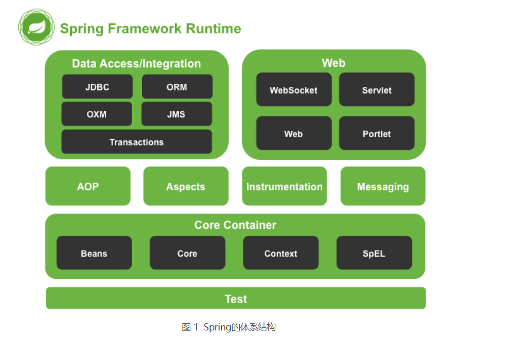
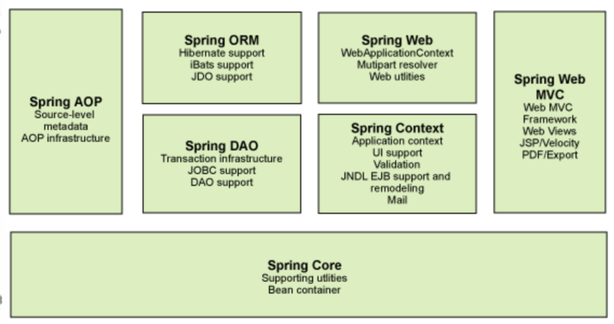
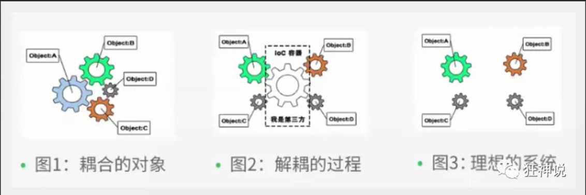
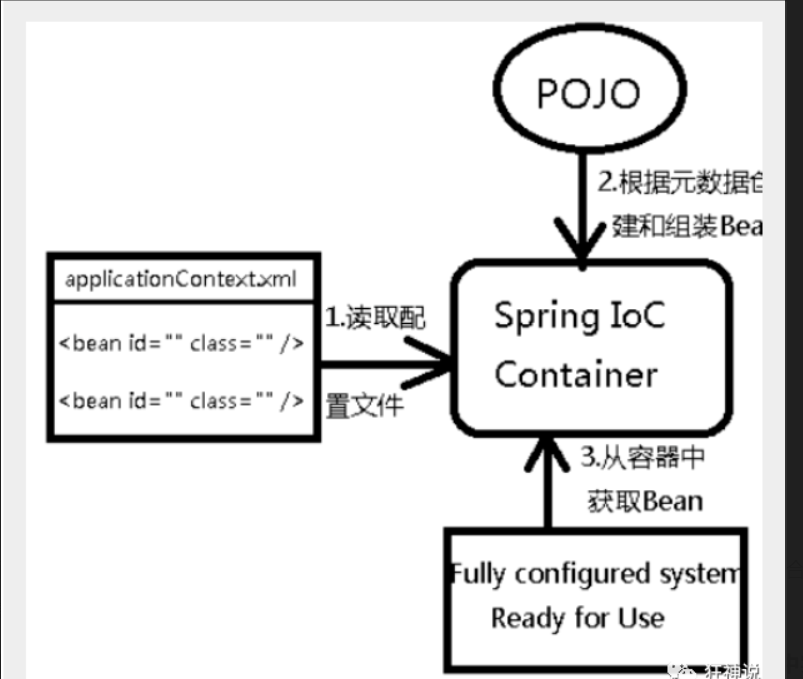
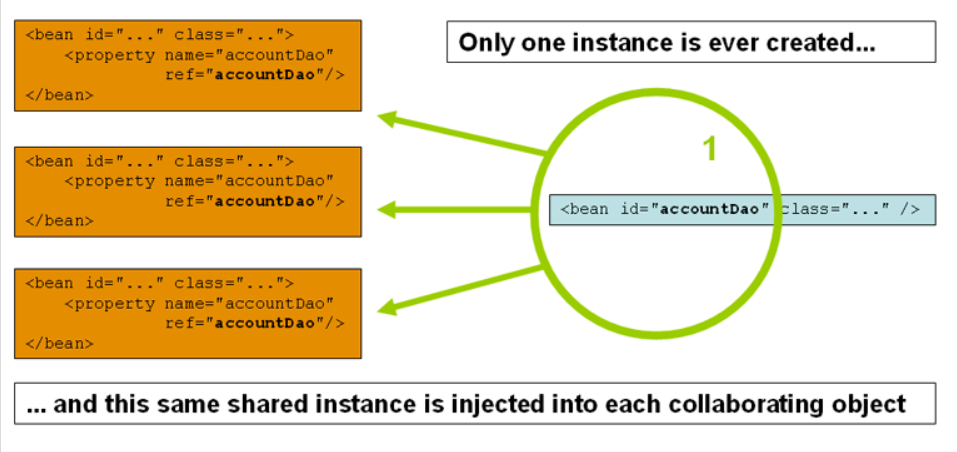
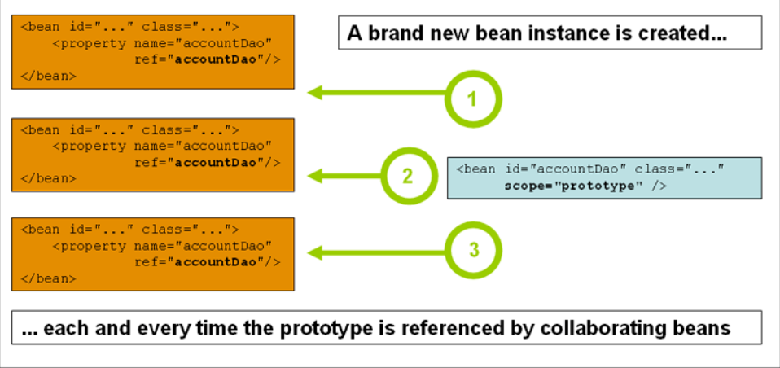
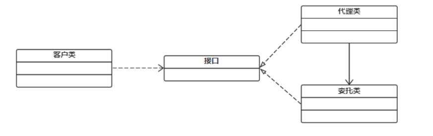
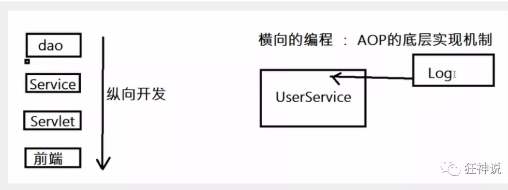
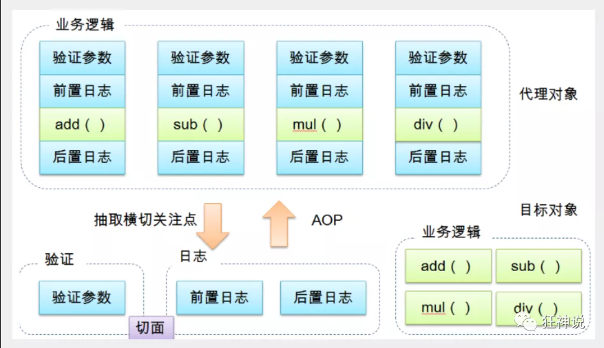
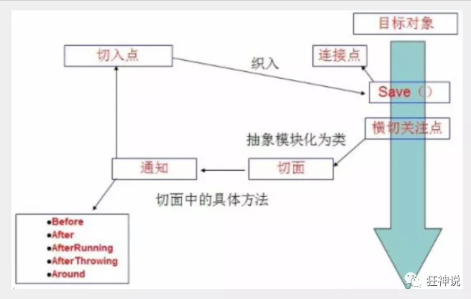

# Spring

> [Spring Framework 中文文档](https://www.docs4dev.com/docs/zh/spring-framework/5.1.3.RELEASE/reference/)

Spring是一个开源框架，它由[Rod Johnson](https://baike.baidu.com/item/Rod Johnson)创建。它是为了解决企业应用开发的复杂性而创建的。Spring使用基本的JavaBean来完成以前只可能由EJB完成的事情。然而，Spring的用途不仅限于服务器端的开发。从简单性、可测试性和松耦合的角度而言，任何Java应用都可以从Spring中受益。

Spring是一个轻量级的控制反转(IoC)和面向切面(AOP)的容器框架。

## 简介

- 2002年 ,首次推出了Spring框架的雏形 : interface21框架
- Spring框架以interface为基础,经过重新设计,并不断丰富其内涵,于2004年3月24日发布了1.0正式版
- spring理念: 使现有的技术更加容易使用,本身是一个大杂烩 , 整合了现有的技术框架

### 优点:

- 是一个开源免费框架(容器)!
- 是一个轻量级,非入侵式的框架
- **控制反转(IOC) ,面向切面编程(AOP)**
- 支持事务处理,对框架整合支持! 

### 组成:



Spring 框架是一个分层架构，由 7 个定义良好的模块组成。Spring 模块构建在核心容器之上，核心容器定义了创建、配置和管理 bean 的方式 .



组成 Spring 框架的每个模块（或组件）都可以单独存在，或者与其他一个或多个模块联合实现。每个模块的功能如下：

- **核心容器**：核心容器提供 Spring 框架的基本功能。核心容器的主要组件是 BeanFactory，它是工厂模式的实现。BeanFactory 使用*控制反转*（IOC） 模式将应用程序的配置和依赖性规范与实际的应用程序代码分开。
- **Spring 上下文**：Spring 上下文是一个配置文件，向 Spring 框架提供上下文信息。Spring 上下文包括企业服务，例如 JNDI、EJB、电子邮件、国际化、校验和调度功能。
- **Spring AOP**：通过配置管理特性，Spring AOP 模块直接将面向切面的编程功能 , 集成到了 Spring 框架中。所以，可以很容易地使 Spring 框架管理任何支持 AOP的对象。Spring AOP 模块为基于 Spring 的应用程序中的对象提供了事务管理服务。通过使用 Spring AOP，不用依赖组件，就可以将声明性事务管理集成到应用程序中。
- **Spring DAO**：JDBC DAO 抽象层提供了有意义的异常层次结构，可用该结构来管理异常处理和不同数据库供应商抛出的错误消息。异常层次结构简化了错误处理，并且极大地降低了需要编写的异常代码数量（例如打开和关闭连接）。Spring DAO 的面向 JDBC 的异常遵从通用的 DAO 异常层次结构。
- **Spring ORM**：Spring 框架插入了若干个 ORM 框架，从而提供了 ORM 的对象关系工具，其中包括 JDO、Hibernate 和 iBatis SQL Map。所有这些都遵从 Spring 的通用事务和 DAO 异常层次结构。
- **Spring Web 模块**：Web 上下文模块建立在应用程序上下文模块之上，为基于 Web 的应用程序提供了上下文。所以，Spring 框架支持与 Jakarta Struts 的集成。Web 模块还简化了处理多部分请求以及将请求参数绑定到域对象的工作。
- **Spring MVC 框架**：MVC 框架是一个全功能的构建 Web 应用程序的 MVC 实现。通过策略接口，MVC 框架变成为高度可配置的，MVC 容纳了大量视图技术，其中包括 JSP、Velocity、Tiles、iText 和 POI。


### 拓展:

- Spring Boot
  - 一个快速开发的脚手架
  - 基于SpringBoot快速的开发单个微服务
  - 约定大于配置
- Spring Cloud
  - SpringCloud 基于SpringBoot实现


SpringBoot的出现就是为了解决Spring的弊端:

**即违背了原理的理念, 配置十分繁琐 , 人称 “ 配置地狱 ” !**


## IOC理论

**控制反转是一种通过描述（XML或注解）并通过第三方去生产或获取特定对象的方式。在Spring中实现控制反转的是IoC容器，其实现方法是依赖注入（Dependency Injection,DI）。**

**控制反转(inversion of control),** 是一种设计思想,DI(dependency injection依赖注入)是IOC的一种方法.未使用IOC的程序中,我们使用面向对象编程,对象的创建和对象之间的依赖关系完全硬编码在程序中,对象的创建是由程序自己控制的.控制反转就是将对象的创建转移给了第三方.IOC就我认为是:获得依赖对象的方式反转了

【硬编码：是将数据直接其纳入到程序或其他可执行程序或其他可执行对象的源代码中的软件开发时间，与外部获取数据或在运行时生成数据不同。硬编码数据通常只能通过编辑源代码或重新编译可执行文件来修改。】




**IOC是Spring框架的核心内容,** 使用了多种方式完美的实现了IOC,xml配置与注解形式,新版本的spring也可以零配置实现IOC

Spring容器在初始化的时候先读取配置文件,根据配置文件或者元数据创建与组织对象存入容器中,程序使用时在从IOC容器中取出需要的对象



**采用XML方式配置Bean的时候，Bean的定义信息是和实现分离的，而采用注解的方式可以把两者合为一体，Bean的定义信息直接以注解的形式定义在实现类中，从而达到了零配置的目的。**

我们先用我们原来的方式写一段代码 .

1、先写一个UserDao接口

```java
public interface UserDao {
   public void getUser();
}
```

2、再去写Dao的实现类

```java
public class UserDaoImpl implements UserDao {
   @Override
   public void getUser() {
       System.out.println("获取用户数据");
  }
}
```

3、然后去写UserService的接口

```java
public interface UserService {
   public void getUser();
}
```

4、最后写Service的实现类

```java
public class UserServiceImpl implements UserService {
   private UserDao userDao = new UserDaoImpl();

   @Override
   public void getUser() {
       userDao.getUser();
  }
}
```

5、测试一下

```java
@Test
public void test(){
   UserService service = new UserServiceImpl();
   service.getUser();
}
```

这是我们原来的方式 , 开始大家也都是这么去写的对吧 . 那我们现在修改一下 .

把Userdao的实现类增加一个 .

```java
public class UserDaoMySqlImpl implements UserDao {
   @Override
   public void getUser() {
       System.out.println("MySql获取用户数据");
  }
}
```

紧接着我们要去使用MySql的话 , 我们就需要去service实现类里面修改对应的实现

```java
public class UserServiceImpl implements UserService {
   private UserDao userDao = new UserDaoMySqlImpl();

   @Override
   public void getUser() {
       userDao.getUser();
  }
}
```

在假设, 我们再增加一个Userdao的实现类 .

```java
public class UserDaoOracleImpl implements UserDao {
   @Override
   public void getUser() {
       System.out.println("Oracle获取用户数据");
  }
}
```

那么我们要使用Oracle , 又需要去service实现类里面修改对应的实现 . 假设我们的这种需求非常大 , 这种方式就根本不适用了, 甚至反人类对吧 , 每次变动 , 都需要修改大量代码 . 这种设计的耦合性太高了, 牵一发而动全身 .

**那我们如何去解决呢 ?** 

我们可以在需要用到他的地方 , 不去实现它 , 而是留出一个接口 , 利用set , 我们去代码里修改下 .

```java
public class UserServiceImpl implements UserService {
   private UserDao userDao;
// 利用set实现
   public void setUserDao(UserDao userDao) {
       this.userDao = userDao;
  }

   @Override
   public void getUser() {
       userDao.getUser();
  }
}
```

现在去我们的测试类里 , 进行测试 ;

```java
@Test
public void test(){
   UserServiceImpl service = new UserServiceImpl();
   service.setUserDao( new UserDaoMySqlImpl() );
   service.getUser();
   //那我们现在又想用Oracle去实现呢
   service.setUserDao( new UserDaoOracleImpl() );
   service.getUser();
}
```

大家发现了区别没有 ? 可能很多人说没啥区别 . 但是同学们 , 他们已经发生了根本性的变化 , 很多地方都不一样了 . 仔细去思考一下 , 以前所有东西都是由程序去进行控制创建 , 而现在是由我们自行控制创建对象 , 把主动权交给了调用者 . 程序不用去管怎么创建,怎么实现了 . 它只负责提供一个接口 .

这种思想 , 从本质上解决了问题 , 我们程序员不再去管理对象的创建了 , 更多的去关注业务的实现 . 耦合性大大降低 . 这也就是IOC的原型 !


## 入门案例(hello Spring)

> 1.导包

​	**只需要导入这一个(springframework)即可包含所有Spring所需要的jar包**

注 : spring 需要导入commons-logging进行日志记录 . 我们利用maven , 他会自动下载对应的依赖项 .只需要导入

```xml
<!-- https://mvnrepository.com/artifact/org.springframework/spring-webmvc -->
<dependency>
    <groupId>org.springframework</groupId>
    <artifactId>spring-webmvc</artifactId>
    <version>5.3.16</version>
</dependency>
```

> 2.编写实体类

```java
package pojo;

public class User {
    private int uid;
    private String name;
    private String pwd;

    public User() {
    }

    public User(int uid, String name, String pwd) {
        this.uid = uid;
        this.name = name;
        this.pwd = pwd;
    }

    @Override
    public String toString() {
        return "User{" +
                "uid=" + uid +
                ", name='" + name + '\'' +
                ", pwd='" + pwd + '\'' +
                '}';
    }

    public int getUid() {
        return uid;
    }

    public void setUid(int uid) {
        this.uid = uid;
    }

    public String getName() {
        return name;
    }

    public void setName(String name) {
        this.name = name;
    }

    public String getPwd() {
        return pwd;
    }

    public void setPwd(String pwd) {
        this.pwd = pwd;
    }
}
```

> 编写配置文件

将此文件放入类加载目录下

```xml
<?xml version="1.0" encoding="UTF-8"?>
<beans xmlns="http://www.springframework.org/schema/beans"
       xmlns:xsi="http://www.w3.org/2001/XMLSchema-instance"
       xsi:schemaLocation="http://www.springframework.org/schema/beans
        http://www.springframework.org/schema/beans/spring-beans.xsd">
<!--  绑定实体类User   -->
    <bean id="user" class="pojo.User">
<!--        设置属性,注意,绑定的实体类一定要有setter方法
 			标签的name表示需要控制的属性的名称
				value属性代表要设置的值(基本数据类型)
				如果要设置值为引用类类型(下面的例子有)
				可以通过<bean>绑定其类似,然后使用ref属性引用其作为此属性的值
-->
        <property name="name" value="Spring"/>
    </bean>

</beans>
```

> 测试代码

```java
    @Test
    public void test02(){
// 加载配置文件(可以通过添加多个参数配置多个文件),并且获取应用程序上下文件
        ApplicationContext context = new ClassPathXmlApplicationContext("beans.xml");
//      通过上下文对象获取处理配置文件中处理过的Bean(实体类) ,
        User user = (User) context.getBean("user");
        System.out.println(user);
    }
```

### 思考?

- User对象是谁创建的 ?  hello 对象是由Spring创建的
- User对象的属性是怎么设置的 ?  hello 对象的属性是由Spring容器设置的

这个过程就叫控制反转 :

- 控制 : 谁来控制对象的创建 , 传统应用程序的对象是由程序本身控制创建的 , 使用Spring后 , 对象是由Spring来创建的
- 反转 : 程序本身不创建对象 , 而变成被动的接收对象 .

依赖注入 : 就是利用set方法来进行注入的.

 IOC是一种编程思想，由主动的编程变成被动的接收

可以通过newClassPathXmlApplicationContext去浏览一下底层源码 .


### 简单模拟应用场景

我们原先的习惯是这样的:

```java
// 持久层,接口约定
public interface UserDao {
   public void getUser();
}
// 持久层实现1
public class UserDaoImpl implements UserDao {
   @Override
   public void getUser() {
       System.out.println("获取用户数据");
  }
}
// 持久层实现2
public class UserDaoMySqlImpl implements UserDao {
   @Override
   public void getUser() {
       System.out.println("MySql获取用户数据");
  }
}

// 业务层接口约定
public interface UserService {
   public void getUser();
}
// 业务层实现
public class UserServiceImpl implements UserService {
   private UserDao userDao;
   public void setUserDao(UserDao userDao) {
       this.userDao = userDao;
  }
   @Override
   public void getUser() {
       userDao.getUser();
  }
}
// 测试
@Test
public void test(){
   UserServiceImpl service = new UserServiceImpl();
   service.setUserDao( new UserDaoMySqlImpl() );
   service.getUser();
   //那我们现在又想用Oracle去实现呢
   service.setUserDao( new UserDaoOracleImpl() );
   service.getUser();
}
```

现在我们用Spring来实现一下(假设上述的持久层接口和实现已经写好) :

配置文件(beans.xml)

```xml
<?xml version="1.0" encoding="UTF-8"?>
<beans xmlns="http://www.springframework.org/schema/beans"
       xmlns:xsi="http://www.w3.org/2001/XMLSchema-instance"
       xsi:schemaLocation="http://www.springframework.org/schema/beans
        http://www.springframework.org/schema/beans/spring-beans.xsd">

<!--    绑定两个持久层实现类-->
    <bean id="UserDaoImpl" class="dao.UserDaoImpl"></bean>
    <bean id="UserDaoImplMysql" class="dao.UserDaoImplMysql"></bean>

<!--绑定业务层实现-->
    <bean id="UserServiceImpl" class="service.UserServiceImpl">
        <!--    设置业务层的UserDaoImpl属性,由此来决定执行哪个实现
        标签的ref是引用了上面绑定的两个实现类,需要更改实现,只需要修改
        ref属性即可
        -->
        <property name="userDao" ref="UserDaoImplMysql" />
    </bean>
</beans>
```

测试代码:

```java
@Test
public void test03(){
    ApplicationContext context = new ClassPathXmlApplicationContext("beans.xml");

    UserServiceImpl service = (UserServiceImpl) context.getBean("UserServiceImpl");
    service.getUser();
}
```


## IOC创建对象

### 创建对象的时机:

**当我们将配置加载到应用程序上下文的时候就创建了**

```java
// 执行此语句 User 对象就已经创建
ApplicationContext context = new ClassPathXmlApplicationContext("createUser.xml");
// 而并非在此语句执行时创建
User user = (User) context.getBean("user");
```

### 创建对象的方式:

**默认使用无参构造进行创建, 但可以通过配置文件中的`constructor-arg`元素选择构造器进行创建**

```xml
<?xml version="1.0" encoding="UTF-8"?>
<beans xmlns="http://www.springframework.org/schema/beans"
       xmlns:xsi="http://www.w3.org/2001/XMLSchema-instance"
       xsi:schemaLocation="http://www.springframework.org/schema/beans
        http://www.springframework.org/schema/beans/spring-beans.xsd">
    <bean id="user" class="pojo.User">
<!--  使用有参构造进行创建对象:      -->
<!--        1.通过有参构造的参数名设置参数创建对象-->
<!--        <constructor-arg name="name" value="万叶"></constructor-arg>-->
<!--        <constructor-arg name="uid" value="12"></constructor-arg>-->
<!--        2.通过索引设置构造器的参数创建对象-->
<!--        <constructor-arg index="0" value="万叶" ></constructor-arg>-->
<!--        3.通过有参构造的参数类型进行创建(不推荐)-->
        <constructor-arg type="java.lang.String" value="万叶"></constructor-arg>
    </bean>
</beans>
```

### 创建对象的复用性

Spring为了避免重复创建对象浪费内存, **每次加载配置文件只创建一个对象(对应配置文件中配置的每一个bean),故多次通过`getBean()`获取的同名Bean其实是同一个对象**

```java
@Test
public void createUser(){
    ApplicationContext context = new ClassPathXmlApplicationContext("createUser.xml");
    User user1 = (User) context.getBean("user");
    User user2 = (User) context.getBean("user");
    System.out.println(user1 == user2);  // 结果为true
}
```


## Bean的配置

```xml
<!--设置别名：在获取Bean的时候可以使用别名获取-->
<alias name="userT" alias="userNew"/>

<!--bean就是java对象,由Spring创建和管理-->

<!--
   id 是bean的标识符,要唯一,如果没有配置id,name就是默认标识符
   如果配置id,又配置了name,那么name是别名
   name可以设置多个别名,可以用逗号,分号,空格隔开
   如果不配置id和name,可以根据applicationContext.getBean(.class)获取对象;
   
   class 是bean的全限定名=包名+类名
-->
<bean id="hello" name="hello2 h2,h3;h4" class="com.kuang.pojo.Hello">
   <property name="name" value="Spring"/>
</bean>

<!--
    可引入其它配置文件, 一般用于团队的合作
-->
<import resource="{path}/beans.xml"/>
```


### Bean作用域

通过bean标签的`scope`属性设置作用域

```xml
<bean id="对象id" class="包名.类名" scope="需要设置的作用域名"/>
```


| Scope                                                        | Description                                                  |
| :----------------------------------------------------------- | :----------------------------------------------------------- |
| [singleton](https://docs.spring.io/spring-framework/docs/current/reference/html/core.html#beans-factory-scopes-singleton) | （默认值）将单个 Bean 定义限定为每个 Spring IoC 容器的单个对象实例。 |
| [prototype](https://docs.spring.io/spring-framework/docs/current/reference/html/core.html#beans-factory-scopes-prototype) | 将单个 Bean 定义的作用域限定为任意数量的对象实例。           |
| [request](https://docs.spring.io/spring-framework/docs/current/reference/html/core.html#beans-factory-scopes-request) | 将单个 Bean 定义的作用域限定为单个 HTTP 请求的生命周期。也就是说，每个 HTTP 请求都有自己的 Bean 实例，该实例是在单个 Bean 定义后面创建的。仅在网络感知Spring的上下文中有效。`ApplicationContext` |
| [session](https://docs.spring.io/spring-framework/docs/current/reference/html/core.html#beans-factory-scopes-session) | 将单个 Bean 定义作用域限定为 HTTP 的生命周期。仅在网络感知Spring的上下文中有效。`Session``ApplicationContext` |
| [application](https://docs.spring.io/spring-framework/docs/current/reference/html/core.html#beans-factory-scopes-application) | 将单个 Bean 定义的作用域限定为 的生命周期。仅在网络感知Spring的上下文中有效。`ServletContext``ApplicationContext` |
| [websocket](https://docs.spring.io/spring-framework/docs/current/reference/html/web.html#websocket-stomp-websocket-scope) | 将单个 Bean 定义的作用域限定为 的生命周期。仅在网络感知Spring的上下文中有效。`WebSocket``ApplicationContext` |

几种作用域中，request、session作用域仅在基于web的应用中使用（不必关心你所采用的是什么web应用框架），只能用在基于web的Spring ApplicationContext环境。

##### 单例作用域  Singleton



##### 原型作用域 Prototype



##### Request

当一个bean的作用域为Request，表示在一次HTTP请求中，一个bean定义对应一个实例；即每个HTTP请求都会有各自的bean实例，它们依据某个bean定义创建而成。该作用域仅在基于web的Spring ApplicationContext情形下有效。

##### Session

当一个bean的作用域为Session，表示在一个HTTP Session中，一个bean定义对应一个实例。该作用域仅在基于web的Spring ApplicationContext情形下有效。


## 依赖注入

### 通过构造器注入

```xml
<?xml version="1.0" encoding="UTF-8"?>
<beans xmlns="http://www.springframework.org/schema/beans"
       xmlns:xsi="http://www.w3.org/2001/XMLSchema-instance"
       xsi:schemaLocation="http://www.springframework.org/schema/beans
        http://www.springframework.org/schema/beans/spring-beans.xsd">
    <bean id="user" class="pojo.User">
<!--  使用有参构造进行创建对象(默认使用无参构造):      -->
<!--        1.通过有参构造的参数名设置参数创建对象-->
<!--        <constructor-arg name="name" value="万叶"></constructor-arg>-->
<!--        <constructor-arg name="uid" value="12"></constructor-arg>-->
<!--        2.通过索引设置构造器的参数创建对象-->
<!--        <constructor-arg index="0" value="万叶" ></constructor-arg>-->
<!--        3.通过有参构造的参数类型进行创建(不推荐)-->
        <constructor-arg type="java.lang.String" value="万叶"></constructor-arg>
    </bean>
</beans>
```


### setter方式注入

实体类(getter,setter,toString已写好)

```java
public class User {
    private String uid;
    private User user;
    private String[] books;
    private List hobbies;
    private Map cards;
    private Set games;
    private Properties info;
    private String girl;
    // ...
}    
```

常用类型注入对应如下:

```xml
<?xml version="1.0" encoding="UTF-8"?>
<beans xmlns="http://www.springframework.org/schema/beans"
       xmlns:xsi="http://www.w3.org/2001/XMLSchema-instance"
       xsi:schemaLocation="http://www.springframework.org/schema/beans
        http://www.springframework.org/schema/beans/spring-beans.xsd">

<!--    基本类型注入-->
    <bean id="user1" class="pojo.User">
        <property name="uid" value="001"></property>
    </bean>

    <bean id="user2" class="pojo.User">
        <!--    引用类型bean(对象)注入-->
        <property name="user" ref="user1"></property>
<!--        数组注入-->
        <property name="books">
            <array>
                <value>双城记</value>
                <value>往后余生</value>
                <value>秽土转生</value>
            </array>
        </property>
<!--       集合注入-->
        <property name="hobbies">
            <list>
                <value>吉他</value>
                <value>音乐</value>
                <value>旅游</value>
            </list>
        </property>

        <property name="cards">
            <map>
                <entry key="邮政" value="1001" />
                <entry key="信用社" value="2001"/>
                <entry key="建行" value="3001"/>
            </map>
        </property>
        
        <property name="games">
            <set>
                <value>原神</value>
                <value>LOL</value>
                <value>王者荣耀</value>
            </set>
        </property>
        
<!--        配置类注入-->
        <property name="info">
            <props>
                <prop key="driver">com.mysql.cj.jdbc.Driver</prop>
                <prop key="url">jdbc:mysql://localhost:3306/db01?&amp;useSSL=true</prop>
                <prop key="user">root</prop>
                <prop key="password">123456</prop>
            </props>
        </property>

<!--        注入null值,注意空串与null值不一样-->
        <property name="girl">
            <null></null>
        </property>
    </bean>
</beans>
```


### 命名空间方式注入

**注意:使用命令空间注入时要在xml添加关于命令空间的配置**

```xml-dtd
<!-- p命名空间xml-dta约束 -->
xmlns:p="http://www.springframework.org/schema/p"
<!-- c命名空间xml-dta约束 -->
xmlns:c="http://www.springframework.org/schema/c"
```


#### p(Properties)命名空间注入

也就是相当于属性的快捷注入方式

**注意:** 使用的时候保证**bean有无参构造并且需要注入的属性要有setter方法**

```xml
<!--    使用p命名空间注入属性-->
    <bean id="user1" class="pojo.User" p:uid="1001"></bean>
```

#### c(Constructor-args)命名空间注入

也就是相当于constructor-argsz的快捷注入方式

**注意:要保证bean有 有参构造** 

```xml
<!--    使用c命名空间注入属性-->
<bean id="user2" class="pojo.User" c:uid="1002"></bean>
```


## Bean自动装配

自动装配是使用spring满足bean依赖的一种方法 , spring会在应用上下文中为某个bean寻找其依赖的bean。

在Spring中有三种装配的方式:

- 在xml中显式配置
- 在java中显示配置(使用注解)
- 隐式的bean发现机制和自动装配。

Spring的自动装配需要从两个角度来实现，或者说是两个操作：

1. 组件扫描(component scanning)：spring会自动发现应用上下文中所创建的bean；
2. 自动装配(autowiring)：spring自动满足bean之间的依赖，也就是我们说的IoC/DI；

组件扫描和自动装配组合发挥巨大威力，使得显示的配置降低到最少。

---


下面将使用如下bean来进行测试:

bean:

```java
package pojo;

public class People {
    private Cat cat;
    private Dog dog;
    private String name;
    
    public void show(){
        this.cat.show();
        this.dog.show();
    }

    public People() {
    }

    public People(Cat cat, Dog dog, String name) {
        this.cat = cat;
        this.dog = dog;
        this.name = name;
    }

    @Override
    public String toString() {
        return "People{" +
                "cat=" + cat +
                ", dog=" + dog +
                ", name='" + name + '\'' +
                '}';
    }

    public Cat getCat() {
        return cat;
    }

    public void setCat(Cat cat) {
        this.cat = cat;
    }

    public Dog getDog() {
        return dog;
    }

    public void setDog(Dog dog) {
        this.dog = dog;
    }

    public String getName() {
        return name;
    }

    public void setName(String name) {
        this.name = name;
    }
}

```

测试程序:

```java
@org.junit.Test
public void test01(){
    ApplicationContext context = new ClassPathXmlApplicationContext("beans.xml");
    People people = (People) context.getBean("people");
    people.show();
}
```

### autowire byName

当一个bean节点带有 autowire byName的属性时。

1. 将查找其类中所有的set方法名，例如setCat，获得将set去掉并且首字母小写的字符串，即cat。
2. 去spring容器中寻找是否有此字符串名称id的对象。
3. 如果有，就取出注入；如果没有，就报空指针异常。

```xml
<?xml version="1.0" encoding="UTF-8"?>
<beans xmlns="http://www.springframework.org/schema/beans"
       xmlns:xsi="http://www.w3.org/2001/XMLSchema-instance"
       xsi:schemaLocation="http://www.springframework.org/schema/beans http://www.springframework.org/schema/beans/spring-beans.xsd">

    <bean id="cat" class="pojo.Cat"></bean>
    <bean id="dog" class="pojo.Dog"></bean>

<!--    手动装配:即注入属性-->
<!--    <bean id="people" class="pojo.People">-->
<!--        <property name="name" value="南城"></property>-->
<!--        <property name="cat" ref="cat"></property>-->
<!--        <property name="dog" ref="dog"></property>-->
<!--    </bean>-->

<!--    根据名字自动装配:
        这个名字是基于setter方法名和bean id来配置,并且会将setter方法名属性名首字母换成小写
-->
    <bean id="people" class="pojo.People" autowire="byName">
        <property name="name" value="南城"></property>
    </bean>
```

### autowire byType

使用autowire byType首先需要保证：同一类型的对象，在spring容器中唯一。如果不唯一，会报不唯一的异常。

```xml
<?xml version="1.0" encoding="UTF-8"?>
<beans xmlns="http://www.springframework.org/schema/beans"
       xmlns:xsi="http://www.w3.org/2001/XMLSchema-instance"
       xsi:schemaLocation="http://www.springframework.org/schema/beans http://www.springframework.org/schema/beans/spring-beans.xsd">

    <bean id="dog" class="pojo.Dog"></bean>
    <bean id="cat1" class="pojo.Cat"></bean>

<!--    手动装配:即注入属性-->
<!--    <bean id="people" class="pojo.People">-->
<!--        <property name="name" value="南城"></property>-->
<!--        <property name="cat" ref="cat"></property>-->
<!--        <property name="dog" ref="dog"></property>-->
<!--    </bean>-->

<!--    根据类型自动装配,请注意,这时候配置的bean类型必须得唯一!-->
    <bean id="people" class="pojo.People" autowire="byType">
        <property name="name" value="南城"></property>
    </bean>
</beans>
```


### 注解实现自动装配

jdk1.5支持注解,Spring2.5支持注解开发

在Spring4.0以后,使用注解需要导入aop的包(直接导入webmvc即可包含)

**使用注解需要在xml配置文件引入配置约束**,并且添加`<context:annotation-config/>`

```xml
<?xml version="1.0" encoding="UTF-8"?>
<beans xmlns="http://www.springframework.org/schema/beans"
      xmlns:xsi="http://www.w3.org/2001/XMLSchema-instance"
      xmlns:context="http://www.springframework.org/schema/context"
      xsi:schemaLocation="http://www.springframework.org/schema/beans
       http://www.springframework.org/schema/beans/spring-beans.xsd
       http://www.springframework.org/schema/context
       http://www.springframework.org/schema/context/spring-context.xsd">
 <!-- 开启注解设置 -->
<context:annotation-config/>
</beans>
```


==使用注解自动装配的属性前提该属性是需要在IOC容器中存在(即使在配置文件xml中注册了该bean)==

#### @Autowired

由于**注解是通过反射实现的,故不依赖属性的stter方法了**

**装配顺序原则:**

1. **先byType**
2. **然后byName**

*扩展:*

@Autowired(required=false) 说明：false，对象可以为null；true，对象必须存对象，不能为null。

@Nullable 使用属性可以为null

#### @Qualifier

可以通过`@Qualifier`限定装配指定名字的bean

- @Autowired是默认优先根据类型自动装配的，**加上@Qualifier则可以优先根据byName的方式自动装配**
- **@Qualifier不能单独使用。**

```java
// 指定装配 bean id 为cat2 的bean 
@Qualifier(value = "cat2")
```

测试:

```xml
<?xml version="1.0" encoding="UTF-8"?>
<beans xmlns="http://www.springframework.org/schema/beans"
       xmlns:xsi="http://www.w3.org/2001/XMLSchema-instance"
       xmlns:context="http://www.springframework.org/schema/context"
       xsi:schemaLocation="http://www.springframework.org/schema/beans
       http://www.springframework.org/schema/beans/spring-beans.xsd
       http://www.springframework.org/schema/context
       http://www.springframework.org/schema/context/spring-context.xsd">
    <!-- 开启注解设置 -->
    <context:annotation-config/>

    <bean id="cat2" class="pojo.Cat">
        <property name="name" value="猫猫2"/>
    </bean>
    <bean id="cat" class="pojo.Cat"/>

    <bean id="dog" class="pojo.Dog"/>

    <bean id="people" class="pojo.People_annotation"></bean>

</beans>
```


```java
package pojo;
import org.springframework.beans.factory.annotation.Autowired;
import org.springframework.beans.factory.annotation.Qualifier;
public class People_annotation {
    @Autowired
    @Qualifier(value = "cat2")
    private Cat cat;
    @Autowired
    private Dog dog;
    private String name;

    public void show(){
        this.cat.show();
        this.dog.show();
    }
    public People_annotation() {
    }
    @Override
    public String toString() {
        return "People_annotation{" +
                "cat=" + cat.toString() +
                ", dog=" + dog.toString() +
                ", name='" + name + '\'' +
                '}';
    }
}
/***********************使用了@Qualifier(value = "cat2")测试*************************/
    @org.junit.Test
    public void test02(){
        ApplicationContext context = new ClassPathXmlApplicationContext("beans_annotation.xml");
        People_annotation people =context.getBean("people", People_annotation.class);
        people.show();
        System.out.println(people.toString());
    }
/**************结果***************/
喵~
汪~
People_annotation{cat=Cat{name='猫猫2'}, dog=pojo.Dog@7920ba90, name='null'}

/***********只使用使用@AutoWired的结果*****************************/
喵~
汪~
People_annotation{cat=Cat{name='null'}, dog=pojo.Dog@7920ba90, name='null'}
```

#### @Resource

这个注解是属于J2EE的(推荐使用,便于解耦),上面两个属于Spring

- @Resource注解既可以用在setter中也可以用在属性当中，**当Resource指定属性name名字时，就只会按照指定的name去查找bean，否则会报错。**
- 当注解写在字段上时，@Resource不指定name，默认取字段名进行按照名称查找，如果注解写在setter方法上默认取属性名进行装配。**如果最后都找不到与名称匹配的bean时才按照类型进行装配。**我们运行也会成功

**总结: @Resource 先byName,再byType,可以通过属性name将bean id限定**

配置文件

```xml
<?xml version="1.0" encoding="UTF-8"?>
<beans xmlns="http://www.springframework.org/schema/beans"
       xmlns:xsi="http://www.w3.org/2001/XMLSchema-instance"
       xmlns:context="http://www.springframework.org/schema/context"
       xsi:schemaLocation="http://www.springframework.org/schema/beans
       http://www.springframework.org/schema/beans/spring-beans.xsd
       http://www.springframework.org/schema/context
       http://www.springframework.org/schema/context/spring-context.xsd">
    <!-- 开启注解设置 -->
    <context:annotation-config/>
    
    <bean id="dog" class="pojo.Dog"/>
    <bean id="dog2" class="pojo.Dog">
        <property name="name" value="修勾勾2"></property>
    </bean>

    <bean id="people" class="pojo.People_annotation"></bean>

</beans>
```


```java
@Resource(name = "dog2")
    private Dog dog;

/*******测试程序与上面相同,结果:***********/
喵~
汪~
People_annotation{cat=Cat{name='猫猫2'}, dog=Dog{name='修勾勾2'}, name='null'}

/**********************不指定名字****************************/
@Resource
    private Dog dog;
/*******测试程序与上面相同,结果:***********/
喵~
汪~
People_annotation{cat=Cat{name='猫猫2'}, dog=Dog{name='null'}, name='null'}
```


## 使用注解开发

### 需要的配置

注意! 使用注解需要**在配置文件中引入相关的注解配置,以及扫描指定的包**

```xml
<?xml version="1.0" encoding="UTF-8"?>
<beans xmlns="http://www.springframework.org/schema/beans"
      xmlns:xsi="http://www.w3.org/2001/XMLSchema-instance"
      xmlns:context="http://www.springframework.org/schema/context"
      xsi:schemaLocation="http://www.springframework.org/schema/beans
       http://www.springframework.org/schema/beans/spring-beans.xsd
       http://www.springframework.org/schema/context
       http://www.springframework.org/schema/context/spring-context.xsd">
<!--指定注解扫描包-->
<context:component-scan base-package="com.kuang.pojo"/>
 <!-- 开启注解设置 -->
<context:annotation-config/>    
</beans>
```

### 基础注解

- @Component : 使用了该注解的类将会称为Spring的组件(即被Spring管理)
- @value  : 注入属性值

```java
@Component("user")
// 相当于配置文件中 <bean id="user" class="当前注解的类"/>
public class User {
   @Value("南城")
   // 相当于配置文件中 <property name="name" value="南城"/>
   public String name;
}

//如果提供了set方法，在set方法上添加@value("值");
@Component("user")
public class User {

   public String name;

   @Value("秦疆")
   public void setName(String name) {
       this.name = name;
  }
}
```

### 衍生注解

所谓衍生,就有点类似html5的语义化标签(如header标签和div标签), 名字不同,功能都一样

**@Component三个衍生注解**

为了更好的进行分层，Spring可以使用其它三个注解，功能一样，目前使用哪一个功能都一样。

- @Controller：web层
- @Service：service层
- @Repository：dao层


### 自动装配注解

- @Autowired
- @Qualifier  与@Autowired搭配使用限定bean id
- @Resource  J2EE的原生注解

### 作用域@scope

注解的值:

- singleton：默认的，Spring会采用单例模式创建这个对象。关闭工厂 ，所有的对象都会销毁。
- prototype：多例模式。关闭工厂 ，所有的对象不会销毁。内部的垃圾回收机制会回收
- session
- request

```java
@Controller("user")
@Scope("prototype")
public class User {
   @Value("南城")
   public String name;
}
```

### xml与注解:

**XML与注解比较**

- XML可以适用任何场景 ，结构清晰，维护方便
- 注解不是自己提供的类使用不了，开发简单方便

**xml与注解整合开发** ：推荐最佳实践

- xml管理Bean
- 注解完成属性注入
- 使用过程中， 可以不用扫描，扫描是为了类上的注解

```xml
<context:annotation-config/>  
```

作用：

- 进行注解驱动注册，从而使注解生效
- 用于激活那些已经在spring容器里注册过的bean上面的注解，也就是显示的向Spring注册
- 如果不扫描包，就需要手动配置bean
- 如果不加注解驱动，则注入的值为null！


### JavaConfig配置

**其实, 我们也可以完全不使用xml配置!**

JavaConfig 原来是 Spring 的一个子项目，它通过 Java 类的方式提供 Bean 的定义信息，在 Spring4 的版本， JavaConfig 已正式成为 Spring4 的核心功能 。

#### @Configuration 

使用`@Configuration`注解可以将一个类声明成配置类,相当于xml中的`<beans>`

#### @bean

使用`@bean` 注解可以将一个返回bean的方法的返回值作为被Spring管理的bean,**方法名就是bean id**相当于xml中的`<bean>`,其底层是`@Component`实现的

#### @Import(类名.class)

使用`@Import`注解可以引入其他的配置类

#### @ComponentScan(basePackages = "包名或者包路径")

使用`@Component`注解可以扫描指定的包的组件,也就是说被扫描的包中的类也可以使用`@Component`注册组件bean , 相当于:

```xml
<beans>
    <context:component-scan base-package="com.acme"/>
</beans>
```


看如下例子:

需要被管理的bean

```java
package pojo;

import org.springframework.beans.factory.annotation.Value;

public class User {
    private int uid;
    // 注入属性值
    @Value("南城")
    private String name;
    private String pwd;

    public User() {
        System.out.println("User的无参构造函数!");
    }

    public User(String name) {
        this.name = name;
        System.out.println("一个参数的有参数构造");
    }

    public User(int uid, String name) {
        this.uid = uid;
        this.name = name;
        System.out.println("两个参数的有参数构造");
    }

    public User(int uid, String name, String pwd) {
        this.uid = uid;
        this.name = name;
        this.pwd = pwd;
        System.out.println("三个参数的有参数构造");
    }

    @Override
    public String toString() {
        return "User{" +
                "uid=" + uid +
                ", name='" + name + '\'' +
                ", pwd='" + pwd + '\'' +
                '}';
    }

    public int getUid() {
        return uid;
    }

    public void setUid(int uid) {
        this.uid = uid;
    }

    public String getName() {
        return name;
    }

    public void setName(String name) {
        this.name = name;
    }

    public String getPwd() {
        return pwd;
    }

    public void setPwd(String pwd) {
        this.pwd = pwd;
    }
}
```

配置类AppConfig

```java
package config;

import org.springframework.context.annotation.Bean;
import org.springframework.context.annotation.Configuration;
import org.springframework.context.annotation.Import;
import pojo.User;


@Configuration
    //@Import(MyConfig2.class)  //导入合并其他配置类，类似于配置文件中的 inculde 标签
public class AppConfig {
    @Bean
    User getUser(){
        return new User();
    }
}

```

测试:

```java
@Test
    public void test01(){
        // 注意! 此时的应用程序上下文将通过 注解应用程序构造器 获得
        ApplicationContext context = new AnnotationConfigApplicationContext(AppConfig.class);
        // 方法名即为 bean id
        User user = (User) context.getBean("getUser");
        System.out.println(user.toString());

    }
```


上述例子相当于:

```xml
<beans>
    <bean id="getUser" class="pojo.User">
    <property name="name" value="南城"/>
    </bean>
</beans>
```


## 代理模式

为什么要学习代理模式，因为AOP的底层机制就是动态代理！【SpringAOP和SpringMVC】

代理模式：

- 静态代理
- 动态代理

学习aop之前 , 我们要先了解一下代理模式！



### 静态代理:

- 抽象角色 : 一般使用接口或者抽象类来实现
- 真实角色 : 被代理的角色
- 代理角色 : 代理真实角色 ; 代理真实角色后 , 一般会做一些附属的操作 .
- 客户 : 使用代理角色来进行一些操作 .

**代码实现**

Rent . java 即抽象角色


```java
//抽象角色：租房
public interface Rent {
   public void rent();
}
```

Host . java 即真实角色

```java
//真实角色: 房东，房东要出租房子
public class Host implements Rent{
   public void rent() {
       System.out.println("房屋出租");
  }
}
```

Proxy . java 即代理角色

```java
//代理角色：中介
public class Proxy implements Rent {

   private Rent rent;
   public Proxy() { }
   public Proxy(Rent rent) {
       this.rent = rent;
  }

   //租房
   public void rent(){
       seeHouse();
       host.rent();
       fare();
  }
   //看房
   public void seeHouse(){
       System.out.println("带房客看房");
  }
   //收中介费
   public void fare(){
       System.out.println("收中介费");
  }
}
```

Client . java 即客户

```java
//客户类，一般客户都会去找代理！
public class Client {
   public static void main(String[] args) {
       //房东要租房
       Host host = new Host();
       //中介帮助房东
       Proxy proxy = new Proxy(host);

       //你去找中介！
       proxy.rent();
  }
}
```

分析：在这个过程中，你直接接触的就是中介，就如同现实生活中的样子，你看不到房东，但是你依旧租到了房东的房子通过代理，这就是所谓的代理模式，程序源自于生活，所以学编程的人，一般能够更加抽象的看待生活中发生的事情。

**静态代理的好处:**

- 可以使得我们的真实角色更加纯粹 . 不再去关注一些公共的事情 .
- 公共的业务由代理来完成 . 实现了业务的分工 ,
- 公共业务发生扩展时变得更加集中和方便 .

缺点 :类多了 , 多了代理类 , 工作量变大了 . 开发效率降低 .

---


1、创建一个抽象角色，比如咋们平时做的用户业务，抽象起来就是增删改查！

```java
//抽象角色：增删改查业务
public interface UserService {
   void add();
   void delete();
   void update();
   void query();
}
```

2、我们需要一个真实对象来完成这些增删改查操作

```java
//真实对象，完成增删改查操作的人
public class UserServiceImpl implements UserService {

   public void add() {
       System.out.println("增加了一个用户");
  }

   public void delete() {
       System.out.println("删除了一个用户");
  }

   public void update() {
       System.out.println("更新了一个用户");
  }

   public void query() {
       System.out.println("查询了一个用户");
  }
}
```

3、需求来了，现在我们需要增加一个日志功能，怎么实现！

- 思路1 ：在实现类上增加代码 【麻烦！】
- 思路2：使用代理来做，能够不改变原来的业务情况下，实现此功能就是最好的了！

4、设置一个代理类来处理日志！代理角色

```java
//代理角色，在这里面增加日志的实现
public class UserServiceProxy implements UserService {
   private UserServiceImpl userService;

   public void setUserService(UserServiceImpl userService) {
       this.userService = userService;
  }

   public void add() {
       log("add");
       userService.add();
  }

   public void delete() {
       log("delete");
       userService.delete();
  }

   public void update() {
       log("update");
       userService.update();
  }

   public void query() {
       log("query");
       userService.query();
  }

   public void log(String msg){
       System.out.println("执行了"+msg+"方法");
  }
}
```

测试

```java
public class Client {
    public static void main(String[] args) {
        UserService service = new UserServiceImp();
//        service.query();
//        使用代理:
        UserServiceProxy serviceProxy = new UserServiceProxy(service);
        serviceProxy.query();

    }
}
```




### 动态代理:

- 动态代理的角色和静态代理的一样 .
- 动态代理的代理类是动态生成的 . 静态代理的代理类是我们提前写好的
- 动态代理分为两类 : 一类是基于接口动态代理 , 一类是基于类的动态代理
- - 基于接口的动态代理----JDK动态代理
  - 基于类的动态代理--cglib
  - 现在用的比较多的是 javasist 来生成动态代理 . 百度一下javasist
  - 我们这里使用JDK的原生代码来实现，其余的道理都是一样的！、

**JDK的动态代理需要了解两个类**

核心 : **InvocationHandler** 和 **Proxy**

**利用Java的反射技术(Java Reflection)，在运行时创建一个实现某些给定接口的新类（也称“动态代理类”）及其实例（对象）,代理的是接口(Interfaces)，不是类(Class)，也不是抽象类。在运行时才知道具体的实现，spring aop就是此原理。**

---

#### Proxy

- `Proxy`提供了**创建动态代理类和实例的静态方法**，它也是由这些方法创建的所有**动态代理类的父类**。
-    **创建代理对象实例方法:**public static Object newProxyInstance(ClassLoader loader,Class<?>[] interfaces,InvocationHandler h);

newProxyInstance( ) 方法有三个参数：

**loader: 用哪个类加载器去加载代理对象**

**interfaces:动态代理类需要实现的接口,并且通过这个接口找到具体的需要代理的实现类**

**h:调用程序处理对象, 代理实例在执行方法时，会调用h里面的invoke方法去执行**     

---

#### InvocationHandler (调用程序处理接口)

- `InvocationHandler`是由**代理实例的调用处理程序实现的接口** 。
- **每个代理实例都有一个关联的调用处理程序**。  当在**代理实例调用方法时，方法调用将被编码并分派到其调用处理程序的`invoke`方法。**
- `invoke(Object proxy, Method method, Object[] args)`有三个参数:

**proxy:** 代理实例

**method:** 代理实例执行方法时反射回来的方法

**args:** 代理实例执行方法时反射回来的方法参数


如下例子用之前静态代理添加日志功能的例子继续演示:

UserService接口:

```java
public interface UserService {
    void add();
    void delete();
    void update();
    void query();
}
```

UserServiceImp业务实现:

```java
public class UserServiceImp implements UserService {
    @Override
    public void add() {
        System.out.println("增加用户");
    }
    @Override
    public void delete() {
        System.out.println("删除用户");
    }
    @Override
    public void update() {
        System.out.println("修改用户");
    }
    @Override
    public void query() {
        System.out.println("查询用户");
    }
}
```

封装好的创建代理实例工具类:

```java
import java.lang.reflect.InvocationHandler;
import java.lang.reflect.Method;
import java.lang.reflect.Proxy;

public class InvocationHandlerProxy implements InvocationHandler {
//  被代理的真实目标对象(即原型对象)
    private Object target;

    public InvocationHandlerProxy(Object target) {
        this.target = target;
    }

    //    获取代理实例
    public Object getProxyInstance(){
//        通过 当前对象的类加载器加载代理实例, 代理实例实现的接口(后面通过这个接口找到对应实现类) , this代表代理实例关联的调用程序对象
        return Proxy.newProxyInstance(this.getClass().getClassLoader(),target.getClass().getInterfaces(),this);
    }

    @Override
//    当代理实例执行方法时, 会执行代理实例的关联的调用程序对象的invoke()方法
    public Object invoke(Object proxy, Method method, Object[] args) throws Throwable {
        log(proxy,method.getName());
        //返回方法的结果
        /* 通过代理实例反射回来的method对象调用invoke(),实际上还是target去执行那个方法   */
        return method.invoke(target,args);
    }

    public void log(Object o ,String msg){
        System.out.println("代理对象:"+o.getClass()+"执行了"+msg+"方法!");
    }

    public void setTarget(Object target) {
        this.target = target;
    }
}
```

测试程序Client:

```java
public class Client {
    public static void main(String[] args) {
        UserServiceImp serviceImp = new UserServiceImp();
        InvocationHandlerProxy invocationHandlerProxy = new InvocationHandlerProxy(serviceImp);

        UserService proxy = (UserService) invocationHandlerProxy.getProxyInstance();
        proxy.query();
        proxy.add();
    }
}
```


## Spring中的AOP

### 相关概念:

AOP（Aspect Oriented Programming）意为：面向切面编程，**通过预编译方式和运行期动态代理实现程序功能的统一维护的一种技术。**AOP是OOP的延续，是软件开发中的一个热点，也是Spring框架中的一个重要内容，是函数式编程的一种衍生范型。利用AOP可以对业务逻辑的各个部分进行隔离，从而使得业务逻辑各部分之间的耦合度降低，提高程序的可重用性，同时提高了开发的效率。

Spring的Aop就是将公共的业务 (日志 , 安全等) 和领域业务结合起来 , 当执行领域业务时 , 将会把公共业务加进来 . 实现公共业务的重复利用 . 领域业务更纯粹 , 程序猿专注领域业务 , 其本质还是动态代理 . 




相关概念:

- 横切关注点：跨越应用程序多个模块的方法或功能。即是，与我们业务逻辑无关的，但是我们需要关注的部分，就是横切关注点。如日志 , 安全 , 缓存 , 事务等等 ....
- **切面（Aspect）：横切关注点 被模块化 的特殊对象。即，它是一个类。**
- **通知（Advice）**：**切面必须要完成的工作。即，它是类中的一个方法。**
- 目标（Target）：被通知对象。即原型对象
- 代理（Proxy）：向目标对象应用通知之后创建的对象。即代理对象或代理者
- **切入点（PointCut）**：**切面通知 执行的 “地点”的定义。**
- **连接点（JointPoint）**：与切入点匹配的执行点。在使用环绕切入时必须通过链接点显式调用方法




**SpringAOP中，通过Advice(通知)定义横切逻辑，Spring中支持5种类型的Advice:**

| Advice类型                            | 链接点                   | 实现接口                                           |
| ------------------------------------- | ------------------------ | -------------------------------------------------- |
| **前置通知:BeforeAdvice**             | **切点(方法)执行前**     | `org.springframework.aop.MethodBeforeAdvice`       |
| 后置通知:AfterAdvice                  | **切点(方法)执行后**     | `org.springframework.aop.MethodAfterAdvice`        |
| **环绕通知:AroundAdvice,Interceptor** | **切点(方法)执行前后**   | `org.aopalliance.intercept.MethodInterceptor`      |
| **异常通知:ThrowsAdvice**             | **切点(方法)抛出异常时** | `org.springframework.aop.ThrowsAdvice`             |
| 引介通知:IntroductionInterceptor      | 在类中新增方法           | `org.springframework.aop.IntroductionInterceptor;` |


### 需要的配置:

使用api需要另外导入依赖包(不是webmvc里的包)

```xml
<!-- https://mvnrepository.com/artifact/org.aspectj/aspectjweaver -->
<dependency>
   <groupId>org.aspectj</groupId>
   <artifactId>aspectjweaver</artifactId>
   <version>1.9.4</version>
</dependency>
```

所需要的xml配置约束:

```xml
<?xml version="1.0" encoding="UTF-8"?>
<beans xmlns="http://www.springframework.org/schema/beans"
      xmlns:xsi="http://www.w3.org/2001/XMLSchema-instance"
      xmlns:aop="http://www.springframework.org/schema/aop"
      xsi:schemaLocation="
       http://www.springframework.org/schema/beans
       http://www.springframework.org/schema/beans/spring-beans.xsd
       http://www.springframework.org/schema/aop
       http://www.springframework.org/schema/aop/spring-aop.xsd">
</beans>
```


### 使用Spring API实现AOP

我们需要将切入的代码实现相关的通知接口(如:`MethodBeforeAdvice`,`AfterReturningAdvice`等等...),随后使用`<aop:config>`中的`<aop:pointcut>`标签**配置切入点,**,使用` <aop:advisor>`配置通知类实现

UserService接口:

```java
package aop;

public interface UserService {
    void add();
    void delete();
    void update();
    void query();
}
```

业务代码接口实现:

```java
package aop;

public class UserServiceImp implements UserService {
    @Override
    public void add() {
        System.out.println("增加用户");
    }

    @Override
    public void delete() {
        System.out.println("删除用户");
    }

    @Override
    public void update() {
        System.out.println("修改用户");
    }

    @Override
    public void query() {
        System.out.println("查询用户");
    }
}

```

需要切入的代码:

前置通知需要实现`org.springframework.aop.MethodBeforeAdvice`接口

```java
package aop.SpringAPI实现;
import org.springframework.aop.MethodBeforeAdvice;
import java.lang.reflect.Method;

public class BeforeLog implements MethodBeforeAdvice {
// 实现了此接口的类的before方法将会在切入点执行前执行
    @Override
    public void before(Method method, Object[] args, Object target) throws Throwable {
        /*
        * method 表示执行的方法对象
        * args 方法所执行的参数
        * target 表示被代理的对象(即原型对象)
        * */
        System.out.println(target.getClass().getName()+"执行方法"+method.getName()+"之前========");
    }
}
```

后置通知需要实现`org.springframework.aop.AfterReturningAdvice`接口

```java
package aop.SpringAPI实现;
import org.springframework.aop.AfterReturningAdvice;
import java.lang.reflect.Method;

public class AfterLog implements AfterReturningAdvice {
    // 实现了此接口的类的before方法将会在切入点执行后执行
    @Override
    public void afterReturning(Object returnValue, Method method, Object[] args, Object target) throws Throwable {
        /*
         * returnValue 表示执行方法所返回的值
         * method 表示执行的方法对象
         * args 方法所执行的参数
         * target 表示被代理的对象(即原型对象)
         * */
        System.out.println(target.getClass().getName()+"执行方法"+method.getName()+"之后========返回值为"+returnValue);
    }
}
```


applicationconfig.xml

```xml
<?xml version="1.0" encoding="UTF-8"?>
<beans xmlns="http://www.springframework.org/schema/beans"
       xmlns:xsi="http://www.w3.org/2001/XMLSchema-instance"
       xmlns:aop="http://www.springframework.org/schema/aop"
       xsi:schemaLocation="http://www.springframework.org/schema/beans
       http://www.springframework.org/schema/beans/spring-beans.xsd
       http://www.springframework.org/schema/aop
       http://www.springframework.org/schema/aop/spring-aop.xsd">

<!--    注册bean-->
    <bean id="serviceImp" class="aop.UserServiceImp"/>
    <bean id="beforeLog" class="aop.SpringAPI实现.BeforeLog" />
    <bean id="afterLog" class="aop.SpringAPI实现.AfterLog"/>

<!--    aop配置-->
    <aop:config>
<!--        设置 切入点,表达式:expression="execution(* aop.UserServiceImp.*(..))
表示:切入点为 当执行 aop包下UserServiceImp类的任意方法且此方法有0至多个参数,且该方法的返回值也是任意的
也就是说: UserServiceImp类的所有方法执行时进行切入
-->
        <aop:pointcut id="pointcut" expression="execution(* aop.UserServiceImp.*(..))"/>
<!--        配置 切入通知-->
        <aop:advisor advice-ref="beforeLog" pointcut-ref="pointcut"/>
        <aop:advisor advice-ref="afterLog" pointcut-ref="pointcut"/>
    </aop:config>
</beans>
```

测试:

```java
import aop.UserService;
import org.springframework.context.ApplicationContext;
import org.springframework.context.support.ClassPathXmlApplicationContext;
import 动态代理.增加功能.UserServiceImp;

public class MainDemo1 {
    public static void main(String[] args) {
        ApplicationContext context = new ClassPathXmlApplicationContext("appconfig1.xml");
        // 注意!!! 这里接收的是上转型对象,注册的bean是实现类,接收的类型是接口类型
// 使用实现类接口将会报切入异常:com.sun.proxy.$Proxy3 cannot be cast to 动态代理.增加功能.UserServiceImp
        UserService service = (UserService) context.getBean("serviceImp");

        service.query();
    }
}
```

#### 注意与拓展:

##### `<aop:config>`切点表达式:

> 关于Spring中AOP的切点表示更多详细参考:[切点表达式用法 (cnblogs.com)](https://www.cnblogs.com/zhangxufeng/p/9160869.html)

 由于Spring切面粒度最小是达到方法级别，而execution表达式可以用于明确**指定方法返回类型，类名，方法名和参数名等与方法相关的部件，并且在Spring中，大部分需要使用AOP的业务场景也只需要达到方法级别即可**，因而execution表达式的使用是最为广泛的。如下是execution表达式的语法：

```xml
execution(方法访问修饰符? 返回值 方法含包名全路径?方法名(参数类型) 抛出的异常类型?)
```

 *这里问号表示当前项可以有也可以没有*，其中各项的语义如下：

- ***通配符，该通配符主要用于匹配单个单词，或者是以某个词为前缀或后缀的单词。**
- ..通配符，**该通配符表示0个或多个项**，主要用于方法的`含包名全路径`和`参数类型`中，如果用于`含包名全路径`中，==则表示匹配当前包及其子包==，如果用于`参数类型`中，则**表示匹配0个或多个参数。**

如下示例表示匹配返回值为任意类型，并且是com.spring.service包及其子包下的任意类的名称为businessService的方法，而且该方法不能有任何参数：

```java
execution(* com.spring.service..*.businessService())
```

​    这里需要说明的是，包路径service..*.businessService()中的..应该理解为延续前面的service路径，表示到service路径为止，或者继续延续service路径，从而包括其子包路径；后面的*.businessService()，这里的*表示匹配一个单词，因为是在方法名前，因而表示匹配任意的类。

​    如下示例是使用..表示任意个数的参数的示例，需要注意，表示参数的时候可以在括号中事先指定某些类型的参数，而其余的参数则由..进行匹配：

```java
execution(* com.spring.service.BusinessObject.businessService(java.lang.String,..))
```

##### 实现类与接口的转换:

由于我们的**实现类(即UserServiceImp)交给了Spring进行代理来实现AOP**,**所以我们在获取bean时应该使用实现类对应的接口来获取**

```java
context.getBean("serviceImp",UserService.class).add();
```


### 使用自定义类实现AOP

我们除了可以通过实现相关的接口来进行通知增强外,还**可以自定义切入通知类** ,只需要使用`<aop:aspect ref="myAdvice" </aop:aspect>`配置切面标签中配置切面即可

UserService接口与其实现类与上面的例子一致,就省略了

UserService接口,实现类 略

自定义通知类 MyAdvice:

```java
package aop.自定义类实现;

public class MyAdspect {
    public void before(){
        System.out.println("================执行方法前============");
    }

    public void after(){
        System.out.println("================执行方法后============");
    }
}

```

applicationconfig.xml

```xml
<?xml version="1.0" encoding="UTF-8"?>
<beans xmlns="http://www.springframework.org/schema/beans"
       xmlns:xsi="http://www.w3.org/2001/XMLSchema-instance"
       xmlns:aop="http://www.springframework.org/schema/aop"
       xsi:schemaLocation="http://www.springframework.org/schema/beans
       http://www.springframework.org/schema/beans/spring-beans.xsd
       http://www.springframework.org/schema/aop
       http://www.springframework.org/schema/aop/spring-aop.xsd">
<!--    被管理的原型对象-->
    <bean id="serviceImp" class="aop.UserServiceImp"/>
<!--引入自定义的切面类-->
    <bean id="myAdvice" class="aop.自定义类实现.MyAspect"/>

    <aop:config>
<!--        设置切入点-->
        <aop:pointcut id="pointcut" expression="execution(* aop.UserServiceImp.*(..))"/>
<!--        配置自定义的切面, ref引入自定义通知类-->
        <aop:aspect ref="myAspect" id="myAspect">
<!--            配置具体切入方式和通知类的具体方法实现以及切入点-->
            <aop:before method="after" pointcut-ref="pointcut"/>
            <aop:after  method="before" pointcut-ref="pointcut"/>
        </aop:aspect>
    </aop:config>
</beans>
```

测试:

```java
package aop.自定义类实现;

import aop.UserService;
import aop.UserServiceImp;
import org.springframework.context.ApplicationContext;
import org.springframework.context.support.ClassPathXmlApplicationContext;

public class MainDemo2 {
    public static void main(String[] args) {
        ApplicationContext context = new ClassPathXmlApplicationContext("appconfig2.xml");

        UserService userService = (UserService) context.getBean("serviceImp");
        userService.add();
    }
}
```

#### 补充:环绕切入

**环绕切入需要显式的通过链接点`ProceedingJoinPoint`**对象调用`proceed()`方法执行目标(原型对象)调用的方法

自定义切面类:

```java
import org.aspectj.lang.ProceedingJoinPoint;

public class MyAspect {

    public void round(ProceedingJoinPoint joinPoint) throws Throwable {
        System.out.println("================执行方法前============");
        Object returnValue = joinPoint.proceed();  // 显式通过链接点执行原型对象执行的方法
        System.out.println("执行了"+joinPoint.getSignature()+"方法"+"原型对象为"+joinPoint.getTarget()+"返回值:"+returnValue);
    }
}
```

applicationconfig.xml

```xml
<?xml version="1.0" encoding="UTF-8"?>
<beans xmlns="http://www.springframework.org/schema/beans"
       xmlns:xsi="http://www.w3.org/2001/XMLSchema-instance"
       xmlns:aop="http://www.springframework.org/schema/aop"
       xsi:schemaLocation="http://www.springframework.org/schema/beans
       http://www.springframework.org/schema/beans/spring-beans.xsd
       http://www.springframework.org/schema/aop
       http://www.springframework.org/schema/aop/spring-aop.xsd">
<!--    被管理的原型对象-->
    <bean id="serviceImp" class="aop.UserServiceImp"/>
<!--引入自定义的切面类-->
    <bean id="myAdvice" class="aop.自定义类实现.MyAspect"/>

    <aop:config>
<!--        设置切入点-->
        <aop:pointcut id="pointcut" expression="execution(* aop.UserServiceImp.*(..))"/>
<!--        配置自定义的切面, ref引入自定义通知类-->
        <aop:aspect ref="myAdvice" id="myAspect">
            <!-- 配置具体切入方式和通知类的具体方法实现以及切入点-->
            <aop:around method="round" pointcut-ref="pointcut"/>
        </aop:aspect>
    </aop:config>
</beans>
```


### 使用注解实现AOP

实现aop的常用注解:

- `@Aspect`  标注为自定义切面类
- `@Before("execution(表达式)")` 标注方法为前置通知方法
- `@After("execution(表达式")`      标注方法为前置通知方法
- `@Around("execution(表达式")`    标注方法为环绕通知方法(注意需要显示通过链接点调用方法)
- `@EnableAspectJAutoProxy` **用于自定义配置类, 开启自动代理**

`aop:aspectj-autoproxy`：说明

通过aop命名空间的<aop:aspectj-autoproxy />声明自动为spring容器中那些配置@aspectJ切面的bean创建代理，织入切面。当然，spring 在内部依旧采用AnnotationAwareAspectJAutoProxyCreator进行自动代理的创建工作，但具体实现的细节已经被<aop:aspectj-autoproxy />隐藏起来了

<aop:aspectj-autoproxy />有一个proxy-target-class属性，默认为false，表示使用jdk动态代理织入增强，当配为<aop:aspectj-autoproxy  poxy-target-class="true"/>时，表示使用CGLib动态代理技术织入增强。不过即使proxy-target-class设置为false，如果目标类没有声明接口，则spring将自动使用CGLib动态代理。


#### 自定义配置类不用配置文件

如下例子完全采用注解注册bean,并且实现环绕切面 (UserService接口和实现类已省略)

自定义切面类: AnnotationAspect 

```java
package aop.注解实现;

import org.aspectj.lang.ProceedingJoinPoint;
import org.aspectj.lang.annotation.After;
import org.aspectj.lang.annotation.Around;
import org.aspectj.lang.annotation.Aspect;
import org.aspectj.lang.annotation.Before;
import org.springframework.context.annotation.EnableAspectJAutoProxy;
import org.springframework.stereotype.Component;

@Aspect
public class AnnotationAspect {

    @Around("execution(* aop.UserServiceImp.*(..))")
    public void around(ProceedingJoinPoint joinPoint) throws Throwable {
        System.out.println("================执行方法前============");
        Object returnValue = joinPoint.proceed();
        System.out.println("执行了"+joinPoint.getSignature()+"方法"+"原型对象为"+joinPoint.getTarget()+"返回值:"+returnValue);
    }
}

```

java配置类: MyAppConfig

```java
package aop.注解实现;

import aop.UserServiceImp;
import org.springframework.context.annotation.*;
import org.springframework.stereotype.Component;

@Configuration
@EnableAspectJAutoProxy  //一定要开启自动代理才能生效
public class MyAppConfig {
    @Bean
    UserServiceImp getServiceImp(){
        return new UserServiceImp();
    }
    @Bean
    AnnotationAspect getAnnotationAspect(){
        return new AnnotationAspect();
    }
}
```

测试:

```java
public class MainDemo3 {
    public static void main(String[] args) {
        // 通过注解注册bean容器,完全不使用配置文件
        ApplicationContext context = new AnnotationConfigApplicationContext(MyAppConfig.class);
        UserService userService = (UserService) context.getBean("getServiceImp");
        userService.add();
    }
}
```

#### 使用配置文件结合注解使用

本例中将通过配置文件**开启注解扫描和自动代理**设置,然后再使用注解实现

自定义切面类: AnnotationAspect

```java
package aop.注解实现;

import org.aspectj.lang.ProceedingJoinPoint;
import org.aspectj.lang.annotation.After;
import org.aspectj.lang.annotation.Around;
import org.aspectj.lang.annotation.Aspect;
import org.aspectj.lang.annotation.Before;
import org.springframework.context.annotation.EnableAspectJAutoProxy;
import org.springframework.stereotype.Component;

@Aspect
public class AnnotationAspect {

    @Around("execution(* aop.UserServiceImp.*(..))")
    public void around(ProceedingJoinPoint joinPoint) throws Throwable {
        System.out.println("================执行方法前============");
        Object returnValue = joinPoint.proceed();
        System.out.println("执行了"+joinPoint.getSignature()+"方法"+"原型对象为"+joinPoint.getTarget()+"返回值:"+returnValue);
    }
}
```

接口实现类,注册组件:

```java
package aop;

import org.springframework.stereotype.Component;

@Component("serviceImp")
public class UserServiceImp implements UserService {
    @Override
    public void add() {
        System.out.println("增加用户");
    }

    @Override
    public void delete() {
        System.out.println("删除用户");
    }

    @Override
    public void update() {
        System.out.println("修改用户");
    }

    @Override
    public void query() {
        System.out.println("查询用户");
    }
}

```

配置文件: appconfig.xml

```xml
<?xml version="1.0" encoding="UTF-8"?>
<beans xmlns="http://www.springframework.org/schema/beans"
       xmlns:xsi="http://www.w3.org/2001/XMLSchema-instance"
       xmlns:context="http://www.springframework.org/schema/context"
       xmlns:aop="http://www.springframework.org/schema/aop"
       xsi:schemaLocation="
       http://www.springframework.org/schema/beans
       http://www.springframework.org/schema/beans/spring-beans.xsd
       http://www.springframework.org/schema/context
       http://www.springframework.org/schema/context/spring-context.xsd
       http://www.springframework.org/schema/aop
       http://www.springframework.org/schema/aop/spring-aop.xsd">

    <!-- 开启注解设置 -->
    <context:annotation-config/>
    <!--指定注解扫描包-->
    <context:component-scan base-package="aop"/>
<!--    开启自动代理-->
    <aop:aspectj-autoproxy/>
</beans>
```

测试:

```java
package aop.注解实现;

import aop.UserService;
import org.springframework.context.ApplicationContext;
import org.springframework.context.annotation.AnnotationConfigApplicationContext;
import org.springframework.context.support.ClassPathXmlApplicationContext;

public class MainDemo3 {
    public static void main(String[] args) {
        // 方式二:
        ApplicationContext context2  = new ClassPathXmlApplicationContext("appconfig3.xml");
        UserService userService2 = (UserService) context2.getBean("serviceImp");
        userService2.add();
    }
}
```


## Spring整合Mybatis

> 官方参考文档:[mybatis-spring ](http://mybatis.org/spring/zh/index.html)

什么是 MyBatis-Spring？

MyBatis-Spring 会帮助你将 MyBatis 代码无缝地整合到 Spring 中。它将允许 MyBatis 参与到 Spring 的事务管理之中，创建映射器 mapper 和 `SqlSession` 并注入到 bean 中，以及将 Mybatis 的异常转换为 Spring 的 `DataAccessException`。 最终，可以做到应用代码不依赖于 MyBatis，Spring 或 MyBatis-Spring。

### 依赖配置

```xml
<!--        测试工具-->
    <dependency>
        <groupId>junit</groupId>
        <artifactId>junit</artifactId>
        <version>4.13</version>
        <scope>test</scope>
    </dependency>

<!--        Spring重要核心-->
        <!-- https://mvnrepository.com/artifact/org.springframework/spring-webmvc -->
        <dependency>
            <groupId>org.springframework</groupId>
            <artifactId>spring-webmvc</artifactId>
            <version>5.3.16</version>
        </dependency>

<!--        Spring织入-->
        <!-- https://mvnrepository.com/artifact/org.aspectj/aspectjweaver -->
        <dependency>
            <groupId>org.aspectj</groupId>
            <artifactId>aspectjweaver</artifactId>
            <version>1.9.4</version>
        </dependency>

<!--        spring的jdbc-->
        <!-- https://mvnrepository.com/artifact/org.springframework/spring-jdbc -->
        <dependency>
            <groupId>org.springframework</groupId>
            <artifactId>spring-jdbc</artifactId>
            <version>5.3.16</version>
        </dependency>

<!--        spring中的Mybatis-->
        <!-- https://mvnrepository.com/artifact/org.mybatis/mybatis-spring -->
        <dependency>
            <groupId>org.mybatis</groupId>
            <artifactId>mybatis-spring</artifactId>
            <version>2.0.6</version>
        </dependency>

        <!--        Mybatis-->
        <dependency>
            <groupId>org.mybatis</groupId>
            <artifactId>mybatis</artifactId>
            <version>3.5.7</version>
        </dependency>

<!--        mysql驱动-->
        <dependency>
            <groupId>mysql</groupId>
            <artifactId>mysql-connector-java</artifactId>
            <version>8.0.21</version>
        </dependency>
```


### 入门案例:

1. 首先需要编写Spring的上下文件配置文件,然后将**`数据源` ,`SqlSessionFactoryBean`(会话工厂) 注入Spring中**,至少需要定义这两个
   - 数据源中需要设置`driverClassName` , `url` ,`username` ,`password`
   - 会话工厂也有两个很重要的东西,必须配置**数据源**,**映射器**, 之前我们在mybatis中是通过引入配置文件`mybatis-config.xml`来创建会话工厂的,现在可以完全不用配置mybatis配置文件(如果没有其他配置要求的话)
2. 通过会话工厂获得SqlSession对象(在Spring-Mybatis中是他的子类`SqlSessionTemplate`),随后也交给Spring管理
3. 最后通过SqlSession获取Mapper执行对应方法

实体类: User (省略)

dao接口:Userdao 

```java
package spring_mybatis01.dao;
import spring_mybatis01.pojo.User;
import java.util.List;

public interface UserDao {
    List<User> getAllUser();
}

```

 Spring的配置文件 appconfig.xml , **注意！ 如果需要引入mybatis核心配置文件**

```xml
<?xml version="1.0" encoding="UTF-8"?>
<beans xmlns="http://www.springframework.org/schema/beans"
       xmlns:xsi="http://www.w3.org/2001/XMLSchema-instance"
       xsi:schemaLocation="http://www.springframework.org/schema/beans http://www.springframework.org/schema/beans/spring-beans.xsd">

<!--    配置数据源,这里配置的是Spring的JDBC的-->
    <bean id="dataSource" class="org.springframework.jdbc.datasource.DriverManagerDataSource">
        <property name="driverClassName" value="com.mysql.cj.jdbc.Driver"/>
        <property name="url" value="jdbc:mysql://localhost:3306/mybatis?
        useSSL=true&amp;serverTimezone=Asia/Shanghai&amp;useUnicode=true&amp;characterEncoding=UTF-8"/>
        <property name="username" value="root"/>
        <property name="password" value="123456"/>
    </bean>

<!--    创建SqlSession工厂-->
    <bean id="sqlSessionFactory" class="org.mybatis.spring.SqlSessionFactoryBean">
<!--        直接给工厂对象注入数据源,映射器mapper,这两个是必须的-->
        <property name="configLocation" value="mybatis-config.xml"/>  <!--注意! 如果注入配置文件,则必须最先注入 -->
        <property name="dataSource" ref="dataSource" />   <!-- 必填项 -->
<!--  可以通过mybatis配置引入mapper配置,也可以通过mapperLocations属性注入 -->
<!--        <property name="mapperLocations" value="classpath:spring_mybatis01/dao/*.xml" />-->
    </bean>

<!--    创建sqlSession对象-->
    <bean id="sqlSessionTemplate" class="org.mybatis.spring.SqlSessionTemplate">
        <constructor-arg name="sqlSessionFactory" ref="sqlSessionFactory"/>
    </bean>

    <bean id="userDaoMapper" class="spring_mybatis01.dao.UserDaoMapper">
        <constructor-arg index="0" ref="sqlSessionTemplate"/>
    </bean>
</beans>
```

mybatis-config.xml , 一般我们用来**对mybatis的一些设置，如mapper,缓冲之类的**

```xml
<?xml version="1.0" encoding="UTF-8" ?>
<!DOCTYPE configuration
        PUBLIC "-//mybatis.org//DTD Config 3.0//EN"
        "http://mybatis.org/dtd/mybatis-3-config.dtd">
<configuration>
    
    <mappers>
<!--        &lt;!&ndash;        注意:这里的路径下一级用 / 表示,可以注册多个映射器          &ndash;&gt;-->
        <mapper resource="spring_mybatis01/dao/UserDaoMapper.xml"/>
    </mappers>
</configuration>
```

UserDaoMapper.xml , 也可以通过注解实现

```xml
<?xml version="1.0" encoding="UTF-8" ?>
<!DOCTYPE mapper
        PUBLIC "-//mybatis.org//DTD Mapper 3.0//EN"
        "http://mybatis.org/dtd/mybatis-3-mapper.dtd">
<!--命名空间作用是绑定 Dao/Mapper接口,相当于编写了一个类实现了该接口-->
<mapper namespace="spring_mybatis01.dao.UserDao">
    <!-- id就当于Dao/Mapper接口的方法,相当于实现了接口重写了接口里的方法,方法体内容就是sql,
   返回类型和参数类型应该与重写的方法保持一致
-->
   <select id="getAllUser" resultType="spring_mybatis01.pojo.User">
       select * from `user`
   </select>
</mapper>
```

UserDaoMapper.class, 此类不是必要的,只是将通过Spring将SqlSessiontemplate注入,然后返回对应接口的mapper

```java
package spring_mybatis01.dao;

import org.mybatis.spring.SqlSessionTemplate;

public class DaoMapper {
    private SqlSessionTemplate sqlSessionTemplate;
    // 根据参数类型,返回对应接口的Mapper
    public <T> T getMapper(Class<T> typeClass){
        return this.sqlSessionTemplate.getMapper(typeClass);
    }

    public DaoMapper(SqlSessionTemplate sqlSessionTemplate) {
        this.sqlSessionTemplate = sqlSessionTemplate;
    }
}
```

测试程序:

```java
package spring_mybatis01;

public class MainTest {
    public static void main(String[] args) {
        ApplicationContext context = new ClassPathXmlApplicationContext("appconfig.xml");
        // 通过Spring管理的DaoMapper类获取接口的sql映射器
        UserDao userDaoMapper = context.getBean("daoMapper", DaoMapper.class).getMapper(UserDao.class);
        // 执行sql
        List<User> list =  userDaoMapper.getAllUser();
        for (User user: list) {
            System.out.println(user);
        }
    }
}

```

---

#### 注解实现

**案例二: ** 此案例将大量通过注解实现

UserDao接口:

```java
package spring_mybatis02.dao;
import org.apache.ibatis.annotations.Select;
import spring_mybatis02.pojo.User;
import java.util.List;

public interface UserDao {
    @Select("select * from `user`")
    List<User> getAllUser();
}
```


Spring配置类: MyAppconfig

```java
package spring_mybatis02.config;

import org.apache.ibatis.session.SqlSessionFactory;
import org.mybatis.spring.SqlSessionFactoryBean;
import org.mybatis.spring.SqlSessionTemplate;
import org.mybatis.spring.mapper.MapperFactoryBean;
import org.springframework.context.annotation.Bean;
import org.springframework.context.annotation.Configuration;
import org.springframework.jdbc.datasource.DriverManagerDataSource;
import spring_mybatis02.MainTest;
import spring_mybatis02.dao.UserDao;
import java.io.InputStream;
import java.util.Properties;

@Configuration
public class MyAppConfig {
    // 将工厂对象放入Spring
    @Bean
    SqlSessionFactory sqlSessionFactoryBean() throws Exception {
        // 创建数据源
        InputStream inputStream = MyAppConfig.class.getClassLoader().getResourceAsStream("db.properties");
        Properties properties = new Properties();
        properties.load(inputStream);
        String driver = properties.getProperty("driver");
        String url = properties.getProperty("url");
        String username = properties.getProperty("username");
        String password = properties.getProperty("password");
        DriverManagerDataSource dataSource = new DriverManagerDataSource(url,username,password);
        dataSource.setDriverClassName(driver);
        // 创建工厂bean, 并且为工厂对象设置数据源后放入Spring中
        SqlSessionFactoryBean factoryBean = new SqlSessionFactoryBean();
        factoryBean.setDataSource(dataSource);
        return factoryBean.getObject();
    }

    // 通过Spring中的工厂对象创建SqlSession,并且也交给Spring管理
    @Bean
    SqlSessionTemplate sqlSessionTemplate() throws Exception {
        return new SqlSessionTemplate(sqlSessionFactoryBean());
    }
    
    /*通过MapperFactoryBean获取SqlSession,进而获取到UserDao接口的Mapper,
    *  将其也交给Spring管理
    * */
    @Bean
    UserDao userDaoMapper() throws Exception {
        // 注意! 要在配置对象中注册Mapper,可以是xml或者注解的接口
        sqlSessionFactoryBean().getConfiguration().addMapper(UserDao.class);  //相当于再配置文件中注册Mapper
        MapperFactoryBean mapperFactoryBean = new MapperFactoryBean(UserDao.class);
        mapperFactoryBean.setSqlSessionFactory(sqlSessionFactoryBean());
        return mapperFactoryBean.getSqlSessionTemplate().getMapper(UserDao.class);
    }
}
```

测试程序:

```java
package spring_mybatis02;

import org.springframework.context.ApplicationContext;
import org.springframework.context.annotation.AnnotationConfigApplicationContext;
import spring_mybatis02.config.MyAppConfig;
import spring_mybatis02.dao.UserDao;
import spring_mybatis02.pojo.User;
import java.util.List;

public class MainTest {
    public static void main(String[] args) {
        ApplicationContext context = new AnnotationConfigApplicationContext(MyAppConfig.class);
        List<User> list =  context.getBean("userDaoMapper",UserDao.class).getAllUser();
        for (User u:list) {
            System.out.println(u);
        }
    }
}
```


### 几个重要对象

#### SqlSessionFactoryBean

在基础的 MyBatis 用法中，是通过 `SqlSessionFactoryBuilder` 来创建 `SqlSessionFactory` 的。而在 MyBatis-Spring 中，则使用 `SqlSessionFactoryBean` 来创建。

需要注意的是 `SqlSessionFactoryBean` 实现了 Spring 的 `FactoryBean` 接口（参见 Spring 官方文档 3.8 节 [通过工厂 bean 自定义实例化逻辑](https://docs.spring.io/spring/docs/current/spring-framework-reference/core.html#beans-factory-extension-factorybean) ）。 这意味着由 Spring 最终创建的 bean **并不是** `SqlSessionFactoryBean` 本身，而是工厂类（`SqlSessionFactoryBean`）的 getObject() 方法的返回结果。这种情况下，Spring 将会在应用启动时为你创建 `SqlSessionFactory`，并使用 `sqlSessionFactory` 这个名字存储起来。

##### 属性:

**`SqlSessionFactory` 有一个唯一的必要属性：用于 JDBC 的 `DataSource`。这可以是任意的 `DataSource` 对象，它的配置方法和其它 Spring 数据库连接是一样的**

**一个常用的属性是 `configLocation`，它用来指定 MyBatis 的 XML 配置文件路径。**它在需要修改 MyBatis 的基础配置非常有用。通常，基础配置指的是 `<settings>` 或 `<typeAliases>` 元素。

需要注意的是，这个配置文件**并不需要**是一个完整的 MyBatis 配置。确切地说，任何环境配置（`<environments>`），数据源（`<DataSource>`）和 MyBatis 的事务管理器（`<transactionManager>`）都会被**忽略**。 `SqlSessionFactoryBean` 会创建它自有的 MyBatis 环境配置（`Environment`），并按要求设置自定义环境的值。

如果 MyBatis 在映射器类对应的路径下找不到与之相对应的映射器 XML 文件，那么也需要配置文件。这时有两种解决办法：第一种是手动在 MyBatis 的 XML 配置文件中的 `<mappers>` 部分中指定 XML 文件的类路径；第二种是设置工厂 bean 的 `mapperLocations` 属性。

`mapperLocations` 属性接受多个资源位置。这个属性可以用来指定 MyBatis 的映射器 XML 配置文件的位置。属性的值是一个 Ant 风格的字符串，可以指定加载一个目录中的所有文件，或者从一个目录开始递归搜索所有目录。比如:

```xml
 <bean id="sqlSessionFactory" class="org.mybatis.spring.SqlSessionFactoryBean">
 <!--注意! 如果注入配置文件,则必须最先注入 -->
        <property name="configLocation" value="mybatis-config.xml"/> 
        <property name="dataSource" ref="dataSource" />   <!-- 必填项 -->
        <property name="mapperLocations" value="classpath*:spring_mybatis01/dao/*.xml" />
 </bean>
```


#### SqlSessionTemplate

在 MyBatis 中，你可以使用 `SqlSessionFactory` 来创建 `SqlSession`。 一旦你获得一个 session 之后，你可以使用它来执行映射了的语句，提交或回滚连接，最后，当不再需要它的时候，你可以关闭 session。 使用 MyBatis-Spring 之后，你不再需要直接使用 `SqlSessionFactory` 了，**因为你的 bean 可以被注入一个线程安全的 `SqlSession`，**它能基于 Spring 的事务配置来自动提交、回滚、关闭 session。

当调用 SQL 方法时（包括由 `getMapper()` 方法返回的映射器中的方法），`SqlSessionTemplate` 将会保证使用的 `SqlSession` 与当前 Spring 的事务相关。 此外，它管理 session 的生命周期，包含必要的关闭、提交或回滚操作。另外，它也负责将 MyBatis 的异常翻译成 Spring 中的 `DataAccessExceptions`。

由于模板可以参与到 Spring 的事务管理中，并且由于其是线程安全的，可以供多个映射器类使用，你应该**总是**用 `SqlSessionTemplate` 来替换 MyBatis 默认的 `DefaultSqlSession` 实现。在同一应用程序中的不同类之间混杂使用可能会引起数据一致性的问题。

**创建这个SqlSessionTemplate对象需要SqlSessionFactory对象来创建**

```xml
    <bean id="sqlSessionTemplate" class="org.mybatis.spring.SqlSessionTemplate">
        <constructor-arg name="sqlSessionFactory" ref="sqlSessionFactory"/>
    </bean>
```

java:

```java
// 通过Spring中的工厂对象创建SqlSession,并且也交给Spring管理
    @Bean
    SqlSessionTemplate sqlSessionTemplate() throws Exception {
        return new SqlSessionTemplate(sqlSessionFactory());
    }
```


#### MapperFactoryBean

`MapperFactoryBean` 需要配置一个 `SqlSessionFactory` 或 `SqlSessionTemplate`。它们可以分别通过 `sqlSessionFactory` 和 `sqlSessionTemplate` 属性来进行设置。 如果两者都被设置，`SqlSessionFactory` 将被忽略。

可以通过`MapperFactoryBean`获取到`SqlSessionTemplate`.

```java
@Bean
    UserDao userDaoMapper() throws Exception {
        // 注意! 如果是注解接口, 要在配置对象中注册Mapper
        sqlSessionFactory().getConfiguration().addMapper(UserDao.class);  //相当于再配置文件中注册Mapper
        MapperFactoryBean mapperFactoryBean = new MapperFactoryBean();
        mapperFactoryBean.setSqlSessionFactory(sqlSessionFactory());
        return mapperFactoryBean.getSqlSessionTemplate().getMapper(UserDao.class);
    }
```


**如果映射器接口 UserMapper 在相同的类路径下有对应的 MyBatis XML 映射器配置文件**，将会被 `MapperFactoryBean` 自动解析。不需要在 MyBatis 配置文件中显式配置映射器，除非映射器配置文件与接口类不在同一个类路径下。 参考 `SqlSessionFactoryBean` 的 [`configLocation`](http://mybatis.org/spring/zh/factorybean.html) 属性以获取更多信息。


#### SqlSessionDaoSupport

`SqlSessionDaoSupport` 是一个抽象的支持类，用来为你提供 `SqlSession`。调用 `getSqlSession()` 方法你会得到一个 `SqlSessionTemplate`，之后可以用于执行 SQL 方法，就像下面这样:

```java
public class UserDaoImpl extends SqlSessionDaoSupport implements UserDao {
  public User getUser(String userId) {
    return getSqlSession().selectOne("org.mybatis.spring.sample.mapper.UserMapper.getUser", userId);
  }
}
```

在这个类里面，通常更倾向于使用 `MapperFactoryBean`，因为它不需要额外的代码。但是，如果你需要在 DAO 中做其它非 MyBatis 的工作或需要一个非抽象的实现类，那么这个类就很有用了。

`SqlSessionDaoSupport` 需要通过属性设置一个 `sqlSessionFactory` 或 `SqlSessionTemplate`。如果两个属性都被设置了，那么 `SqlSessionFactory` 将被忽略。

假设类 `UserMapperImpl` 是 `SqlSessionDaoSupport` 的子类，可以编写如下的 Spring 配置来执行设置：

```xml
<bean id="userDao" class="org.mybatis.spring.sample.dao.UserDaoImpl">
  <property name="sqlSessionFactory" ref="sqlSessionFactory" />
</bean>
```


## Mybatis-Spring中的事务

一个使用 MyBatis-Spring 的其中一个主要原因是它允许 MyBatis 参与到 Spring 的事务管理中。而不是给 MyBatis 创建一个新的专用事务管理器，MyBatis-Spring 借助了 Spring 中的 `DataSourceTransactionManager` 来实现事务管理。

一旦配置好了 Spring 的事务管理器，你就可以在 Spring 中按你平时的方式来配置事务。并且支持 `@Transactional` 注解和 AOP 风格的配置。在事务处理期间，一个单独的 `SqlSession` 对象将会被创建和使用。当事务完成时，这个 session 会以合适的方式提交或回滚。

事务配置好了以后，MyBatis-Spring 将会透明地管理事务。


> [mybatis-spring参考文档](http://mybatis.org/spring/zh/transactions.html)

事务就是把一系列的动作当成一个独立的工作单元，这些动作要么全部完成，要么全部不起作用。

- 事务在项目开发过程非常重要，涉及到数据的一致性的问题，不容马虎！
- 事务管理是企业级应用程序开发中必备技术，用来确保数据的完整性和一致性。

### 事务四个属性ACID原则

- **原子性（atomicity):**事务是原子性操作，由一系列动作组成，事务的原子性确保动作要么全部完成，要么完全不起作用
- **一致性（consistency）:**一旦所有事务动作完成，事务就要被提交。数据和资源处于一种满足业务规则的一致性状态中
- **隔离性（isolation）:**可能多个事务会同时处理相同的数据，因此每个事务都应该与其他事务隔离开来，防止数据损坏
- **持久性（durability）**:事务一旦完成，无论系统发生什么错误，结果都不会受到影响。通常情况下，事务的结果被写到持久化存储器中

Spring在不同的事务管理API之上定义了一个抽象层，使得开发人员不必了解底层的事务管理API就可以使用Spring的事务管理机制。Spring支持编程式事务管理和声明式的事务管理。


### 标准配置

要开启 Spring 的事务处理功能，在 Spring 的配置文件中创建一个 `DataSourceTransactionManager` 对象：

```xml
<bean id="transactionManager" class="org.springframework.jdbc.datasource.DataSourceTransactionManager">
  <constructor-arg ref="dataSource" />
</bean>
```

传入的 `DataSource` 可以是任何能够与 Spring 兼容的 JDBC `DataSource`。包括连接池和通过 JNDI 查找获得的 `DataSource`。

注意：为事务管理器指定的 `DataSource` **必须**和用来创建 `SqlSessionFactoryBean` 的是同一个数据源，否则事务管理器就无法工作了。

### 交由容器管理事务(了解即可)

如果你正使用一个 JEE 容器而且想让 Spring 参与到容器管理事务（Container managed transactions，CMT）的过程中，那么 Spring 应该被设置为使用 `JtaTransactionManager` 或由容器指定的一个子类作为事务管理器。最简单的方式是使用 Spring 的事务命名空间或使用 `JtaTransactionManagerFactoryBean`：

```xml
<tx:jta-transaction-manager />
```

```java
@Configuration
public class DataSourceConfig {
  @Bean
  public JtaTransactionManager transactionManager() {
    return new JtaTransactionManagerFactoryBean().getObject();
  }
}
```

在这个配置中，MyBatis 将会和其它由容器管理事务配置的 Spring 事务资源一样。Spring 会自动使用任何一个存在的容器事务管理器，并注入一个 `SqlSession`。 如果没有正在进行的事务，而基于事务配置需要一个新的事务的时候，Spring 会开启一个新的由容器管理的事务。

注意，如果你想使用由容器管理的事务，而**不想**使用 Spring 的事务管理，你就**不能**配置任何的 Spring 事务管理器。且**必须配置** `SqlSessionFactoryBean` 以使用基本的 MyBatis 的 `ManagedTransactionFactory`


### spring事务传播特性

事务传播行为就是多个事务方法相互调用时，事务如何在这些方法间传播。spring支持7种事务传播行为：

- propagation_requierd：如果当前没有事务，就新建一个事务，如果已存在一个事务中，加入到这个事务中，这是最常见的选择。
- propagation_supports：支持当前事务，如果没有当前事务，就以非事务方法执行。
- propagation_mandatory：使用当前事务，如果没有当前事务，就抛出异常。
- propagation_required_new：新建事务，如果当前存在事务，把当前事务挂起。
- propagation_not_supported：以非事务方式执行操作，如果当前存在事务，就把当前事务挂起。
- propagation_never：以非事务方式执行操作，如果当前事务存在则抛出异常。
- propagation_nested：如果当前存在事务，则在嵌套事务内执行。如果当前没有事务，则执行与propagation_required类似的操作

**Spring 默认的事务传播行为是 PROPAGATION_REQUIRED，它适合于绝大多数的情况。**

假设 ServiveX#methodX() 都工作在事务环境下（即都被 Spring 事务增强了），假设程序中存在如下的调用链：Service1#method1()->Service2#method2()->Service3#method3()，那么这 3 个服务类的 3 个方法通过 Spring 的事务传播机制都工作在同一个事务中。

就好比，我们刚才的几个方法存在调用，所以会被放在一组事务当中！


### 声明式事务

- 一般情况下比编程式事务好用。
- 将事务管理代码从业务方法中分离出来，以声明的方式来实现事务管理。
- 将事务管理作为横切关注点，通过aop方法模块化。Spring中通过Spring AOP框架支持声明式事务管理

一般我们使用声明式事务,即**通过Spring AOP织入实现事务管理**

首先我们来看一个例子:*这个例子演示了同时添加两个用户,并且故意把删除用户的语句写错 , 若不进行事务管理,插入语句将会执行成功;*

*而进行事务管理后, 由于事务中的删除语句出现错误,该事务将会回滚,导致事务中所有的语句都不会执行*

实体类User省略,UserMapper接口如下:

```java
package dao;

import org.apache.ibatis.annotations.Param;
import pojo.User;
import java.util.List;
import java.util.Map;

public interface UserMapper {
    List<User> getAllUser();
    int addUser(@Param("user") User user);
    int removeUser(@Param("id") int id);
    int updateUser(@Param("map") Map<String,Object> map);
}
```

对应的UserMapper.xml

```xml
<?xml version="1.0" encoding="UTF-8" ?>
<!DOCTYPE mapper
        PUBLIC "-//mybatis.org//DTD Mapper 3.0//EN"
        "http://mybatis.org/dtd/mybatis-3-mapper.dtd">

<mapper namespace="dao.UserMapper">
    <select id="getAllUser" resultType="pojo.User" >
        select * from mybatis.user;
    </select>

    <insert id="addUser" parameterType="pojo.User">
        insert into `user` values(#{user.id},#{user.name}, #{user.pwd})
    </insert>

    <delete id="removeUser" parameterType="_int">
        deletes from `user` where id = #{id}
    </delete>

    <update id="updateUser" parameterType="map">
        update `user` set ${map.column} = #{map.value} where id = #{map.id}
    </update>
</mapper>
```

UserMapper的实现类:

```java
package dao;

import org.mybatis.spring.support.SqlSessionDaoSupport;
import pojo.User;
import java.util.List;
import java.util.Map;

public class UserMapperImp extends SqlSessionDaoSupport implements UserMapper{

    @Override
    public List<User> getAllUser() {
        UserMapper mapper = getSqlSession().getMapper(UserMapper.class);
        addUser(new User(1001,"小北","1010101"));
        addUser(new User(1002,"小九","1010101"));
        removeUser(1002);
        return mapper.getAllUser();
    }

    @Override
    public int addUser(User user) {
        return getSqlSession().getMapper(UserMapper.class).addUser(user);
    }

    @Override
    public int removeUser(int id) {
        return getSqlSession().getMapper(UserMapper.class).removeUser(1001);
    }

    @Override
    public int updateUser(Map<String, Object> map) {
        return getSqlSession().getMapper(UserMapper.class).updateUser(map);
    }
}
```


Spring配置文件applicationconfig.xml

```xml
<?xml version="1.0" encoding="UTF-8"?>
<beans xmlns="http://www.springframework.org/schema/beans"
       xmlns:xsi="http://www.w3.org/2001/XMLSchema-instance"
       xmlns:tx="http://www.springframework.org/schema/tx"
       xmlns:aop="http://www.springframework.org/schema/aop"
       xsi:schemaLocation="
       http://www.springframework.org/schema/beans
       http://www.springframework.org/schema/beans/spring-beans.xsd
       http://www.springframework.org/schema/tx
       http://www.springframework.org/schema/tx/spring-tx.xsd
       http://www.springframework.org/schema/aop
       http://www.springframework.org/schema/aop/spring-aop.xsd
">

<!--配置数据源-->
    <bean id="dataSource" class="org.springframework.jdbc.datasource.DriverManagerDataSource">
        <property name="driverClassName" value="com.mysql.cj.jdbc.Driver"/>
        <property name="url" value="jdbc:mysql://localhost:3306/mybatis?serverTimezone=Asia/Shanghai&amp;useUnicode=true&amp;characterEncoding=utf-8&amp;useSSL=true"/>
        <property name="username" value="root"/>
        <property name="password" value="123456"/>
    </bean>
<!--注册会话工厂-->
    <bean id="sessionFactory" class="org.mybatis.spring.SqlSessionFactoryBean">
      <property name="dataSource" ref="dataSource"/>
      <property name="mapperLocations" value="classpath:dao/*.xml"/>
    </bean>
<!--注册会话-->
    <bean id="sqlSessionTemplate" class="org.mybatis.spring.SqlSessionTemplate">
        <constructor-arg name="sqlSessionFactory" ref="sessionFactory"/>
    </bean>

                        <!--测试用的-->
<!--    <bean id="daoMapper" class="org.mybatis.spring.mapper.MapperFactoryBean">-->
<!--        <property name="mapperInterface" value="dao.UserMapper"/>-->
<!--        <property name="sqlSessionTemplate" ref="sqlSessionTemplate"/>-->
<!--    </bean>-->

<!--    由于实现类继承SqlSessionDaoSupport类,可以直接在方法作用域中获取sql会话,所以要注入一个sql会话或者会话工厂-->
    <bean id="mapperImp" class="dao.UserMapperImp">
        <property name="sqlSessionTemplate" ref="sqlSessionTemplate"/>
    </bean>

<!--    进行事务管理需要注册事务管理器-->
    <bean id="transactionManager" class="org.springframework.jdbc.datasource.DataSourceTransactionManager">
        <property name="dataSource" ref="dataSource" />
    </bean>

<!--    配置事务aop通知-->
    <tx:advice id="txAdvice" >
        <!-- 设置通知属性,即声明哪些方法需要进行事务管理通知,没有设置的方法是不会进行事务管理的-->
        <tx:attributes>
            <!-- 可以设置一些事务的属性,一个tx:method标签可以看作一个事务,可以设置隔离级别,传播性,超时时间,只读等 -->
            <tx:method name="getAllUser"/>
            <!--可以使用*通配符表示所有方法,并且设置了事务隔离级别,传播性,是否只读超时时间等-->
<!--            <tx:method name="*" isolation="DEFAULT" propagation="MANDATORY" read-only="false" timeout="1000"/>-->
        </tx:attributes>
    </tx:advice>

<!--    进行aop配置-->
    <aop:config>
        <!--设置aop切点,请注意不要将aop的切点与事务管理事务事务通知设置的方法搞混,两者本质是有区别的
         但是它们两共同决定了一个方法是否进行事务管理
         -->
       <aop:pointcut id="txPointcut" expression="execution(* dao.UserMapperImp.getAllUser(..))"/>
        <!-- 设置aop织入事务通知 -->
       <aop:advisor advice-ref="txAdvice" pointcut-ref="txPointcut"/>
    </aop:config>
</beans>
```

测试程序:

```java
import dao.UserMapper;
import dao.UserMapperImp;
import org.mybatis.spring.SqlSessionTemplate;
import org.springframework.context.ApplicationContext;
import org.springframework.context.support.ClassPathXmlApplicationContext;
import pojo.User;

import java.util.HashMap;
import java.util.List;
import java.util.Map;

public class MainTest {
    public static void main(String[] args) {
        ApplicationContext context = new ClassPathXmlApplicationContext("applicationconfig.xml");
         //  这里注意,动态代理代理的是接口,所以不能写实现类类型
        context.getBean("mapperImp",UserMapper.class).getAllUser();
    }
}
```


### 编程式事务

MyBatis 的 `SqlSession` 提供几个方法来在代码中处理事务。但是当使用 MyBatis-Spring 时，你的 bean 将会注入由 Spring 管理的 `SqlSession` 或映射器。也就是说，Spring 总是为你处理了事务。

**你不能在 Spring 管理的 `SqlSession` 上调用 `SqlSession.commit()`，`SqlSession.rollback()` 或 `SqlSession.close()` 方法。**如果这样做了，就会抛出 `UnsupportedOperationException` 异常。在使用注入的映射器时，这些方法也不会暴露出来。

**无论 JDBC 连接是否设置为自动提交，调用 `SqlSession` 数据方法或在 Spring 事务之外调用任何在映射器中方法，事务都将会自动被提交。**

如果你想编程式地控制事务，请参考 [the Spring reference document(Data Access -Programmatic transaction management-)](https://docs.spring.io/spring/docs/current/spring-framework-reference/data-access.html#transaction-programmatic) 。下面的代码展示了如何使用 `PlatformTransactionManager` 手工管理事务。下面的代码展示了如何使用 `PlatformTransactionManager` 手工管理事务。

- 将事务管理代码嵌到业务方法中来控制事务的提交和回滚
- 缺点：必须在每个事务操作业务逻辑中包含额外的事务管理代码


```java
public class UserService {
  private final PlatformTransactionManager transactionManager;
  public UserService(PlatformTransactionManager transactionManager) {
    this.transactionManager = transactionManager;
  }
  public void createUser() {
    TransactionStatus txStatus =
        transactionManager.getTransaction(new DefaultTransactionDefinition());
    try {
      userMapper.insertUser(user);
    } catch (Exception e) {
      transactionManager.rollback(txStatus);
      throw e;
    }
    transactionManager.commit(txStatus);
  }
}
```

在使用 `TransactionTemplate` 的时候，可以省略对 `commit` 和 `rollback` 方法的调用。

```java
public class UserService {
  private final PlatformTransactionManager transactionManager;
  public UserService(PlatformTransactionManager transactionManager) {
    this.transactionManager = transactionManager;
  }
  public void createUser() {
    TransactionTemplate transactionTemplate = new TransactionTemplate(transactionManager);
    transactionTemplate.execute(txStatus -> {
      userMapper.insertUser(user);
      return null;
    });
  }
}
```

注意：虽然这段代码使用的是一个映射器，但换成 SqlSession 也是可以工作的。


