# SpringBoot

Spring是为了解决企业级应用开发的复杂性而创建的，简化开发。

为了降低Java开发的复杂性，Spring采用了以下4种关键策略：

1、基于POJO的轻量级和最小侵入性编程，所有东西都是bean；

2、通过IOC，依赖注入（DI）和面向接口实现松耦合；

3、基于切面（AOP）和惯例进行声明式编程；

4、通过切面和模版减少样式代码，RedisTemplate，xxxTemplate；


## 什么是SpringBoot

**什么是SpringBoot呢? 就是一个javaweb的开发框架，**和SpringMVC类似，对比其他javaweb框架的好处，官方说是**简化开发，约定大于配置， you can “just run”，能迅速的开发web应用，几行代码开发一个http接口。**

 所有的技术框架的发展似乎都遵循了一条主线规律：从一个复杂应用场景 衍生 一种规范框架，人们只需要进行各种配置而不需要自己去实现它，这时候强大的配置功能成了优点；发展到一定程度之后，人们根据实际生产应用情况，选取其中实用功能和设计精华，重构出一些轻量级的框架；之后为了提高开发效率，嫌弃原先的各类配置过于麻烦，于是开始提倡“约定大于配置”，进而衍生出一些一站式的解决方案。这就是Java企业级应用->J2EE->spring->springboot的过程。

 随着 Spring 不断的发展，涉及的领域越来越多，项目整合开发需要配合各种各样的文件，慢慢变得不那么易用简单，违背了最初的理念，甚至人称配置地狱。Spring Boot 正是在这样的一个背景下被抽象出来的开发框架，目的为了让大家更容易的使用 Spring 、更容易的集成各种常用的中间件、开源软件；

 Spring Boot 基于 Spring 开发，Spirng Boot **本身并不提供 Spring 框架的核心特性以及扩展功能，只是用于快速、敏捷地开发新一代基于 Spring 框架的应用程序。也就是说，它并不是用来替代 Spring 的解决方案，而是和 Spring 框架紧密结合用于提升 Spring 开发者体验的工具。Spring Boot 以约定大于配置的核心思想，默认帮我们进行了很多设置，多数 Spring Boot 应用只需要很少的 Spring 配置。同时它集成了大量常用的第三方库配置（例如 Redis、MongoDB、Jpa、RabbitMQ、Quartz 等等），Spring Boot 应用中这些第三方库几乎可以零配置的开箱即用。**

 简单来说就是SpringBoot其实不是什么新的框架，它默认配置了很多框架的使用方式，就像maven整合了所有的jar包，spring boot整合了所有的框架 。

**Spring Boot的主要优点：**

- 为所有Spring开发者更快的入门
- **开箱即用**，提供各种默认配置来简化项目配置
- 内嵌式容器简化Web项目
- 没有冗余代码生成和XML配置的要求


## 微服务架构简介

> [微服务理解(国外论文)](https://martinfowler.com/articles/microservices.html#CharacteristicsOfAMicroserviceArchitecture) , 翻译转载:[微服务（Microservices）——Martin Flower - 船长&CAP - 博客园 (cnblogs.com)](https://www.cnblogs.com/liuning8023/p/4493156.html)

微服务是一种架构风格，他要求我们在开发一个应用的时候，这个应用必须建成一系列小服务组合，可以通过http方式进行通信。

 所谓微服务加购，就是打破之前all in one的架构方式，把每个功能元素独立出来，把独立出来的功能元素的动态组合，需要的功能元素才去拿来组合，需要多一些可以整合多个功能元素，所以微服务架构是对功能元素进行赋值，而没有对整个应用进行复制，这样做的好处是：

- 节省了调用资源
- 每个功能元素的服务都是一个可替换的，可独立升级的软件代

体现了**高内聚低耦合**的思想


## 第一个SpringBoot程序

> 官网:[Spring Boot](https://spring.io/projects/spring-boot#overview)

### 通过官方网站生成demo模板

官网为我们提供了快速生成一个SpringBoot项目的工具,[**Spring Initializr**](https://start.spring.io/)


随后得到一个项目的压缩包,导入到IDE中即可

#### 编写一个测试接口

**注意!** **在`Application`类的包以及子目录才能被扫描到**,所以我们的代码不要写在`Application`类的包目录之上

```java
package com.example.SpringBoot.controller;

import org.springframework.web.bind.annotation.RequestMapping;
import org.springframework.web.bind.annotation.RestController;

@RestController
public class Hello {
    @RequestMapping(value = "/hello")
    public String hello(){
        return "hello";
    }
}
```

随后在浏览器的地址栏输入:`localhost:8080/hrllo` , 即可看到打印了hello


### 使用idea创建SpringBoot项目

其实本质上也还是依赖官网

创建项目时勾选**Spring Initializr**,选择对应的配置项即可,**不要忘记勾选web依赖** , 随后一直点击下一步就可以了


### 配置文件分析:pom.xml

打开pom.xml，看看Spring Boot项目的依赖：

```xml
<!-- 父依赖 -->
<parent>
    <groupId>org.springframework.boot</groupId>
    <artifactId>spring-boot-starter-parent</artifactId>
    <version>2.2.5.RELEASE</version>
    <relativePath/>
</parent>

<dependencies>
    <!-- web场景启动器 -->
    <!--web依赖：tomcat,dispatcherServlet，xml...-->
    <dependency>
        <groupId>org.springframework.boot</groupId>
        <artifactId>spring-boot-starter-web</artifactId>
    </dependency>
    <!--spring-boot-starter：所有的springboot依赖都是使用这个开头的-->
    <!-- springboot单元测试 -->
    <dependency>
        <groupId>org.springframework.boot</groupId>
        <artifactId>spring-boot-starter-test</artifactId>
        <scope>test</scope>
        <!-- 剔除依赖 -->
        <exclusions>
            <exclusion>
                <groupId>org.junit.vintage</groupId>
                <artifactId>junit-vintage-engine</artifactId>
            </exclusion>
        </exclusions>
    </dependency>
</dependencies>

<build>
    <plugins>
        <!-- 打包插件 -->
        <plugin>
            <groupId>org.springframework.boot</groupId>
            <artifactId>spring-boot-maven-plugin</artifactId>
        </plugin>
    </plugins>
</build>
```

如上所示，主要有四个部分：

- 项目元数据：创建时候输入的Project Metadata部分，也就是Maven项目的基本元素，包括：groupId、artifactId、version、name、description等
- parent：继承`spring-boot-starter-parent`的依赖管理，控制版本与打包等内容
- dependencies：项目具体依赖，这里包含了`spring-boot-starter-web`用于实现HTTP接口（该依赖中包含了Spring MVC），官网对它的描述是：**使用Spring MVC构建Web（包括RESTful）应用程序的入门者，使用Tomcat作为默认嵌入式容器。**`spring-boot-starter-test`用于编写单元测试的依赖包。更多功能模块的使用将在后面逐步展开。
- build：构建配置部分。默认使用了`spring-boot-maven-plugin`，配合`spring-boot-starter-parent`就可以把Spring Boot应用打包成JAR来直接运行。


### 修改配置

修改tomcat端口:


设置上下文(项目发布路径):

```properties
#配置项目的访问路径
server.servlet.context-path=/路径
```


### 彩蛋(Banner):

我们可以更改SpringBoot的启动加载内容, 这里附上一个自动生成banner的网站 [BootSchool](https://www.bootschool.net/ascii-art/comic)

我们还可在**resource文件夹**下添加一个``


## 部署

由于SpringBoot将Tomcat作为默认嵌入容器,即**内置了Tomcat,故我们部署web应用的时候不再需要打war包丢入Tomcat中**,而是

**使用`java -jar`命令直接运行将项目打包成的jar包即可**

(1)**使用maven插件打包:**


(2)**使用`java -jar jar包名`**运行jar包

如果是window下,打开powershell窗口(与cmd差不多 , 比cmd功能更强大一点),切换至jar的目录运行目录即可


## 原理初探

### 父项目依赖:

- spring-boot-dependencies：核心依赖在父工程中！
- 我们在写或者引入一些Springboot依赖的时候，不需要指定版本，就因为有这些版本仓库

1、其中它主要是依赖一个父项目，主要是管理项目的资源过滤及插件

```xml
<parent>
    <groupId>org.springframework.boot</groupId>
    <artifactId>spring-boot-starter-parent</artifactId>
    <version>2.3.1.RELEASE</version>
    <relativePath/> 
    <!-- lookup parent from repository -->
</parent>
```

2、点进去，发现还有一个父依赖

```xml
<parent>
    <groupId>org.springframework.boot</groupId>
    <artifactId>spring-boot-dependencies</artifactId>
    <version>2.3.1.RELEASE</version>
</parent>
```

3、这里才是真正管理SpringBoot应用里面所有依赖版本的地方，SpringBoot的版本控制中心；

**4、以后我们导入依赖默认是不需要写版本；但是如果导入的包没有在依赖中管理着就需要手动配置版本了；**


### 启动器 spring-boot-starter

- 依赖

  ```xml
  <dependency>        								 	
       <groupId>org.springframework.boot</groupId>
       <artifactId>spring-boot-starter</artifactId>
  </dependency>
  ```

- **springboot-boot-starter-xxx**，说白了就是Springboot的启动场景

- 比如**spring-boot-starter-web**，他就会帮我们自动导入web的所有依赖

- springboot会将所有的功能场景，都变成一个个的启动器

- 我们要使用什么功能，就只需要找到对应的启动器就好了`start`


### 主程序

#### 默认的主启动类

```java
//@SpringBootApplication 来标注一个主程序类
//说明这是一个Spring Boot应用
@SpringBootApplication
public class SpringbootApplication {
   public static void main(String[] args) {
     //以为是启动了一个方法，没想到启动了一个服务
      SpringApplication.run(SpringbootApplication.class, args);
   }
}
```

**我们来分析一下这些注解都干了什么**

#### @SpringBootApplication

- 作用：标注在某个类上说明这个类是SpringBoot的主配置
- SpringBoot就应该运行这个类的main方法来启动SpringBoot应用；
- 进入这个注解：可以看到上面还有很多其他注解！

```java
@SpringBootConfiguration
@EnableAutoConfiguration
@ComponentScan(
    excludeFilters = {@Filter(
    type = FilterType.CUSTOM,
    classes = {TypeExcludeFilter.class}
), @Filter(
    type = FilterType.CUSTOM,
    classes = {AutoConfigurationExcludeFilter.class}
)}
)
public @interface SpringBootApplication {
    // ......
}
```

##### @ComponentScan

- 这个注解在Spring中很重要 ,它对应XML配置中的元素。
- 作用：自动扫描并加载符合条件的组件或者bean ， 将这个bean定义加载到IOC容器中

##### @SpringBootConfiguration

- 作用：<font color=red>SpringBoot的配置类 </font>，标注在某个类上 ， 表示这是一个SpringBoot的配置类；
- 我们继续进去这个注解查看

```java
// 点进去得到下面的 @Component
@Configuration
public @interface SpringBootConfiguration {}

@Component
public @interface Configuration {}
```

- 这里的 **@Configuration**，说明这是一个<font color=red>spring的配置类</font> ，配置类就是对应Spring的xml 配置文件；
- **@Component** 这就说明，启动类本身也是<font color=red>Spring中的一个组件</font>而已，负责启动应用！
- 我们回到 SpringBootApplication 注解中继续看。


#### @EnableAutoConfiguration

**<font color=red>开启自动配置功能</font>**

- 以前我们需要自己配置的东西，而现在SpringBoot可以自动帮我们配置 ；
- @EnableAutoConfiguration告诉SpringBoot开启自动配置功能，这样自动配置才能生效；

点进注解接续查看：

##### **@AutoConfigurationPackage **

**<font color=red>自动配置包</font>**

```java
@Import({Registrar.class})
public @interface AutoConfigurationPackage {
}
```

- **@import** ：Spring底层注解@import ， 给容器中导入一个组件

- **Registrar.class** 作用：<font color=red>自动配置包注册</font>，将主启动类的所在包及包下面所有子包里面的所有组件扫描到Spring容器 ；

  

这个分析完了，退到上一步，继续看

##### @Import({AutoConfigurationImportSelector.class})

给容器导入组件

- **AutoConfigurationImportSelector** ：<font color=red>自动配置导入选择器</font>，那么它会导入哪些组件的选择器呢？我们点击去这个类看源码：

```java
// 获取所有的配置
List<String> configurations = this.getCandidateConfigurations(annotationMetadata, attributes);
```

- 获得候选的配置

```java
protected List<String> getCandidateConfigurations(AnnotationMetadata metadata, AnnotationAttributes attributes) {
    // 和下面的方法对应
    //这里的getSpringFactoriesLoaderFactoryClass（）方法
    //返回的就是我们最开始看的启动自动导入配置文件的注解类；EnableAutoConfiguration
  List<String> configurations = SpringFactoriesLoader.loadFactoryNames(this.getSpringFactoriesLoaderFactoryClass(), this.getBeanClassLoader());
    
  
    Assert.notEmpty(configurations, "No auto configuration classes found in META-INF/spring.factories. If you are using a custom packaging, make sure that file is correct.");
    return configurations;
}

//和上面的类的方法loadFactoryNames里面的第一个参数对应
//这里的getSpringFactoriesLoaderFactoryClass（）方法
//返回的就是我们最开始看的启动自动导入配置文件的注解类；EnableAutoConfiguration
 protected Class<?> getSpringFactoriesLoaderFactoryClass() {
     return EnableAutoConfiguration.class;
 }
```

这个方法`getCandidateConfigurations()`又调用了  `SpringFactoriesLoader` 类的静态方法！我们进入`SpringFactoriesLoader`类loadFactoryNames() 方法，<font color=red>获取所有的加载配置</font>

```java
public static List<String> loadFactoryNames(Class<?> factoryClass, @Nullable ClassLoader classLoader) {
    String factoryClassName = factoryClass.getName();
    //这里它又调用了 loadSpringFactories 方法
    return (List)loadSpringFactories(classLoader).getOrDefault(factoryClassName, Collections.emptyList());
}
```

我们继续点击查看 loadSpringFactories 方法

- 项目资源:`META-INF/spring.factories`
- 系统资源:`META-INF/spring.factories`
- 从这些资源中配置了所有的nextElement（自动配置），分装成properties

```java
//将所有的资源加载到配置类中（将下面的抽离出来分析，第15行）
Properties properties = PropertiesLoaderUtils.loadProperties(resource);
```

```java
private static Map<String, List<String>> loadSpringFactories(@Nullable ClassLoader classLoader) {
    //获得classLoader ， 我们返回可以看到这里得到的就是EnableAutoConfiguration标注的类本身
    MultiValueMap<String, String> result = (MultiValueMap)cache.get(classLoader);
    if (result != null) {
        return result;
    } else {
        try {
            //去获取一个资源 "META-INF/spring.factories"
            Enumeration<URL> urls = classLoader != null ? classLoader.getResources("META-INF/spring.factories") : ClassLoader.getSystemResources("META-INF/spring.factories");
            LinkedMultiValueMap result = new LinkedMultiValueMap();
            //判断有没有更多的元素，将读取到的资源循环遍历，封装成为一个Properties
            while(urls.hasMoreElements()) {
              URL url = (URL)urls.nextElement();
                UrlResource resource = new UrlResource(url);
                Properties properties = PropertiesLoaderUtils.loadProperties(resource);
                Iterator var6 = properties.entrySet().iterator();
                while(var6.hasNext()) {
                    Entry<?, ?> entry = (Entry)var6.next();
                    String factoryClassName = ((String)entry.getKey()).trim();
                    String[] var9 = StringUtils.commaDelimitedListToStringArray((String)entry.getValue());
                    int var10 = var9.length;
                    for(int var11 = 0; var11 < var10; ++var11) {
                        String factoryName = var9[var11];
                        result.add(factoryClassName, factoryName.trim());
                    }
                }
            }
            cache.put(classLoader, result);
            return result;
        } catch (IOException var13) {
            throw new IllegalArgumentException("Unable to load factories from location [META-INF/spring.factories]", var13);
        }
    }
}
```

发现一个多次出现的文件：spring.factories，全局搜索它


#### spring.factories文件

我们根据源头打开spring.factories ， 看到了很多自动配置的文件；这就是自动配置根源所在！


我们在上面的自动配置类随便找一个打开看看，比如 ：`WebMvcAutoConfiguration`


可以看到这些一个个的都是JavaConfig配置类，而且都注入了一些Bean，可以找一些自己认识的类，看着熟悉一下！

所以，**自动配置真正实现是从classpath中搜寻所有的`META-INF/spring.factories`配置文件 ，并将其中对应的 `org.springframework.boot.autoconfigure`. 包下的配置项，通过反射实例化为对应标注了` @Configuration的JavaConfig`形式的IOC容器配置类 ， 然后将这些都汇总成为一个实例并加载到IOC容器中。**

**总结**:

1. SpringBoot在启动的时候从类路径下的`META-INF/spring.factories`中获取`EnableAutoConfiguration`指定的值
2. 将这些值作为自动配置类导入容器 ， 自动配置类就生效 ， 帮我们进行自动配置工作；
3. 以前我们需要自动配置的东西，现在springboot帮我们做了
4. 整合JavaEE，整体解决方案和自动配置的东西都在`springboot-autoconfigure`的jar包中；
5. 它会把所有需要导入的组件，以类名的方式返回，这些组件就会被添加到容器中
6. 它会给容器中导入非常多的自动配置类 （xxxAutoConfiguration）, 就是给容器中导入这个场景需要的所有组件 ， 并自动配置，@Configuration（javaConfig） ；
7. 有了自动配置类 ， 免去了我们手动编写配置注入功能组件等的工作；


### 启动:

初以为就是运行了一个main方法，没想到却开启了一个服务；

```java
@SpringBootApplication
public class Springboot01HellowordApplication {

    public static void main(String[] args) {
       	//该方法返回一个ConfigurableApplicationContext对象
 		//参数一：应用入口的类； 参数二：命令行参数  
        SpringApplication.run(Springboot01HellowordApplication.class, args);
    }
}
```

**SpringApplication.run()分析**

- 分析该方法主要分两部分
- 一是SpringApplication的实例化，
- 二是run方法的执行；

#### SpringApplication

**这个类主要做了以下四件事情：**

1. 推断应用的类型是普通的项目还是Web项目
2. 查找并加载所有可用初始化器 ， 设置到initializers属性中
3. 找出所有的应用程序监听器，设置到listeners属性中
4. 推断并设置main方法的定义类，找到运行的主类

**查看构造器**：

```java
public SpringApplication(ResourceLoader resourceLoader, Class... primarySources) {
    // ......
    this.webApplicationType = WebApplicationType.deduceFromClasspath();
    this.setInitializers(this.getSpringFactoriesInstances();
    this.setListeners(this.getSpringFactoriesInstances(ApplicationListener.class));
    this.mainApplicationClass = this.deduceMainApplicationClass();
}
```

#### run()方法流程分析


## 配置文件


### yaml

#### 配置文件

SpringBoot使用**一个全局的配置文件 ， 配置文件名称是固定的**

- application.properties

- - 语法结构 ：key=value

- application.yaml

- - 语法结构 ：key：<font color=red>空格</font> value


#### yaml概述:

*YAML*是"YAML Ain't a Markup Language"（YAML不是一种[标记语言](https://baike.baidu.com/item/标记语言)）的[递归缩写](https://baike.baidu.com/item/递归缩写)。在开发的这种语言时，*YAML* 的意思其实是："Yet Another Markup Language"（仍是一种[标记语言](https://baike.baidu.com/item/标记语言)），但为了强调这种语言以数据做为中心，而不是以标记语言为重点，而用反向缩略语重命名。

- 这种语言以**数据**作为中心，而不是以标记语言为重点！

- 以前的配置文件，大多数都是使用xml来配置；比如一个简单的端口配置，我们来对比下yaml和xml

  - 传统xml配置：

    ```xml
    <server>
        <port>8081<port>
    </server>
    ```

  - yaml配置：

    ```yaml
    server：
      prot: 8080
    ```


#### 基础语法:

**说明：语法要求严格！**

1. **空格不能省略(并且不能多)**
2. **以缩进**来控制层级关系，只要是左边对齐的一列数据都是同一个层级的。
3. 属性和值的大小写都是十分敏感的。

**字面量：普通的值  [ 数字，布尔值，字符串  ]**

- 字面量直接写在后面就可以 ， 字符串默认不用加上双引号或者单引号；`k: v`

  注意：

  - <font color=red>“ ” 双引号</font>，不会转义字符串里面的特殊字符 ， 特殊字符会作为本身想表示的意思；

    比如 ：name: "kuang \n shen"   输出 ：kuang  换行   shen

  - <font color=red>'' 单引号</font>，会转义特殊字符 ， 特殊字符最终会变成和普通字符一样输出

    比如 ：name: ‘kuang \n shen’   输出 ：kuang  \n   shen

**对象、Map（键值对）**

```yaml
#Map格式,注意缩进
map: 
 key1: value1
 key2: value2
# 对象,注意缩进
student:
 name: qinjiang
 age: 3
 #行内写法,注意有空格 
student: {name: qinjiang,age: 3}
```

**数组（ List、set ）**

用` - value值`表示数组中的一个元素,比如：

```yaml
pets:
 - cat
 - dog
 - pig
#行内写法
pets: [cat,dog,pig]
```

**修改SpringBoot的默认端口号**

配置文件中添加，端口号的参数，就可以切换端口；

```yaml
server:
  port: 8082
```


### 注入配置文件

**yaml文件更强大的地方在于，他可以直接注入匹配值！**

1. 在springboot项目中的resources目录下新建一个文件 application.yaml
2. 编写一个实体类 Dog

```java
package nuc.ss.pojo;

@Component  //注册bean到容器中
public class Dog {
    private String name;
    private Integer age;
    
    //有参无参构造、get、set方法、toString()方法  
}
```

3. 我们原来是通过`value注解`**或者xml配置文件**注入属性值的

```java
@Component //注册bean
public class Dog {
    @Value("阿黄")
    private String name;
    @Value("18")
    private Integer age;
}
```

4. 测试类测试一下

```java
@SpringBootTest
class ApplicationTests {

	@Autowired
	Dog dog;

	@Test
	void contextLoads() {
		System.out.println(dog);
	}
}
```

5. 我们在编写一个复杂一点的实体类：Person 类

```java
@Component //注册bean到容器中
public class Person {
    private String name;
    private Integer age;
    private Boolean happy;
    private Date birth;
    private Map<String,Object> maps;
    private List<Object> lists;
    private Dog dog;
    
    //有参无参构造、get、set方法、toString()方法  
}
```

6. 我们来使用yaml配置的方式进行注入，大家写的时候注意区别和优势，我们编写一个yaml配置！

```yaml
person:
  name: qinjiang
  age: 3
  happy: false
  birth: 2000/01/01
  maps: {k1: v1,k2: v2}
  lists:
   - code
   - girl
   - music
  dog:
    name: 旺财
    age: 1
```

7. 我们刚才已经把person这个对象的所有值都写好了，我们现在来注入到我们的类中！

```java
/*
@ConfigurationProperties作用：
将配置文件中配置的每一个属性的值，映射到这个组件中；
告诉SpringBoot将本类中的所有属性和配置文件中相关的配置进行绑定
参数 prefix = “person” : 将配置文件中的person下面的所有属性一一对应
*/
@Component
@ConfigurationProperties(prefix = "person")
public class Person {
    private String name;
    private Integer age;
    private Boolean happy;
    private Date birth;
    private Map<String,Object> maps;
    private List<Object> lists;
    private Dog dog;
    //有参无参构造、get、set方法、toString()方法
}
```

8. 编写测试类测试一下

```java
@SpringBootTest
class Springboot02ConfigApplicationTests {
    @Autowired
    private Person person;
    @Test
    void contextLoads() {
        System.out.println(person);
    }
}
```


#### 加载指定的配置文件

**需要用到的两个注解:**

- **`@PropertySource` ：**加载指定的配置文件；
- **`@configurationProperties`**：默认从全局配置文件中获取值；

1. 我们去在resources目录下新建一个文件**person.properties**:

   ```properties
   name=lqy
   ```

2. 然后在我们的代码中指定加载person.properties文件

```java
@PropertySource(value = "classpath:person.properties")
@Component //注册bean
public class Person {
    @Value("${name}")
    private String name;
    ......  
}
```

####  yaml配置文件占位符

```yaml
person:
  name: qinjiang${random.uuid}  #自动生成uuid
  age: ${random.int}            #生成随机整数
  happy: false
  birth: 2020/07/13            #日期格式要求
  maps: {k1: v1,k2: v2}
  lists:
    - code
    - music
    - girl
  dog:
  #类似三目运算符,如果person对象的hell值存在则使用hell的值,否则将值设置为hello_旺财
    name: ${person.hell:hello}_旺财 
    age: 3
```


#### @ConfigurationProperties与@Value

|                | @ConfigurationProperties | @Value     |
| -------------- | ------------------------ | ---------- |
| 功能           | 批量注入配置文件中的属性 | 一个个指定 |
| 松散绑定       | 支持                     | 不支持     |
| SpEL           | 不支持                   | 支持       |
| JSR303数据校验 | 支持                     | 不支持     |
| 复杂类型封装   | 支持                     | 不支持     |

1. `@ConfigurationProperties`只需要写一次即可 ， @Value则需要每个字段都添加
2. <font color=red>松散绑定</font>：这个什么意思呢? 比如我的**yaml中写的last-name，这个和lastName是一样的**， - 后面跟着的字母默认是大写的。这就是松散绑定。可以测试一下
3. JSR303数据校验 ， 这个就是我们可以在字段是增加一层过滤器验证 ， 可以保证数据的合法性
4. 复杂类型封装，`@ConfigurationProperties`中**可以注入对象(通过配置文件)** ， 使用@value就**不支持**


### 配置加载与多环境切换

> 官网参考:[核心特性 (spring.io)](https://docs.spring.io/spring-boot/docs/current/reference/html/features.html#features.external-config.files)

profile是Spring对不同环境提供不同配置功能的支持，可以通过激活不同的环境版本，实现快速切换环境；（不同位置的优先级如下图）


#### 多环境配置文件

我们在主配置文件编写的时候，文件名可以是 `application-环境名.properties/yml `, 用来指定多个环境版本；

**例如：**

application-test.properties 代表测试环境配置

application-dev.properties 代表开发环境配置

**但是Springboot并不会直接启动这些配置文件，默认使用application.properties主配置文件**


##### yaml文档多模块

和properties配置文件中一样，但是yml支持文档多模块,不需要创建多个配置文件

```yaml
server:
  port: 8081
#选择要激活那个环境块
spring:
  profiles:
    active: test

---
server:
  port: 8083
spring:
  profiles: dev #配置环境的名称


---

server:
  port: 8084
spring:
  profiles: test  #配置环境的名称
```

**注意**：如果yml和properties同时都配置了端口，并且没有激活其他环境 ， 默认会使用properties配置文件的, 即,**properties配置文件优先级高于yaml文件**(propertis文件最后扫描)

#### 切换环境

我们需要在主配置文件`application.properties或yaml`中添加设置`spring.profiles.active=环境名`

application.properties|yaml

```properties
#比如在配置文件中指定使用dev环境，我们可以通过设置不同的端口号进行测试；
#我们启动SpringBoot，就可以看到已经切换到dev下的配置了；
spring.profiles.active=dev
```


#### 配置文件加载位置

> 官网参考:[核心特性 (spring.io)](https://docs.spring.io/spring-boot/docs/current/reference/html/features.html#features.external-config.files)

配置文件的位置一般有如下几个**,按照优先级从低到高(即扫描顺序)以次为:**

- `./`: 项目路径下的配置文件
- `./config/` :项目路径下的config目录下的配置文件
- `./*/config/`: :项目路径下的config目录下所有子目录下的配置文件
- `classpath/`: 类加载目录下的配置文件,在**maven项目中是resource文件夹**
- `classpath/config/`: ....

**需要注意的是:所以配置文件都会被加载设置了相同的配置那么后加载的(优先级高)的配置会覆盖掉之前加载的配置**

例如同时设置了端口,最终以`classpath/config/`下的配置文件为准;


#### 拓展(运维):外部配置

我们还可以通过`spring.config.location`来改变默认的配置文件位置 ,项目打包好以后，我们**可以使用命令行参数的形式，启动项目的时候来指定配置文件的新位置；**这种情况，一般是后期运维做的多，相同配置，外部指定的配置文件优先级最高

```shell
java -jar spring-boot-config.jar --spring.config.location=配置文件路径
```


### 配置文件详解

> [核心特性 (spring.io)](https://docs.spring.io/spring-boot/docs/current/reference/html/features.html#features.profiles)

配置文件到底能写什么？怎么写？<font color=red>----联系----</font> `spring.factories`文件 , 此文件中包含了很多的配置相关


#### 自动配置原理

1. SpringBoot启动的时候加载主配置类，开启了自动配置功能 `@EnableAutoConfiguration`

2. @EnableAutoConfiguration 作用:

   - 利用**EnableAutoConfigurationImportSelector给容器中导入一些组件**
   - 可以查看selectImports()方法的内容,他返回了一个autoConfigurationEnty,来自`this.getAutoConfigurationEntry(autoConfigurationMetadata,annotationMetadata);`
   - 这个方法有一个值：`List<String> configurations = getCandidateConfigurations(annotationMetadata, attributes);`叫做获取候选的配置 ，我们点击继续跟踪

     - `SpringFactoriesLoader.loadFactoryNames()`
     - 扫描所有jar包类路径下`META-INF/spring.factories`
     - **把扫描到的这些文件的内容包装成properties对象**
     - **从properties中获取到EnableAutoConfiguration.class类（类名）对应的值，然后把他们添加在容器中**
   - <font color=red>在类路径下,`META-INF/spring.factories`里面配置的所有EnableAutoConfiguration的值加入到容器中：</font>

   spring.factorties文件:

   ```shell
   # Initializers
   org.springframework.context.ApplicationContextInitializer=\
   org.springframework.boot.autoconfigure.SharedMetadataReaderFactoryContextInitializer,\
   org.springframework.boot.autoconfigure.logging.ConditionEvaluationReportLoggingListener
   
   # Application Listeners
   org.springframework.context.ApplicationListener=\
   org.springframework.boot.autoconfigure.BackgroundPreinitializer
   
   # Auto Configuration Import Listeners
   org.springframework.boot.autoconfigure.AutoConfigurationImportListener=\
   org.springframework.boot.autoconfigure.condition.ConditionEvaluationReportAutoConfigurationImportListener
   
   # Auto Configuration Import Filters
   org.springframework.boot.autoconfigure.AutoConfigurationImportFilter=\
   org.springframework.boot.autoconfigure.condition.OnBeanCondition,\
   org.springframework.boot.autoconfigure.condition.OnClassCondition,\
   org.springframework.boot.autoconfigure.condition.OnWebApplicationCondition
   
   # Auto Configure
   org.springframework.boot.autoconfigure.EnableAutoConfiguration=\
   org.springframework.boot.autoconfigure.admin.SpringApplicationAdminJmxAutoConfiguration,\
   org.springframework.boot.autoconfigure.aop.AopAutoConfiguration,\
   org.springframework.boot.autoconfigure.amqp.RabbitAutoConfiguration,\
   org.springframework.boot.autoconfigure.batch.BatchAutoConfiguration,\
   org.springframework.boot.autoconfigure.cache.CacheAutoConfiguration,\
   org.springframework.boot.autoconfigure.cassandra.CassandraAutoConfiguration,\
   org.springframework.boot.autoconfigure.context.ConfigurationPropertiesAutoConfiguration,\
   org.springframework.boot.autoconfigure.context.LifecycleAutoConfiguration,\
   org.springframework.boot.autoconfigure.context.MessageSourceAutoConfiguration,\
   org.springframework.boot.autoconfigure.context.PropertyPlaceholderAutoConfiguration,\
   org.springframework.boot.autoconfigure.couchbase.CouchbaseAutoConfiguration,\
   org.springframework.boot.autoconfigure.dao.PersistenceExceptionTranslationAutoConfiguration,\
   org.springframework.boot.autoconfigure.data.cassandra.CassandraDataAutoConfiguration,\
   org.springframework.boot.autoconfigure.data.cassandra.CassandraReactiveDataAutoConfiguration,\
   org.springframework.boot.autoconfigure.data.cassandra.CassandraReactiveRepositoriesAutoConfiguration,\
   org.springframework.boot.autoconfigure.data.cassandra.CassandraRepositoriesAutoConfiguration,\
   org.springframework.boot.autoconfigure.data.couchbase.CouchbaseDataAutoConfiguration,\
   org.springframework.boot.autoconfigure.data.couchbase.CouchbaseReactiveDataAutoConfiguration,\
   org.springframework.boot.autoconfigure.data.couchbase.CouchbaseReactiveRepositoriesAutoConfiguration,\
   org.springframework.boot.autoconfigure.data.couchbase.CouchbaseRepositoriesAutoConfiguration,\
   org.springframework.boot.autoconfigure.data.elasticsearch.ElasticsearchDataAutoConfiguration,\
   org.springframework.boot.autoconfigure.data.elasticsearch.ElasticsearchRepositoriesAutoConfiguration,\
   org.springframework.boot.autoconfigure.data.elasticsearch.ReactiveElasticsearchRepositoriesAutoConfiguration,\
   org.springframework.boot.autoconfigure.data.elasticsearch.ReactiveElasticsearchRestClientAutoConfiguration,\
   org.springframework.boot.autoconfigure.data.jdbc.JdbcRepositoriesAutoConfiguration,\
   org.springframework.boot.autoconfigure.data.jpa.JpaRepositoriesAutoConfiguration,\
   org.springframework.boot.autoconfigure.data.ldap.LdapRepositoriesAutoConfiguration,\
   org.springframework.boot.autoconfigure.data.mongo.MongoDataAutoConfiguration,\
   org.springframework.boot.autoconfigure.data.mongo.MongoReactiveDataAutoConfiguration,\
   org.springframework.boot.autoconfigure.data.mongo.MongoReactiveRepositoriesAutoConfiguration,\
   org.springframework.boot.autoconfigure.data.mongo.MongoRepositoriesAutoConfiguration,\
   org.springframework.boot.autoconfigure.data.neo4j.Neo4jDataAutoConfiguration,\
   org.springframework.boot.autoconfigure.data.neo4j.Neo4jRepositoriesAutoConfiguration,\
   org.springframework.boot.autoconfigure.data.solr.SolrRepositoriesAutoConfiguration,\
   org.springframework.boot.autoconfigure.data.r2dbc.R2dbcDataAutoConfiguration,\
   org.springframework.boot.autoconfigure.data.r2dbc.R2dbcRepositoriesAutoConfiguration,\
   org.springframework.boot.autoconfigure.data.r2dbc.R2dbcTransactionManagerAutoConfiguration,\
   org.springframework.boot.autoconfigure.data.redis.RedisAutoConfiguration,\
   org.springframework.boot.autoconfigure.data.redis.RedisReactiveAutoConfiguration,\
   org.springframework.boot.autoconfigure.data.redis.RedisRepositoriesAutoConfiguration,\
   org.springframework.boot.autoconfigure.data.rest.RepositoryRestMvcAutoConfiguration,\
   org.springframework.boot.autoconfigure.data.web.SpringDataWebAutoConfiguration,\
   org.springframework.boot.autoconfigure.elasticsearch.ElasticsearchRestClientAutoConfiguration,\
   org.springframework.boot.autoconfigure.flyway.FlywayAutoConfiguration,\
   org.springframework.boot.autoconfigure.freemarker.FreeMarkerAutoConfiguration,\
   org.springframework.boot.autoconfigure.groovy.template.GroovyTemplateAutoConfiguration,\
   org.springframework.boot.autoconfigure.gson.GsonAutoConfiguration,\
   org.springframework.boot.autoconfigure.h2.H2ConsoleAutoConfiguration,\
   org.springframework.boot.autoconfigure.hateoas.HypermediaAutoConfiguration,\
   org.springframework.boot.autoconfigure.hazelcast.HazelcastAutoConfiguration,\
   org.springframework.boot.autoconfigure.hazelcast.HazelcastJpaDependencyAutoConfiguration,\
   org.springframework.boot.autoconfigure.http.HttpMessageConvertersAutoConfiguration,\
   org.springframework.boot.autoconfigure.http.codec.CodecsAutoConfiguration,\
   org.springframework.boot.autoconfigure.influx.InfluxDbAutoConfiguration,\
   org.springframework.boot.autoconfigure.info.ProjectInfoAutoConfiguration,\
   org.springframework.boot.autoconfigure.integration.IntegrationAutoConfiguration,\
   org.springframework.boot.autoconfigure.jackson.JacksonAutoConfiguration,\
   org.springframework.boot.autoconfigure.jdbc.DataSourceAutoConfiguration,\
   org.springframework.boot.autoconfigure.jdbc.JdbcTemplateAutoConfiguration,\
   org.springframework.boot.autoconfigure.jdbc.JndiDataSourceAutoConfiguration,\
   org.springframework.boot.autoconfigure.jdbc.XADataSourceAutoConfiguration,\
   org.springframework.boot.autoconfigure.jdbc.DataSourceTransactionManagerAutoConfiguration,\
   org.springframework.boot.autoconfigure.jms.JmsAutoConfiguration,\
   org.springframework.boot.autoconfigure.jmx.JmxAutoConfiguration,\
   org.springframework.boot.autoconfigure.jms.JndiConnectionFactoryAutoConfiguration,\
   org.springframework.boot.autoconfigure.jms.activemq.ActiveMQAutoConfiguration,\
   org.springframework.boot.autoconfigure.jms.artemis.ArtemisAutoConfiguration,\
   org.springframework.boot.autoconfigure.jersey.JerseyAutoConfiguration,\
   org.springframework.boot.autoconfigure.jooq.JooqAutoConfiguration,\
   org.springframework.boot.autoconfigure.jsonb.JsonbAutoConfiguration,\
   org.springframework.boot.autoconfigure.kafka.KafkaAutoConfiguration,\
   org.springframework.boot.autoconfigure.availability.ApplicationAvailabilityAutoConfiguration,\
   org.springframework.boot.autoconfigure.ldap.embedded.EmbeddedLdapAutoConfiguration,\
   org.springframework.boot.autoconfigure.ldap.LdapAutoConfiguration,\
   org.springframework.boot.autoconfigure.liquibase.LiquibaseAutoConfiguration,\
   org.springframework.boot.autoconfigure.mail.MailSenderAutoConfiguration,\
   org.springframework.boot.autoconfigure.mail.MailSenderValidatorAutoConfiguration,\
   org.springframework.boot.autoconfigure.mongo.embedded.EmbeddedMongoAutoConfiguration,\
   org.springframework.boot.autoconfigure.mongo.MongoAutoConfiguration,\
   org.springframework.boot.autoconfigure.mongo.MongoReactiveAutoConfiguration,\
   org.springframework.boot.autoconfigure.mustache.MustacheAutoConfiguration,\
   org.springframework.boot.autoconfigure.orm.jpa.HibernateJpaAutoConfiguration,\
   org.springframework.boot.autoconfigure.quartz.QuartzAutoConfiguration,\
   org.springframework.boot.autoconfigure.r2dbc.R2dbcAutoConfiguration,\
   org.springframework.boot.autoconfigure.rsocket.RSocketMessagingAutoConfiguration,\
   org.springframework.boot.autoconfigure.rsocket.RSocketRequesterAutoConfiguration,\
   org.springframework.boot.autoconfigure.rsocket.RSocketServerAutoConfiguration,\
   org.springframework.boot.autoconfigure.rsocket.RSocketStrategiesAutoConfiguration,\
   org.springframework.boot.autoconfigure.security.servlet.SecurityAutoConfiguration,\
   org.springframework.boot.autoconfigure.security.servlet.UserDetailsServiceAutoConfiguration,\
   org.springframework.boot.autoconfigure.security.servlet.SecurityFilterAutoConfiguration,\
   org.springframework.boot.autoconfigure.security.reactive.ReactiveSecurityAutoConfiguration,\
   org.springframework.boot.autoconfigure.security.reactive.ReactiveUserDetailsServiceAutoConfiguration,\
   org.springframework.boot.autoconfigure.security.rsocket.RSocketSecurityAutoConfiguration,\
   org.springframework.boot.autoconfigure.security.saml2.Saml2RelyingPartyAutoConfiguration,\
   org.springframework.boot.autoconfigure.sendgrid.SendGridAutoConfiguration,\
   org.springframework.boot.autoconfigure.session.SessionAutoConfiguration,\
   org.springframework.boot.autoconfigure.security.oauth2.client.servlet.OAuth2ClientAutoConfiguration,\
   org.springframework.boot.autoconfigure.security.oauth2.client.reactive.ReactiveOAuth2ClientAutoConfiguration,\
   org.springframework.boot.autoconfigure.security.oauth2.resource.servlet.OAuth2ResourceServerAutoConfiguration,\
   org.springframework.boot.autoconfigure.security.oauth2.resource.reactive.ReactiveOAuth2ResourceServerAutoConfiguration,\
   org.springframework.boot.autoconfigure.solr.SolrAutoConfiguration,\
   org.springframework.boot.autoconfigure.task.TaskExecutionAutoConfiguration,\
   org.springframework.boot.autoconfigure.task.TaskSchedulingAutoConfiguration,\
   org.springframework.boot.autoconfigure.thymeleaf.ThymeleafAutoConfiguration,\
   org.springframework.boot.autoconfigure.transaction.TransactionAutoConfiguration,\
   org.springframework.boot.autoconfigure.transaction.jta.JtaAutoConfiguration,\
   org.springframework.boot.autoconfigure.validation.ValidationAutoConfiguration,\
   org.springframework.boot.autoconfigure.web.client.RestTemplateAutoConfiguration,\
   org.springframework.boot.autoconfigure.web.embedded.EmbeddedWebServerFactoryCustomizerAutoConfiguration,\
   org.springframework.boot.autoconfigure.web.reactive.HttpHandlerAutoConfiguration,\
   org.springframework.boot.autoconfigure.web.reactive.ReactiveWebServerFactoryAutoConfiguration,\
   org.springframework.boot.autoconfigure.web.reactive.WebFluxAutoConfiguration,\
   org.springframework.boot.autoconfigure.web.reactive.error.ErrorWebFluxAutoConfiguration,\
   org.springframework.boot.autoconfigure.web.reactive.function.client.ClientHttpConnectorAutoConfiguration,\
   org.springframework.boot.autoconfigure.web.reactive.function.client.WebClientAutoConfiguration,\
   org.springframework.boot.autoconfigure.web.servlet.DispatcherServletAutoConfiguration,\
   org.springframework.boot.autoconfigure.web.servlet.ServletWebServerFactoryAutoConfiguration,\
   org.springframework.boot.autoconfigure.web.servlet.error.ErrorMvcAutoConfiguration,\
   org.springframework.boot.autoconfigure.web.servlet.HttpEncodingAutoConfiguration,\
   org.springframework.boot.autoconfigure.web.servlet.MultipartAutoConfiguration,\
   org.springframework.boot.autoconfigure.web.servlet.WebMvcAutoConfiguration,\
   org.springframework.boot.autoconfigure.websocket.reactive.WebSocketReactiveAutoConfiguration,\
   org.springframework.boot.autoconfigure.websocket.servlet.WebSocketServletAutoConfiguration,\
   org.springframework.boot.autoconfigure.websocket.servlet.WebSocketMessagingAutoConfiguration,\
   org.springframework.boot.autoconfigure.webservices.WebServicesAutoConfiguration,\
   org.springframework.boot.autoconfigure.webservices.client.WebServiceTemplateAutoConfiguration
   
   # Failure analyzers
   org.springframework.boot.diagnostics.FailureAnalyzer=\
   org.springframework.boot.autoconfigure.diagnostics.analyzer.NoSuchBeanDefinitionFailureAnalyzer,\
   org.springframework.boot.autoconfigure.flyway.FlywayMigrationScriptMissingFailureAnalyzer,\
   org.springframework.boot.autoconfigure.jdbc.DataSourceBeanCreationFailureAnalyzer,\
   org.springframework.boot.autoconfigure.jdbc.HikariDriverConfigurationFailureAnalyzer,\
   org.springframework.boot.autoconfigure.r2dbc.ConnectionFactoryBeanCreationFailureAnalyzer,\
   org.springframework.boot.autoconfigure.session.NonUniqueSessionRepositoryFailureAnalyzer
   
   # Template availability providers
   org.springframework.boot.autoconfigure.template.TemplateAvailabilityProvider=\
   org.springframework.boot.autoconfigure.freemarker.FreeMarkerTemplateAvailabilityProvider,\
   org.springframework.boot.autoconfigure.mustache.MustacheTemplateAvailabilityProvider,\
   org.springframework.boot.autoconfigure.groovy.template.GroovyTemplateAvailabilityProvider,\
   org.springframework.boot.autoconfigure.thymeleaf.ThymeleafTemplateAvailabilityProvider,\
   org.springframework.boot.autoconfigure.web.servlet.JspTemplateAvailabilityProvider
   ```

   **每一个这样的 xxxAutoConfiguration类都是容器中的一个组件，都加入到容器中；用他们来做自动配置；**

   3. 每一个自动配置类进行自动配置功能；

   

   我们以**HttpEncodingAutoConfiguration（Http编码自动配置）**为例解释自动配置原理:

   ```java
   //表示这是一个配置类，和以前编写的配置文件一样，也可以给容器中添加组件；
   @Configuration 
      
   //启动指定类的ConfigurationProperties功能；
     //进入这个HttpProperties查看，将配置文件中对应的值和HttpProperties绑定起来；
     //并把HttpProperties加入到ioc容器中
   @EnableConfigurationProperties({HttpProperties.class}) 
      
   //Spring底层@Conditional注解
     //根据不同的条件判断，如果满足指定的条件，整个配置类里面的配置就会生效；
     //这里的意思就是判断当前应用是否是web应用，如果是，当前配置类生效
   @ConditionalOnWebApplication(
       type = Type.SERVLET
   )
      
   //判断当前项目有没有这个类CharacterEncodingFilter；SpringMVC中进行乱码解决的过滤器；
   @ConditionalOnClass({CharacterEncodingFilter.class})
      
   //判断配置文件中是否存在某个配置：spring.http.encoding.enabled；
     //如果不存在，判断也是成立的
     //即使我们配置文件中不配置pring.http.encoding.enabled=true，也是默认生效的；
   @ConditionalOnProperty(
       prefix = "spring.http.encoding",
       value = {"enabled"},
       matchIfMissing = true
   )
      
   public class HttpEncodingAutoConfiguration {
       //他已经和SpringBoot的配置文件映射了
       private final Encoding properties;
       //只有一个有参构造器的情况下，参数的值就会从容器中拿
       public HttpEncodingAutoConfiguration(HttpProperties properties) {
           this.properties = properties.getEncoding();
       }
      
       //给容器中添加一个组件，这个组件的某些值需要从properties中获取
       @Bean
       @ConditionalOnMissingBean //判断容器没有这个组件？
       public CharacterEncodingFilter characterEncodingFilter() {
           CharacterEncodingFilter filter = new OrderedCharacterEncodingFilter();
           filter.setEncoding(this.properties.getCharset().name());
           filter.setForceRequestEncoding(this.properties.shouldForce(org.springframework.boot.autoconfigure.http.HttpProperties.Encoding.Type.REQUEST));
           filter.setForceResponseEncoding(this.properties.shouldForce(org.springframework.boot.autoconfigure.http.HttpProperties.Encoding.Type.RESPONSE));
           return filter;
       }
       //。。。。。。。
   }
   ```

   **一句话总结 ：根据当前不同的条件判断，决定这个配置类是否生效！**

   - 一但这个配置类生效；这个配置类就会给容器中添加各种组件；
   - 这些组件的属性是从对应的properties类中获取的，这些类里面的每一个属性又是和配置文件绑定的；
   - 所有在配置文件中能配置的属性都是在xxxxProperties类中封装着；
   - 配置文件能配置什么就可以参照某个功能对应的这个属性类

   ```java
   //从配置文件中获取指定的值和bean的属性进行绑定
   @ConfigurationProperties(prefix = "spring.http") 
   public class HttpProperties {
       // .....
   }
   ```

   我们去配置文件里面试试前缀，看提示！

   


##### 小结:

1. SpringBoot启动会加载大量的自动配置类

2. 我们看我们需要的功能有没有在SpringBoot默认写好的自动配置类当中；

3. 我们再来看这个自动配置类中到底配置了哪些组件；（只要我们要用的组件存在在其中，我们就不需要再手动配置了）

4. 给容器中自动配置类添加组件的时候，会从properties类中获取某些属性。我们只需要在配置文件中指定这些属性的值即可；

**xxxxAutoConfigurartion：自动配置类；**给容器中添加组件

**xxxxProperties:封装配置文件中相关属性；**


#### @Conditional

了解完自动装配的原理后，我们来关注一个细节问题，**自动配置类必须在一定的条件下才能生效；**

**@Conditional派生注解（<font color=red>Spring注解版原生的@Conditional作用</font>）**

作用：必须是@Conditional指定的条件成立，才给容器中添加组件，配置配里面的所有内容才生效；

| @Conditional扩展注解            | 作用(判断是否满足当前指定条件)                   |
| ------------------------------- | ------------------------------------------------ |
| @ConditionalOnJava              | 系统的java版本是否符合要求                       |
| @ConditionalOnJava              | 容器中存在指定Bean ;                             |
| @ConditionalOnMissingBean       | 容器中不存在指定Bean ;                           |
| @ConditionalOnExpression        | 满足SpEL表达式指定                               |
| @ConditionalOnClass             | 系统中有指定的类                                 |
| @ConditionalOnMissingClass      | 系统中没有指定的类                               |
| @ConditionalOnSingleCandidate   | 容器中只有一个指定的Bean ,或者这个Bean是首选Bean |
| @ConditionalOnProperty          | 系统中指定的属性是否有指定的值                   |
| @ConditionalOnResource          | 类路径下是否存在指定资源文件                     |
| @ConditionalOnWebApplication    | 当前是web环境                                    |
| @ConditionalOnNotWebApplication | 当前不是web环境                                  |
| @ConditionalOnJndi              | JNDI存在指定项                                   |


#### 自动配置类是否生效

**在application.properties通过启用 `debug=true`属性；在控制台打印日志，这样我们就可以很方便的知道哪些自动配置类生效**

```properties
#开启springboot的调试类
debug=true 
```

*日志说明*:

- **Positive matches:（自动配置类启用的：正匹配）**
- **Negative matches:（没有启动，没有匹配成功的自动配置类：负匹配）**
- **Unconditional classes: （没有条件的类）**
- **【演示：查看输出的日志】**


#### 自定义启动器(了解拓展)

##### 自定义Starter

我们分析完毕了源码以及自动装配的过程，我们可以尝试自定义一个启动器来玩玩！

##### 说明

启动器模块是一个 空 jar 文件，仅提供辅助性依赖管理，这些依赖可能用于自动装配或者其他类库；

**命名归约：**

官方命名：

- 前缀：spring-boot-starter-xxx
- 比如：spring-boot-starter-web....

自定义命名：

- xxx-spring-boot-starter
- 比如：mybatis-spring-boot-starter

##### 编写启动器

1. 在IDEA中新建一个空项目 spring-boot-starter-diy

2. 新建一个普通Maven模块：kuang-spring-boot-starter

3. 3

4. 新建一个Springboot模块：kuang-spring-boot-starter-autoconfigure

5. 5

6. 点击apply即可，基本结构

7. 7

8. 在我们的 starter 中 导入  autoconfigure 的依赖！

   ```xml
   <!-- 启动器 -->
   <dependencies>
       <!--  引入自动配置模块 -->
       <dependency>
           <groupId>com.kuang</groupId>
           <artifactId>kuang-spring-boot-starter-autoconfigure</artifactId>
           <version>0.0.1-SNAPSHOT</version>
       </dependency>
   </dependencies>
   ```

9. 将 autoconfigure 项目下多余的文件都删掉，Pom中只留下一个 starter，这是所有的启动器基本配置！

10. 10

11. 我们编写一个自己的服务

    ```java
    package nuc.ss;
    
    public class HelloService {
    
        HelloProperties helloProperties;
    
        public HelloProperties getHelloProperties() {
            return helloProperties;
        }
    
        public void setHelloProperties(HelloProperties helloProperties) {
            this.helloProperties = helloProperties;
        }
    
        public String sayHello(String name){
            return helloProperties.getPrefix() + name + helloProperties.getSuffix();
        }
    
    }
    ```

12. 编写`HelloProperties` 配置类

    ```java
    package nuc.ss;
    
    import org.springframework.boot.context.properties.ConfigurationProperties;
    
    // 前缀 kuang.hello
    @ConfigurationProperties(prefix = "kuang.hello")
    public class HelloProperties {
    
        private String prefix;
        private String suffix;
    
        public String getPrefix() {
            return prefix;
        }
    
        public void setPrefix(String prefix) {
            this.prefix = prefix;
        }
    
        public String getSuffix() {
            return suffix;
        }
    
        public void setSuffix(String suffix) {
            this.suffix = suffix;
        }
    }
    ```

13. 编写我们的自动配置类并注入bean，测试！

    ```java
    package nuc.ss;
    
    import org.springframework.beans.factory.annotation.Autowired;
    import org.springframework.boot.autoconfigure.condition.ConditionalOnWebApplication;
    import org.springframework.boot.context.properties.EnableConfigurationProperties;
    import org.springframework.context.annotation.Bean;
    import org.springframework.context.annotation.Configuration;
    
    @Configuration
    @ConditionalOnWebApplication //web应用生效
    @EnableConfigurationProperties(HelloProperties.class)
    public class HelloServiceAutoConfiguration {
    
        @Autowired
        HelloProperties helloProperties;
    
        @Bean
        public HelloService helloService(){
            HelloService service = new HelloService();
            service.setHelloProperties(helloProperties);
            return service;
        }
    
    }
    ```

14. 在resources编写一个自己的 `META-INF\spring.factories`

    ```factories
    # Auto Configure
    org.springframework.boot.autoconfigure.EnableAutoConfiguration=\
    nuc.ss.HelloServiceAutoConfiguration
    ```

15. 编写完成后，可以安装到maven仓库中！

16. 16


##### 新建项目测试我们自己写的启动器

1. 新建一个SpringBoot 项目

2. 导入我们自己写的启动器

   ```xml
   <dependency>
       <groupId>nuc.ss</groupId>
       <artifactId>ss-spring-boot-starter</artifactId>
       <version>1.0-SNAPSHOT</version>
   </dependency>
   ```

3. 编写一个 `HelloController`  进行测试我们自己的写的接口！

   ```java
   package nuc.ss.controller;
   
   @RestController
   public class HelloController {
   
       @Autowired
       HelloService helloService;
   
       @RequestMapping("/hello")
       public String hello(){
           return helloService.sayHello("zxc");
       }
   
   }
   ```

4. 编写配置文件 `application.properties`

   ```prop
   ss.hello.prefix="ppp"
   ss.hello.suffix="sss"
   ```

5. 启动项目进行测试，结果成功 !

**学完的东西一定要多下去实践！**


### 配置文件与配置类自定义

#### 自定配置文件绑定配置类

在配置类与配置文件属性结构相似甚至相同的时候, 推荐使用配置文件绑定配置类, 这样能更方便的注入配置项

下面以支付宝接口的配置类举例:

`AlipayConfig.java`:

```java
package com.bike_server.config;

/* *
 *类名：AlipayConfig
 *功能：基础配置类
 *详细：设置帐户有关信息及返回路径
 *修改日期：2017-04-05
 *说明：
 *以下代码只是为了方便商户测试而提供的样例代码，商户可以根据自己网站的需要，按照技术文档编写,并非一定要使用该代码。
 *该代码仅供学习和研究支付宝接口使用，只是提供一个参考。
 */

import com.alipay.api.AlipayClient;
import com.alipay.api.DefaultAlipayClient;
import lombok.Getter;
import lombok.Setter;
import lombok.ToString;
import org.springframework.boot.context.properties.ConfigurationProperties;
import org.springframework.context.annotation.Bean;
import org.springframework.context.annotation.Configuration;

import java.io.FileWriter;

@Configuration
// prefix 表示绑定配置文件的前缀配置项
@ConfigurationProperties(prefix = "alipay")
// Spring注入依赖 Setter,Getter, 并且不能注入静态属性
@Setter
@Getter
@ToString
public class AlipayConfig {

//    注入Spring容器
    @Bean
    public AlipayClient getAlipayClient(){
        //获得初始化的AlipayClient
        return new DefaultAlipayClient(
                this.gatewayUrl,
                this.app_id,
                this.merchant_private_key, "json",
                this.charset,
                this.alipay_public_key,
                this.sign_type);
    }

//↓↓↓↓↓↓↓↓↓↓请在这里配置您的基本信息↓↓↓↓↓↓↓↓↓↓↓↓↓↓↓

    // 应用ID,您的APPID，收款账号既是您的APPID对应支付宝账号
    private String app_id;

    // 商户私钥，您的PKCS8格式RSA2私钥
    private String merchant_private_key;
    // 支付宝公钥,查看地址：https://openhome.alipay.com/platform/keyManage.htm 对应APPID下的支付宝公钥。
    private String alipay_public_key;
    // 服务器异步通知页面路径  需http://格式的完整路径，不能加?id=123这类自定义参数，必须外网可以正常访问
    private String notify_url;

    // 页面跳转同步通知页面路径 需http://格式的完整路径，不能加?id=123这类自定义参数，必须外网可以正常访问
    private String return_url;

    // 签名方式
    private String sign_type;

    // 字符编码格式
    private String charset;

    // 支付宝网关
    private String gatewayUrl;

    // 日志路径
    private String log_path;

//↑↑↑↑↑↑↑↑↑↑请在这里配置您的基本信息↑↑↑↑↑↑↑↑↑↑↑↑↑↑↑

}
```

随后在任意路径(推荐在resources, 即classpath路径下面)创建并且编写自己的配置文件, 本案例中: 

路径文件: `classpath:config/AlipayConfig.yaml`

注意: 文件的前缀要和`@ConfigurationProperties(prefix = "alipay")`配置的对应

```yaml
alipay:
  # 应用ID,您的APPID，收款账号既是您的APPID对应支付宝账号
  app_id: 2021*****

  # 商户私钥，您的PKCS8格式RSA2私钥
  merchant_private_key: MIIEvgIBAD....

  # 支付宝公钥,查看地址：https://openhome.alipay.com/platform/keyManage.htm 对应APPID下的支付宝公钥
  alipay_public_key: MIIBIjANBg....

  # 服务器异步通知页面路径  需http://格式的完整路径，不能加?id=123这类自定义参数，必须外网可以正常访问
  # 如果不设置,则支付成功后, 不接收支付宝官方的异步通知,但是同步通知页面路径(return_url)是必填的
  notify_url: http://localhost:8081/payAsyncNotify

  # 页面跳转同步通知页面路径 需http://格式的完整路径，不能加?id=123这类自定义参数，必须外网可以正常访问
  return_url: http://localhost:8081/finishPay

  # 支付宝网关
  gatewayUrl: https://openapi.alipaydev.com/gateway.do

  log_path: E:\\Code\\共享单车管理系统\\bike_server\\src\\main\\java\\com\\bike_server
  # 签名方式
  sign_type: RSA2

  charset: utf-8
```

随后在SringBoot的主配置文件中引入咱们的配置文件, 在`application.yaml`中,添加如下内容:

```yaml
spring
  config:
    import: classpath:config/AlipayConfig.yaml
```

tips: 当我们讲自定义配置文件引入到主配置文件中时, 我们编写配置文件的时候会有自动提示


#### 从配置文件中注入配置项的值

这种情况通常是**用于我们某些业务需要部分使用到配置文件的值,的时候, 并且配置文件的结构并没有与之对应的配置类, 这种方式并不要求配置文件需要有前缀**

首先,创建并且编写我们的配置文件:  `classpath:/config/BikeServerConfig.yaml`

```yaml
# 过期时间(分钟) , 可以通过 #{60 * 24 * 7} 的形式进行计算 !
tokenExpireTime: 10
verifyCodeExpireTime: 2
orderPayExpireTime: 5
verifyCodeLength: 6

```

业务类:

```java
@Service
@Getter
@Setter
@PropertySource("classpath:/config/BikeServerConfig.yaml")
public class UserService{
    // token 有效期 (单位:分钟)
    @Value("${tokenExpireTime}")
    private int TOKEN_EXPIRE_TIME;

    // 验证码有效期 (单位:分钟)
    @Value("${verifyCodeExpireTime}")
    private int VerifyCode_EXPIRE_TIME = 2;
    ...
}
```


## AOP

SpringBoot中实现AOP较Spring有更简便的方式,使用步骤如下: 

### 1.引入依赖:

```xml
<dependency>
	<groupId>org.springframework.boot</groupId>
	<artifactId>spring-boot-starter-aop</artifactId>
</dependency>
```

不需要再添加aspectjweaver的依赖了，因为spring-boot-starter-aop包含了aspectjweaver，并且版本是较新的版本，如果在添加老版本（如1.5.4）启动会报错。

### 2.定义切面

Spring采用`@AspectJ`注解对POJO进行标注，**该注解表明该类不仅仅是一个POJO，还是一个切面。切面是切点和通知的结合，那么定义一个切面就需要编写切点和通知。**在代码中，只需要添加`@Aspect`注解即可。


### 3.定义切点

**切点是通过`@Pointcut`注解和切点表达式定义的。`@Pointcut`注解作用在方法上,可以在一个切面内定义可重用的切点。==在使用 @Pointcut 注解时，需要将该注解所标注的方法声明为一个空方法体==，即不需要在该方法中编写任何代码逻辑。**因为 @Pointcut 注解的作用并不是用来运行方法体内的代码逻辑，而是用来定义切入点的条件表达式。当 Spring AOP 执行切入点时，它会根据切入点表达式匹配指定的方法并将通知织入到这些方法中。因此，即使方法体中包含代码逻辑，也不会在执行切入点时被执行。

**由于Spring切面粒度最小是达到方法级别**，而`execution表达式`可以用于明确指定方法返回类型，类名，方法名和参数名等与方法相关的部件，并且实际中，大部分需要使用AOP的业务场景也只需要达到方法级别即可，因而execution表达式的使用是最为广泛的。如图是execution表达式的语法：


execution表示在方法执行的时候触发。**以`“`开头，表明方法返回值类型为任意类型**。然后是全限定的类名和方法名， **`*`可以表示任意类和任意方法。**对于方法参数列表，**可以使用`..`表示参数为任意类型。**如果需要多个表达式，可以使用“&&”、“||”和“!”完成与、或、非的操作。

###  4.定义通知

通知有五种类型，分别是：

- 前置通知（`@Before`）：在目标方法调用之前调用通知

- 后置通知（`@After`）：在目标方法完成之后调用通知

- 环绕通知（`@Around`）：在**被通知的方法调用之前和调用之后执行自定义的方法**

- 返回通知（`@AfterReturning`）：在目标方法成功执行之后调用通知

- 异常通知（`@AfterThrowing`）：在目标方法抛出异常之后调用通知

### 案例:

有一个控制器如下:

```java
@RestController
public class AopController {
	@RequestMapping("/hello")
	public String sayHello(){
		System.out.println("hello");
		return ;
	}
}
```

代码中定义了三种类型的通知，使用@Before注解标识前置通知，打印“beforeAdvice...”，使用@After注解标识后置通知，打印“AfterAdvice...”，使用@Around注解标识环绕通知，在方法执行前和执行之后分别打印“before”和“after”。这样一个切面就定义好了，代码如下：

```java
@Aspect
@Component
public class AopAdvice {

    /*
    	@Pointcut标注的切点方法仅仅用来定义切点表达式
    	方法体应该为空不具有任何逻辑
    */
	@Pointcut("execution (* com.shangguan.aop.controller.*.*(..))")
	public void test() {

	}

	@Before("test()")
	public void beforeAdvice() {
		System.out.println("beforeAdvice...");
	}

	@After()
	public void afterAdvice() {
		System.out.println("afterAdvice...");
	}

	@Around()
	public void aroundAdvice(ProceedingJoinPoint proceedingJoinPoint) {
		System.out.println("before");
		try {
			proceedingJoinPoint.proceed();
		} catch (Throwable t) {
			t.printStackTrace();
		}
		System.out.println("after");
	}
}
```

测试结果如下:

```sh
before
beforeAdvice...
hello
after
afterAdvice...
```


## Web开发

### 简介

其实SpringBoot的东西用起来非常简单，因为SpringBoot最大的特点就是自动装配。

**使用SpringBoot的步骤：**

1、创建一个SpringBoot应用，选择我们需要的模块，SpringBoot就会默认将我们的需要的模块自动配置好

2、手动在配置文件中配置部分配置项目就可以运行起来了

3、专注编写业务代码，不需要考虑以前那样一大堆的配置了。

要熟悉掌握开发，之前学习的自动配置的原理一定要搞明白！

比如SpringBoot到底帮我们配置了什么？我们能不能修改？我们能修改哪些配置？我们能不能扩展？

- 向容器中自动配置组件 ：**Autoconfiguration**
- 自动配置类，封装配置文件的内容：**Properties**

没事就找找类，看看自动装配原理！


### 静态资源处理

**首先，我们搭建一个普通的SpringBoot项目，回顾一下HelloWorld程序！**

写请求非常简单，那我们要引入我们前端资源，我们项目中有许多的静态资源，比如css，js等文件，这个SpringBoot怎么处理呢？

如果我们是一个web应用，我们的main下会有一个webapp，我们以前都是将所有的页面导在这里面的，对吧！但是我们现在的pom呢，打包方式是为jar的方式，那么这种方式SpringBoot能不能来给我们写页面呢？当然是可以的，但是SpringBoot对于静态资源放置的位置，是有规定的！

**我们先来聊聊这个静态资源映射规则：**

- SpringBoot中，SpringMVC的web配置都在` WebMvcAutoConfiguration` 这个配置类里面；

- 我们可以去看看 WebMvcAutoConfigurationAdapter 中有很多配置方法；

- 有一个方法：`addResourceHandlers` 添加资源处理

```java
@Override
public void addResourceHandlers(ResourceHandlerRegistry registry) {
    if (!this.resourceProperties.isAddMappings()) {
        // 已禁用默认资源处理
        logger.debug("Default resource handling disabled");
        return;
    }
    // 缓存控制
    Duration cachePeriod = this.resourceProperties.getCache().getPeriod();
    CacheControl cacheControl = this.resourceProperties.getCache().getCachecontrol().toHttpCacheControl();
    // webjars 配置
    if (!registry.hasMappingForPattern("/webjars/**")) {
        customizeResourceHandlerRegistration(registry.addResourceHandler("/webjars/**")
                                             .addResourceLocations("classpath:/META-INF/resources/webjars/")
                                             .setCachePeriod(getSeconds(cachePeriod)).setCacheControl(cacheControl));
    }
    // 静态资源配置
    String staticPathPattern = this.mvcProperties.getStaticPathPattern();
    if (!registry.hasMappingForPattern(staticPathPattern)) {
        customizeResourceHandlerRegistration(registry.addResourceHandler(staticPathPattern)
                                             .addResourceLocations(getResourceLocations(this.resourceProperties.getStaticLocations()))
                                             .setCachePeriod(getSeconds(cachePeriod)).setCacheControl(cacheControl));
    }
}
```

读一下源代码：比如所有的` /webjars/**` ， 都需要去 `classpath:/META-INF/resources/webjars/` 找对应的资源；

#### 内置静态资源映射规则

1、那我们项目中要是使用自己的静态资源该怎么导入呢？我们看下一行代码；


2、我们去找`staticPathPattern`发现第二种映射规则 ：/** , 访问当前的项目任意资源，它会去找 `resourceProperties` 这个类，我们可以点进去看一下分析：

```java
// 进入方法
public String[] getStaticLocations() {
    return this.staticLocations;
}
// 找到对应的值
private String[] staticLocations = CLASSPATH_RESOURCE_LOCATIONS;
// 找到路径
private static final String[] CLASSPATH_RESOURCE_LOCATIONS = { 
    "classpath:/META-INF/resources/",
  	"classpath:/resources/", 
    "classpath:/static/", 
    "classpath:/public/" 
};
```

3、ResourceProperties 可以设置和我们静态资源有关的参数；这里面指向了它会去寻找资源的文件夹，即上面数组的内容。

4、所以得出结论，以下**四个目录存放的静态资源可以直接被我们识别：**

```java
"classpath:/META-INF/resources/"
"classpath:/resources/"
"classpath:/static/"
"classpath:/public/"
```

5、我们可以在resources根目录下新建对应的文件夹，都可以存放我们的静态文件；


#### 自定义路径静态资源映射规则

我们也可以自己通过配置文件来指定一下，哪些文件夹是需要我们放静态资源文件的，在application.properties中配置；

```properties
#自定义资源路径,可以设置多个,用逗号分隔, 一般放在类加载路径下
spring.resources.static-locations=classpath:/路径名1,classpath:/路径名2 
```


#### webjars静态资源映射规则

使用SpringBoot需要使用Webjars，我们可以去搜索一下：[https://www.webjars.org](https://www.webjars.org) 

**什么是Webjars?**

Webjars本质就是以jar包的方式引入我们的静态资源 ， 我们以前要导入一个静态资源文件，直接导入即可。

比如要使用jQuery，我们只要要引入jQuery对应版本的pom依赖即可！

```xml
<dependency>
    <groupId>org.webjars</groupId>
    <artifactId>jquery</artifactId>
    <version>3.4.1</version>
</dependency>
```

导入完毕，查看webjars目录结构，并访问Jquery.js文件！


### 首页与图标设置

静态资源文件夹说完后，我们继续向下看源码！可以看到一个欢迎页的映射，就是我们的首页！

```java
@Bean
public WelcomePageHandlerMapping welcomePageHandlerMapping(ApplicationContext applicationContext,
                                                           FormattingConversionService mvcConversionService, ResourceUrlProvider mvcResourceUrlProvider) {
    WelcomePageHandlerMapping welcomePageHandlerMapping = new WelcomePageHandlerMapping(
        new TemplateAvailabilityProviders(applicationContext), applicationContext, getWelcomePage(),
        this.mvcProperties.getStaticPathPattern());
    welcomePageHandlerMapping.setInterceptors(getInterceptors(mvcConversionService, mvcResourceUrlProvider));
    welcomePageHandlerMapping.setCorsConfigurations(getCorsConfigurations());
    return welcomePageHandlerMapping;
}
```

官网原文:

**欢迎页面(Welcome Page)**

> Spring Boot supports both static and templated welcome pages. It first looks for an `index.html` file in the configured static content locations. If one is not found, it then looks for an `index template`. If either is found, it is automatically used as the welcome page of the application.

#### 设置首页

1. 欢迎页，静态资源文件夹下的所有 index.html 页面；被 /** 映射。
2. 比如我访问  http://localhost:8080/ ，就会找静态资源文件夹下的 index.html
3. **新建一个 index.htmt静态资源映射目录(resource,public,static等)中任意一个**,首页就将默认欢迎页面替换成我们自己的首页


#### 设置网页图标

官网原文:

**自定义应用图标（Custom Facicon）**

> Spring Boot looks for a `favicon.ico` in the configured static content locations and the root of the classpath (in that order). If such a file is present, it is automatically used as the favicon of the application.

**2.2.x之前的版本（<font color=red>如2.1.7</font>）需要在配置文件中关闭默认图标**

与其他静态资源一样，Spring Boot在配置的**静态内容位置中查找` favicon.ico`文件(文件名固定的)**。如果存在这样的文件，它将自动用作应用程序的favicon。

1. 关闭SpringBoot默认图标

   ```properties
   #关闭默认图标
   spring.mvc.favicon.enabled=false
   ```

2. **自己放一个图标在静态资源目录下，如放在 static目录下**

3. 清除浏览器缓存`Ctrl + F5`！刷新网页，发现图标已经变成自己的了！

**注: 2.2.x之后的版本（<font color=red>如2.3.0</font>）直接执行2和3就可以了**


### 模板引擎Thymeleaf

- 前端交给我们的页面，是html页面。如果是我们以前开发，我们需要把他们转成jsp页面，jsp好处就是当我们查出一些数据转发到JSP页面以后，我们可以用jsp轻松实现数据的显示，及交互等。
- jsp支持非常强大的功能，包括能写Java代码，但是呢，我们现在的这种情况，SpringBoot这个项目首先是以jar的方式，不是war，像第二，我们用的还是**嵌入式的Tomcat**，所以呢，**他现在默认是不支持jsp的**。
- 那不支持jsp，如果我们直接用纯静态页面的方式，那给我们开发会带来非常大的麻烦，那怎么办呢？

**SpringBoot推荐你可以来使用模板引擎：**

模板引擎，我们其实大家听到很多，其实jsp就是一个模板引擎，还有用的比较多的freemarker，包括SpringBoot给我们推荐的Thymeleaf，模板引擎有非常多，但再多的模板引擎，他们的思想都是一样的，什么样一个思想呢我们来看一下这张图：


模板引擎的作用就是我们来写一个页面模板，比如**有些值呢，是动态的，我们写一些表达式。**而这些值，从哪来呢，**就是我们在后台封装一些数据。然后把这个模板和这个数据交给我们模板引擎，模板引擎按照我们这个数据帮你把这表达式解析、填充到我们指定的位置，然后把这个数据最终生成一个我们想要的内容给我们写出去**，这就是我们这个模板引擎，不管是jsp还是其他模板引擎，都是这个思想。只不过呢，就是说不同模板引擎之间，他们可能这个语法有点不一样。其他的我就不介绍了，我主要来介绍一下SpringBoot给我们推荐的Thymeleaf模板引擎，这模板引擎呢，是一个高级语言的模板引擎，他的这个语法更简单。而且呢，功能更强大。

我们呢，就来看一下这个模板引擎，那既然要看这个模板引擎。首先，我们来看SpringBoot里边怎么用。

#### 引入依赖

怎么引入呢，对于springboot来说，什么事情不都是一个start的事情嘛，我们去在项目中引入一下。给大家三个网址：

- Thymeleaf 官网：[https://www.thymeleaf.org/](https://www.thymeleaf.org/)

- Thymeleaf 在Github 的主页：[https://github.com/thymeleaf/thymeleaf](https://github.com/thymeleaf/thymeleaf)

- Spring官方文档：找到我们对应的版本[https://docs.spring.io/spring-boot/docs/2.2.5.RELEASE/reference/htmlsingle/#using-boot-starter ](https://docs.spring.io/spring-boot/docs/2.2.5.RELEASE/reference/htmlsingle/#using-boot-starter )

在Maven中添加依赖, **其实我们也可以在创建SpringBoot项目时就直接添加依赖**

```xml
<!--thymeleaf-->
<dependency>
    <groupId>org.springframework.boot</groupId>
    <artifactId>spring-boot-starter-thymeleaf</artifactId>
</dependency>
```


#### Thymeleaf分析与使用

我们按照SpringBoot的自动配置原理看一下我们这个Thymeleaf的自动配置规则，在按照那个规则，我们进行使用。

我们去找一下Thymeleaf的自动配置类：`ThymeleafProperties`

```java
@ConfigurationProperties(
    prefix = "spring.thymeleaf"
)
public class ThymeleafProperties {
    private static final Charset DEFAULT_ENCODING;
    public static final String DEFAULT_PREFIX = "classpath:/templates/";
    public static final String DEFAULT_SUFFIX = ".html";
    private boolean checkTemplate = true;
    private boolean checkTemplateLocation = true;
    private String prefix = "classpath:/templates/";
    private String suffix = ".html";
    private String mode = "HTML";
    private Charset encoding;
}
```

我们可以在其中看到默认的前缀和后缀！我们**只需要把我们的html页面放在类路径下的templates下，thymeleaf就可以帮我们自动渲染了。**


#### Thymeleaf语法

> 官网:[https://www.thymeleaf.org/](https://www.thymeleaf.org/ )  , 博客园中文文档:[Thymeleaf 教程 | 範宗雲 (fanlychie.github.io)](https://fanlychie.github.io/post/thymeleaf.html)

##### 入门:

要使用thymeleaf，需要在**html文件中导入命名空间的约束，方便提示。**

```xml-dtd
 xmlns:th="http://www.thymeleaf.org"
```

**测试:**

1. 在`templates`目录下新建一个page1.html前端页面

```html
<!DOCTYPE html>
<html lang="en" xmlns:th="http://www.thymeleaf.org">
<head>
    <meta charset="UTF-8">
    <title>Title</title>
</head>
<body>
    模板引擎提示信息: <span th:text="${msg}"></span>
</body>
</html>
```

2. 编写控制器

```java
package com.lqy.web.controller;

import org.springframework.stereotype.Controller;
import org.springframework.ui.Model;
import org.springframework.web.bind.annotation.RequestMapping;

@Controller
public class ThymeleafDemo01 {
    @RequestMapping("/t1")
    public String test01(Model model){
        model.addAttribute("msg","hello Thymeleaf!");
        return "page1";
    }
}
```

3. 测试url: `http://localhost:8080/t1`


##### 表达式:

| 语法 |              名称              |      描述      |            作用            |
| :--: | :----------------------------: | :------------: | :------------------------: |
| ${…} |      Variable Expressions      |   变量表达式   |   **取出上下文变量的值**   |
| *{…} | Selection Variable Expressions | 选择变量表达式 | **取出选择的对象的属性值** |
| #{…} |      Message Expressions       |   消息表达式   |   使文字消息国际化，I18N   |
| @{…} |      Link URL Expressions      |   链接表达式   | **用于表示各种超链接地址** |
| ~{…} |      Fragment Expressions      |   片段表达式   |   引用一段公共的代码片段   |

```html
<!--变量表达式${}是面向整个上下文的，而选择变量表达式*{}的上下文是父标签（th:object）所选择的对象： -->
<div th:object="${session.user}">
    <p th:text="*{name}"></p>
    <p th:text="*{sex}"></p>
    <p th:text="*{age}"></p>
</div>

<!--链接表达式@{}是专门用来处理 URL 链接地址的。 -->
<!-- 绝对地址 -->
<p th:text="@{https://fanlychie.github.io}"></p>
<!-- 相对地址如:commons/base.html -->
<p th:text="@{commons/base.html}"></p>
<!-- 上下文相对地址（相对于当前的服务） -->
<p th:text="@{/css/mian.css}"></p>
```


##### 内置对象:

|                             对象                             |                             描述                             |
| :----------------------------------------------------------: | :----------------------------------------------------------: |
| [#ctx](https://github.com/thymeleaf/thymeleaf/blob/thymeleaf-3.0.5.RELEASE/src/main/java/org/thymeleaf/context/IContext.java) |                          上下文对象                          |
| [#vars](https://github.com/thymeleaf/thymeleaf/blob/thymeleaf-3.0.5.RELEASE/src/main/java/org/thymeleaf/context/IContext.java) |                   同 #ctx，表示上下文变量                    |
|                           #locale                            | 上下文本地化（特定的地理区域）变量，可参考 java.util.Locale  |
|                           #request                           | HttpServletRequest 对象，可参考 javax.servlet.http.HttpServletRequest |
|                          #response                           | HttpServletResponse 对象，可参考 javax.servlet.http.HttpServletResponse |
|                           #session                           |   HttpSession 对象，可参考 javax.servlet.http.HttpSession    |
|                       #servletContext                        |   ServletContext 对象，可参考 javax.servlet.ServletContext   |


**常见用法**:

```html
<!DOCTYPE html>
<html lang="en" xmlns:th="http://www.thymeleaf.org">
<head>
    <meta charset="UTF-8">
    <title>Title</title>
</head>
<body>
<div>
    <h1>Test页面</h1>
    <!--不转义-->
    <div th:text="${msg}"></div>
    <!--转义html文本内容-->
    <div th:utext="${msg}"></div>

    <hr>
	<!--遍历数据-->
	<!--th:each每次遍历都会生成当前这个标签：-->
    <h3 th:each="user:${users}" th:text="${user}"></h3>
    <hr>
     <!--行内写法：官网#12-->
    <h3 th:each="user:${users}">[[ ${user} ]]</h3>
</div>
</body>
</html>
```


### MVC自动配置原理

在进行项目编写前，我们还需要知道一个东西，就是SpringBoot对我们的SpringMVC还做了哪些配置，包括如何扩展，如何定制。

> [官网说明](https://docs.spring.io/spring-boot/docs/2.2.5.RELEASE/reference/htmlsingle/#boot-features-spring-mvc-auto-configuration)

**Spring MVC Auto-configuration(摘抄自官网)**

---

译: **Spring Boot为Spring MVC提供了自动配置，它可以很好地与大多数应用程序一起工作。**
Spring Boot provides auto-configuration for Spring MVC that works well with most applications.
译: 自动配置在Spring默认设置的基础上添加了以下功能：
The auto-configuration adds the following features on top of Spring’s defaults:
译: **包含视图解析器**
Inclusion of ContentNegotiatingViewResolver and `BeanNameViewResolver` beans.
译:  **支持静态资源文件夹的路径，以及webjars**
Support for serving static resources, including support for WebJars 
译: **自动注册了Converter：转换器，这就是我们网页提交数据到后台自动封装成为对象的东西，比如把"1"字符串自动转换为int类型**
Formatter：【格式化器，比如页面给我们了一个2019-8-10，它会给我们自动格式化为Date对象】
Automatic registration of Converter, GenericConverter, and Formatter beans.
`HttpMessageConverters`
**SpringMVC用来转换Http请求和响应的的，比如我们要把一个User对象转换为JSON字符串，可以去看官网文档解释；**
Support for HttpMessageConverters (covered later in this document).
// 定义错误代码生成规则的
Automatic registration of MessageCodesResolver (covered later in this document).
// 首页定制
Static index.html support.
// 图标定制
Custom Favicon support (covered later in this document).
// 初始化数据绑定器：帮我们把请求数据绑定到JavaBean中！
Automatic use of a ConfigurableWebBindingInitializer bean (covered later in this document).

/*
如果您**希望保留Spring Boot MVC功能，并且希望添加其他MVC配置（拦截器、格式化程序、视图控制器和其他功能），则可以添加自己的`@configuration类`，类型为`webmvcconfiguer`，但不要添加`@EnableWebMvc`。**如果要提供 、 或 的自定义实例，并且仍保留 Spring Boot MVC 自定义项，则可以声明一个 Bean 类型，并使用它来提供这些组件的自定义实例。
*/
If you want to keep Spring Boot MVC features and you want to add additional MVC configuration 
(interceptors, formatters, view controllers, and other features), you can add your own 
@Configuration class of type WebMvcConfigurer but without @EnableWebMvc. If you wish to provide 
custom instances of RequestMappingHandlerMapping, RequestMappingHandlerAdapter, or 
ExceptionHandlerExceptionResolver, you can declare a WebMvcRegistrationsAdapter instance to provide such components.

// 如果**您想完全控制Spring MVC，可以添加自己的@Configuration，并用@EnableWebMvc进行注释。**
If you want to take complete control of Spring MVC, you can add your own @Configuration annotated with @EnableWebMvc.


#### 内容协商视图解析器

- 自动配置了ViewResolver，就是我们之前学习的SpringMVC的视图解析器；
- 即根据方法的返回值取得视图对象（View），然后由视图对象决定如何渲染（转发，重定向）。
- 我们去看看这里的源码：我们找到 `WebMvcAutoConfiguration` ， 然后搜索`ContentNegotiatingViewResolver`。找到如下方法！

```java
@Bean
@ConditionalOnBean(ViewResolver.class)
@ConditionalOnMissingBean(name = "viewResolver", value = ContentNegotiatingViewResolver.class)
public ContentNegotiatingViewResolver viewResolver(BeanFactory beanFactory) {
    ContentNegotiatingViewResolver resolver = new ContentNegotiatingViewResolver();
    resolver.setContentNegotiationManager(beanFactory.getBean(ContentNegotiationManager.class));
    // ContentNegotiatingViewResolver使用所有其他视图解析器来定位视图，因此它应该具有较高的优先级
    resolver.setOrder(Ordered.HIGHEST_PRECEDENCE);
    return resolver;
}
```

我们可以点进这类看看！找到对应的解析视图的代码:

```java
@Nullable // 注解说明：@Nullable 即参数可为null
public View resolveViewName(String viewName, Locale locale) throws Exception {
    RequestAttributes attrs = RequestContextHolder.getRequestAttributes();
    Assert.state(attrs instanceof ServletRequestAttributes, "No current ServletRequestAttributes");
    List<MediaType> requestedMediaTypes = this.getMediaTypes(((ServletRequestAttributes)attrs).getRequest());
    if (requestedMediaTypes != null) {
        // 获取候选的视图对象
        List<View> candidateViews = this.getCandidateViews(viewName, locale, requestedMediaTypes);
        // 选择一个最适合的视图对象，然后把这个对象返回
        View bestView = this.getBestView(candidateViews, requestedMediaTypes, attrs);
        if (bestView != null) {
            return bestView;
        }
    }
    // .....
}
```

我们继续点进去看，他是怎么获得候选的视图的呢？

`getCandidateViews`中看到他是把所有的视图解析器拿来，进行while循环，挨个解析！

```java
Iterator var5 = this.viewResolvers.iterator();
```

所以得出结论：**ContentNegotiatingViewResolver 这个视图解析器就是用来组合所有的视图解析器的**

我们再去研究下他的组合逻辑，看到有个属性viewResolvers，看看它是在哪里进行赋值的！

```java
protected void initServletContext(ServletContext servletContext) {
    // 这里它是从beanFactory工具中获取容器中的所有视图解析器
    // ViewRescolver.class 把所有的视图解析器来组合的
    Collection<ViewResolver> matchingBeans = BeanFactoryUtils.beansOfTypeIncludingAncestors(this.obtainApplicationContext(), ViewResolver.class).values();
    ViewResolver viewResolver;
    if (this.viewResolvers == null) {
        this.viewResolvers = new ArrayList(matchingBeans.size());
    }
    // ...............
}
```


#### 自定义视图解析器

我们可以自己给容器中去添加一个视图解析器；这个类就会帮我们自动的将它组合进来；**我们去实现一下**

可以在主程序的同级目录或者子目录下新建一个config目录表示是个配置类,内容如下:

```java
//扩展 springmvc      DispatchServlet
@Configuration
public class MyMvcConfig implements WebMvcConfigurer {
    

    @Bean
    public ViewResolver myViewResolver() {
        return new MyViewResolver();
    }
    // 自定义了一个自己的视图解析器
    // public interface ViewResolver 实现了视图解析器接口的类，我们就可以吧它看做视图解析器
    public static class MyViewResolver implements ViewResolver {

        @Override
        public View resolveViewName(String s, Locale locale) throws Exception {

            return null;
        }
    }
}
```

**所以说，我们如果想要使用自己定制化的东西，我们只需要给容器中添加这个组件就好了！剩下的事情SpringBoot就会帮我们做了！**


#### 转换器与格式化器

在`WebMvcAutoConfiguration`中找到格式化转换器：

```java
@Bean
@Override
public FormattingConversionService mvcConversionService() {
    // 拿到配置文件中的格式化规则
    WebConversionService conversionService = 
        new WebConversionService(this.mvcProperties.getDateFormat());
    addFormatters(conversionService);
    return conversionService;
}
```

点击去：可以看到在我们的`application.properties`文件中，我们可以进行自动配置它！

- 2.2.x之前版本

  ```java
  public String getDateFormat() {
      return this.dateFormat;
  }
  
  /**
  * Date format to use. For instance, `dd/MM/yyyy`. 默认的
   */
  private String dateFormat;
  ```

- 2.2.x之后的版本

```java
public String getDateFormat() {
    return this.format.getDate();
}

public String getDate() {
    return this.date;
}

/**
	* Date format to use, for example `dd/MM/yyyy`.默认的
*/
private String date;
```

如果配置了自己的格式化方式，就会注册到Bean中生效，我们可以在配置文件中配置日期格式化的规则：

- 2.2.x版本之前的

  配置文件

  ```properties
  # 配置文件
  spring.nvc.date-format=
  ```

  源码

  ```java
  @Deprecated
  public void setDateFormat(String dateFormat) {
      this.dateFormat = dateFormat;
  }
  ```

- 2.2.x版本之后的

  配置文件

  ```properties
  spring.nvc.date=
  ```

  源码

  ```java
  @Deprecated
  public void setDateFormat(String dateFormat) {
      this.format.setDate(dateFormat);
  }
  
  public void setDate(String date) {
      this.date = date;
  }
  ```


其余的就不一一举例了，大家可以下去多研究探讨即可！


#### 修改拓展默认配置

- 这么多的自动配置，原理都是一样的，通过这个WebMVC的自动配置原理分析，我们要学会一种学习方式，通过源码探究，得出结论；这个结论一定是属于自己的，而且一通百通。

- SpringBoot的底层，大量用到了这些设计细节思想，所以，没事需要多阅读源码！得出结论；

- SpringBoot在自动配置很多组件的时候，先看容器中有没有用户自己配置的（如果用户自己配置@bean），如果有就用用户配置的，如果没有就用自动配置的；

- 如果有些组件可以存在多个，比如我们的视图解析器，就将用户配置的和自己默认的组合起来！

- **扩展使用SpringMVC**  官方文档如下：

  If you want to keep Spring Boot MVC features and you want to add additional MVC configuration (interceptors, formatters, view controllers, and other features), you can add your own `@Configuration` class of type `WebMvcConfigurer` <font color=red>**but without** `@EnableWebMvc`</font>. If you wish to provide custom instances of `RequestMappingHandlerMapping`, `RequestMappingHandlerAdapter`, or `ExceptionHandlerExceptionResolver`, you can declare a WebMvcRegistrationsAdapter instance to provide such components.

- 我们要做的就是编写一个`@Configuration`注解类，并且类型要为`WebMvcConfigurer`，还不能标注`@EnableWebMvc`注解；我们去自己写一个；

- 我们新建一个包叫config，写一个类MyMvcConfig:

```java
// 如果我们要扩展springmvc，官方建议我们这样去做@Configuration
//应为类型要求为WebMvcConfigurer，所以我们实现其接口
//扩展 springmvc      DispatchServlet
//@EnableWebMvc //这玩意就是导入了一个类，DelegatingWebMvcConfiguration，从容器中获取所有的webMvcConfig
@Configuration
public class MyMvcConfig implements WebMvcConfigurer {

    @Override
    public void addViewControllers(ViewControllerRegistry registry) {
        // 浏览器发送/test ， 就会跳转到test页面；
        registry.addViewController("/test2").setViewName("test");
    }
}	
```

**确实也跳转过来了！所以说，我们要扩展SpringMVC，官方就推荐我们这么去使用，既保SpringBoot留所有的自动配置，也能用我们扩展的配置！**

我们可以去分析一下原理：

1. `WebMvcAutoConfiguration` 是 SpringMVC的自动配置类，里面有一个类`WebMvcAutoConfigurationAdapter`

2. 这个类上有一个注解，在做其他自动配置时会导入：`@Import(EnableWebMvcConfiguration.class)`

3. 我们点进`EnableWebMvcConfiguration`这个类看一下，它继承了一个父类：`DelegatingWebMvcConfiguration`

   这个父类中有这样一段代码：

```java
public class DelegatingWebMvcConfiguration extends WebMvcConfigurationSupport {
    private final WebMvcConfigurerComposite configurers = new WebMvcConfigurerComposite();
    
  // 从容器中获取所有的webmvcConfigurer
    @Autowired(required = false)
    public void setConfigurers(List<WebMvcConfigurer> configurers) {
        if (!CollectionUtils.isEmpty(configurers)) {
            this.configurers.addWebMvcConfigurers(configurers);
        }
    }
}
```

4. 我们可以在这个类中去寻找一个我们刚才设置的viewController当做参考，发现它调用了一个

```java
protected void addViewControllers(ViewControllerRegistry registry) {
    this.configurers.addViewControllers(registry);
}
```

5. 我们点进去看一下

```java
public void addViewControllers(ViewControllerRegistry registry) {
    Iterator var2 = this.delegates.iterator();

    while(var2.hasNext()) {
        // 将所有的WebMvcConfigurer相关配置来一起调用！包括我们自己配置的和Spring给我们配置的
        WebMvcConfigurer delegate = (WebMvcConfigurer)var2.next();
        delegate.addViewControllers(registry);
    }

}
```

**得出结论**：所有的`WebMvcConfiguration`都会被使用，不止Spring自己的配置类，我们自己的配置类当然也会被调用；


#### 全面接管重写SpringMVC配置

官方原话:If you want to take complete control of Spring MVC , you can add your own @Configuration annotated with `@EnableWebMvc.`

- 全面接管即：SpringBoot对SpringMVC的**原来的自动配置不需要了，所有都是我们自己去配置！**
- 只需在**我们的配置类中要加一个`@EnableWebMvc`。**

为什么加了一个注解，自动配置就失效了?我们看下源码：

1. 这里发现它是导入了一个类，我们可以继续进去看

```java
@Import({DelegatingWebMvcConfiguration.class})
public @interface EnableWebMvc {
}
```

2. 它继承了一个父类 WebMvcConfigurationSupport

```java
public class DelegatingWebMvcConfiguration extends WebMvcConfigurationSupport {
  // ......
}
```

3. 我们来回顾一下Webmvc自动配置类

```java
@Configuration(proxyBeanMethods = false)
@ConditionalOnWebApplication(type = Type.SERVLET)
@ConditionalOnClass({ Servlet.class, DispatcherServlet.class, WebMvcConfigurer.class })
// 这个注解的意思就是：容器中没有这个组件的时候，这个自动配置类才生效
@ConditionalOnMissingBean(WebMvcConfigurationSupport.class)
@AutoConfigureOrder(Ordered.HIGHEST_PRECEDENCE + 10)
@AutoConfigureAfter({ DispatcherServletAutoConfiguration.class, TaskExecutionAutoConfiguration.class,
    ValidationAutoConfiguration.class })
public class WebMvcAutoConfiguration {
    
}
```


### 拦截器

Javaweb中有一个过滤器,拦截器跟过滤器非常类似,下面讲一下拦截器的使用方法:

新建一个类(名字自定义), 实现拦截器的口: 比如`WebInterceptor`

```java
/**
 * 自定义拦截器类, 配置拦截逻辑
 */
public class WebInterceptor implements HandlerInterceptor {// 实现HandlerInterceptor接口

//    访问控制器方法前执行
    @Override
    public boolean preHandle(HttpServletRequest request, HttpServletResponse response, Object handler)
            throws Exception {
        System.out.println(new Date() + "--preHandle:" + request.getRequestURL());
        return true;
    }

    // 访问控制器方法后执行
    @Override
    public void postHandle(HttpServletRequest request, HttpServletResponse response, Object handler,
                           ModelAndView modelAndView) throws Exception {
        System.out.println(new Date() + "--postHandle:" + request.getRequestURL());
    }

    // postHandle方法执行完成后执行，一般用于释放资源
    @Override
    public void afterCompletion(HttpServletRequest request, HttpServletResponse response, Object handler, Exception ex)
            throws Exception {
        System.out.println(new Date() + "--afterCompletion:" + request.getRequestURL());
    }
}
```

再新建一个拦截器配置类,,配置类的接口, 如: `WebConfig`  

```java
/**
 * Web配置类
 */
@Configuration
public class WebConfig implements WebMvcConfigurer {
    
    // 注意!!! 如果不将拦截器注入, 拦截器无法注入 Spring Bean 
    @Bean
    public WebInterceptor webInterceptor(){
        return new WebInterceptor();
    }
    
    /**
     * 添加Web项目的拦截器的拦截规则
     */
    @Override
    public void addInterceptors(InterceptorRegistry registry) {
        // 对所有访问路径，都通过MyInterceptor类型的拦截器进行拦截,
        //注意这里不要使用 new WebInterceptor() ，否则就会出现拦截器里无法注入service的问题
        registry.addInterceptor(new WebInterceptor()).addPathPatterns("/**")
                .excludePathPatterns("/login", "/index.html", "/user/login", "/css/**", "/images/**", "/js/**", "/fonts/**");
        //放行登录页，登陆操作，静态资源
    }
}

```

这样就设置好了拦截器


### 接口异常统一处理

在前后端分离的模式下,后端需要关注数据(json)传输,而不需要控制视图跳转,所以我们常常会用一个统一规范的数据集表示:

```json
{
    code: "业务代码",
    msg: "描述信息"
    data: ... // 业务数据
}
```

而**业务异常或者失败的结果集是非常类似甚至相同的,这样会在控制器代码中重复变量大量的冗余代码, 这时我们可以想办法集中统一处理这些接口异常**,具体实现案例如下:

#### 1.自定义异常类:

```java
public class MyException extends RuntimeException {
  private Integer code;
  public MyException(Integer code, String message) {
    super(message);
    this.code = code;
  }
  // Getter 和 Setter 方法省略
}
```

#### 2.定义异常处理器

`@ControllerAdvice`注解，**表示这个类是一个全局控制器异常处理器，用来捕获所有 Controller 层抛出的异常。**然后，我们定义了一个方法，**使用`@ExceptionHandler`注解来指明处理的异常类型为MyException。当控制器抛出MyException异常时，Spring Boot 就会自动调用这个方法并返回相应的自定义异常信息。**

```java
@ControllerAdvice
public class MyExceptionHandler {
  @ExceptionHandler(MyException.class)
  @ResponseBody
  public ResponseResult handleMyException(MyException e) {
    // ResponseResult 是我们自定义的接口统一数据集
    return ResponseResult.failure(e.getCode(), e.getMessage(), null);
  }
}
```

#### 3.在Controller中使用自定义异常

在 Controller 层方法中，我们**在相应的业务情况下人为手动抛出了一个自定义异常 MyException。当系统捕获到这个异常时，就会被 MyExceptionHandler 中定义的 handleMyException 方法所捕获，然后将自定义异常信息返回给前端。**

```java
@RestController
public class UserController {
  @Autowired
  private UserService userService;
  @DeleteMapping("/users/{id}")
  public ResponseResult<Void> deleteUser(@PathVariable Long id) {
    User user = userService.getUserById(id);
    if (user == null) {
      throw new MyException(10001, "用户不存在");
    }
    userService.deleteUser(id);
    return ResponseResult.success(null);
  }
}
```


## 链接数据库

###  整合JDBC

在创建项目时,勾选上**SQL依赖里的JDBC API**

项目建立好后, 在maven的配置文件中发现自动帮我们导入了如下启动器:

```xml
<dependency>
    <groupId>org.springframework.boot</groupId>
    <artifactId>spring-boot-starter-jdbc</artifactId>
</dependency>
<dependency>
    <groupId>mysql</groupId>
    <artifactId>mysql-connector-java</artifactId>
    <scope>runtime</scope>
</dependency>
```

配置完这一些东西后，我们就可以直接去使用了，因为SpringBoot已经默认帮我们进行了自动配置；去测试类测试一下

```java
package com.lqy.sql;

import org.junit.jupiter.api.Test;
import org.springframework.beans.factory.annotation.Autowired;
import org.springframework.boot.test.context.SpringBootTest;

import javax.sql.DataSource;
import java.sql.SQLException;

@SpringBootTest
class SqlApplicationTests {
    @Autowired
    DataSource dataSource;
    @Test
    void contextLoads() throws SQLException {
        System.out.println(dataSource.getClass());
        System.out.println(dataSource.getConnection());
    }
}
```

结果：我们可以看到他默认给我们配置的数据源为 : class com.zaxxer.hikari.HikariDataSource ， 我们并没有手动配置

我们来全局搜索一下，找到数据源的所有自动配置都在 ：DataSourceAutoConfiguration文件：

```java
@Import(
    {Hikari.class, Tomcat.class, Dbcp2.class, Generic.class, DataSourceJmxConfiguration.class}
)
protected static class PooledDataSourceConfiguration {
    protected PooledDataSourceConfiguration() {
    }
}
```

这里导入的类都在 DataSourceConfiguration 配置类下，可以看出 Spring Boot 2.2.5 默认使用HikariDataSource 数据源，而以前版本，如 Spring Boot 1.5 默认使用 org.apache.tomcat.jdbc.pool.DataSource 作为数据源；

**<font color=red>HikariDataSource 号称 Java WEB 当前速度最快的数据源，相比于传统的 C3P0 、DBCP、Tomcat jdbc 等连接池更加优秀；</font>**

**可以使用 spring.datasource.type 指定自定义的数据源类型，值为要使用的连接池实现的完全限定名。**

关于数据源我们并不做介绍，有了数据库连接，显然就可以 CRUD 操作数据库了。但是我们需要先了解一个对象 JdbcTemplate

#### JdbcTemplate

1. 有了数据源(com.zaxxer.hikari.HikariDataSource)，然后可以拿到数据库连接(java.sql.Connection)，有了连接，就可以使用原生的 JDBC 语句来操作数据库；
2. 即使不使用第三方第数据库操作框架，如 MyBatis等，**Spring 本身也对原生的JDBC 做了轻量级的封装，即JdbcTemplate。**
3. 数据库操作的所有 CRUD 方法都在 JdbcTemplate 中。
4. Spring Boot 不仅提供了默认的数据源，同时**默认已经配置好了 JdbcTemplate 放在了容器中，程序员只需自己注入即可使用**
5. JdbcTemplate 的**自动配置是依赖 org.springframework.boot.autoconfigure.jdbc 包下的 JdbcTemplateConfiguration 类**

**JdbcTemplate主要提供以下几类方法：**

- execute方法：可以用于执行任何SQL语句，一般用于执行DDL语句；
- update方法及batchUpdate方法：update方法用于执行新增、修改、删除等语句；batchUpdate方法用于执行批处理相关语句；
- query方法及queryForXXX方法：用于执行查询相关语句；
- call方法：用于执行存储过程、函数相关语句。

##### 测试:

SpringBoot测试类:

```java

@SpringBootTest
class SqlApplicationTests {
    @Autowired
    DataSource dataSource;
    @Autowired
    JdbcTemplate jdbcTemplate;
    @Test
    void contextLoads() throws SQLException {
/*
      JdbcTemplate是SpringBoot对JDBC进行的封装类
      将查询到的结果集用List存储,由于没有实体类,每个list元素代表一行元素,并且是一个map集合(即键值对集合),map的key为列名,value类对应列的值
 */
        List<Map<String,Object>> res =jdbcTemplate.queryForList(sql);
        for (Map map:res) {
            System.out.println(map); //这里默认调用了AbstractMap的toString,遍历map,内容用{}包裹,键值对以: 键=值 的形式表示
        }

    }
}
/*   打印结果:
{id=1, name=小有, pwd=000000}
{id=2, name=枫原万叶, pwd=2222222}
{id=3, name=慕雪归, pwd=3333333}
{id=4, name=慕枫, pwd=12121}
{id=5, name=北北, pwd=11313131}
{id=7, name=南笙, pwd=171771}
/*
```


###### 增删改查:

```java
package com.lqy.sql.controller.res_controller;

@RestController
public class UserController {

    @Autowired
    JdbcTemplate jdbcTemplate;

    @RequestMapping("/getAllUser")
    public List<Map<String,Object>> getAllUser(){
        String sql = "select * from `user`";
        List<Map<String,Object>> res =jdbcTemplate.queryForList(sql);
        return res;
    }

    @RequestMapping("/addUser")
    public String addUser(){
        String sql = "insert into `user` values(99,'南城',999)";
        jdbcTemplate.update(sql);
        return "update-ok!";
    }

    @RequestMapping("/deleteUser/{id}")  //使用路径参数传递
    public String deleteUser(@PathVariable("id") int id){
        //类似原生JDBC的 statement 使用占位符,防止字符串拼接导致sql注入
        String sql = "delete from `user` where(id = ?)";
        jdbcTemplate.update(sql,id); //第二个参数是将 ?占位符 替换成我们实际的参数, 也可以传递Object数组使用多个参数
        return "update-ok!";
    }

    @RequestMapping("/updateUser/{id}@{name}&{pwd}")
    public String updateUser(@PathVariable("id")int id,@PathVariable("name")String name,@PathVariable("pwd")String pwd){

        String sql = "update `user` set name=?,pwd=? where id = ?";
        Object[] args = new Object[3];
        args[0] = name;
        args[1] = pwd;
        args[2] = id;
        jdbcTemplate.update(sql,args); //使用了多个参数,所以用Object数组传递参数
        return "update-ok!";
    }
}
```


### 整合Druid数据连接池

#### Druid简介

- Java程序很大一部分要操作数据库，为了提高性能操作数据库的时候，又不得不使用数据库连接池。
- Druid 是**阿里巴巴开源平台上一个数据库连接池实现**，结合了 C3P0、DBCP 等 DB 池的优点，同时**加入了日志监控**。

- Druid 可以很好的**监控 DB 池连接和 SQL 的执行情况**，天生就是针对监控而生的 DB 连接池。
- Druid已经在阿里巴巴部署了超过600个应用，经过一年多生产环境大规模部署的严苛考验。
- **Spring Boot 2.0 以上默认使用 Hikari 数据源**，可以说 **Hikari 与 Driud 都是当前 Java Web 上最优秀的数据源**，我们来重点介绍 Spring Boot 如何集成 Druid 数据源，如何实现数据库监控。
- Github地址：https://github.com/alibaba/druid/

**com.alibaba.druid.pool.DruidDataSource 基本配置参数如下：**

|           **配置**            |      **缺省值**       | **说明**                                                     |
| :---------------------------: | :-------------------: | ------------------------------------------------------------ |
|             name              |                       | 配置这个属性的意义在于，如果存在多个数据源，监控的时候可以通过名字来区分开来。 如果没有配置，将会生成一个名字，格式是：“DataSource-” + System.identityHashCode(this) |
|            jdbcUrl            |                       | 连接数据库的url，不同数据库不一样。例如： mysql : jdbc:mysql://10.20.153.104:3306/druid2 oracle : jdbc:oracle:thin:@10.20.149.85:1521:ocnauto |
|           username            |                       | 连接数据库的用户名                                           |
|           password            |                       | 连接数据库的密码。如果你不希望密码直接写在配置文件中，可以使用ConfigFilter。详细看这里：[https://github.com/alibaba/druid/wiki/%E4%BD%BF%E7%94%A8ConfigFilter](https://github.com/alibaba/druid/wiki/%E4%BD%BF%E7%94%A8ConfigFilter) |
|        driverClassName        |    根据url自动识别    | 这一项可配可不配，如果不配置druid会根据url自动识别dbType，然后选择相应的driverClassName(建议配置下) |
|          initialSize          |           0           | 初始化时建立物理连接的个数。初始化发生在显示调用init方法，或者第一次getConnection时 |
|           maxActive           |           8           | 最大连接池数量                                               |
|            maxIdle            |           8           | 已经不再使用，配置了也没效果                                 |
|            minIdle            |                       | 最小连接池数量                                               |
|            maxWait            |                       | 获取连接时最大等待时间，单位毫秒。配置了maxWait之后，缺省启用公平锁，并发效率会有所下降，如果需要可以通过配置useUnfairLock属性为true使用非公平锁。 |
|    poolPreparedStatements     |         false         | 是否缓存preparedStatement，也就是PSCache。PSCache对支持游标的数据库性能提升巨大，比如说oracle。在mysql下建议关闭。 |
|   maxOpenPreparedStatements   |          -1           | 要启用PSCache，必须配置大于0，当大于0时，poolPreparedStatements自动触发修改为true。在Druid中，不会存在Oracle下PSCache占用内存过多的问题，可以把这个数值配置大一些，比如说100 |
|        validationQuery        |                       | 用来检测连接是否有效的sql，要求是一个查询语句。如果validationQuery为null，testOnBorrow、testOnReturn、testWhileIdle都不会其作用。 |
|    validationQueryTimeout     |                       | 单位:秒，检测连接是否有效的超时时间。底层调用jdbc<br/>Statement对象的void setQueryTimeout(int seconds)方法 |
|         testOnBorrow          |         true          | 申请连接时执行validationQuery检测连接是否有效，做了这个配置会降低性能 |
|         testOnReturn          |         false         | 归还连接时执行validationQuery检测连接是否有效，做了这个配置会降低性能 |
|         testWhileIdle         |         false         | 建议配置为true，不影响性能，并且保证安全性。申请连接的时候检测，如果空闲时间大于timeBetweenEvictionRunsMillis，执行validationQuery检测连接是否有效 |
| timeBetweenEvictionRunsMillis | 1分钟<br/>( 1.0.14 )  | 有两个含义： 1) Destroy线程会检测连接的间隔时间 2) testWhileIdle的判断依据，详细看testWhileIdle属性的说明 |
|    numTestsPerEvictionRun     |                       | 不再使用，一个DruidDataSource只支持一个EvictionRun           |
|  minEvictableIdleTimeMillis   | 30分钟<br/>( 1.0.14 ) | 连接保持空闲而不被驱逐的最长时间                             |
|      connectionInitSqls       |                       | 物理连接初始化的时候执行的sql                                |
|        exceptionSorter        |  根据dbType自动识别   | 当数据库抛出一些不可恢复的异常时，抛弃连接                   |
|            filters            |                       | 属性类型是字符串，通过别名的方式配置扩展插件，常用的插件有： 监控统计用的filter:stat日志用的filter:log4j防御sql注入的filter:wall |
|         proxyFilters          |                       | 类型是List<com.alibaba.druid.filter.Filter>，如果同时配置了filters和proxyFilters，是组合关系，并非替换关系 |


#### 配置数据源

##### 1.添加依赖

```xml
<!-- https://mvnrepository.com/artifact/com.alibaba/druid -->
<dependency>
    <groupId>com.alibaba</groupId>
    <artifactId>druid</artifactId>
    <version>1.2.8</version>
</dependency>
```

##### 2.切换数据源

之前已经说过 Spring Boot 2.0 以上默认使用 `com.zaxxer.hikari.HikariDataSource `数据源，但可以通过修改配置文件`application.properties`设置配置`spring.datasource.type` 指定数据源。

```properties
# 数据库驱动：
spring.datasource.driver-class-name=com.mysql.cj.jdbc.Driver
# 数据库用户名&密码和url
spring.datasource.username=root
spring.datasource.password=123456
spring.datasource.url=jdbc:mysql://localhost:3306/mybatis?useSSL=true&serverTimezone=Asia/Shanghai&useUnicode=true&characterEncoding=UTF-8
#设置数据源,替换掉默认的数据源
spring.datasource.type=com.alibaba.druid.pool.DruidDataSource
```

**在测试类中注入数据源并打印查看是否切换成功**

```java
package com.lqy.sql;

import org.junit.jupiter.api.Test;
import org.springframework.beans.factory.annotation.Autowired;
import org.springframework.boot.test.context.SpringBootTest;
import org.springframework.jdbc.core.JdbcTemplate;

import javax.sql.DataSource;
import java.sql.SQLException;
import java.util.HashMap;
import java.util.List;
import java.util.Map;
import java.util.Set;

import static java.util.Map.*;

@SpringBootTest
class SqlApplicationTests {
    @Autowired  //自动装配注入数据源
    DataSource dataSource;

    @Test
    void contextLoads() throws SQLException {
        System.out.println(dataSource.getClass());
//打印结果为:com.alibaba.druid.pool.DruidDataSource ,切换成功了
    }
}

```

##### 3.配置参数(非必要)

切换成功！既然切换成功，就可以设置**数据源连接初始化大小、最大连接数、等待时间、最小连接数** 等设置项

有两种设置方式:

- 一是我们**自己编写配置类结合配置文件来进行配置**,我们需要引入Driud的依赖包,
- 二是直接引入Druid启动器依赖包 , 我们直接在配置文件上改配置 , 在数据监控那会详细说明 **(推荐)**

###### (1).编写配置类

**注意! 如果我们引入的是Druid的SpringBoot启动器,就不需要再自己编写配置类了**

(通过配置类,类似Spring中xml文件里的`<beans>`)将`DruidDataSource`注入到Spring中,**`@ConfigurationProperties(prefix = "spring.datasource")`**的作用就是**将SpringBoot配置文件中属性名前缀为`spring.datasource`(这个我们可以随意起名)的属性值注入到`DruidDataSource`数据源中的同名属性值中**

```java
package com.lqy.sql.config;

import com.alibaba.druid.pool.DruidDataSource;
import org.springframework.boot.context.properties.ConfigurationProperties;
import org.springframework.context.annotation.Bean;
import org.springframework.context.annotation.Configuration;


@Configuration
public class DruidConfig {
    /*
     将自定义的 Druid数据源添加到容器中，不再让 Spring Boot 自动创建
     绑定全局配置文件中的 druid 数据源属性到 com.alibaba.druid.pool.DruidDataSource从而让它们生效
     @ConfigurationProperties(prefix = "spring.datasource")：作用就是将 全局配置文件中
     前缀为 spring.datasource的属性值注入到 com.alibaba.druid.pool.DruidDataSource 的同名参数中
   */
    @Bean
    @ConfigurationProperties(prefix = "spring.datasource")
    public DruidDataSource druidDataSource() {
        return new DruidDataSource();
    }
}
```

###### (2)编写配置文件

在SpringBoot配置文件中编写如下配置:

```properties
# 数据库驱动：
spring.datasource.driver-class-name=com.mysql.cj.jdbc.Driver
# 数据库用户名&密码和url
spring.datasource.username=root
spring.datasource.password=123456
spring.datasource.url=jdbc:mysql://localhost:3306/mybatis?useSSL=true&serverTimezone=Asia/Shanghai&useUnicode=true&characterEncoding=UTF-8
#设置数据源,替换掉默认的数据源
spring.datasource.type=com.alibaba.druid.pool.DruidDataSource
#config druid
#连接池的设置
#初始化时建立物理连接的个数
spring.datasource.initialSize=5
#最小连接池数量
spring.datasource.minIdle=5
#最大连接池数量 maxIdle已经不再使用
spring.datasource.maxActive=20
#获取连接时最大等待时间，单位毫秒
spring.datasource.maxWait=60000
#申请连接的时候检测，如果空闲时间大于timeBetweenEvictionRunsMillis，执行validationQuery检测连接是否有效。
spring.datasource.testWhileIdle=true
#既作为检测的间隔时间又作为testWhileIdel执行的依据
spring.datasource.timeBetweenEvictionRunsMillis=60000
#销毁线程时检测当前连接的最后活动时间和当前时间差大于该值时，关闭当前连接
spring.datasource.minEvictableIdleTimeMillis=30000
#用来检测连接是否有效的sql 必须是一个查询语句
#mysql中为 select 'x'
#oracle中为 select 1 from dual
spring.datasource.validationQuery=select 'x'
#申请连接时会执行validationQuery检测连接是否有效,开启会降低性能,默认为true
spring.datasource.testOnBorrow=false
#归还连接时会执行validationQuery检测连接是否有效,开启会降低性能,默认为true
spring.datasource.testOnReturn=false

#是否缓存preparedStatement,mysql5.5+建议开启
#spring.datasource.poolPreparedStatements=true
#配置扩展插件,stat:监控统计、wall：防御sql注入 ,log4j(可能需要另外导包)：日志记录
spring.datasource.druidFilters=stat,wall
#通过connectProperties属性来打开mergeSql功能；慢SQL记录
spring.datasource.connectionProperties=druid.stat.mergeSql=true;druid.stat.slowSqlMillis=500
#合并多个DruidDataSource的监控数据
spring.datasource.useGlobalDataSourceStat=true
```

**在测试类测试一下是否读取到配置文件的配置**

```java
package com.lqy.sql;

@SpringBootTest
class SqlApplicationTests {
    @Autowired
    DataSource dataSource;
    @Test
    public void test02() throws SQLException {
        //看一下默认数据源
        System.out.println(dataSource.getClass());
        //获得连接
        Connection connection =   dataSource.getConnection();
        System.out.println(connection);

        DruidDataSource druidDataSource = (DruidDataSource) dataSource;
        System.out.println("druidDataSource 数据源最大连接数：" + druidDataSource.getMaxActive());
        System.out.println("druidDataSource 数据源初始化连接数：" + druidDataSource.getInitialSize());
        //关闭连接
        connection.close();
    }
}
```


#### 配置Druid数据源监控

> 配置参考:[2509-Druid监控功能的深入使用与配置-基于SpringBoot-完全使用 .properties配置文件 - 爱码网 (likecs.com)](https://www.likecs.com/show-20171.html)

Druid 数据源具有监控的功能，并提供了一个 web 界面方便用户查看，类似安装 路由器 时，人家也提供了一个默认的 web 页面。

所以第一步需要设置 Druid 的后台管理页面，比如 登录账号、密码 等；配置后台管理；

##### 通过配置类配置

在配置类中再次注入数据监控相关的bean

```java
package com.lqy.sql.config;

@Configuration
public class DruidConfig {
    /*
     将自定义的 Druid数据源添加到容器中，不再让 Spring Boot 自动创建
     绑定全局配置文件中的 druid 数据源属性到 com.alibaba.druid.pool.DruidDataSource从而让它们生效
     @ConfigurationProperties(prefix = "spring.datasource")：作用就是将 全局配置文件中
     前缀为 spring.datasource的属性值注入到 com.alibaba.druid.pool.DruidDataSource 的同名参数中
   */
	// 配置Druid
    @Bean
    @ConfigurationProperties(prefix = "spring.datasource")
    public DruidDataSource druidDataSource() {
        return new DruidDataSource();
    }

 //配置 Druid 监控管理后台的Servlet；内置 Servlet 容器时没有web.xml文件，所以使用 Spring Boot 的注册 Servlet 方式
    @Bean
    public ServletRegistrationBean statViewServlet() {
        ServletRegistrationBean bean = new ServletRegistrationBean(new StatViewServlet(), "/druid/*");
// 这些参数可以在 com.alibaba.druid.support.http.StatViewServlet的父类 com.alibaba.druid.support.http.ResourceServlet 中找到
        Map<String, String> initParams = new HashMap<>();
        initParams.put("loginUsername", "root"); //后台管理界面的登录账号
        initParams.put("loginPassword", "admin"); //后台管理界面的登录密码
        //后台允许谁可以访问
        //initParams.put("allow", "localhost")：表示只有本机可以访问
        //initParams.put("allow", "")：为空或者为null时，表示允许所有访问
        initParams.put("allow", "");
        //deny：Druid 后台拒绝谁访问
        //initParams.put("name", "192.168.1.20");表示禁止此ip访问
        //设置初始化参数
        bean.setInitParameters(initParams);
        return bean;
    }

 //配置 Druid 监控 之  web 监控的过滤器filter
 //WebStatFilter：用于配置Web和Druid数据源之间的管理关联监控统计
    @Bean
    public FilterRegistrationBean webStatFilter() {
        FilterRegistrationBean bean = new FilterRegistrationBean();
        bean.setFilter(new WebStatFilter());
        //exclusions：设置哪些请求进行过滤排除掉，从而不进行统计
        Map<String, String> initParams = new HashMap<>();
         //"/*" 表示过滤所有请求
        bean.setUrlPatterns(Arrays.asList("/*"));
        initParams.put("exclusions", "*.js,*.css,/druid/*");
        bean.setInitParameters(initParams);
        return bean;
    }
}

```

**这样,数据监控就配置好了,我们可以通过url`http://localhost:8080/druid/login.html`根据我们设置的用户名密码登陆**


##### 通过配置文件配置

只通过配置文件配置,我们就**只需要引入Druid的启动器依赖,而不用Druid依赖**,两者会起冲突

```xml
<dependency>
    <groupId>com.alibaba</groupId>
    <artifactId>druid-spring-boot-starter</artifactId>
    <version>1.1.9</version>
</dependency>
```


###### 配置文件

这些配置只关于数据源监控的配置, 不包含数据源切换的配置,所以这些配置要在**切换完切换源之后追加的配置**

```properties
	# StatViewServlet配置，说明请参考Druid Wiki，配置_StatViewServlet配置
#是否启用StatViewServlet默认值true
spring.datasource.druid.stat-view-servlet.enabled=true
#进入监控页面的url,设置为/druid/*就好
spring.datasource.druid.stat-view-servlet.url-pattern=/druid/*
#是否允许手动重置监控数据
spring.datasource.druid.stat-view-servlet.reset-enable=false
#设置账号密码
spring.datasource.druid.stat-view-servlet.login-username=admin
spring.datasource.druid.stat-view-servlet.login-password=123456

	# WebStatFilter配置，说明请参考Druid Wiki，配置_配置WebStatFilter
#是否启用StatFilter默认值true
spring.datasource.druid.web-stat-filter.enabled=true
#过滤哪些请求
spring.datasource.druid.web-stat-filter.url-pattern=/*
#排除哪些请求
spring.datasource.druid.web-stat-filter.exclusions=*.js,*.gif,*.jpg,*.png,*.css,*.ico,/druid/*
```


#### 去除监控页面广告

由于**1.2.xx版本源码结构已经更改,故需要去除广告尽量使用1.1.xx版本**

> 教程:[(23条消息) 如何去除Druid数据监控广告？_Roc-xb的博客-CSDN博客_druid去除广告](https://blog.csdn.net/qq_19309473/article/details/122095425)

1、找到本地[maven](https://so.csdn.net/so/search?q=maven&spm=1001.2101.3001.7020)库中的对应的druid-1.1.xx.jar文件，用压缩包软件打开

2、找到support/http/resource/js/common.js, 打开找到 buildFooter 方法

```js
this.buildFooter();
buildFooter : function() {
	var html ='此处省略一些相关JS代码';
	$(document.body).append(html);
},
```

3、删除此函数和及初始方法后覆盖文件

4、重启项目后，广告就会消失了


#### 完整配置文件

如果**引入了Druid启动器依赖,直接copy即可**,自定义配置类的话,就把属性前缀改成`spring.datasource.druid`就可以了,但是自定义配置的话就需要再手动注入监控器而不能通过配置文件配置比较麻烦

````properties
# 数据库驱动：
spring.datasource.driver-class-name=com.mysql.cj.jdbc.Driver
#设置数据源,替换掉默认的数据源
spring.datasource.type=com.alibaba.druid.pool.DruidDataSource
# 数据库用户名&密码和url
spring.datasource.username=root
spring.datasource.password=123456
spring.datasource.url=jdbc:mysql://localhost:3306/mybatis?useSSL=true&serverTimezone=Asia/Shanghai&useUnicode=true&characterEncoding=UTF-8

#config druid,引入Druid启动器会有前缀提示,自定义配置类可以自己设置属性前缀,但是不会有提示
#连接池的设置
#初始化时建立物理连接的个数
spring.datasource.druid.initialSize=5
#最小连接池数量
spring.datasource.druid.minIdle=5
#最大连接池数量 maxIdle已经不再使用
spring.datasource.druid.maxActive=20
#获取连接时最大等待时间，单位毫秒
spring.datasource.druid.maxWait=60000
#申请连接的时候检测，如果空闲时间大于timeBetweenEvictionRunsMillis，执行validationQuery检测连接是否有效。
spring.datasource.druid.testWhileIdle=true
#既作为检测的间隔时间又作为testWhileIdel执行的依据
spring.datasource.druid.timeBetweenEvictionRunsMillis=60000
#销毁线程时检测当前连接的最后活动时间和当前时间差大于该值时，关闭当前连接
spring.datasource.druid.minEvictableIdleTimeMillis=30000
#用来检测连接是否有效的sql 必须是一个查询语句
#mysql中为 select 'x'
#oracle中为 select 1 from dual
spring.datasource.druid.validationQuery=select 'x'
#申请连接时会执行validationQuery检测连接是否有效,开启会降低性能,默认为true
spring.datasource.druid.testOnBorrow=false
#归还连接时会执行validationQuery检测连接是否有效,开启会降低性能,默认为true
spring.datasource.druid.testOnReturn=false
#是否缓存preparedStatement,mysql5.5+建议开启
spring.datasource.druid.poolPreparedStatements=true
#配置扩展插件`stat:监控统计、wall：防御sql注入 ,log4j(可能需要另外导包)：日志记录
spring.datasource.druid.filters=stat,wall
#通过connectProperties属性来打开mergeSql功能；慢SQL记录
spring.datasource.druid.connectionProperties=druid.stat.mergeSql=true;druid.stat.slowSqlMillis=500
#合并多个DruidDataSource的监控数据
spring.datasource.druid.useGlobalDataSourceStat=true
# StatViewServlet配置，说明请参考Druid Wiki，配置_StatViewServlet配置
#是否启用StatViewServlet默认值true
spring.datasource.druid.stat-view-servlet.enabled=true
#进入监控页面的url,设置为/druid/*就好
spring.datasource.druid.stat-view-servlet.url-pattern=/druid/*
#是否允许手动重置监控数据
spring.datasource.druid.stat-view-servlet.reset-enable=false
#设置账号密码
spring.datasource.druid.stat-view-servlet.login-username=admin
spring.datasource.druid.stat-view-servlet.login-password=123456

# WebStatFilter配置，说明请参考Druid Wiki，配置WebStatFilter
#是否启用StatFilter默认值true
spring.datasource.druid.web-stat-filter.enabled=true
#过滤哪些请求
spring.datasource.druid.web-stat-filter.url-pattern=/*
#排除哪些请求
spring.datasource.druid.web-stat-filter.exclusions=*.js,*.gif,*.jpg,*.png,*.css,*.ico,/druid/*
````


### 整合mybatis

> 官网:[mybatis-spring-boot-autoconfigure – Introduction](http://mybatis.org/spring-boot-starter/mybatis-spring-boot-autoconfigure/)

#### 需要的依赖:

```xml
<!--        web不是必须的-->
        <dependency>
            <groupId>org.springframework.boot</groupId>
            <artifactId>spring-boot-starter-web</artifactId>
        </dependency>
<!--        mybatis必须-->
        <dependency>
            <groupId>org.mybatis.spring.boot</groupId>
            <artifactId>mybatis-spring-boot-starter</artifactId>
            <version>2.2.2</version>
        </dependency>
<!--        mysql驱动,这个是必须的-->
        <dependency>
            <groupId>mysql</groupId>
            <artifactId>mysql-connector-java</artifactId>
            <scope>runtime</scope>
        </dependency>
<!--        SpringBoot测试单元,非必须-->
        <dependency>
            <groupId>org.springframework.boot</groupId>
            <artifactId>spring-boot-starter-test</artifactId>
            <scope>test</scope>
        </dependency>
```

#### 配置文件

SpringBoot配置文件

```properties

#mybatis给实体类设置别名
mybatis.type-aliases-package=com.example.springbootmybatis.pojo
#扫描mybatis的映射器配置文件
mybatis.mapper-locations=classpath:mybatis/mapper/*.xml

# 数据库驱动：
spring.datasource.driver-class-name=com.mysql.cj.jdbc.Driver
#设置数据源,替换掉默认的数据源
spring.datasource.type=com.alibaba.druid.pool.DruidDataSource
# 数据库用户名&密码和url
spring.datasource.username=root
spring.datasource.password=123456
spring.datasource.url=jdbc:mysql://localhost:3306/mybatis?useSSL=true&serverTimezone=Asia/Shanghai&useUnicode=true&characterEncoding=UTF-8

#config druid,引入Druid启动器会有前缀提示,自定义配置类可以自己设置属性前缀,但是不会有提示
#连接池的设置
#初始化时建立物理连接的个数
spring.datasource.druid.initialSize=5
#最小连接池数量
spring.datasource.druid.minIdle=5
#最大连接池数量 maxIdle已经不再使用
spring.datasource.druid.maxActive=20
#获取连接时最大等待时间，单位毫秒
spring.datasource.druid.maxWait=60000
#申请连接的时候检测，如果空闲时间大于timeBetweenEvictionRunsMillis，执行validationQuery检测连接是否有效。
spring.datasource.druid.testWhileIdle=true
#既作为检测的间隔时间又作为testWhileIdel执行的依据
spring.datasource.druid.timeBetweenEvictionRunsMillis=60000
#销毁线程时检测当前连接的最后活动时间和当前时间差大于该值时，关闭当前连接
spring.datasource.druid.minEvictableIdleTimeMillis=30000
#用来检测连接是否有效的sql 必须是一个查询语句
#mysql中为 select 'x'
#oracle中为 select 1 from dual
spring.datasource.druid.validationQuery=select 'x'
#申请连接时会执行validationQuery检测连接是否有效,开启会降低性能,默认为true
spring.datasource.druid.testOnBorrow=false
#归还连接时会执行validationQuery检测连接是否有效,开启会降低性能,默认为true
spring.datasource.druid.testOnReturn=false
#是否缓存preparedStatement,mysql5.5+建议开启
spring.datasource.druid.poolPreparedStatements=true
#配置扩展插件`stat:监控统计、wall：防御sql注入 ,log4j(可能需要另外导包)：日志记录
spring.datasource.druid.filters=stat,wall
#通过connectProperties属性来打开mergeSql功能；慢SQL记录
spring.datasource.druid.connectionProperties=druid.stat.mergeSql=true;druid.stat.slowSqlMillis=500
#合并多个DruidDataSource的监控数据
spring.datasource.druid.useGlobalDataSourceStat=true
# StatViewServlet配置，说明请参考Druid Wiki，配置_StatViewServlet配置
#是否启用StatViewServlet默认值true
spring.datasource.druid.stat-view-servlet.enabled=true
#进入监控页面的url,设置为/druid/*就好
spring.datasource.druid.stat-view-servlet.url-pattern=/druid/*
#是否允许手动重置监控数据
spring.datasource.druid.stat-view-servlet.reset-enable=false
#设置账号密码
spring.datasource.druid.stat-view-servlet.login-username=admin
spring.datasource.druid.stat-view-servlet.login-password=123456

# WebStatFilter配置，说明请参考Druid Wiki，配置WebStatFilter
#是否启用StatFilter默认值true
spring.datasource.druid.web-stat-filter.enabled=true
#过滤哪些请求
spring.datasource.druid.web-stat-filter.url-pattern=/*
#排除哪些请求
spring.datasource.druid.web-stat-filter.exclusions=*.js,*.gif,*.jpg,*.png,*.css,*.ico,/druid/*
```


#### 创建实体类

`User.java`

```java
package com.example.springbootmybatis.pojo;

public class User {
    private int id;
    private String name;
    private String pwd;

 // 构造器,getter,setter,toString
}
```

#### dao层接口

`UserMapper.java`

```java
package com.example.springbootmybatis.dao;

/*
此注解表示了这是一个mybatis的mapper类,相当于mybatis扫描Mapper接口,
同时将Mapper注入到Spring容器中
 */
@Mapper
public interface UserMapper {
    List<User> getAllUser();

    User getUserById();

    int addUser(User user);

    int deleteUser(int id);

    int updateUser(User user);
}
```

也可以在**主程序类中加上一个Mapper扫描注解`@MapperScan("包名")`,扫描指定包下的dao接口** ,这样就不用每次都在接口上写`@Mapper`注解了 **(注: 但是这样idea会报红,但是程序本身是正确的,是idea的问题,如果有强迫症,还是在每个接口加上`@Mapper`吧)**


#### Mapper映射文件

```xml
<?xml version="1.0" encoding="UTF-8" ?>
<!DOCTYPE mapper
        PUBLIC "-//mybatis.org//DTD Mapper 3.0//EN"
        "http://mybatis.org/dtd/mybatis-3-mapper.dtd">
<!--命名空间作用是绑定 Dao/Mapper接口,相当于编写了一个类实现了该接口-->
<mapper namespace="com.example.springbootmybatis.dao.UserMapper" >

<!--    
		由于我们给实体类起了别名,在application中,所以不需要写含包类名的实体类了
        此外,需要注意哪怕接口的方法是List类型,但是每行结果都是和实体类映射对应的
        所以返回结果类型应该实体类类型
-->
    <select id="getAllUser" resultType="User">
        select * from `user`
    </select>
    <select id="getUser" resultType="User">
        select * from `user` where id = #{id}
    </select>

    <insert id="addUser" parameterType="User">
        insert into `user` values (#{id},#{name},#{pwd})
    </insert>

    <delete id="deleteUser" parameterType="int">
        delete from `user` where id = #{id}
    </delete>

    <update id="updateUser" parameterType="User">
        update `user` set name=#{name},pwd=#{pwd} where id = #{id}
    </update>

</mapper>
```

#### 测试

编写一个控制器测试一下!

```java
package com.example.springbootmybatis.controller;

@RestController
public class UserController {
    @Autowired
    UserMapper userMapper;

    @RequestMapping("/getAllUser")
    public List<User> getAllUser(){

        return userMapper.getAllUser();
    }

    @RequestMapping("/addUser/{id}@{name}&{pwd}")
    public String addUser(@PathVariable int id,@PathVariable String name,@PathVariable String pwd){
        userMapper.addUser(new User(id,name,pwd));
        return "update-ok!";
    }

    @RequestMapping("/deleteUser/{id}")  //使用路径参数传递
    public String deleteUser(@PathVariable("id") int id){
        userMapper.deleteUser(id);
        return "update-ok!";
    }

    @RequestMapping("/updateUser/{id}@{name}&{pwd}")
    public String updateUser(@PathVariable("id")int id,@PathVariable("name")String name,@PathVariable("pwd")String pwd){
        userMapper.updateUser(new User(id,name,pwd));
        return "update-ok!";
    }
}
```


### Mybatis-Puls与敏捷CURD

#### 简介

MyBatisPlus（简称MP）是基于MyBatis框架基础上开发的增强型工具，旨在简化开发、提高效率 

官网：https://mybatis.plus/ https://mp.baomidou.com/

**特性:**

- 无侵入：只做增强不做改变，不会对现有工程产生影响 强大的 
- CRUD 操作：**内置通用 Mapper，少量配置即可实现单表CRUD 操作** 
- **支持 Lambda：编写查询条件无需担心字段写错 支持主键自动生成** 
- 内置分页插件 ……

#### 快速入门

需要的依赖: 

```xml
<dependency>
	<groupId>com.baomidou</groupId>
	<artifactId>mybatis-plus-boot-starter</artifactId>
	<version>3.4.1</version>
</dependency>
<!--        mysql驱动,这个是必须的-->
<dependency>
   <groupId>mysql</groupId>
   <artifactId>mysql-connector-java</artifactId>
   <scope>runtime</scope>
</dependency>

<!-- 数据源,看情况 -->
<dependency>
	<groupId>com.alibaba</groupId>
	<artifactId>druid</artifactId>
	<version>1.1.16</version>
</dependency>
```

**配置Jdbc参数（application.yml）....**

建表sql: 

```sql
create database if not exists mybatisplus_db character set utf8;
use mybatisplus_db;
CREATE TABLE user (
id bigint(20) primary key auto_increment,
name varchar(32) not null,
password varchar(32) not null,
age int(3) not null ,
tel varchar(32) not null
);
insert into user values(null,'tom','123456',12,'12345678910');
insert into user values(null,'jack','123456',8,'12345678910');
insert into user values(null,'jerry','123456',15,'12345678910');
insert into user values(null,'tom','123456',9,'12345678910');
insert into user values(null,'snake','123456',28,'12345678910');
insert into user values(null,'张益达','123456',22,'12345678910');
insert into user values(null,'张大炮','123456',16,'12345678910');
```

实体类:

```java
public class User {
private Long id;
private String name;
private String password;
private Integer age;
private String tel;
//自行添加getter、setter、toString()等方法
}
```

**定义数据接口，继承BaseMapper** , 请注意这里的`@Mapper`注解是Mybatis-Puls注解, 而不是Mybatis, 也就不需要在xml文件里sql

mybatis-puls 的Mapper内置封装了一些简单的增删改查

```java
import com.baomidou.mybatisplus.core.mapper.BaseMapper;
import com.zgc.domain.User;
import org.apache.ibatis.annotations.Mapper;
@Mapper
public interface UserDao extends BaseMapper<User> {
    
}
```

**测试:**

```java
@SpringBootTest
public class Mybatisplus01QuickstartApplicationTests {
	@Autowired
	private UserDao userDao;
	@Test
	void testGetAll() {
        //selectList()根据MP内置的条件构造器查询一个list集合，null表示没有条件，即查询所有
		List<User> userList = userDao.selectList(null);
		System.out.println(userList);
	}		
}

```

#### 日志

在`application.yml`中配置日志输出

```yaml
# 配置MyBatis日志
mybatis-plus:
  configuration:
    log-impl: org.apache.ibatis.logging.stdout.StdOutImpl

```


## Spring事务

> https://blog.csdn.net/lemon_TT/article/details/127089922

Spring 为事务管理提供了丰富的功能支持。Spring 事务管理分为**编码式和声明式**的两种方式。

- 编程式事务管理： 编程式事务管理使用 TransactionTemplate 或者直接使用底层的 PlatformTransactionManager。对于编程式事务管理，spring推荐使用TransactionTemplate

- 声明式事务管理： 建立在AOP之上的。其本质是对方法前后进行拦截，然后在目标方法开始之前创建或者加入一个事务，在执行完目标方法之后根据执行情况提交或者回滚事务


- 声明式事务管理不需要入侵代码，更快捷而且简单，推荐使用

声明式事务有两种方式：

- 一种是在配置文件(xml)中做相关的事务规则声明
- 另一种是基于 **`@Transactional`** 注解的方式。**注释配置是目前流行的使用方式，推荐使用**

在应用系统**调用声明了 @Transactional 的目标方法时，Spring Framework 默认使用 AOP 代理**，在代码运行时生成一个代理对象，根据 @Transactional 的属性配置信息，这个代理对象决定该声明 @Transactional 的目标方法是否由拦截器 TransactionInterceptor来使用拦截，在 TransactionInterceptor拦截时，会在目标方法开始执行之前创建并加入事务，并执行目标方法的逻辑，最后根据执行情况是否出现异常，利用抽象事务管理器 AbstractPlatformTransactionManager 操作数据源 DataSource 提交或回滚事务

> Spring AOP 代理有 `CglibAopProxy`和 `JdkDynamicAopProxy`两种，以 CglibAopProxy 为例，对于 CglibAopProxy，需要调用其内部类的 DynamicAdvisedInterceptor的 intercept方法。对于 JdkDynamicAopProxy，需要调用其 invoke方法


### @Transactional详解

| **参 数 名 称** | **功 能 描 述** |
| --------------- | --------------- |
| readOnly| 该属性用于设置当前事务是否为只读事务，设置为true表示只读，false则表示可读写，默认值为false。例如：@Transactional(readOnly=true) |
| **rollbackFor** | **rollbackFor 该属性用于设置需要进行回滚的异常类数组**，当方法中抛出指定异常数组中的异常时，则进行事务回滚。例如：指定单一异常类：@Transactional(rollbackFor=RuntimeException.class)指定多个异常类：@Transactional(rollbackFor={RuntimeException.class,Exception.class}) |
| rollbackForClassName|	该属性用于设置需要进行回滚的异常类名称数组，当方法中抛出指定异常名称数组中的异常时，则进行事务回滚。例如：指定单一异常类名称@Transactional(rollbackForClassName="RuntimeException")指定多个异常类名称：@Transactional(rollbackForClassName={"RuntimeException","Exception"})|
| noRollbackFor|	该属性用于设置不需要进行回滚的异常类数组，当方法中抛出指定异常数组中的异常时，不进行事务回滚。例如：指定单一异常类：@Transactional(noRollbackFor=RuntimeException.class)指定多个异常类：@Transactional(noRollbackFor={RuntimeException.class, Exception.class})|
| noRollbackForClassName|	该属性用于设置不需要进行回滚的异常类名称数组，当方法中抛出指定异常名称数组中的异常时，不进行事务回滚。例如：指定单一异常类名称：@Transactional(noRollbackForClassName="RuntimeException")指定多个异常类名称：@Transactional(noRollbackForClassName={"RuntimeException", "Exception"})|
| **propagation** | 该属性**用于设置事务的传播行为**。例如：@Transactional(propagation=Propagation.NOT_SUPPORTED, readOnly=true) |
| **isolation**	|该属性用于**设置底层数据库的事务隔离级别**，事务隔离级别用于处理多事务并发的情况，通常使用数据库的默认隔离级别即可，基本不需要进行设置|
| timeout|	该属性用于设置事务的超时秒数，默认值为-1表示永不超时 事物超时设置：@Transactional(timeout=30) ，设置为30秒|

### 事务传播行为

例如：@Transactional(isolation = Isolation.READ_COMMITTED)

| **隔离级别** | **含义** |
| ------------ | -------- |
|DEFAULT| 这是一个PlatfromTransactionManager默认的隔离级别，**使用数据库默认的事务隔离级别另外四个与JDBC的隔离级别相对应** |
|READ_UNCOMMITTED| 最低的隔离级别。事实上我们不应该称其为隔离级别，**因为在事务完成前，其他事务可以看到该事务所修改的数据。**而在其他事务提交前，该事务也可以看到其他事务所做的修改。可能导致脏，幻，不可重复读 |
|READ_COMMITTED| **大多数数据库的默认级别。**在**事务完成前，其他事务无法看到该事务所修改的数据。**遗憾的是，在该事务提交后，你就可以查看其他事务插入或更新的数据。这意味着在事务的不同点上，如果其他事务修改了数据，你就会看到不同的数据。可防止脏读，但幻读和不可重复读仍可以发生 |
|REPEATABLE_READ| 比ISOLATION_READ_COMMITTED更严格，**该隔离级别确保如果在事务中查询了某个数据集，你至少还能再次查询到相同的数据集，即使其他事务修改了所查询的数据。**然而如果其他事务插入了新数据，你就可以查询到该新插入的数据。可防止脏读，不可重复读，但幻读仍可能发生 |
|SERIALIZABLE| 完全服从ACID的隔离级别，确保不发生脏读、不可重复读和幻影读。**这在所有隔离级别中也是最慢的，因为它通常是通过完全锁定当前事务所涉及的数据表来完成的。**代价最大、可靠性最高的隔离级别，所有的事务都是按顺序一个接一个地执行。避免所有不安全读取 |

### 事务使用事项与场景

- 在**具体的类(或类的方法)上使用 @Transactional 注解**，而不要使用在类所要实现的任何接口上


- `@Transactional `注解应该**只被应用在 public 修饰的方法上(注意)**。 如果在 protected、private 或者 package-visible 的方法上使用 该注解，它也不会报错(IDEA会有提示)， 但事务并没有生效

- @Transactional是**基于动态代理的(注意)，需要一个类调用另一个类，类内调用会失效**


- 被外部调用的公共方法A有两个进行了数据操作的子方法B和子方法C的事务注解说明：

  - 被**外部调用的公共方法A声明事务@Transactional**，无论子方法B和C是不是本类的方法，无论子方法B和C是否声明事务，**事务均由公共方法A控制**


  - 被外部调用的公共方法A未声明事务@Transactional，子方法B和C若是其他类的方法且各自声明事务：事务由子方法B和C各自控制


  - **被外部调用的公共方法A未声明事务@Transactional，子方法B和C若是本类的方法，则即使子方法B和C各自声明事务，事务也不会生效，并且会报错(没有可用的transactional)**

- 默认情况下，**Spring会对unchecked异常进行事务回滚，也就是默认对 RuntimeException() 异常或是其子类进行事务回滚；如果是checked异常则不回滚，例如空指针异常、算数异常等会被回滚；文件读写、网络问题Spring就没法回滚。若想对所有异常(包括自定义异常)都起作用，注解上面需配置异常类型：@Transactional(rollbackFor = Exception.class)**


- 数据库要支持事务，如果是mysql，要使用innodb引擎，myisam不支持事务

- **被外部调用的公共方法A声明事务@Transactional，子方法运行异常，但运行异常被子方法自己 try-catch 处理了，则事务回滚是不会生效的！如果想要事务回滚生效，需要将子方法的事务控制交给调用的方法来处理：**

  - 方案1：子方法中不用 try-catch 处理运行异常
  
  - 方案2：子方法的catch里面将运行异常抛出throw new RuntimeException(), 如果想事务生效可以进行手动回滚或者在catch里面将异常抛出`throw new RuntimeException();`有两种方法:
  
  方案一：手动抛出运行时异常(缺陷是不能在catch代码块自定义返回值)
  
  ```java
  try{
        ....  
    }catch(Exception e){
        logger.error("fail",e);
        throw new RuntimeException;
  }
  ```
  
  方案二：手动进行回滚 `TransactionAspectSupport.currentTransactionStatus().setRollbackOnly();`
  
  ```java
  try{
        ...
    }catch(Exception e){
        log.error("fail",e);
        TransactionAspectSupport.currentTransactionStatus().setRollbackOnly();
        return false;
  }
  ```

### 事务使用场景

#### 自动回滚

直接抛出，不try/catch

```java
@Override
@Transactional(rollbackFor = Exception.class)
public Object submitOrder() throws Exception {  
     success();  
     //假如exception这个操作数据库的方法会抛出异常，方法success()对数据库的操作会回滚
     exception(); 
     return ApiReturnUtil.success();
}
```

#### 手动回滚

进行try/catch，回滚并抛出

```java
@Override
@Transactional(rollbackFor = Exception.class)
public Object submitOrder (){  
    success();  
    try {  
        exception(); 
     } catch (Exception e) {  
        e.printStackTrace();     
        //手工回滚异常
        TransactionAspectSupport.currentTransactionStatus().setRollbackOnly();
        return ApiReturnUtil.error();
     }  
    return ApiReturnUtil.success();
}
```

#### 回滚部分异常

```java
@Override
@Transactional(rollbackFor = Exception.class)
public Object submitOrder (){  
    success();  
    //只回滚以下异常，设置回滚点
    Object savePoint = TransactionAspectSupport.currentTransactionStatus().createSavepoint();
    try {  
        exception(); 
     } catch (Exception e) {  
        e.printStackTrace();     
        //手工回滚异常，回滚到savePoint
        TransactionAspectSupport.currentTransactionStatus().rollbackToSavepoint(savePoint);
        return ApiReturnUtil.error();
     }  
    return ApiReturnUtil.success();
}
```

#### 手动创建、提交、回滚事务

`PlatformTransactionManager` 这个接口中定义了三个方法 getTransaction创建事务，commit 提交事务，rollback 回滚事务。它的实现类是 `AbstractPlatformTransactionManager`


### 事务其他情况

#### 事务的提交方式

**默认情况下，数据库处于自动提交模式。每一条语句处于一个单独的事务中，在这条语句执行完毕时，如果执行成功则隐式的提交事务，如果执行失败则隐式的回滚事务。**

**对于正常的事务管理，是一组相关的操作处于一个事务之中，因此必须关闭数据库的自动提交模式。不过，这个我们不用担心，spring 会将底层连接的自动提交特性设置为 false 。**也就是在使用 spring 进行事物管理的时候，spring 会将是否自动提交设置为false，等价于JDBC中的 connection.setAutoCommit(false); ，在执行完之后在进行提交 connection.commit();

**spring事务管理器回滚一个事务的推荐方法是在当前事务的上下文内抛出异常。spring事务管理器会捕捉任何未处理的异常，然后依据规则决定是否回滚抛出异常的事务。**

#### 事务并发经典情况

- **第一类丢失更新**

​	在没有事务隔离的情况下，两个事务都同时更新一行数据，但是第二个事务却中途失败退出， 导致对数据的两个修改都失效了

- **脏读**

​	脏读就是指当一个事务正在访问数据，并且对数据进行了修改，而这种修改还没有提交到数据库中，这时，另外一个事务也访问这个数	据，然后使用了这个数据。

- **不可重复读**

​	在一个事务内，多次读同一数据。在这个事务还没有结束时，另外一个事务也访问该同一数据。那么，在第一个事务中的两次读数据之	间，由于第二个事务的修改，那么第一个事务两次读到的的数据可能是不一样的。这样就发生了在一个事务内两次读到的数据是不一样	的，因此称为是不可重复读

- **第二类丢失更新**

​	不可重复读的特例，有两个并发事务同时读取同一行数据，然后其中一个对它进行修改提交，而另一个也进行了修改提交。这就会造成	第一次写操作失效。

- **幻读**

​	当事务不是独立执行时发生的一种现象，例如第一个事务对一个表中的数据进行了修改，这种修改涉及到表中的全部数据行。同时，第	二个事务也修改这个表中的数据，这种修改是向表中插入一行新数据。那么，以后就会发生操作第一个事务的用户发现表中还有没有修	改的数据行，就好象发生了幻觉一样


### 事务常见错误案例

#### **问题描述:**

两个使用Transaction注解的Service，A和B，在A中引入了B的方法用于更新数据 ，当A中捕捉到B中有异常时，回滚动作正常执行，但是当return时则出现org.springframework.transaction.UnexpectedRollbackException: Transaction rolled back because it has been marked as rollback-only异常

```java
@Transactional
public class ServiceA {
  @Autowired
  private ServiceB serviceB;

  public void methodA() {
    try{
      serviceB.methodB();
    } catch (Exception e) {
      e.printStackTrace();
    }
  }
}

@Transactional
public class serviceB {
  public void methodB() {
    throw new RuntimeException();
  }
}
```

#### 问题原因:

`@Transactional(propagation= Propagation.REQUIRED)`：如果当前存在事务，则加入该事务；如果当前没有事务，则创建一个新的事务。这是@Transactional的默认方式。在这种情况下，外层事务（ServiceA）和内层事务（ServiceB）就是一个事务，任何一个出现异常，都会在methodA执行完毕后回滚。

如果内层事务B抛出异常e（没有catch，继续向外层抛出），在内层事务结束时，spring会把事务B标记为"rollback-only"；这时外层事务A发现了异常e，如果外层事务A catch了异常并处理掉，那么外层事务A的方法会继续执行代码，直到外层事务也结束时，**这时外层事务A想commit，因为正常结束没有向外抛异常，但是内外层事务AB是同一个事务，事务B（同时也是事务A）已经被内层方法标记为"rollback-only"，需要回滚，无法commit**，这时spring就会抛出`org.springframework.transaction.UnexpectedRollbackException: Transaction rolled back because it has been marked as rollback-only`，意思是**事务已经被标记为回滚，无法提交**

**解决方案:**

- 直接在外层事务的catch代码块中抛出捕获的内层事务的异常，两层事务有未捕获异常，都回滚（有时候这个异常就是交给外层处理的，抛出到更外层显得多此一举）；


- 在内层事务中做异常捕获处理，并且不向外抛异常，两层事务都不回滚


- 最好的方式：如果希望内层事务回滚，但不影响外层事务提交，需要将内层事务的传播方式指定为`@Transactional(propagation= Propagation.NESTED)`，外层事务的提交和回滚能够控制嵌套的内层事务回滚；而内层事务报错时，只回滚内层事务，外层事务可以继续提交。（JPA不支持NESTED，有时可以用REQUIRES_NEW替代一下）。


详细说明参考：https://www.jianshu.com/p/8beab9f37e5b

- 如果这个异常发生时，内层需要事务回滚的代码还没有执行，则可以@Transactional(noRollbackFor = {内层抛出的异常}.class)，指定内层也不为这个异常回滚。


## 异步,定义任务与邮箱

### 异步任务

SpringBoot为我们提供了线程池,可供我们**直接将一个方法变成异步方法(也就是另外开一个线程去做) , 我们需要在方法上加上一个注解`@Async` , 同时我们还需要在主程序类加上一个开启异步功能的注解`@EnableAsync `**

异步方法: 即使休眠了,但是在程序调用方法时并不会等这个执行完在执行后续结果

```java
//告诉Spring这是一个异步方法
@Async
public void hello(){
   try {
       Thread.sleep(3000);
  } catch (InterruptedException e) {
       e.printStackTrace();
  }
   System.out.println("业务进行中....");
}
```

主程序类:

```java
@EnableAsync //开启异步注解功能
@SpringBootApplication
public class SpringbootTaskApplication {

   public static void main(String[] args) {
       SpringApplication.run(SpringbootTaskApplication.class, args);
  }
}
```


### 定时任务

项目开发中经常需要**执行一些定时任务**，比如需要在每天凌晨的时候，分析一次前一天的日志信息，Spring为我们**提供了异步执行任务调度的方式**，提供了两个接口。

- TaskExecutor接口（任务执行者）
- TaskScheduler接口（任务调度者）

两个注解：

- `@EnableScheduling`——**开启定时功能的注解** , 在主程序类上标注
- `@Scheduled(cron = "cron表达式")`——**什么时候执行** , 在方法上标注

#### cron表达式:

> cron表达式参考:[cron表达式详解 - JaxYoun - 博客园 (cnblogs.com)](https://www.cnblogs.com/JaxYoun/p/15654721.html)

Cron表达式**是一个字符串，字符串以5或6个空格隔开，分为6或7个域，每一个域代表一个含义**

**秒 分 时 日 月 周几**

| 字段                     | 允许值                                 | 允许的特殊字符           |
| ------------------------ | -------------------------------------- | ------------------------ |
| 秒（Seconds）            | 0~59的整数                             | , - * / 四个字符         |
| 分（*Minutes*）          | 0~59的整数                             | , - * / 四个字符         |
| 小时（*Hours*）          | 0~23的整数                             | , - * / 四个字符         |
| 日期（*DayofMonth*）     | 1~31的整数（但是你需要考虑你月的天数） | ,- * ? / L W C 八个字符  |
| 月份（*Month*）          | 1~12的整数或者 JAN-DEC                 | , - * / 四个字符         |
| 星期（*DayofWeek*）      | 1~7的整数或者 SUN-SAT （1=SUN）        | , - * ? / L C # 八个字符 |
| 年(可选，留空)（*Year*） | 1970~2099                              | , - * / 四个字符         |

---

| 特殊字符 | 代表含义                   |
| -------- | -------------------------- |
| ,        | 枚举                       |
| -        | 区间                       |
| *        | 任意                       |
| /        | 步长                       |
| ?        | 日/星期冲突匹配            |
| L        | 最后                       |
| W        | 工作日                     |
| C        | 和calendar练习后计算过的值 |
| #        | 星期，4#2 第二个星期三     |

**测试:**

注意:要在主程序写上开启定时任务的注解

```java
@EnableScheduling //开启基于注解的定时任务
@SpringBootApplication
public class SpringbootTaskApplication {
   public static void main(String[] args) {
       SpringApplication.run(SpringbootTaskApplication.class, args);
  }
}
```

定时任务方法:

```java
@Service  //业务层方法
public class ScheduledService {

    //cron表达式
    // 秒 分 时 日 月 周几
    /*
        0 49 11 * * ?   每天的11点49分00秒执行
        0 0/5 11,12 * * ?   每天的11点和12点每个五分钟执行一次
        0 15 10 ? * 1-6     每个月的周一到周六的10点15分执行一次
        0/2 * * * * ?     每2秒执行一次
     */
    @Scheduled(cron = "0/2 * * * * ?")
    public void hello() {
        System.out.println("hello,你被执行了");
    }
}
```


### 邮箱功能

邮件发送，在我们的日常开发中，也非常的多，Springboot也帮我们做了支持**(对javax.mail做了封装)**

*详细原理可查看javaweb相关的邮箱功能*

- 邮件发送需要引入`spring-boot-start-mail` 邮箱启动器依赖包
- SpringBoot 自动配置MailSenderAutoConfiguration
- 定义MailProperties内容，配置在application.yml中
- 自动装配JavaMailSender

#### 依赖项:

引入这个启动器即可

```xml
<dependency>
   <groupId>org.springframework.boot</groupId>
   <artifactId>spring-boot-starter-mail</artifactId>
</dependency>
```

看它引入的依赖，可以看到里面包含了jakarta.mail

```xml
<dependency>
   <groupId>com.sun.mail</groupId>
   <artifactId>jakarta.mail</artifactId>
   <scope>compile</scope>
</dependency>
```

查看自动配置类：MailSenderAutoConfiguration


这个类中存在bean，JavaMailSenderImpl


然后我们去看下配置类: MailProperties

```java
@ConfigurationProperties(prefix = "spring.mail")
public class MailProperties {

	private static final Charset DEFAULT_CHARSET = StandardCharsets.UTF_8;
	private String host;
	private Integer port;
	private String username;
	private String password;
	private String protocol = "smtp";
	private Charset defaultEncoding = DEFAULT_CHARSET;
	private Map<String, String> properties = new HashMap<>();
	private String jndiName;
	//set、get方法省略。。。
}
```


#### 配置文件:

在SpringBoot的配置文件中配置一下邮箱的配置:

```properties
spring.mail.username=xxx@qq.com
spring.mail.password=你的qq授权码
spring.mail.host=smtp.qq.com
```

*获取授权码：在QQ邮箱中的设置->账户->开启pop3和smtp服务*

#### 测试示例:

```java
package com.example.SpringBoot;

@SpringBootTest
class ApplicationTests {
    
  @Autowired  // 装配一下SpringBoot为我们封装好的邮箱实现类
  JavaMailSenderImpl javaMailSender;
    
  @Test//邮件设置1：一个简单的邮件
  void contextLoads() {
    SimpleMailMessage mailMessage = new SimpleMailMessage();
    mailMessage.setSubject("狂神，你好");
    mailMessage.setText("谢谢你的狂神说Java系列课程");

    mailMessage.setTo("24736743@qq.com");
    mailMessage.setFrom("1710841251@qq.com");
    javaMailSender.send(mailMessage);
  }

  @Test// 一个复杂的邮件
  void contextLoads2() throws MessagingException {
    MimeMessage mimeMessage = javaMailSender.createMimeMessage();
    //组装
    MimeMessageHelper helper = new MimeMessageHelper(mimeMessage, true);

    //正文
    helper.setSubject("狂神，你好~plus");
    helper.setText("<p style='color:red'>谢谢你的狂神说Java系列课程</p>", true);

    //附件
    helper.addAttachment("1.jpg", new File(""));
    helper.addAttachment("2.jpg", new File(""));

    helper.setTo("24736743@qq.com");
    helper.setFrom("1710841251@qq.com");
    javaMailSender.send(mimeMessage);
  }
}
```


## 整合Redis与缓存

### SpringDataRedis

SpringData是Spring中数据操作的模块，包含对各种数据库的集成，其中对Redis的集成模块就叫做SpringDataRedis，官网地址：https://spring.io/projects/spring-data-redis

* 提供了对不同Redis客户端的整合（Lettuce和Jedis）, SpringBData默认使用Lettuce
* 提供了RedisTemplate统一API来操作Redis
* 支持Redis的发布订阅模型
* 支持Redis哨兵和Redis集群
* 支持基于Lettuce的响应式编程
* 支持基于JDK.JSON.字符串.Spring对象的数据序列化及反序列化
* 支持基于Redis的JDKCollection实现

SpringDataRedis中提供了RedisTemplate工具类，其中封装了各种对Redis的操作。并且将不同数据类型的操作API封装到了不同的类型中：

| **API**                       | 返回值类型      | 说明                  |
| ----------------------------- | --------------- | --------------------- |
| `redisTemplate.opsForValue()` | ValueOperations | 操作String类型数据    |
| `redisTemplate.opsForHash()`  | HashOperations  | 操作Hash类型数据      |
| `redisTemplate.opsForList()`  | ListOperations  | 操作List类型数据      |
| `redisTemplate.opsForSet()`   | SetOperations   | 操作Set类型数据       |
| `redisTemplate.opsForZSet()`  | ZSetOperations  | 操作SortedSet类型数据 |
| `redisTemplate`               |                 | 通用的命令            |

#### 快速入门

SpringBoot已经提供了对SpringDataRedis的支持，使用非常简单：

首先导入依赖:

```xml
 <!--redis依赖-->
<dependency>
 <groupId>org.springframework.boot</groupId>
 <artifactId>spring-boot-starter-data-redis</artifactId>
</dependency>
<!--common-pool 数据库连接池-->
<dependency>
   <groupId>org.apache.commons</groupId>
   <artifactId>commons-pool2</artifactId>
</dependency>

<!--Jackson依赖-->
<dependency>
   <groupId>com.fasterxml.jackson.core</groupId>
   <artifactId>jackson-databind</artifactId>
</dependency>
```

springboot配置文件:

```yaml
spring:
  redis:
    host: 192.168.150.101
    port: 6379
    password: 123321
    lettuce:
      pool:
        max-active: 8  #最大连接
        max-idle: 8   #最大空闲连接
        min-idle: 0   #最小空闲连接
        max-wait: 100ms #连接等待时间
```

**测试代码:**

```java
@SpringBootTest
class SpringDataRedisApplicationTests {
    @Autowired
    private RedisTemplate<String, String> redisTemplate;
    @Test
    void String() {
        redisTemplate.opsForValue().set("name", "顾北");
        System.out.println(redisTemplate.opsForValue().get("name"));
    }
}
```

#### 数据序列化Serializer

RedisTemplate可以接收**任意Object作为值写入Redis**：

只不过写入前会把Object序列化为字节形式，默认是采用JDK序列化，得到的结果是这样的：


缺点：

- 可读性差
- 内存占用较大

我们可以自定义RedisTemplate的序列化方式，代码如下：

在com.项目名xxx.redis.config包下创建:

```java
@Configuration
public class RedisConfig {

    @Bean
    public RedisTemplate<String, Object> redisTemplate(RedisConnectionFactory connectionFactory){
        // 创建RedisTemplate对象
        RedisTemplate<String, Object> template = new RedisTemplate<>();
        // 设置连接工厂
        template.setConnectionFactory(connectionFactory);
        // 创建JSON序列化工具
        GenericJackson2JsonRedisSerializer jsonRedisSerializer = 
            							new GenericJackson2JsonRedisSerializer();
        // 设置Key的序列化
        template.setKeySerializer(RedisSerializer.string());
        template.setHashKeySerializer(RedisSerializer.string());
        // 设置Value的序列化
        template.setValueSerializer(jsonRedisSerializer);
        template.setHashValueSerializer(jsonRedisSerializer);
        // 返回
        return template;
    }
}
```

整体可读性有了很大提升，并且**能将Java对象自动的序列化为JSON字符串**，并且**查询时能自动把JSON反序列化为Java对象**。不过，其中**记录了序列化时对应的class名称**，目的是为了查询时实现自动反序列化。这**会带来额外的内存开销**。


为了**减少内存的消耗**，我们可以**采用手动序列化的方式**，换句话说，就是不借助默认的序列化器，而是我们自己来控制序列化的动作，同时，我们只采用String的序列化器，这样，在存储value时，我们就不需要在内存中就不用多存储数据，从而节约我们的内存空间


**这种用法比较普遍**，因此SpringDataRedis就提供了RedisTemplate的子类：`StringRedisTemplate`，它的key和value的序列化方式默认就是String方式。

省去了我们自定义RedisTemplate的序列化方式的步骤，而是直接使用：

```java
@SpringBootTest
class SpringDataRedisApplicationTests {

    // 使用 StringRedisTemplate 
    @Autowired
    private StringRedisTemplate redisTemplate;

    @Test
    void String() throws JsonProcessingException {
        // 使用 jackson 库 解析 JSON
        ObjectMapper objectMapper = new ObjectMapper();
        User user = new User("南城",20);
        // 讲 Java对象序列化成 JSON后插入
        String jsonStr = objectMapper.writeValueAsString(user);
        redisTemplate.opsForValue().set("user:200",jsonStr);
        // 讲 JSON 字符串取出来后反序列化成Java对象
        final String s = redisTemplate.opsForValue().get("user:200");
        User o = objectMapper.readValue(s,User.class);
        System.out.println(o);
    }
}
```

最后小总结：

RedisTemplate的两种序列化实践方案：

* 方案一：
  * 自定义RedisTemplate
  * 修改RedisTemplate的序列化器为GenericJackson2JsonRedisSerializer

* 方案二：
  * 使用StringRedisTemplate
  * 写入Redis时，手动把对象序列化为JSON
  * 读取Redis时，手动把读取到的JSON反序列化为对象

#### Hash结结构和其他结构

操作Hash结构时需要注意: api 不是类似原生的Redis命令风格设计,而是**按照Java的Map操作api进行设计**的

而其他结构如: List ,Set 等则和原生Redis命令类似

```java
@Test
void testHash(){
 HashOperations<String, Object, Object> hashOperations = redisTemplate.opsForHash();
    hashOperations.put("user:400","name","北笙");
    hashOperations.put("user:400","age","18");
    Map map = new HashMap<>();
    map.put("name","北笙");
    map.put("age","17");
    hashOperations.putAll("user:400",map);
}
```


### Redis缓存

如果我们想通过Redis讲接口的数据进行缓存, Sring为我们提供了一个非常方便的方案**Spring Cache**:

注: 一下操作已经是默认配置好并连接好Redis环境

**首先我们要在程序启动类中使用注解`@EnableCaching`开启缓存功能:**

```java
@SpringBootApplication
@EnableCaching //开启缓存
public class BikeServerApplication {
    public static void main(String[] args) {
        SpringApplication.run(BikeServerApplication.class, args);
    }

}
```

在需**要缓存的接口方法的类**上打上注解`@CacheConfig`:

该注解主要属性有：

- 缓存名称：`cacheNames`，对应value或者cacheNames,命名空间, 即Redis的键名前缀
- 缓存管理器名称：`cacheManager`，对应cacheManager, 对应的一些配置信息
- KeyGenerator的名称集合：keyGenerator，对应keyGenerator

**要需要缓存的接口方法打上注解`@Cacheable`:**

该注解的主要属性有: 

- 缓存名称：`value`，可集体抽取为@CacheConfig的cacheNames，或者单独写，必填

- 键名：`key`，可以为空，可使用 SpEL 表达式编写，如果为空，则按照方法的所有参数进行组合
- 缓存条件：condition，可以为空，使用 SpEL 编写，返回 true 或 false，为 true 才进行缓存, 例如: `unless = "#result==null"` ,表示当接口放回null时, 不进行缓存

一个实现了缓存的接口的`UserController`类如下所示:

```java
@RestController
@CacheConfig(cacheNames="bike_server:cache-list")
public class UserController {
    @RequestMapping("/getAllUser")
    @Cacheable(key = "'user'")
    public Result getAllUser(){
      // 代码逻辑...
      // 返回结果
    }
    
    // 其他接口方法...
}
```

#### 其他缓存注解补充:

上述所示的基本功能就已经实现了, 除此之外,我们可以根据不同情况选中如下的多种缓存方案:

##### @CachePut

与@Cacheable基本相同
区别是:

- @CachePut：这个注释可以确保方法被执行，同时方法的返回值也被记录到缓存中。
- @Cacheable：当重复使用相同参数调用方法时，方法本身不会被调用，而是直接从缓存中找到结果并返回。**也就是说@Cacheable一次缓存，不再更新。@CachePut次次缓存，一直更新**


##### @CacheEvict

主要属性有：

- 键名：`key`，可以为空，可使用 SpEL 表达式编写，如果为空，则按照方法的所有参数进行组合
- 缓存条件：`condition`，可以为空，使用 SpEL 编写，返回 true 或 false，为 true 才进行缓存
- 缓存名称：`value`，可集体抽取为@CacheConfig的cacheNames，或者单独写，必填
- 是否清空所有缓存：`allEntries`，缺省为 false，指定为 true
- 是否在方法执行前就清空：`beforeInvocation`，缺省为 false，指定为 true

```java
	@CacheEvict(key = "'findByBatchId_'+ #detailId + '_' + #batchId ")
	public void updateByBatchId(Long detailId, String batchId) {
		batchHistoryRepository.updateByBatchId(detailId,batchId);
	}

```

##### @Caching

为自定义的组合缓存规则, 主要属性有：

- @Cacheable的组合：cacheable，默认{}
- @CachePut的组合：put，默认{}
- @CacheEvict的组合：evict，默认{}

```java
	@Caching(evict = { 
		@CacheEvict(key = "'findByDocInfo_'+ #docVO.bussNo + '_'+ #docVO.category"),
		@CacheEvict(key = "'selectByDocDetailId_'+ #docVO.id"),
		@CacheEvict(key = "'findByDocDetailId_'+ #docVO.id ")
		})
    public void updateFileSort(DocVO docVO, DocDetailVO detailVO) {
        impDocFileRepository.updateFileSort(detailVO.getId(),detailVO.getSort());
    }

```

#### 序列化与缓存时间配置

我们讲数据写入Redis默认是使用jdk的默认序列化方式, 在Redis中看到的就是一串乱码, **通常情况下,为了兼容性可读性,我们会把数据序列化成json格式再写入Redis. 为此我们需要编写一个配置类来修改一些配置**, 特别需要注意: 我们在设置序列化方式时, **需要配置`RedisTemplate`的序列化方式, ==如果使用``@Cacheable`注解来进行缓存,还需要对`RedisCacheManager`的序列化方式同样也要修改,(本人亲自踩坑实践过)==**, 

配置类如下所示:

```java

@Configuration
public class RedisConfig {
    // 修改RedisTemplate的序列化方式,注意只修改这个并不能影响到@Cacheable注解的序列化方式
    @Bean
    public RedisTemplate<Object, Object> redisTemplate(RedisConnectionFactory factory) {
        RedisTemplate<Object, Object> redisTemplate = new RedisTemplate<>();
        redisTemplate.setConnectionFactory(factory);

        // 设置键（key）的序列化方式为stringSerializer
        StringRedisSerializer stringSerializer = new StringRedisSerializer();
        redisTemplate.setKeySerializer(stringSerializer);
        redisTemplate.setHashKeySerializer(stringSerializer);

        // 设置值（value）的序列化方式为json序列化器
        redisTemplate.setValueSerializer(new GenericJackson2JsonRedisSerializer());
        redisTemplate.setHashValueSerializer(new GenericJackson2JsonRedisSerializer());
        redisTemplate.afterPropertiesSet();
        return redisTemplate;
    }

    @Bean
    CacheManager cacheManager(RedisConnectionFactory factory) {

        RedisCacheConfiguration config = RedisCacheConfiguration.defaultCacheConfig()
                .entryTtl(Duration.ofMinutes(2))  // 其他命名空间的过期时间
                /* 设置键的序列化方式... 一般键都是字符串,可以省略 */
                .serializeKeysWith(RedisSerializationContext.SerializationPair
                        .fromSerializer(new StringRedisSerializer()))
//               /* 设置值的序列化方式, 不设置就会使用jdk默认的序列化方式 */
                .serializeValuesWith(RedisSerializationContext.SerializationPair
                        .fromSerializer(new GenericJackson2JsonRedisSerializer()));

        Map<String, RedisCacheConfiguration> configurationMap = new HashMap<>();
        //此处可以自定义缓存空间的缓存的过期时间，可以根据自己实际情况进行设置，也可以不设置，用统一过期时间
        configurationMap.put("bike_server:cache-list", config.entryTtl(Duration.ofSeconds(200)));

        RedisCacheWriter redisCacheWriter =
                RedisCacheWriter.nonLockingRedisCacheWriter(factory);

        return RedisCacheManager.builder(redisCacheWriter)
                .initialCacheNames(configurationMap.keySet())
                .withInitialCacheConfigurations(configurationMap)
                .cacheDefaults(config)
                .build();
    }
}
```


## 热部署与监控

### 热部署

在开发时期，经常修改内容并测试，大量手动重复【重启服务】操作。将**spring-boot-devtools**引入项目后，**只要classpath路径下的文件发生了变化，项目就会自动重启，这极大地提高了项目的开发速度。**

==经过本人测试, 效果一般,勉强能接受, 相当于文件改动后若干秒后自动启动,也可能是本人电脑不好==

> 参考连接: [SpringBoot实现热部署两种方式！ - 知乎 (zhihu.com)](https://zhuanlan.zhihu.com/p/433129960)

添加依赖项:

```xml
<dependency>
	<groupId>org.springframework.boot</groupId>
	<artifactId>spring-boot-devtools</artifactId>
</dependency>
```


使用快捷键：`Ctrl + Alt + Shift + /` 调出 Registry 窗口,勾选 `compiler.automake.allow.when.app.running` 选项。


### 监控

应用启动：我们需要对应用程序的基本信息、运行状况进行实时监控，以便了解程序是否健康。 硬盘使用状况，内存使用状况，CPU使用状况等等... 数据库链接状况，网络连接状况，线程使用状况等等... 于此同时：我们还需要收集应用程序的运行情况，对一些关键数据进行统计分析。

**解决方案: **

- 使用第三方工具+自定义工具类+日志系统，封装所需要的内容，然后对外暴露。 

- SpringBoot 提供了相关组件 Actuator。

####  SpringBoot Actuator

Actuator 是 Spring Boot自带的一个组件，包含许多附加功能，可在您将应用程序投入生产 时帮助您监视和管理应用程序。 包括：Bean加载情况、环境变量、日志信息、线程信息等等，使用非常简单。

使用步骤： 

1. 添加Actuator的起步依赖即可使用 
2. 增加配置可启用更多功能

`pom.xml`:

```xml
<dependency>
	<groupId>org.springframework.boot</groupId>
	<artifactId>spring-boot-starter-actuator</artifactId>
</dependency>
```

`application.yaml`

```yaml
management:
  endpoint:
    health:
      show-details: always #配置健康端点开启所有详情信息，默认是不显示
    shutdown:
      enabled: true #开启远程关闭功能
  endpoints:
    web:
      exposure:
        include: '*' #设置开放所有web相关的端点信息
```

随后输入: https://localhost:8081/actuator , 主机名,端口号自定义, + `/actuator`, 


返回了一个JSON, JSON的信息包含了一些监控信息的url, 如下是一些说明:

|路径 | 描述 | 
|---|---|
|/beans |描述应用程序上下文里全部的Bean，以及它们的关系| 
|/env |获取全部环境属性 /env/{name} 根据名称获取特定的环境属性值| 
|/health |报告应用程序的健康指标，这些值由HealthIndicator的实现类提供| 
|/info |获取应用程序的定制信息，这些信息由info打头的属性提供 |
|/mappings |描述全部的URI路径，以及它们和控制器(包含Actuator端点)的映射关系| 
|/metrics |报告各种应用程序度量信息，比如内存用量和HTTP请求计数 |
|/metrics/{name} |报告指定名称的应用程序度量值| 
|/trace |提供基本的HTTP请求跟踪信息(时间戳、HTTP头等)|


#### SpringBoot Admin

Spring Boot Admin是一个开源社区项目，**用于管理和监控SpringBoot应用程序**。 Spring Boot Admin 有两个角色，客户端(Client)和服务端(Server)。 **应用程序作为Spring Boot Admin Client向Spring Boot Admin Server注册 ,  Spring Boot Admin Server 通过图形化界面方式展示Spring Boot Admin Client的监控信息**

##### 启动服务端:

注意!! 服务端和客户端应该是两个项目, 为了避免端口冲突

新建项目:

导入依赖项: 

```xml
<dependency>
	<groupId>de.codecentric</groupId>
	<artifactId>spring-boot-admin-starter-server</artifactId>
	<version>2.2.4</version>
</dependency>
```

在启动类使用`@EnableAdminServer`

```java
@SpringBootApplication
@EnableAdminServer
public class SpringbootAdminServerApplication {
    public static void main(String[] args) {
        SpringApplication.run(SpringbootAdminServerApplication.class, args);
    }

}
```

访问该项目可以看到一个可视化管理界面:


##### 注册客户端:

添加依赖:

```xml
<dependency>
	<groupId>de.codecentric</groupId>
	<artifactId>spring-boot-admin-starter-client</artifactId>
	<version>2.2.4</version>
</dependency>
```

修改`application.yaml`配置:

```yaml
# 增加如下配置
spring:
  boot:
    admin:
      client:
        url: http://localhost:9000 # 服务端地址
#-- 以下是SpringBoot Actuator配置
management:
  endpoint:
    health:
      show-details: always #配置健康端点开启所有详情信息，默认是不显示
    shutdown:
      enabled: true #开启远程关闭功能
  endpoints:
    web:
      exposure:
        include: '*' #设置开放所有web相关的端点信息
```

随后再次刷新访问服务端项目(本例中是: http://localhost:9000/)


## 项目打包发布

**SpringBoot**项目有两种打包部署方式:

- 打包成jar, 内置Tomcat, 使用`java 打包好的文件名.jar`部署

- 打包成war, 部署到Tomcat上

推荐打包成jar 包

### Jar方式打包

> 参考 [玩转 Spring Boot 应用篇（项目打包、发布） (qq.com)](https://mp.weixin.qq.com/s?__biz=MzU2MDg5NzYzNA==&mid=2247486699&idx=1&sn=68ed2d49011e40b83372164ad65dd409&chksm=fc0047e6cb77cef045fcccc0d2ff726602cf170a9b998dddd34a355b9d16d3c8631501169360&scene=27)
>

如果是在Idea下的项目, 并且是用Maven构建, 只需要**点击Idea右边的Maven选项工具, 选择 生命周期  选项下的package** , 

打包可以检查一下项目结构:

#### 打包好的结构

> Jar项目包结构: [SpringBoot项目打包后的项目结构（以jar包为例） - 飞蛇在水 - 博客园 (cnblogs.com)](https://www.cnblogs.com/flying-snake/p/12689801.html)

```
根目录
    |-- BOOT-INF        |-- classes        |-- lib
    |-- META-INF
    |-- org
```

- BOOT-INF 目录
  - classes 目录中存放项目代码对应的 .class文件
  - lib 目录中存放项目相关的依赖包，依赖包以 jar包 的方式存放（jar文件中存放jar文件，有个专门称呼叫 “FatJar”
- META-INF
  - 存放清单文件，其内容描述当前可执行 jar 包的基本信息
  - 其中，有两个主要的描述信息：
    - Main-Class
      - 描述 jar包 的入口文件（main 方法所在的类）
      - Spring 框架固定是 `org.springframework.boot.loader.JarLauncher`
      - 定义完此属性后，一定要有一个换行
    - Start-Class
      - 描述自定义 main 方法的全称
- org
  - 存放了一些打包 SpringBoot 项目后的相关启动类
  - 由于 SpringBoot 基于管理及安全性的考虑，打包使用 “项目代码与依赖包分离” 的方式（不同于以前将所有依赖包中的 .class 文件与项目的 .class 文件合并到一起的方式），因此打包后的 jar/war 包中依然包含了依赖的 jar 包，不符合 jar包 的规范，依赖的 jar包 无法通过默认的加载器进行加载
  - 为了规避 jar文件规范，SpringBoot 使用自定义加载器去加载整个项目，于是入口就不再是编写项目时的 main 方法，而是使用 `org.springframework.boot.loader.JarLauncher` 类，在启动的时候创建自定义加载器去加载项目中的所有类
  - 因此，打包后的 SpringBoot 项目，只有 `org` 文件夹中的类的类加载器是 `AppClassLoader` ，`BOOT-INF` 文件夹中的类和依赖包的加载器是 `LaunchedURLClassLoader`

war包的结构跟jar包结构差不多，只是多了几个目录（如 “WEB-INF/” 等）。


Jar包启动


#### 常见问题:

- 无法访问静态资源:

检查`pom.xml`文件, 如果有如下内容, 请把他删掉, 就可以了

```xml
        <!--  包含的资源  -->
        <resources>
            <resource>
                <directory>src/main/resources</directory>
                <includes>
                    <include>**/*.properties</include>
                    <include>**/*.yml</include>
                    <include>**/*.yaml</include>
                    <include>**/*.xml</include>
                    <include>**/*.txt</include>
                </includes>
                <filtering>false</filtering>
            </resource>
            <resource>
                <directory>src/main/java</directory>
                <includes>
                    <include>**/*.properties</include>
                    <include>**/*.yml</include>
                    <include>**/*.xml</include>
                    <include>**/*.tld</include>
                </includes>
                <filtering>false</filtering>
            </resource>
        </resources>
```


- 报错: There are test failures. 

这是因为测试方法有报错的, 忽略测试环境即可, 不影响打包部署. 


- 打包以后运行时,**找不或者无法加载主类**

修改maven的配置文件:`pom.xml`


#### 部署启动

> https://www.cnblogs.com/xiaoqi/p/6955288.html

打包成jar包后, 使用JDK的命令启动即可

```sh
java -jar xxx.jar 
```

该命令有一些命令参数,可以覆盖`application.yaml`配置文件的内容启动: 

`--server.port=端口号`  指定端口号启动

`-Dspring.config.location=配置文件带路径文件名`

例如:

```sh
# 通过80端口启动
java -jar xxx.jar --server.port=80

# 通过当前目录下的 aaa配置文件启动
java -jar -Dspring.config.location=./aaa.yaml xxx.jar 
```

**后台启动:**

用上述方式启动后断开连接, SringBoot应用就会停止运行, 这时我们可以用如下命令进行后台运行, **断开连接也不会停止, 只能通过查询端口号找到对应进程来结束进程停止应用**

```sh
nohup java -jar xxx.jar >log.out 2>&1 &
```

该命令在后台启动一个Java进程，并将其标准输出和错误流重定向到名为"`log.out`"的文件中。"`nohup`"命令**确保即使用户注销或终端会话结束，进程仍将继续运行**。命令末尾的“＆”符号也将进程发送到后台。

数字1和2分别代表标准输出和标准错误输出。使用“2>&1”将标准错误输出重定向到与标准输出相同的文件中。这意味着命令的所有输出都将被写入到"log.out"文件中。


### war包

需要修改maven的配置文件`pom.xml`:

- 需要配置spring-boot-maven-plugin插件,web启动器移除默认内嵌tomcat依赖
- 加入servlet-api避免编译失败 
- SpringBoot应用启动类继承SpringBootServletInitializer【表示配置web.xml】

```xml
<packaging>war</packaging>
<dependency>
	<groupId>org.springframework.boot</groupId>
	<artifactId>spring-boot-starter-web</artifactId>
	<exclusions>
		<exclusion>
			<groupId>org.springframework.boot</groupId>
			<artifactId>spring-boot-starter-tomcat</artifactId>
		</exclusion>
	</exclusions>
</dependency>
<dependency>
	<groupId>javax.servlet</groupId>
	<artifactId>javax.servlet-api</artifactId>
	<scope>provided</scope>
</dependency>

```


### 支持https, 生成SSL证书

> [(100条消息) JDK生成HTTPS证书_](https://blog.csdn.net/Bank_Hu/article/details/107198865)

JDK 能自带生成SSL功能. 首先, **进入JDK安装目录下的`bin`目录下** (推荐使用管理员权限, windos用管理员权限打开cmd进入), 输入如下命令:

```sh
keytool -genkey -alias tomcathttps -keyalg RSA -keysize 2048 -keystore bank.p -validity 365
```

• `-genkey` 表示要创建一个新的密钥。 

• `-alias` 表示 keystore 的别名。 

• `-keyalg` 表示使用的加密算法是 RSA， 一种非对称加密算法． 

• `-keysize` 表示密钥的长度． 

• `-keystore` 表示生成的密钥存放位直。 

• -`validity` 表示密钥的有效时间，单位为天


讲该证书文件拷贝到SpringBoot的根目录下(推荐这样, 也可以自定义,**默认会找 项目名\证书文件名的路径)**,

本案例中放到了如下位置:

  

随后在`application.yaml`文件添加配置

```yaml
server:
  port: 8081
  ssl:
    key-store: src\main\resources\bank.p     # 证书的带路径文件名
    key-alias: tomcathttps
    key-store-password: 123456   # 刚才我们通过jdk输入命令生成时的自定义的口令密码
```

随后启动项目, 就是 Https协议了


## Swagger(未测,api文档生成器)

- 了解Swagger的概念及作用
- 了解前后端分离
- 在springboot中集成swagger


### Swagger简介

**解决**

- 首先定义schema [ 计划的提纲 ]，并实时跟踪最新的API，降低集成风险；
- 早些年：指定word计划文档；
- 前后端分离：
  - 前端测试后端接口：postman
  - 后端提供接口，需要实时更新最新的消息及改动

### Swagger

- 号称世界上最流行的API框架
- Restful Api 文档在线自动生成器 => <font color=red>**API 文档 与API 定义同步更新**</font>
- 直接运行，在线测试API
- 支持多种语言 （如：Java，PHP等）
- 官网：https://swagger.io/

### SpringBoot集成Swagger

**SpringBoot集成Swagger** => **springfox**，两个jar包

- **[Springfox-swagger2](https://mvnrepository.com/artifact/io.springfox/springfox-swagger2)**
- [springfox-swagger-ui](https://mvnrepository.com/artifact/io.springfox/springfox-swagger-ui)

**使用Swagger**

要求：jdk 1.8 + 否则swagger2无法运行

步骤：

1. 新建一个SpringBoot-web项目

2. 添加Maven依赖（<font color=red>注意：2.9.2版本之前，之后的不行</font>）

   ```xml
   <dependency>
      <groupId>io.springfox</groupId>
      <artifactId>springfox-swagger2</artifactId>
      <version>2.9.2</version>
   </dependency>
   
   <dependency>
      <groupId>io.springfox</groupId>
      <artifactId>springfox-swagger-ui</artifactId>
      <version>2.9.2</version>
   </dependency>
   ```

3. 编写HelloController，测试确保运行成功！

4. 要使用Swagger，我们需要**编写一个配置类-SwaggerConfig来配置 Swagger**

   ```java
   @Configuration //配置类
   @EnableSwagger2// 开启Swagger2的自动配置
   public class SwaggerConfig {  
   }
   ```

5. 访问测试 ：http://localhost:8080/swagger-ui.html ，可以看到swagger的界面；

   

### 配置Swagger

1. Swagger实例Bean是Docket，所以通过配置Docket实例来配置Swaggger。

   ```java
   @Bean //配置docket以配置Swagger具体参数
   public Docket docket() {
      return new Docket(DocumentationType.SWAGGER_2);
   }
   ```

2. 可以通过apiInfo()属性配置文档信息

   ```java
   //配置文档信息
   private ApiInfo apiInfo() {
      Contact contact = new Contact("联系人名字", "http://xxx.xxx.com/联系人访问链接", "联系人邮箱");
      return new ApiInfo(
              "Swagger学习", // 标题
              "学习演示如何配置Swagger", // 描述
              "v1.0", // 版本
              "http://terms.service.url/组织链接", // 组织链接
              contact, // 联系人信息
              "Apach 2.0 许可", // 许可
              "许可链接", // 许可连接
              new ArrayList<>()// 扩展
     );
   }
   ```

3. 在配置类Docket 实例关联上 apiInfo()

   ```java
   @Bean
   public Docket docket() {
      return new Docket(DocumentationType.SWAGGER_2).apiInfo(apiInfo());
   }
   ```

4. 重启项目，访问测试 http://localhost:8080/swagger-ui.html  看下效果；

   

### 配置扫描接口

1. 构建Docket时通过select()方法配置怎么扫描接口。

   ```java
   @Bean
   public Docket docket() {
      return new Docket(DocumentationType.SWAGGER_2)
         .apiInfo(apiInfo())
         .select()// 通过.select()方法，去配置扫描接口,RequestHandlerSelectors配置如何扫描接口
         .apis(RequestHandlerSelectors.basePackage("nuc.ss.swagger.controller"))
         .build();
   }
   ```

2. 重启项目测试，由于我们配置根据包的路径扫描接口，所以我们只能看到一个类

   

3. 除了通过包路径配置扫描接口外，还可以通过配置其他方式扫描接口，这里注释一下所有的配置方式：

   ```java
   basePackage(final String basePackage) // 根据包路径扫描接口
   any() // 扫描所有，项目中的所有接口都会被扫描到
   none() // 不扫描接口
   // 通过方法上的注解扫描，如withMethodAnnotation(GetMapping.class)只扫描get请求
   withMethodAnnotation(final Class<? extends Annotation> annotation)
   // 通过类上的注解扫描，如.withClassAnnotation(Controller.class)只扫描有controller注解的类中的接口
   withClassAnnotation(final Class<? extends Annotation> annotation)
   ```

4. 除此之外，我们还可以配置接口扫描过滤：

   ```java
   @Bean
   public Docket docket() {
      return new Docket(DocumentationType.SWAGGER_2)
         .apiInfo(apiInfo())
         .select()
         .apis(RequestHandlerSelectors.basePackage("com.kuang.swagger.controller"))
          // 配置如何通过path过滤,即这里只扫描请求以/ss开头的接口
         .paths(PathSelectors.ant("/ss/**"))
         .build();
   }
   ```

5. 这里的可选值还有

   ```java
   any() // 任何请求都扫描
   none() // 任何请求都不扫描
   regex(final String pathRegex) // 通过正则表达式控制
   ant(final String antPattern) // 通过ant()控制
   ```

   

### 配置Swagger开关

1. 通过enable()方法配置是否启用swagger，如果是false，swagger将不能在浏览器中访问了

   ```java
   @Bean
   public Docket docket() {
      return new Docket(DocumentationType.SWAGGER_2)
         .apiInfo(apiInfo())
         .enable(false) //配置是否启用Swagger，如果是false，在浏览器将无法访问
         .select()
         .apis(RequestHandlerSelectors.basePackage("nuc.ss.swagger.controller"))
         .paths(PathSelectors.ant("/ss/**"))
         .build();
   }
   ```


2. 如何动态配置当项目处于test、dev环境时显示swagger，处于prod时不显示？

   ```java
   @Bean
   public Docket docket(Environment environment) {
      // 设置要显示swagger的环境
      Profiles of = Profiles.of("dev", "test");
      // 判断当前是否处于该环境
      // 通过 enable() 接收此参数判断是否要显示
      boolean b = environment.acceptsProfiles(of);
      
      return new Docket(DocumentationType.SWAGGER_2)
         .apiInfo(apiInfo())
         .enable(b)
         .select()
         .apis(RequestHandlerSelectors.basePackage("com.kuang.swagger.controller"))
         .paths(PathSelectors.ant("/ss/**"))
         .build();
   }
   ```

3. 可以在项目中增加配置文件

   - dev测试环境

     ```properties
     server.port=8081
     ```

     

     项目运行结果

     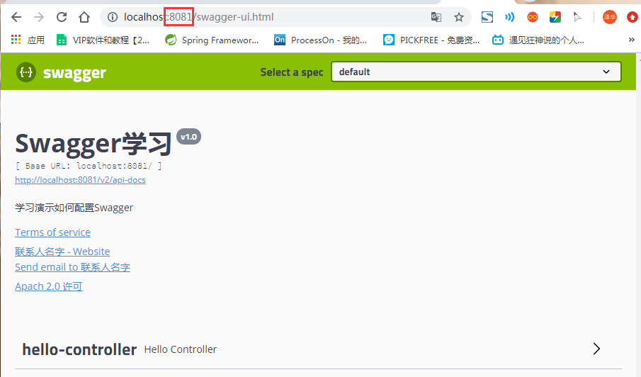

   - pro测试环境

     ```properties
     server.port=8082
     ```

     

     项目运行结果

     

### 配置API分组

1. 如果没有配置分组，默认是default。通过groupName()方法即可配置分组：

   ```java
   @Bean
   public Docket docket(Environment environment) {
      return new Docket(DocumentationType.SWAGGER_2).apiInfo(apiInfo())
         .groupName("狂神") // 配置分组
          // 省略配置....
   }
   ```

2. 重启项目查看分组

   

3. 如何配置多个分组？配置多个分组只需要配置多个docket即可：

   ```java
   @Bean
   public Docket docket1(){
      return new Docket(DocumentationType.SWAGGER_2).groupName("group1");
   }
   @Bean
   public Docket docket2(){
      return new Docket(DocumentationType.SWAGGER_2).groupName("group2");
   }
   @Bean
   public Docket docket3(){
      return new Docket(DocumentationType.SWAGGER_2).groupName("group3");
   }
   ```

4. 重启项目查看即可

   

### 实体配置

1. 新建一个实体类

   ```java
   //@Api("注释")
   @ApiModel("用户实体")
   public class User {
       @ApiModelProperty("用户名")
       private String username;
       @ApiModelProperty("密码")
       private String password;
   
       public String getUsername() {
           return username;
       }
   
       public void setUsername(String username) {
           this.username = username;
       }
   
       public String getPassword() {
           return password;
       }
   
       public void setPassword(String password) {
           this.password = password;
       }
   }
   ```

2. 只要这个实体在**请求接口**的返回值上（即使是泛型），都能映射到实体项中：

   ```java
   @RestController
   public class HelloController {
   
       //   /error默认错误请求
       @GetMapping("/hello")
       public String hello() {
           return "hello";
       }
   
       //只要我们的接口中，返回值中存在实体类，他就会被扫描到Swagger中
       @PostMapping("/user")
       public User user() {
           return new User();
       }
   }
   ```

3. 重启查看测试

   

<font color=red>注：并不是因为@ApiModel这个注解让实体显示在这里了，而是只要出现在接口方法的返回值上的实体都会显示在这里，而@ApiModel和@ApiModelProperty这两个注解只是为实体添加注释的</font>。

- `@ApiModel`为类添加注释

- `@ApiModelProperty`为类属性添加注释

**总结：**

- 我们可以通过Swagger给一些比较难理解的接口或者属性，增加注释信息
- 接口文档实时更新
- 可以在线测试

Swagger是一个优秀的工具，几乎所有大公司都有使用它

<font color=red>【注意点】：在正式发布的时候，关闭Swagger！！！</font>

- 出于安全考虑
- 而且节省内存

### 常用注解

Swagger的所有注解定义在io.swagger.annotations包下

下面列一些经常用到的，未列举出来的可以另行查阅说明：

| Swagger注解                                            | 简单说明                                             |
| ------------------------------------------------------ | ---------------------------------------------------- |
| @Api(tags = "xxx模块说明")                             | 作用在模块类上                                       |
| @ApiOperation("xxx接口说明")                           | 作用在接口方法上                                     |
| @ApiModel("xxxPOJO说明")                               | 作用在模型类上：如VO、BO                             |
| @ApiModelProperty(value = "xxx属性说明",hidden = true) | 作用在类方法和属性上，hidden设置为true可以隐藏该属性 |
| @ApiParam("xxx参数说明")                               | 作用在参数、方法和字段上，类似@ApiModelProperty      |

我们也可以给请求的接口配置一些注释

1. 在HelloController控制类中的接口添加api接口注释

   ```java
   @RestController
   public class HelloController {
       ......
       @ApiOperation("Hello控制接口")
       @GetMapping("/hello")
       public String hello2(@ApiParam("用户名") String username) {
           return "hello" + username;
       }
       
       @ApiOperation("get测试")
       @GetMapping("/get")
       public User hello2(@ApiParam("用户") User user) {
           return user;
       }
   }
   ```

   

2. 进行try it out测试

   

   测试结果

   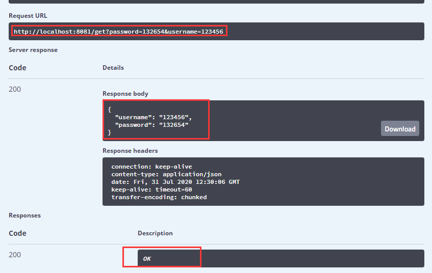

**总结：**

1. 这样的话，可以给一些比较难理解的属性或者接口，增加一些配置信息，让人更容易阅读！

2. 相较于传统的Postman或Curl方式测试接口，使用swagger简直就是傻瓜式操作，不需要额外说明文档(写得好本身就是文档)而且更不容易出错，只需要录入数据然后点击Execute，如果再配合自动化框架，可以说基本就不需要人为操作了。

3. Swagger是个优秀的工具，现在国内已经有很多的中小型互联网公司都在使用它，相较于传统的要先出Word接口文档再测试的方式，显然这样也更符合现在的快速迭代开发行情。当然了，提醒下大家在正式环境要记得关闭Swagger，一来出于安全考虑二来也可以节省运行时内存。

### 拓展：其他皮肤

我们可以导入不同的包实现不同的皮肤定义：

1、默认的  **访问 http://localhost:8080/swagger-ui.html**

```xml
<dependency> 
   <groupId>io.springfox</groupId>
   <artifactId>springfox-swagger-ui</artifactId>
   <version>2.9.2</version>
</dependency>
```


2、bootstrap-ui  **访问 http://localhost:8080/doc.html**

```xml
<!-- 引入swagger-bootstrap-ui包 /doc.html-->
<dependency>
   <groupId>com.github.xiaoymin</groupId>
   <artifactId>swagger-bootstrap-ui</artifactId>
   <version>1.9.1</version>
</dependency>
```


3、Layui-ui  **访问 http://localhost:8080/docs.html**

```xml
<!-- 引入swagger-ui-layer包 /docs.html-->
<dependency>
   <groupId>com.github.caspar-chen</groupId>
   <artifactId>swagger-ui-layer</artifactId>
   <version>1.1.3</version>
</dependency>
```

- <font color=red>我这个测试没成功(Layui-ui)</font>

4、mg-ui  **访问 http://localhost:8080/document.html**

```xml
<!-- 引入swagger-ui-layer包 /document.html-->
<dependency>
   <groupId>com.zyplayer</groupId>
   <artifactId>swagger-mg-ui</artifactId>
   <version>1.0.6</version>
</dependency>
```

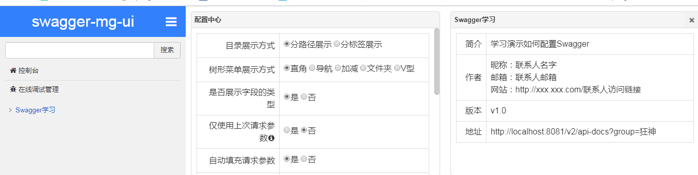


## SpringSecurity(未测,安全框架)

1、在 Web 开发中，安全一直是非常重要的一个方面。**安全虽然属于应用的非功能性需求，但是应该在应用开发的初期就考虑进来。**如果在应用开发的后期才考虑安全的问题，就可能陷入一个两难的境地：一方面，应用存在严重的安全漏洞，无法满足用户的要求，并可能造成用户的隐私数据被攻击者窃取；另一方面，应用的基本架构已经确定，要修复安全漏洞，可能需要对系统的架构做出比较重大的调整，因而需要更多的开发时间，影响应用的发布进程。因此，从应用开发的第一天就应该把安全相关的因素考虑进来，并在整个应用的开发过程中。

2、市面上存在比较有名的：Shiro，Spring Security ！

### 简介:

Spring Security是一个能够为基于Spring的企业应用系统提供声明式的安全访问控制解决方案的**安全框架**。它提供了一组可以在Spring应用上下文中配置的Bean，充分利用了Spring IoC，DI（控制反转Inversion of Control ,DI:Dependency Injection 依赖注入）和AOP（面向切面编程）功能，为应用系统提供声明式的安全访问控制功能，减少了为企业系统安全控制编写大量重复代码的工作。

1、Spring Security是一个功能强大且高度可定制的**身份验证和访问控制框架**。它实际上是保护基于spring的应用程序的标准。

2、Spring Security是一个框架，侧重于为**Java应用程序提供身份验证和授权。**与所有Spring项目一样，Spring安全性的真正强大之处在于它可以轻松地扩展以满足定制需求

3、从官网的介绍中可以知道这是一个权限框架。想我们之前做项目是没有使用框架是怎么控制权限的？对于权限 一般会细分为**功能权限，访问权限，和菜单权限。**代码会写的非常的繁琐，冗余。

4、怎么解决之前写权限代码繁琐，冗余的问题，一些主流框架就应运而生而Spring Scecurity就是其中的一种。

5、Spring 是一个非常流行和成功的 Java 应用开发框架。Spring Security 基于 Spring 框架，提供了一套 Web 应用安全性的完整解决方案。一般来说，Web 应用的安全性包括**用户认证（Authentication）和用户授权（Authorization）**两个部分。

- 用户认证指的是验证某个用户是否为系统中的合法主体，也就是说用户能否访问该系统。用户认证一般要求用户提供用户名和密码。系统通过校验用户名和密码来完成认证过程。
- 用户授权指的是验证某个用户是否有权限执行某个操作。在一个系统中，不同用户所具有的权限是不同的。比如对一个文件来说，有的用户只能进行读取，而有的用户可以进行修改。一般来说，系统会为不同的用户分配不同的角色，而每个角色则对应一系列的权限。

10、对于上面提到的两种应用情景，Spring Security 框架都有很好的支持。

- 在用户认证方面，Spring Security 框架支持主流的认证方式，包括 HTTP 基本认证、HTTP 表单验证、HTTP 摘要认证、OpenID 和 LDAP 等。
- 在用户授权方面，Spring Security 提供了基于角色的访问控制和访问控制列表（Access Control List，ACL），可以对应用中的领域对象进行细粒度的控制。


### 测试环境搭建

新建一个初始的springboot项目web模块，thymeleaf模块 , 导入静态资源

静态资源下载: 链接：https://pan.baidu.com/s/1URaFmN6rt2AzDOwVogWBNQ  提取码：bruc


编写个控制器测试一下

```java
package nuc.ss.controller;

@Controller
public class RouterController {

    @RequestMapping({"/","/index"})
    public String index() {
        return "index";
    }

    @RequestMapping("/toLogin")
    public String toLogin() {
        return "views/login";
    }

    @RequestMapping("/level1/{id}")
    public String level1(@PathVariable("id") int id) {
        return "views/level1/" + id;
    }

    @RequestMapping("/level2/{id}")
    public String level2(@PathVariable("id") int id) {
        return "views/level2/" + id;
    }

    @RequestMapping("/level3/{id}")
    public String level3(@PathVariable("id") int id) {
        return "views/level3/" + id;
    }
}
```


测试实验环境是否OK！

- 首页和登陆页


- 详情页

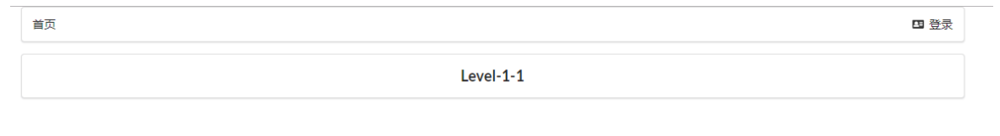

### SpringSecurity使用

Spring Security 是针对Spring项目的安全框架，也是Spring Boot底层安全模块默认的技术选型，他可以实现强大的Web安全控制，对于安全控制，我们仅需要引入 spring-boot-starter-security 模块，进行少量的配置，即可实现强大的安全管理！

记住几个类：

- `WebSecurityConfigurerAdapter`：自定义Security策略
- `AuthenticationManagerBuilder`：自定义认证策略
- `@EnableWebSecurity`：开启WebSecurity模式

Spring Security的两个主要目标是 “认证” 和 “授权”（访问控制）。

**“认证”（Authentication）**

身份验证是关于验证您的凭据，如用户名/用户ID和密码，以验证您的身份。

身份验证通常通过用户名和密码完成，有时与身份验证因素结合使用。

 **“授权” （Authorization）**

授权发生在系统成功验证您的身份后，最终会授予您访问资源（如信息，文件，数据库，资金，位置，几乎任何内容）的完全权限。

这个概念是通用的，而不是只在Spring Security 中存在。


### 认证和授权

目前，我们的测试环境，是谁都可以访问的，我们使用 Spring Security 增加上认证和授权的功能

1. 引入 Spring Security 依赖

```xml
<dependency>
   <groupId>org.springframework.boot</groupId>
   <artifactId>spring-boot-starter-security</artifactId>
</dependency>
```

2. 编写 Spring Security 配置类

- 参考官网：[https://spring.io/projects/spring-security](https://spring.io/projects/spring-security)
- 查看我们自己项目中的版本，找到对应的帮助文档：[https://docs.spring.io/spring-security/site/docs/5.3.0.RELEASE/reference/html5](https://docs.spring.io/spring-security/site/docs/5.3.0.RELEASE/reference/html5)  
- servlet-applications 8.16.4

```java
@EnableWebSecurity
public class Config extends WebSecurityConfigurerAdapter {
    @Override
    protected void configure(HttpSecurity http) throws Exception {
        http
            .apply(customDsl())
                .flag(true)
                .and()
            ...;
    }
}
```

3. 编写基础配置类

```java
package nuc.ss.config;

import org.springframework.security.config.annotation.web.builders.HttpSecurity;
import org.springframework.security.config.annotation.web.configuration.EnableWebSecurity;
import org.springframework.security.config.annotation.web.configuration.WebSecurityConfigurerAdapter;

@EnableWebSecurity// 开启WebSecurity模式
public class SecurityConfig extends WebSecurityConfigurerAdapter {

    @Override
    protected void configure(HttpSecurity http) throws Exception {
        super.configure(http);
    }
}
```

4. 定制请求的授权规则

```java
//链式编程
@Override
protected void configure(HttpSecurity http) throws Exception {
    // 首页所有人都可以访问，功能也只有对应有权限的人才能访问到
    // 请求授权的规则

    http.authorizeRequests()
        .antMatchers("/").permitAll()
        .antMatchers("/level1/**").hasRole("vip1")
        .antMatchers("/level2/**").hasRole("vip2")
        .antMatchers("/level3/**").hasRole("vip3");

}
```

5. 测试一下：发现除了首页都进不去了！因为我们目前没有登录的角色，因为请求需要登录的角色拥有对应的权限才可以！


6. 在**configure()方法中加入以下配置**，开启自动配置的登录功能！

```java
// 开启自动配置的登录功能
// /login 请求来到登录页
// /login?error 重定向到这里表示登录失败
http.formLogin();
```

测试一下：发现，没有权限的时候，会跳转到登录的页面！


7. 查看刚才登录页的注释信息；我们可以定义认证规则，重写configure的另一个方法

```java
// 认证，springboot 2.1.x 可以直接使用
// 密码编码： PasswordEncoder
@Override
protected void configure(AuthenticationManagerBuilder auth) throws Exception {

    //这些数据正常应该中数据库中读

    auth.inMemoryAuthentication()
        .withUser("kuangshen").password("123456").roles("vip2","vip3")
        .and()
        .withUser("root").password("123456").roles("vip1","vip2","vip3")
        .and()
        .withUser("guest").password("123456").roles("vip1");
}
```


8. 测试，我们可以使用这些账号登录进行测试！发现会报错!

原因，我们要将前端传过来的密码进行某种方式加密，否则就无法登录，修改代码

```java
// 认证，springboot 2.1.x 可以直接使用
// 密码编码： PasswordEncoder
// 在spring Secutiry 5.0+ 新增了很多加密方法
@Override
protected void configure(AuthenticationManagerBuilder auth) throws Exception {

    //这些数据正常应该中数据库中读
    auth.inMemoryAuthentication().passwordEncoder(new BCryptPasswordEncoder())
        .withUser("kuangshen").password(new BCryptPasswordEncoder().encode("123456")).roles("vip2","vip3")
        .and()
        .withUser("root").password(new BCryptPasswordEncoder().encode("123456")).roles("vip1","vip2","vip3")
        .and()
        .withUser("guest").password(new BCryptPasswordEncoder().encode("123456")).roles("vip1");
}
```


### 权限控制和注销

1. 开启自动配置的注销的功能

```java
//定制请求的授权规则
@Override
protected void configure(HttpSecurity http) throws Exception {
   //....
   //开启自动配置的注销的功能
   // /logout 注销请求
   http.logout();
}
```

2. 我们在前端，增加一个注销的按钮，`index.html `导航栏中

```html
<!--注销-->
<a class="item" th:href="@{/logout}">
    <i class="sign-out icon"></i> 注销
</a>
```

3. 我们可以去测试一下，登录成功后点击注销，发现注销完毕会跳转到登录页面！但是，我们想让他注销成功后，依旧可以跳转到首页，该怎么处理呢？

```java
// 注销成功来到首页
http.logout().logoutSuccessUrl("/");
```

测试，注销完毕后，发现跳转到首页OK

我们现在又来一个需求：用户没有登录的时候，导航栏上只显示登录按钮，用户登录之后，导航栏可以显示登录的用户信息及注销按钮！还有就是，比如kuangshen这个用户，它只有 vip2，vip3功能，那么登录则只显示这两个功能，而vip1的功能菜单不显示！这个就是真实的网站情况了！该如何做呢？

<font color=red>我们需要结合thymeleaf中的一些功能</font>

`sec：authorize="isAuthenticated()"`:是否认证登录！来显示不同的页面

添加一下Maven依赖:

```xml
<!-- https://mvnrepository.com/artifact/org.thymeleaf.extras/thymeleaf-extras-springsecurity4 -->
<dependency>
   <groupId>org.thymeleaf.extras</groupId>
   <artifactId>thymeleaf-extras-springsecurity5</artifactId>
   <version>3.0.4.RELEASE</version>
</dependency>
```

修改我们的前端页面,导入命名空间

```html
<html lang="en" xmlns:th="http://www.thymeleaf.org"
      xmlns:sec="http://www.thymeleaf.org/thymeleaf-extras-springsecurity5">
```

修改导航栏，增加认证判断

```html
<!--登录注销-->
<div class="right menu">

    <!--如果未登录-->
    <div sec:authorize="!isAuthenticated()">
        <a class="item" th:href="@{/login}">
            <i class="address card icon"></i> 登录
        </a>
    </div>

    <!--如果已登录-->
    <div sec:authorize="isAuthenticated()">
        <a class="item">
            <i class="address card icon"></i>
            用户名：<span sec:authentication="principal.username"></span>
            角色：<span sec:authentication="principal.authorities"></span>
        </a>
    </div>

    <div sec:authorize="isAuthenticated()">
        <a class="item" th:href="@{/logout}">
            <i class="sign-out  icon"></i> 注销
        </a>
    </div>
</div>
```

重启测试，我们可以登录试试看，登录成功后确实，显示了我们想要的页面；

**但是点击注销产生问题** , 版本问题

整合包4（springsecurity4） , 报404

整合包5（springsecurity5）（不算问题，需要点击确定，才能回到首页）

<font color=red>解决问题：</font>

- 它默认防止csrf跨站请求伪造，因为会产生安全问题
- 将请求改为post表单提交
- 在spring security中关闭csrf功能`http.csrf().disable();`

再次点击注销按钮之后（直接退出到首页）

---

我们继续将下面的角色功能块认证完成！

```html
<!--菜单根据用户的角色动态的实现-->
<div class="column"  sec:authorize="hasRole('vip1')">
    <div class="ui raised segment">
        <div class="ui">
            <div class="content">
                <h5 class="content">Level 1</h5>
                <hr>
                <div><a th:href="@{/level1/1}"><i class="bullhorn icon"></i> Level-1-1</a></div>
                <div><a th:href="@{/level1/2}"><i class="bullhorn icon"></i> Level-1-2</a></div>
                <div><a th:href="@{/level1/3}"><i class="bullhorn icon"></i> Level-1-3</a></div>
            </div>
        </div>
    </div>
</div>

<div class="column"  sec:authorize="hasRole('vip2')">
    <div class="ui raised segment">
        <div class="ui">
            <div class="content">
                <h5 class="content">Level 2</h5>
                <hr>
                <div><a th:href="@{/level2/1}"><i class="bullhorn icon"></i> Level-2-1</a></div>
                <div><a th:href="@{/level2/2}"><i class="bullhorn icon"></i> Level-2-2</a></div>
                <div><a th:href="@{/level2/3}"><i class="bullhorn icon"></i> Level-2-3</a></div>
            </div>
        </div>
    </div>
</div>

<div class="column"  sec:authorize="hasRole('vip3')">
    <div class="ui raised segment">
        <div class="ui">
            <div class="content">
                <h5 class="content">Level 3</h5>
                <hr>
                <div><a th:href="@{/level3/1}"><i class="bullhorn icon"></i> Level-3-1</a></div>
                <div><a th:href="@{/level3/2}"><i class="bullhorn icon"></i> Level-3-2</a></div>
                <div><a th:href="@{/level3/3}"><i class="bullhorn icon"></i> Level-3-3</a></div>
            </div>
        </div>
    </div>
</div>
```

再次测试一下


### 记住我

现在的情况，我们只要登录之后，关闭浏览器，再登录，就会让我们重新登录，但是很多网站的情况，就是有一个记住密码的功能，这个该如何实现呢？很简单

1. 开启记住我功能

```	java
//定制请求的授权规则
@Override
protected void configure(HttpSecurity http) throws Exception {
//。。。。。。。。。。。
   //开启记住我功能: cookie,默认保存两周
   http.rememberMe();
}
```

我们再次启动项目测试一下 ,发现登录页多了一个记住我功能 , 我们登录之后关闭 浏览器，然后重新打开浏览器访问，发现用户依旧存在！

<font color=red>思考：如何实现的呢？其实非常简单</font>

我们可以查看浏览器的cookie, 我们点击注销的时候，可以发现，spring security 帮我们自动删除了这个 cookie

cookie发送给浏览器保存，以后登录带上这个cookie，只要通过检查就可以免登录了。如果点击注销，则会删除这个cookie，具体的原理我们在JavaWeb阶段都讲过了，这里就不在多说了！

### 定制登陆页面

现在这个登录页面都是spring security 默认的，怎么样可以使用我们自己写的Login界面呢？

1. 在刚才的登录页配置后面指定 loginpage

```java
protected void configure(HttpSecurity http) throws Exception {
    //......

    // 没有权限默认会到登录页面,需要开启登录的页面
    // /login页面
    http.formLogin().loginPage("/toLogin");

    //......
}
```

2. 然后前端也需要指向我们自己定义的 login请求

```html
<div sec:authorize="!isAuthenticated()">
    <a class="item" th:href="@{/toLogin}">
        <i class="address card icon"></i> 登录
    </a>
</div>
```

3. 我们登录，需要将这些信息发送到哪里，我们也需要配置，login.html 配置提交请求及方式，**方式必须为post:**

   在 loginPage()源码中的注释上有写明

4. 这个请求提交上来，我们还需要验证处理，怎么做呢？我们可以查看formLogin()方法的源码！我们配置接收登录的用户名和密码的参数！

```java
protected void configure(HttpSecurity http) throws Exception {
    //......

    // 没有权限默认会到登录页面,需要开启登录的页面
    // /login页面
    http.formLogin()
      .usernameParameter("username")
      .passwordParameter("password")
      .loginPage("/toLogin")
      .loginProcessingUrl("/login"); // 登陆表单提交请求

    //......
}
```

在登录页增加记住我的多选框

```html
<input type="checkbox" name="remember"> 记住我
```

后端验证处理！

```java
protected void configure(HttpSecurity http) throws Exception {
    //......
    //开启记住我功能: cookie,默认保存两周,自定义接收前端的参数
    http.rememberMe().rememberMeParameter("remember");
}
```


### 完整配置代码:

```java
package nuc.ss.config;

import org.springframework.security.config.annotation.authentication.builders.AuthenticationManagerBuilder;
import org.springframework.security.config.annotation.web.builders.HttpSecurity;
import org.springframework.security.config.annotation.web.configuration.EnableWebSecurity;
import org.springframework.security.config.annotation.web.configuration.WebSecurityConfigurerAdapter;
import org.springframework.security.crypto.bcrypt.BCryptPasswordEncoder;

// AOP:拦截器
@EnableWebSecurity  // 开启WebSecurity模式
public class SecurityConfig extends WebSecurityConfigurerAdapter {

    //链式编程
    //授权
    @Override
    protected void configure(HttpSecurity http) throws Exception {
        // 首页所有人都可以访问，功能也只有对应有权限的人才能访问到
        // 请求授权的规则
        http.authorizeRequests()
                .antMatchers("/").permitAll()
                .antMatchers("/level1/**").hasRole("vip1")
                .antMatchers("/level2/**").hasRole("vip2")
                .antMatchers("/level3/**").hasRole("vip3");

        // 没有权限默认会到登录页面,需要开启登录的页面
        // /login页面
        http.formLogin()
                .usernameParameter("username")
                .passwordParameter("password")
                .loginPage("/toLogin")
                .loginProcessingUrl("/login");

        //注销,开启了注销功能,跳到首页
        http.logout().logoutSuccessUrl("/");

        // 防止网站工具：get，post
        http.csrf().disable();//关闭csrf功能，登录失败肯定存在的原因

        //开启记住我功能: cookie,默认保存两周,自定义接收前端的参数
        http.rememberMe().rememberMeParameter("remember");


    }

    // 认证，springboot 2.1.x 可以直接使用
    // 密码编码： PasswordEncoder
    // 在spring Secutiry 5.0+ 新增了很多加密方法
    @Override
    protected void configure(AuthenticationManagerBuilder auth) throws Exception {

        //这些数据正常应该中数据库中读
        auth.inMemoryAuthentication().passwordEncoder(new BCryptPasswordEncoder())
                .withUser("kuangshen").password(new BCryptPasswordEncoder().encode("123456")).roles("vip2","vip3")
                .and()
                .withUser("root").password(new BCryptPasswordEncoder().encode("123456")).roles("vip1","vip2","vip3")
                .and()
                .withUser("guest").password(new BCryptPasswordEncoder().encode("123456")).roles("vip1");
    }
}
```


# SpringCould

## 分布式(待学)

### 分布式理论

#### **什么是分布式系统？**

在《分布式系统原理与范型》一书中有如下定义：“分布式系统是若干独立计算机的集合，这些计算机对于用户来说就像单个相关系统”；

分布式系统是由一组通过网络进行通信、为了完成共同的任务而协调工作的计算机节点组成的系统。分布式系统的出现是为了用廉价的、普通的机器完成单个计算机无法完成的计算、存储任务。其目的是**利用更多的机器，处理更多的数据**。

分布式系统（distributed system）是建立在网络之上的软件系统。

首先需要明确的是，只有当单个节点的处理能力无法满足日益增长的计算、存储任务的时候，且硬件的提升（加内存、加磁盘、使用更好的CPU）高昂到得不偿失的时候，应用程序也不能进一步优化的时候，我们才需要考虑分布式系统。因为，分布式系统要解决的问题本身就是和单机系统一样的，而由于分布式系统多节点、通过网络通信的拓扑结构，会引入很多单机系统没有的问题，为了解决这些问题又会引入更多的机制、协议，带来更多的问题。。。

#### Dubbo文档

随着互联网的发展，网站应用的规模不断扩大，常规的垂直应用架构已无法应对，分布式服务架构以及流动计算架构势在必行，急需**一个治理系统**确保架构有条不紊的演进。

在Dubbo的官网文档有这样一张图


#### 单一应用架构

当网站流量很小时，只需一个应用，将所有功能都部署在一起，以减少部署节点和成本。此时，用于简化增删改查工作量的数据访问框架(ORM)是关键。


适用于小型网站，小型管理系统，将所有功能都部署到一个功能里，简单易用。

**缺点：**

1、性能扩展比较难

2、协同开发问题

3、不利于升级维护

#### 垂直应用架构

当访问量逐渐增大，单一应用增加机器带来的加速度越来越小，将应用拆成互不相干的几个应用，以提升效率。此时，用于加速前端页面开发的Web框架(MVC)是关键。


通过切分业务来实现各个模块独立部署，降低了维护和部署的难度，团队各司其职更易管理，性能扩展也更方便，更有针对性。

缺点：公用模块无法重复利用，开发性的浪费

#### 分布式服务架构

当垂直应用越来越多，应用之间交互不可避免，将核心业务抽取出来，作为独立的服务，逐渐形成稳定的服务中心，使前端应用能更快速的响应多变的市场需求。此时，用于提高业务复用及整合的**分布式服务框架(RPC)**是关键。


#### 流动计算架构

当服务越来越多，容量的评估，小服务资源的浪费等问题逐渐显现，此时需增加一个调度中心基于访问压力实时管理集群容量，提高集群利用率。此时，用于**提高机器利用率的资源调度和治理中心**(SOA)[ Service Oriented Architecture]是关键。


### RPC

**RPC【Remote Procedure Call】是指远程过程调用，是一种进程间通信方式**，他是一种技术的思想，而不是规范。它允许程序调用另一个地址空间（通常是共享网络的另一台机器上）的过程或函数，而不用程序员显式编码这个远程调用的细节。即程序员无论是调用本地的还是远程的函数，本质上编写的调用代码基本相同。

也就是说两台服务器A，B，一个应用部署在A服务器上，想要调用B服务器上应用提供的函数/方法，由于不在一个内存空间，不能直接调用，需要通过网络来表达调用的语义和传达调用的数据。为什么要用RPC呢？就是无法在一个进程内，甚至一个计算机内通过本地调用的方式完成的需求，比如不同的系统间的通讯，甚至不同的组织间的通讯，由于计算能力需要横向扩展，需要在多台机器组成的集群上部署应用。RPC就是要像调用本地的函数一样去调远程函数；

推荐阅读文章：[https://www.jianshu.com/p/2accc2840a1b](https://www.jianshu.com/p/2accc2840a1b)

**RPC基本原理**

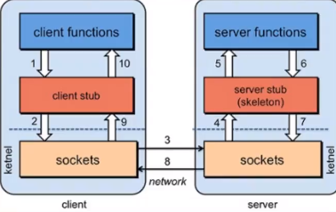


RPC两个核心模块：通讯，序列化。

### Dubbo

Apache Dubbo |ˈdʌbəʊ| 是一款高性能、**轻量级的开源Java RPC框架**，它提供了三大核心能力：面向接口的远程方法调用，智能容错和负载均衡，以及服务自动注册和发现。

dubbo官网 http://dubbo.apache.org/zh-cn/index.html

1.了解Dubbo的特性

2.查看官方文档

**dubbo基本概念**


**服务提供者**（Provider）：暴露服务的服务提供方，服务提供者在启动时，向注册中心注册自己提供的服务。

**服务消费者**（Consumer）：调用远程服务的服务消费方，服务消费者在启动时，向注册中心订阅自己所需的服务，服务消费者，从提供者地址列表中，基于软负载均衡算法，选一台提供者进行调用，如果调用失败，再选另一台调用。

**注册中心**（Registry）：注册中心返回服务提供者地址列表给消费者，如果有变更，注册中心将基于长连接推送变更数据给消费者

**监控中心**（Monitor）：服务消费者和提供者，在内存中累计调用次数和调用时间，定时每分钟发送一次统计数据到监控中心

**调用关系说明**

- 服务容器负责启动，加载，运行服务提供者。

- 服务提供者在启动时，向注册中心注册自己提供的服务。

- 服务消费者在启动时，向注册中心订阅自己所需的服务。

- 注册中心返回服务提供者地址列表给消费者，如果有变更，注册中心将基于长连接推送变更数据给消费者。

- 服务消费者，从提供者地址列表中，基于软负载均衡算法，选一台提供者进行调用，如果调用失败，再选另一台调用。

- 服务消费者和提供者，在内存中累计调用次数和调用时间，定时每分钟发送一次统计数据到监控中心。

#### Dubbo环境搭建

点进dubbo官方文档，推荐我们使用Zookeeper 注册中心

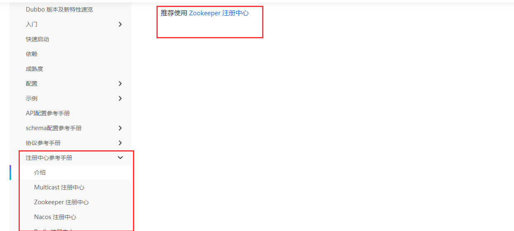

什么是zookeeper呢？可以查看[官方文档](https://zookeeper.apache.org/)

#### Window下安装zookeeper

1. 下载zookeeper ：[地址](https://mirror.bit.edu.cn/apache/zookeeper/)， 我们下载3.6.1， 最新版！解压zookeeper

   下载带bin的

   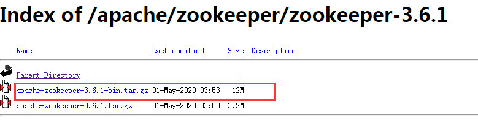

2. 运行/bin/zkServer.cmd ，初次运行会报错，没有zoo.cfg配置文件；

   可能遇到问题：闪退 !

   <font color=red>解决方案</font>：编辑zkServer.cmd文件末尾添加pause 。这样运行出错就不会退出，会提示错误信息，方便找到原因。

   

   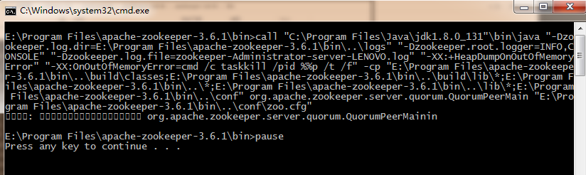

3. 修改zoo.cfg配置文件

   - 将conf文件夹下面的zoo_sample.cfg复制一份改名为zoo.cfg即可。

   - 注意几个重要位置：

     dataDir=./  临时数据存储的目录（可写相对路径）

     <font color=red>clientPort=2181  zookeeper的端口号</font>

   - 修改完成后再次启动zookeeper

     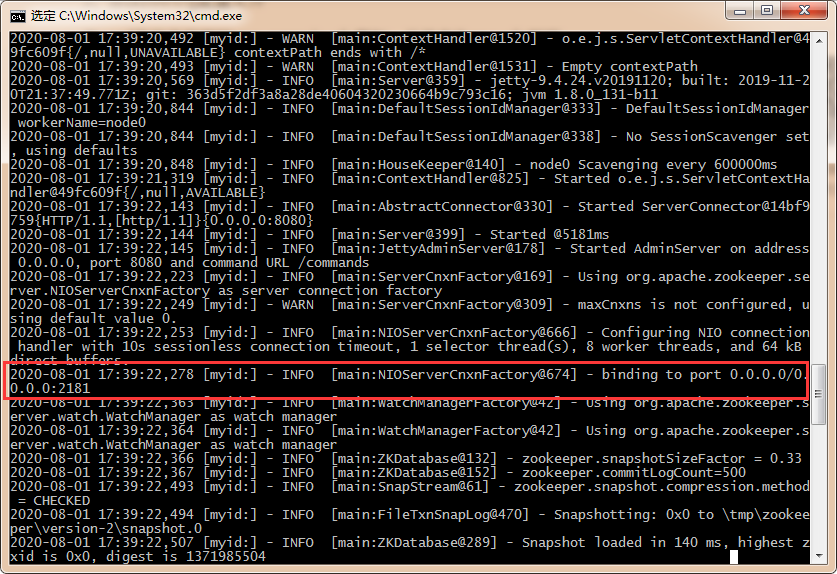

4. 使用zkCli.cmd测试

   - ls /：列出zookeeper根下保存的所有节点

     

     报错别着急，多试几次就好了，我试了三次o(╥﹏╥)o，看报错信息

     

   - create –e /kuangshen 123：创建一个kuangshen节点，值为123

     

   - get /kuangshen：获取/kuangshen节点的值

     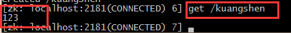

   - 我们再来查看一下节点：ls /

     

#### window下安装dubbo-admin

- dubbo本身并不是一个服务软件。它其实就是一个jar包，能够帮你的java程序连接到zookeeper，并利用zookeeper消费、提供服务。

- 但是为了让用户更好的管理监控众多的dubbo服务，官方提供了一个可视化的监控程序dubbo-admin，不过这个监控即使不装也不影响使用。

我们这里来安装一下：

**1、下载dubbo-admin**

地址 ：[https://github.com/apache/dubbo-admin/tree/master](https://github.com/apache/dubbo-admin/tree/master)

**2、解压进入目录**

修改 dubbo-admin\src\main\resources \application.properties 指定zookeeper地址

```java
server.port=7001
spring.velocity.cache=false
spring.velocity.charset=UTF-8
spring.velocity.layout-url=/templates/default.vm
spring.messages.fallback-to-system-locale=false
spring.messages.basename=i18n/message
spring.root.password=root
spring.guest.password=guest

dubbo.registry.address=zookeeper://127.0.0.1:2181
```

**3、在项目目录下**打包dubbo-admin

```
mvn clean package -Dmaven.test.skip=true
```

**第一次打包的过程有点慢，需要耐心等待！直到成功！**

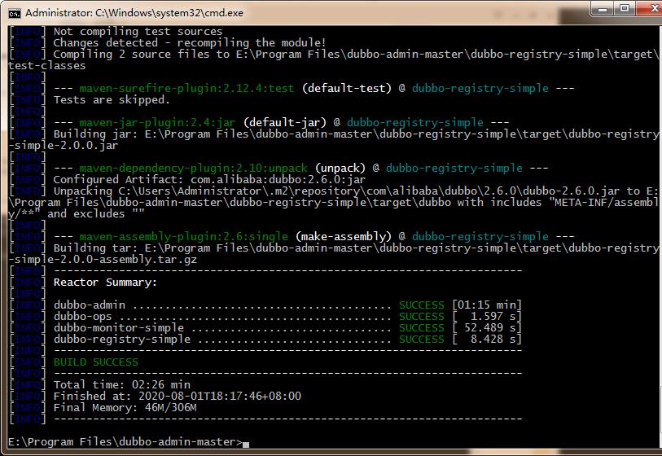

4、执行 dubbo-admin\target 下的dubbo-admin-0.0.1-SNAPSHOT.jar

```
java -jar dubbo-admin-0.0.1-SNAPSHOT.jar
```

【注意：zookeeper的服务一定要打开！】

执行完毕，我们去访问一下 http://localhost:7001/ ， 这时候我们需要输入登录账户和密码，我们都是默认的root-root；


登录成功后，查看界面


安装完成！


**总结：**

- zookeeper :注册中心
- dubbo-admin:是一 个监控管理后台-查看我们注册了哪些服务，哪些服务被消费了（可以不用）
- Dubbo: jar包

### SpringBoot + Dubbo + zookeeper

#### 框架搭建

**1. 启动zookeeper ！**

**2. IDEA创建一个空项目；**

**3.创建一个模块，实现服务提供者：provider-server ， 选择web依赖即可**

**4.项目创建完毕，我们写一个服务，比如卖票的服务；**

编写接口

```java
package nuc.ss.service;

public interface TicketService {
   public String getTicket();
}
```

编写实现类

```java
package nuc.ss.service;

public class TicketServiceImpl implements TicketService {
    @Override
    public String getTicket() {
        return "《狂神说Java》";
    }
}
```

**5.创建一个模块，实现服务消费者：consumer-server ， 选择web依赖即可**

**6.项目创建完毕，我们写一个服务，比如用户的服务；**

编写service

```java
package nuc.ss.service;

public interface UserService {
   //我们需要去拿去注册中心的服务
}
```

**需求：现在我们的用户想使用买票的服务，这要怎么弄呢 ？**


#### 服务提供者

**1、将服务提供者注册到注册中心，我们需要整合Dubbo和zookeeper，所以需要导包**

**我们从dubbo官网进入github，看下方的帮助文档，找到dubbo-springboot，找到依赖包**

```xml
<!-- Dubbo Spring Boot Starter -->
<dependency>
   <groupId>org.apache.dubbo</groupId>
   <artifactId>dubbo-spring-boot-starter</artifactId>
   <version>2.7.3</version>
</dependency>    
```

**zookeeper的包我们去maven仓库下载，zkclient；**

```xml
<!-- https://mvnrepository.com/artifact/com.github.sgroschupf/zkclient -->
<dependency>
   <groupId>com.github.sgroschupf</groupId>
   <artifactId>zkclient</artifactId>
   <version>0.1</version>
</dependency>
```

**【新版的坑】zookeeper及其依赖包，解决日志冲突，还需要剔除日志依赖；**

```xml
<!-- 引入zookeeper -->
<dependency>
   <groupId>org.apache.curator</groupId>
   <artifactId>curator-framework</artifactId>
   <version>2.12.0</version>
</dependency>
<dependency>
   <groupId>org.apache.curator</groupId>
   <artifactId>curator-recipes</artifactId>
   <version>2.12.0</version>
</dependency>
<dependency>
   <groupId>org.apache.zookeeper</groupId>
   <artifactId>zookeeper</artifactId>
   <version>3.4.14</version>
   <!--排除这个slf4j-log4j12-->
   <exclusions>
       <exclusion>
           <groupId>org.slf4j</groupId>
           <artifactId>slf4j-log4j12</artifactId>
       </exclusion>
   </exclusions>
</dependency>
```

**2、在springboot配置文件中配置dubbo相关属性！**

```properties
server.port=8001

#当前应用名字
dubbo.application.name=provider-server
#注册中心地址
dubbo.registry.address=zookeeper://127.0.0.1:2181
#扫描指定包下服务
dubbo.scan.base-packages=nuc.ss.service
```

**3、在service的实现类中配置服务注解，发布服务！注意导包问题**

```java
package nuc.ss.service;

import org.apache.dubbo.config.annotation.Service;
import org.springframework.stereotype.Component;

@Service    //可以被扫描到，在项目一启动就自动注册到注册中心
@Component  //使用Dubbo后尽量不要用Service注解
public class TicketServiceImpl implements TicketService {
    @Override
    public String getTicket() {
        return "《狂神说Java》";
    }
}
```

**逻辑理解 ：应用启动起来，dubbo就会扫描指定的包下带有@component注解的服务，将它发布在指定的注册中心中！**

**4、运行测试**

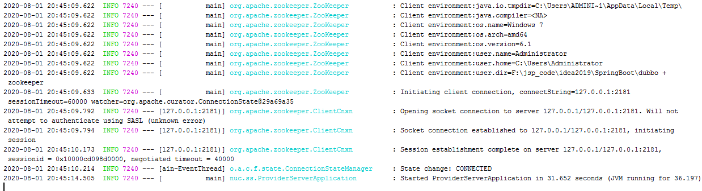

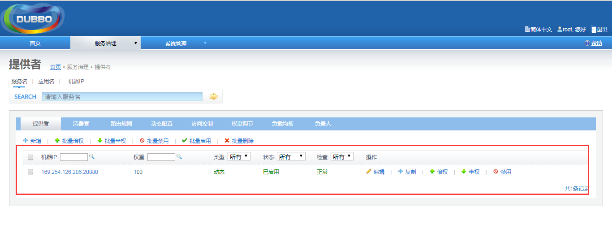

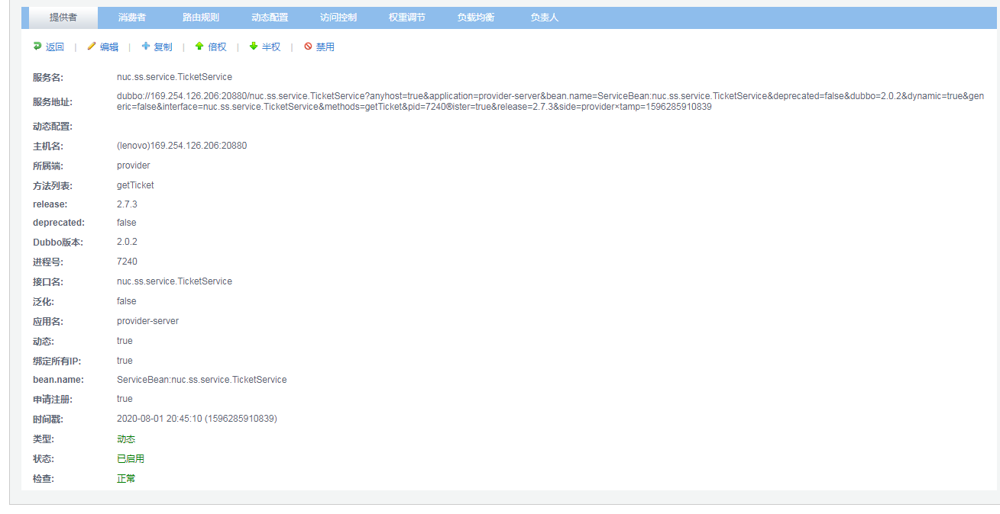

#### 服务消费者

**1、导入依赖，和之前的依赖一样；**

```java
<!--dubbo-->
<!-- Dubbo Spring Boot Starter -->
<dependency>
   <groupId>org.apache.dubbo</groupId>
   <artifactId>dubbo-spring-boot-starter</artifactId>
   <version>2.7.3</version>
</dependency>
<!--zookeeper-->
<!-- https://mvnrepository.com/artifact/com.github.sgroschupf/zkclient -->
<dependency>
   <groupId>com.github.sgroschupf</groupId>
   <artifactId>zkclient</artifactId>
   <version>0.1</version>
</dependency>
<!-- 引入zookeeper -->
<dependency>
   <groupId>org.apache.curator</groupId>
   <artifactId>curator-framework</artifactId>
   <version>2.12.0</version>
</dependency>
<dependency>
   <groupId>org.apache.curator</groupId>
   <artifactId>curator-recipes</artifactId>
   <version>2.12.0</version>
</dependency>
<dependency>
   <groupId>org.apache.zookeeper</groupId>
   <artifactId>zookeeper</artifactId>
   <version>3.4.14</version>
   <!--排除这个slf4j-log4j12-->
   <exclusions>
       <exclusion>
           <groupId>org.slf4j</groupId>
           <artifactId>slf4j-log4j12</artifactId>
       </exclusion>
   </exclusions>
</dependency>
```

2、**配置参数**

```properties
server.port=8002

#当前应用名字
dubbo.application.name=consumer-server
#注册中心地址
dubbo.registry.address=zookeeper://127.0.0.1:2181
```

**3. 本来正常步骤是需要将服务提供者的接口打包，然后用pom文件导入，我们这里使用简单的方式，直接将服务的接口拿过来，路径必须保证正确，即和服务提供者相同；**

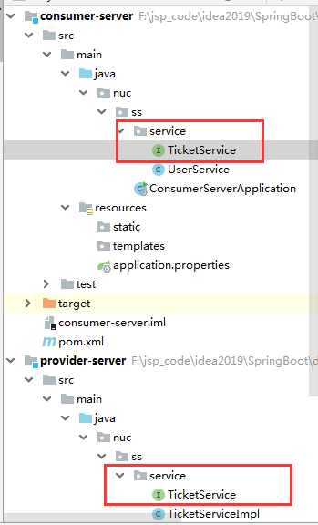

**4. 完善消费者的服务类**

```java
package nuc.ss.service;

import org.apache.dubbo.config.annotation.Reference;
import org.springframework.stereotype.Service;

@Service //注入到容器中
public class UserService {

    // 想拿到provider-server提供的票，要去注册中心拿到服务
    @Reference //引用，Pom坐标，可以定义路径相同的接口名
            TicketService ticketService;

    public void bugTicket(){
        String ticket = ticketService.getTicket();
        System.out.println("在注册中心买到"+ticket);
    }

}
```

**5. 测试类编写；**

```java
@SpringBootTest
public class ConsumerServerApplicationTests {

   @Autowired
   UserService userService;

   @Test
   public void contextLoads() {

       userService.bugTicket();

  }

}
```

#### 启动测试

**1. 开启zookeeper**

**2. 打开dubbo-admin实现监控【可以不用做】**

**3. 开启服务者**

**4. 消费者消费测试，结果：**


**监控中心 ：**

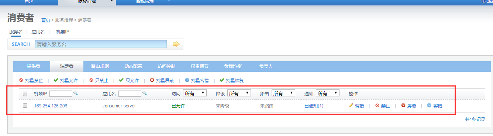

**这就是SpingBoot + dubbo + zookeeper实现分布式开发的应用，其实就是一个服务拆分的思想；**

