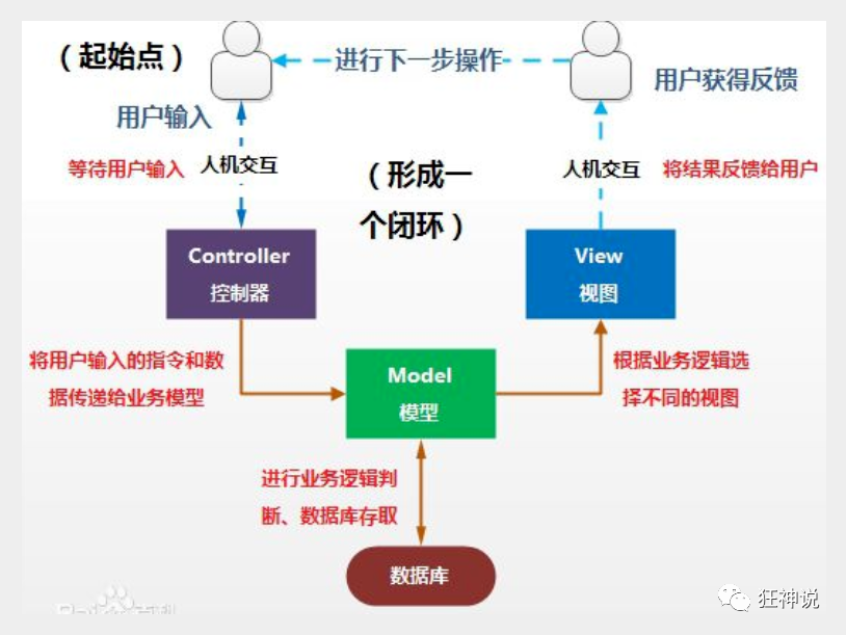
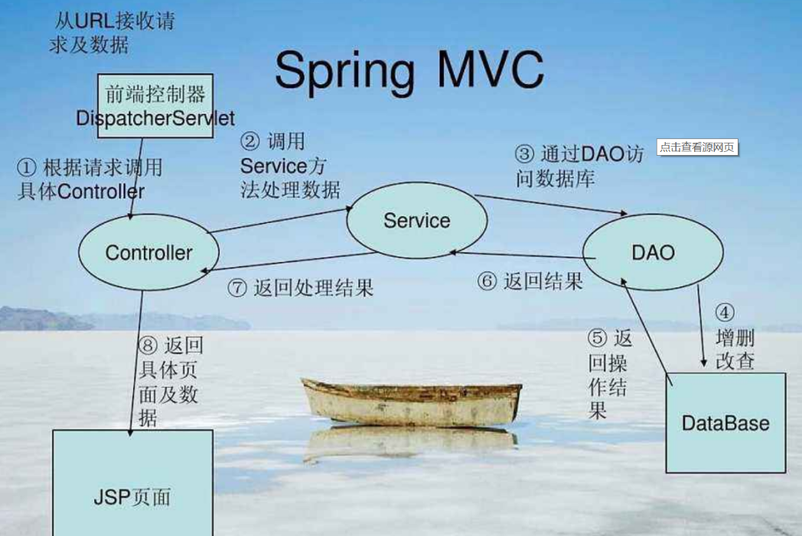
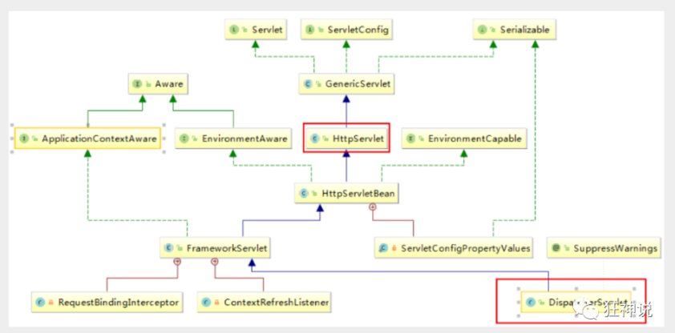
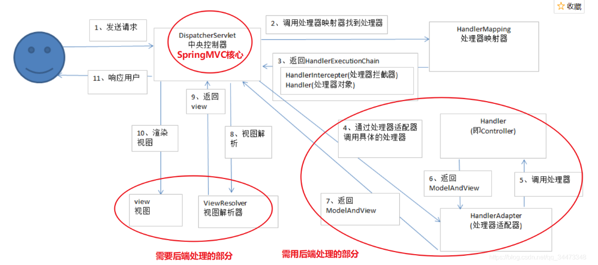

# SpringMVC

## MVC

- MVC是**模型(Model)**、**视图(View)**、**控制器(Controller)**的简写，是一种软件设计规范。
- 是将业务逻辑、数据、显示分离的方法来组织代码。
- MVC主要作用是**降低了视图与业务逻辑间的双向偶合**。
- MVC不是一种设计模式，**MVC是一种架构模式**。当然不同的MVC存在差异。

**Model（模型）：**数据模型，提供要展示的数据，因此包含数据和行为，可以认为是领域模型或JavaBean组件（包含数据和行为），不过现在一般都分离开来：Value Object（数据Dao） 和 服务层（行为Service）。也就是模型提供了模型数据查询和模型数据的状态更新等功能，包括数据和业务。

**View（视图）：**负责进行模型的展示，一般就是我们见到的用户界面，客户想看到的东西。

**Controller（控制器）：**接收用户请求，委托给模型进行处理（状态改变），处理完毕后把返回的模型数据返回给视图，由视图负责展示。也就是说控制器做了个调度员的工作。

最典型的MVC就是JSP + servlet + javabean的模式。



### Model时代

#### Model1时代:

- 在web早期的开发中，通常采用的都是Model1。
- Model1中，主要分为两层，视图层和模型层。

#### Model2时代:

Model2把一个项目分成三部分，包括**视图、控制、模型。**



1. 用户发请求
2. Servlet接收请求数据，并调用对应的业务逻辑方法
3. 业务处理完毕，返回更新后的数据给servlet
4. servlet转向到JSP，由JSP来渲染页面
5. 响应给前端更新后的页面

##### 职责分析:

**Controller：控制器**

1. 取得表单数据
2. 调用业务逻辑
3. 转向指定的页面

**Model：模型**

1. 业务逻辑
2. 保存数据的状态

**View：视图**

1. 显示页面

Model2这样不仅提高的代码的复用率与项目的扩展性，且大大降低了项目的维护成本。Model 1模式的实现比较简单，适用于快速开发小规模项目，Model1中JSP页面身兼View和Controller两种角色，将控制逻辑和表现逻辑混杂在一起，从而导致代码的重用性非常低，增加了应用的扩展性和维护的难度。Model2消除了Model1的缺点。


### MVC框架需要做哪些事

1. 将url映射到java类或java类的方法 .
2. 封装用户提交的数据 .
3. 处理请求--调用相关的业务处理--封装响应数据 .
4. 将响应的数据进行渲染 . jsp / html 等表示层数据 .

**说明：**

​	常见的服务器端MVC框架有：Struts、Spring MVC、ASP.NET MVC、Zend Framework、JSF；常见前端MVC框架：vue、angularjs、react、backbone；由MVC演化出了另外一些模式如：MVP、MVVM 等等....


### 关于三层架构

> 参考链接:[Java中DAO层、Service层和Controller层的区别诚o的博客-CSDN博客](https://blog.csdn.net/qq_22771739/article/details/82344336)

**DAO层：**
DAO层叫数据访问层，全称为data access object，**属于一种比较底层，比较基础的操作，具体到对于某个表的增删改查**，也就是说**某个DAO一定是和数据库的某一张表一一对应的，其中封装了增删改查基本操作，建议DAO只做原子操作，增删改查。**

**Service层：**
Service层叫服务层，被称为服务，粗略的理解就是**对一个或多个DAO进行的再次封装，封装成一个服务，所以这里也就不会是一个原子操作了，需要事务控制。**

**Controler层：**
Controler负责**请求转发，接受页面过来的参数**，**调用对应的Service进行处理，接到返回值，再传给页面。**

**总结：**个人理解DAO面向表，Service面向业务。后端开发时先数据库设计出所有表，然后对每一张表设计出DAO层，然后根据具体的业务逻辑进一步封装DAO层成一个Service层，对外提供成一个服务.


## 回顾Servlet

所需要的依赖包

```xml
 <!-- ServletAPI -->
    <dependency>
      <groupId>javax.servlet</groupId>
      <artifactId>javax.servlet-api</artifactId>
      <version>3.1.0</version>
      <scope>provided</scope>
    </dependency>

    <dependency>
      <groupId>javax.servlet</groupId>
      <artifactId>jsp-api</artifactId>
      <version>2.0</version>
    </dependency>

    <dependency>
      <groupId>javax.servlet.jsp.jstl</groupId>
      <artifactId>jstl-api</artifactId>
      <version>1.2</version>
    </dependency>
```

servlet:

```java
import javax.servlet.*;
import javax.servlet.http.*;
import javax.servlet.annotation.*;
import java.io.IOException;

@WebServlet(name = "HelloServlet", value = "/hello")
public class HelloServlet extends HttpServlet {
    @Override
    protected void doGet(HttpServletRequest request, HttpServletResponse response) throws ServletException, IOException {
            request.setCharacterEncoding("utf-8");
            response.setContentType("text/html;charset=utf-8");

            if (request.getParameter("method").equals("add")){
//                request.getSession().setAttribute("msg","执行了add方法");
                request.setAttribute("msg","执行了add方法");  //由于是请求转发,用这个也可以
            }
            else if(request.getParameter("method").equals("delete")){
                request.setAttribute("msg","执行了delete");
            }
            else {
                System.out.println("错误!");
            }
            request.getRequestDispatcher("/WEB-INF/jsp/hello.jsp").forward(request,response);
    }

    @Override
    protected void doPost(HttpServletRequest request, HttpServletResponse response) throws ServletException, IOException {
        this.doGet(request,response);
    }
}

```

jsp页面,注意,放在WEB-INF目录下也可行:

```jsp
<%@ page contentType="text/html;charset=UTF-8" language="java" %>
<html>
<head>
    <title>Title</title>
</head>
<body>
  ${msg}
</body>
</html>
```

使用带参数的url测试:

- `localhost:8080/method?method=add`
- `localhost:80808/method?method=delete`


## Spring MVC初识

> 官方文档:[Spring-MVC](https://docs.spring.io/spring/docs/5.2.0.RELEASE/spring-framework-reference/web.html#spring-web)

Spring MVC是Spring Framework的一部分，是基于Java实现MVC的轻量级Web框架。

 Spring MVC的特点：

1. 轻量级，简单易学
2. 高效 , 基于请求响应的MVC框架
3. 与Spring兼容性好，无缝结合
4. 约定优于配置
5. 功能强大：RESTful、数据验证、格式化、本地化、主题等
6. 简洁灵活
7. 最重要的一点还是用的人多 , 使用的公司多 . 

==Spring的web框架围绕**DispatcherServlet** [ Servlet调度 ] 设计。==

DispatcherServlet的作用是将请求分发到不同的处理器。从Spring 2.5开始，使用Java 5或者以上版本的用户可以采用基于注解形式进行开发，十分简洁；

正因为SpringMVC好 , 简单 , 便捷 , 易学 , 天生和Spring无缝集成(使用SpringIoC和Aop) , 使用约定优于配置 . 能够进行简单的junit测试 . 支持Restful风格 .异常处理 , 本地化 , 国际化 , 数据验证 , 类型转换 , 拦截器 等等......所以我们要学习 .


### DispatcherServlet

​	Spring的web框架围绕DispatcherServlet设计。DispatcherServlet的作用是**将请求分发到不同的处理器。**从Spring 2.5开始，使用Java 5或者以上版本的用户可以采用基于注解的controller声明方式。

​	Spring MVC框架像许多其他MVC框架一样, **以请求为驱动** , **围绕一个中心Servlet分派请求及提供其他功能**，**DispatcherServlet是一个实际的Servlet (它继承自HttpServlet 基类)**。



### 执行原理:




**简要分析执行流程**

1. DispatcherServlet表示前置控制器，是整个SpringMVC的控制中心。**用户发出请求，DispatcherServlet接收请求并拦截请求。**

   我们假设请求的url为 : http://localhost:8080/SpringMVC/hello

   **如上url拆分成三部分：**

   http://localhost:8080服务器域名

   SpringMVC部署在服务器上的web站点

   hello表示控制器

   通过分析，如上url表示为：请求位于服务器localhost:8080上的SpringMVC站点的hello控制器。

2. `HandlerMapping`为处理器映射。**`DispatcherServlet`调用HandlerMapping(请求处理器映射),HandlerMapping根据请求url查找`Handler`。(请求处理器)**

3. `HandlerAdapter`表示处理器适配器，其按照特定的规则去执行Handler。

4. **`HandlerExecution(请求处理执行器)`**表示具体的Handler,其主要作用**通过`HandlerAdapter(处理器适配器)`是根据url查找控制器**，如上url被查找控制器为：hello。

5. HandlerExecution**将解析后的信息传递给DispatcherServlet,如解析控制器映射等**。

6. Handler让具体的Controller执行。

7. **`Controller(控制器)`将具体的执行信息(如ModelAndView)返回给HandlerAdapter**。

8. HandlerAdapter**将视图逻辑名或模型传递给DispatcherServlet**。

9. DispatcherServlet调用视图解析器(ViewResolver)来解析HandlerAdapter传递的逻辑视图名。

10. **`ViewResolver(视图解析器)`**将解析的逻辑视图名传给DispatcherServlet。

11. DispatcherServlet根据视图解析器解析的视图结果，调用具体的视图。

12. 最终视图呈现给用户。


### 几个重要的对象

**DispatcherServlet(Servlet调度):**

负责对所有请求响应工作的协调调度,所有的用户请求都会最先被他拦截以决定如何处理(即调度),受到请求后会调用`HandlerMapping(处理器映射)`;  并且还会将从处理器适配那里获得的模型视图通过`ViewResolver(视图解析器)`解析后返回给用户

**HandlerMapping(处理器映射):**

通过Servlet调度对象发送来的url返回给一个`HandlerExecution(请求处理执行器)`给Servlet调度对象.

**HandlerAdapter(处理器适配器):**

会收到Servlet调度发来的`HandlerExecution(请求处理执行器)`,然后按照特定的规则去执行`Handler` , 并且返回`ModelAndView模型视图`给Servlet调度对象

**Controller(控制器)即Hander:**

将具体的执行信息(如`ModelAndView模型视图`)返回给`HandlerAdapter处理器适配器`

**ViewResolver(视图解析器):**

解析模型视图,返回给Servlet调度对象


## 入门程序:

所需要的相关依赖包:

```xml
    <dependency>
      <groupId>junit</groupId>
      <artifactId>junit</artifactId>
      <version>4.11</version>
      <scope>test</scope>
    </dependency>

    <!-- ServletAPI -->
    <dependency>
      <groupId>javax.servlet</groupId>
      <artifactId>javax.servlet-api</artifactId>
      <version>3.1.0</version>
      <scope>provided</scope>
    </dependency>

    <dependency>
      <groupId>javax.servlet</groupId>
      <artifactId>jsp-api</artifactId>
      <version>2.0</version>
    </dependency>

    <dependency>
      <groupId>javax.servlet.jsp.jstl</groupId>
      <artifactId>jstl-api</artifactId>
      <version>1.2</version>
    </dependency>

    <dependency>
      <groupId>org.springframework</groupId>
      <artifactId>spring-webmvc</artifactId>
      <version>5.3.16</version>
    </dependency>

```

### 配置文件实现:

首先在`web.xml`中注册Servlet ,这个Servlet是调度对象`DispatcherServlet`

```xml
<?xml version="1.0" encoding="UTF-8"?>
<web-app xmlns="http://xmlns.jcp.org/xml/ns/javaee"
         xmlns:xsi="http://www.w3.org/2001/XMLSchema-instance"
         xsi:schemaLocation="http://xmlns.jcp.org/xml/ns/javaee http://xmlns.jcp.org/xml/ns/javaee/web-app_4_0.xsd"
         version="4.0">
    <!--注册DispatcherServlet-->
    <servlet>
        <servlet-name>springmvc</servlet-name>
        <servlet-class>org.springframework.web.servlet.DispatcherServlet</servlet-class>
        <init-param>
            <param-name>contextConfigLocation</param-name>
            <!--关联一个springmvc的配置文件:【servlet-name】-servlet.xml
       这个Spring配置文件将 处理映射器,处理适配器,模板视图解析器,以及我们自己编写的执行控制器(类似Servlet)
       都交给了Spring进行管理-->
       <!--为Servlet调度对象初始化处理映射器,处理适配器,模板视图解析器,以及执行控制器-->
            <param-value>classpath:springmvc-servlet.xml</param-value>
        </init-param>

        <load-on-startup>1</load-on-startup> <!--启动级别-1-->
    </servlet>

    <servlet-mapping>
        <servlet-name>springmvc</servlet-name>
        <!--   注意!!!
            / 匹配所有的请求；（不包括.jsp）
            /* 匹配所有的请求；（包括.jsp）
        -->
        <!-- 因为Servlet调度对象需要拦截接管所有请求,所以需要将它的映射路径设置为根路径 /  -->
        <url-pattern>/</url-pattern>
    </servlet-mapping>
</web-app>
```

Spring的配置文件,名字可以随意,但一般使用将其命名为 `Servlet名-servlet.xml`,由于是第一个mvc程序我将其命名成了springmvc-servlet.xml, 这个配置文件将一些重要的对象交给了spring管理,并且`web.xml`文件中注册的调度servlet初始化时关联引用了此文件的信息,

此外,我们以后编写的执行控制器(也就是servlet)也将在此文件下配置(即交给spring管理)

```xml
<?xml version="1.0" encoding="UTF-8"?>
<beans xmlns="http://www.springframework.org/schema/beans"
       xmlns:xsi="http://www.w3.org/2001/XMLSchema-instance"
       xsi:schemaLocation="http://www.springframework.org/schema/beans http://www.springframework.org/schema/beans/spring-beans.xsd">

<!--    添加处理映射器-->
    <bean class="org.springframework.web.servlet.handler.BeanNameUrlHandlerMapping"/>
<!--    添加处理适配器-->
    <bean class="org.springframework.web.servlet.mvc.SimpleControllerHandlerAdapter"/>

    <!--模型视图解析器:DispatcherServlet给他的ModelAndView-->
    <bean class="org.springframework.web.servlet.view.InternalResourceViewResolver" id="InternalResourceViewResolver">
<!--        设置视图解析寻找识别规则        -->
        <property name="prefix" value="/WEB-INF/jsp/"/> <!--前缀-->
        <property name="suffix" value=".jsp"/> <!--后缀-->
    </bean>

<!--    注意! 这里的bean id 就相当于Servlet的Mapper映射url,即使请求路径,所以 / 是必须的-->
    <bean id="/hello" class="HelloController"/>
</beans>
```

自己编写的执行控制器`HelloController.java`,就类似以前javaweb中编写的servlet

```java
import org.springframework.web.servlet.ModelAndView;
import org.springframework.web.servlet.mvc.Controller;

import javax.servlet.http.HttpServletRequest;
import javax.servlet.http.HttpServletResponse;

// 本质上就是对Servlet的再次封装
public class HelloController implements Controller {
    @Override
    public ModelAndView handleRequest(HttpServletRequest request, HttpServletResponse response) throws Exception {

        ModelAndView mv = new ModelAndView();  // 创建视图模型
        mv.setViewName("hello");  // 设置视图的名称,注意!这里一定要与jsp或html前端页面的文件名一致
        //下面是设置模型视图的属性名和属性值,类似request.setAttribute()方法
        mv.addObject("msg","你好!SpringMVC");
        return mv;  //返回给模型视图解析器
    }
}
```

前端页面:`hello.jsp`

```jsp

<%@ page contentType="text/html;charset=UTF-8" language="java" %>
<html>
<head>
    <title>Title</title>
</head>
<body>
 ${msg}
</body>
</html>
```

### 注解实现:

`web.xml`基本与上个例子基本一致,用于注册Servlet调度

```xml
<?xml version="1.0" encoding="UTF-8"?>
<web-app xmlns="http://xmlns.jcp.org/xml/ns/javaee"
         xmlns:xsi="http://www.w3.org/2001/XMLSchema-instance"
         xsi:schemaLocation="http://xmlns.jcp.org/xml/ns/javaee http://xmlns.jcp.org/xml/ns/javaee/web-app_4_0.xsd"
         version="4.0">
    <servlet>
        <servlet-name>springmvc</servlet-name>
        <servlet-class>org.springframework.web.servlet.DispatcherServlet</servlet-class>
        <init-param>
            <param-name>contextConfigLocation</param-name>
            <param-value>classpath:springmvc-servlet.xml</param-value>
        </init-param>

        <load-on-startup>1</load-on-startup> <!--启动级别-1-->
    </servlet>

    <servlet-mapping>
        <servlet-name>springmvc</servlet-name>
        <!--   注意!!!
            / 匹配所有的请求；（不包括.jsp）
            /* 匹配所有的请求；（包括.jsp）
        -->
        <url-pattern>/</url-pattern>
    </servlet-mapping>
</web-app>
```

Spring的Servlet配置文件`springmvc-servlet.xml` ,注意! 由于使用了注解,还需要**开启Spring的组件注解扫描,以及SpringMVC的注解驱动等, **同时也不要在加我们编写的**Controller实现类加入Spring容器中(因为注解已经帮我们做了)**

```xml
<?xml version="1.0" encoding="UTF-8"?>
<beans xmlns="http://www.springframework.org/schema/beans"
        xmlns:xsi="http://www.w3.org/2001/XMLSchema-instance"
        xmlns:context="http://www.springframework.org/schema/context"
        xmlns:mvc="http://www.springframework.org/schema/mvc"
        xsi:schemaLocation="http://www.springframework.org/schema/beans
       http://www.springframework.org/schema/beans/spring-beans.xsd
       http://www.springframework.org/schema/context
       http://www.springframework.org/schema/context/spring-context.xsd
       http://www.springframework.org/schema/mvc
       http://www.springframework.org/schema/mvc/spring-mvc.xsd
">
    <!--指定注解扫描包-->
    <context:component-scan base-package="hello_annotation"/>
    <!-- 让Spring MVC不处理静态资源 -->
    <mvc:default-servlet-handler />
    <!--
  支持mvc注解驱动
      在spring中一般采用@RequestMapping注解来完成映射关系
      要想使@RequestMapping注解生效
      必须向上下文中注册DefaultAnnotationHandlerMapping
      和一个AnnotationMethodHandlerAdapter实例
      这两个实例分别在类级别和方法级别处理。
      而annotation-driven配置帮助我们自动完成上述两个实例的注入。
   -->
    <mvc:annotation-driven />

<!--    添加处理映射器-->
    <bean class="org.springframework.web.servlet.handler.BeanNameUrlHandlerMapping"/>
<!--    添加处理适配器-->
    <bean class="org.springframework.web.servlet.mvc.SimpleControllerHandlerAdapter"/>

    <!--模型视图解析器:DispatcherServlet给他的ModelAndView-->
    <bean class="org.springframework.web.servlet.view.InternalResourceViewResolver" id="InternalResourceViewResolver">
<!--        设置视图解析寻找识别规则        -->
        <property name="prefix" value="/WEB-INF/jsp/"/> <!--前缀-->
        <property name="suffix" value=".jsp"/> <!--后缀-->
    </bean>
</beans>
```

编写控制器,我们不在需要实现Controller接口重写handleRequest方法,我们给类标上`@Controller`注解后,随后在类中编写的方法标注上` @RequestMapping("请求的url")`后,一个方法相当于一个Servlet,不需要在Spring中注册了,**注意!这个方法叫做请求映射方法,要为public**

```java
package hello_annotation;

import org.springframework.stereotype.Controller;
import org.springframework.ui.Model;
import org.springframework.web.bind.annotation.RequestMapping;
import javax.servlet.http.HttpServletRequest;
import javax.servlet.http.HttpServletResponse;

@Controller   // 类级别的注解
public class HelloControllerAnnotaion{   // 注意!!! 方法一定要是 public
    @RequestMapping("/hello2")   // 注意!!! 这个注解是方法级别的(如果放在类名上就是多级目录),设置请求的url(注意! 请求时如果有项目名要加项目名)
    /*
    * 这样标注了注解的方法相当于一个Servlet,
    * 不过需要返回一个字符串,这个字符串的内容就是视图模型名,视图模型解析器根据此名字进行解析(在Spring配置文件中进行了配置)
    * 此外可以在方法可以接收视图模型对象,请求头,响应头等对象参数,以供使用
    *  */
    public String sayHello(Model model, HttpServletRequest request, HttpServletResponse response){
    model.addAttribute("msg","这是注解实现的Hello SpringMVC呀!");
        System.out.println(request);
        String viewName = "hello";
        return viewName;
    }
}
```

前端页面:`hello.jsp`

```jsp
<%@ page contentType="text/html;charset=UTF-8" language="java" %>
<html>
<head>
    <title>Title</title>
</head>
<body>
 ${msg}
</body>
</html>
```

### 小结:

1. 编写web.xml , 注册`DispatcherServlet`以及根路径映射
2. 编写springmvc配置文件(必须配置**处理器映射器、处理器适配器、视图解析器**)
3. 接下来就是去创建对应的控制类 ,` controller`
4. 最后完善前端视图和controller之间的对应
4. 

### @RequestMapping

Spring MVC 的` @RequestMapping` 注解能够处理 HTTP 请求的方法, 比如 GET, PUT, POST, DELETE 以及 PATCH。

**所有的地址栏请求默认都会是 HTTP GET 类型的。**

可以通过参数设置限定接收的请求方法类型:

```java
@RequestMapping(value = "/method",method = {RequestMethod.POST}) // 只接收post请求,不设置则接收所有请求
```

#### 限定类型的请求映射

```java
@GetMapping("/url")
@PostMapping("/url")
@PutMapping("/url")
@DeleteMapping("/url")
@PatchMapping("/url")
```

#### 设置编码与响应体:

```java
 @RequestMapping(value = "url",produces = "application/json;charset=utf-8")
```

##### @ResponseBody

一般情况下被`@RequestMapping`标注的方法一般是返回一个视图名然后交给视图解析器解析,**所以返回的最终是一个页面**,我们也可以使用**`@ResponseBody`将此方法设置为响应体,进行这样标注后方法的返回值将作为数据返回给前面页面**


## RestFul 风格

Restful就是一个资源定位及资源操作的风格。不是标准也不是协议，只是一种风格。基于这个风格设计的软件可以更简洁，更有层次，更易于实现缓存等机制。

资源：互联网所有的事物都可以被抽象为资源

资源操作：使用POST、DELETE、PUT、GET，使用不同方法对资源进行操作。

分别对应 添加、 删除、修改、查询。

**传统方式操作资源**  ：通过不同的参数来实现不同的效果！方法单一，post 和 get

​	http://127.0.0.1/item/queryItem.action?id=1 查询,GET

​	http://127.0.0.1/item/saveItem.action 新增,POST

​	http://127.0.0.1/item/updateItem.action 更新,POST

​	http://127.0.0.1/item/deleteItem.action?id=1 删除,GET或POST

**使用RESTful操作资源(通过限定请求类型实现)** ：可以通过不同的请求方式来实现不同的效果！如下：请求地址一样，但是功能可以不同！

​	http://127.0.0.1/item/1 查询,GET

​	http://127.0.0.1/item 新增,POST

​	http://127.0.0.1/item 更新,PUT

​	http://127.0.0.1/item/1 删除,DELETE


### 路径参数

```java
@Controller
public class RestFulControl {

// 路径参数 , 根据路径参数返回相加结果,这就是Restul风格,传统风格下使用问号分隔请求url和参数,参数之间用&分隔
    @RequestMapping("/add/{var1}/{var2}")  // {方法参数名} 占位符用于将路径的值传给(被注解的)方法参数,注意一下数据类型
    String pathAdd(Model model, HttpServletResponse response, @PathVariable int var1,@PathVariable int var2){

        model.addAttribute("res",var1+var2);
        return "result";
    }
```


### @RequestMapping

Spring MVC 的 @RequestMapping 注解能够处理 HTTP 请求的方法, 比如 GET, PUT, POST, DELETE 以及 PATCH。

**所有的地址栏请求默认都会是 HTTP GET 类型的。**

可以通过参数设置限定接收的请求方法类型:

```java
@RequestMapping(value = "/path",method = {RequestMethod.POST}) // 只接收post请求,不设置则接收所有请求
```

#### 限定类型的请求映射

```java
@GetMapping("/url")
@PostMapping("/url")
@PutMapping("/url")
@DeleteMapping("/url")
@PatchMapping("/url")
```

#### 设置编码与响应体:

```java
 @RequestMapping(value = "url",produces = "application/json;charset=utf-8")
```


## 请求与数据处理

### 请求结果跳转的方式:

#### Servlet API

通过设置ServletAPI , 不需要视图解析器 .

1、通过HttpServletResponse进行输出

2、通过HttpServletResponse实现重定向

3、通过HttpServletResponse实现转发

```java
package control;
import org.springframework.stereotype.Controller;
import org.springframework.ui.Model;
import org.springframework.web.bind.annotation.PathVariable;
import org.springframework.web.bind.annotation.RequestMapping;
import javax.servlet.ServletException;
import javax.servlet.http.*;
import java.io.IOException;

@Controller
public class SkipController {
    // Servlet API(请求头响应头) 实现请求转发或者重定向
    @RequestMapping("/s1_{pram}")
    public void servletApi(HttpServletRequest request ,HttpServletResponse response,@PathVariable String pram) throws ServletException, IOException {  //注意! 方法要为public
        if ("forward".equals(pram)){
            request.getRequestDispatcher("/WEB-INF/jsp/page.jsp").forward(request,response);
        }
        else if ("redirect".equals(pram)){
            response.sendRedirect("/project_name/index.jsp");
            /* 重定向与请求转发不同不能访问WEB-INF下的内容, 此外使用重定向就不能再返回一个视图名了,
               要把方法返回值改为 void
               此外,响应头实现的重定向是要写全项目名的(可以跳转到外链)
             */
        }
    }
}
```

##### 注意点:

- **请求映射方法要设置为public**
- **重定向时请求映射方法不能再返回视图名了,要设置为void,转发时可以因为转发优先于返回视图名**
- **重定向要写全项目名(应用程序上下文)**
- 不要忘记开启**Spring配置文件的注解扫描和MVC的注解驱动扫描**


#### ModelAndView

设置ModelAndView对象 , **==根据view的名称==** , 让视图解析器解析后让**Servlet调度对象**执行对应跳转操作 .

页面(含路径文件名) : {视图解析器前缀} + `forward:或redirect:`viewName +{视图解析器后缀}

```java
package control;

import org.springframework.stereotype.Controller;
import org.springframework.ui.Model;
import org.springframework.web.bind.annotation.PathVariable;
import org.springframework.web.bind.annotation.RequestMapping;

import javax.servlet.ServletException;
import javax.servlet.http.HttpServletRequest;
import javax.servlet.http.HttpServletResponse;
import java.io.IOException;

@Controller
public class SkipController {
    // 使用SpringMVC实现转发和重定向,编写特定规则的视图名让Servlet调度实现
    @RequestMapping("/s2_{pram}")
    public String springMVC(@PathVariable String pram, Model model){
        if ("forward".equals(pram)){
            model.addAttribute("msg","请求转发呀!") ;
            return "forward:/WEB-INF/jsp/page.jsp";
        }
        else if ("redirect".equals(pram)){
//            return "redirect:/index.jsp" ;  //注意!!! SpringMVC的重定向不要写项目名,默认带了项目名
//            return "redirect:https://www.baidu.com";  //但是又可以跳转外链,哈哈哈哈
        }
        return "page";  //这里 返回的视图 本质上也是一个由Servlet调度实现的请求转发
    }
}
```

##### 注意与总结:

- **SpringMVC的重定向若是内链则不需要写项目名了**
- **`org.springframework.web.servlet.view.InternalResourceViewResolver`,在只使用SpringMVC的转发和重定向时,不是必须配置的,由此可知解析器只负责解析页面路径名称**
- **映射方法返回的视图名跳转页面实际上也是一个通过Servlet调度实现的请求转发**


### 数据处理

#### 接收数据

在Servlet中我们通常通过`Request`,`Session`,`Cookie`等获取前端参数,而在SpringMVC中可直接在**请求映射方法中声明参数来获得参数,参数名一致时可以直接使用,不一致则需要用到注解`@RequestParam(前端请求参数名)`**,此外,请求的参数名与方法参数不一致的时候可能会使接收的参数为null

**补充: ** `@RequestBody`注解用于获取**请求体的前端请求参数**, `@RequestParam`用于获取**请求头的前端请求参数**

例如请求的url为:`http://localhost:8080/project_name/d1?username=南城`

```java
package control;

import org.springframework.stereotype.Controller;
import org.springframework.ui.Model;
import org.springframework.web.bind.annotation.RequestMapping;
import org.springframework.web.bind.annotation.RequestParam;

@Controller
public class DataProcessController {
    @RequestMapping("/d1")
    public String receive(Model model,@RequestParam("username") String name){
        String str = "前端传来的参数为:"+name;
        model.addAttribute("msg",str);
        return "page";
    }
}
```

此外,如果**接收的参数过多,可以在Java中构建实体类bean来进行映射**,从而使用**对象作为参数类接收**,不过参数名要和对象属性名一致(顺序可以不一致)

例如请求的url为:`http://localhost:8080/project_name/d2?name=小有&id=001`

```java
package control;

import org.springframework.stereotype.Controller;
import org.springframework.ui.Model;
import org.springframework.web.bind.annotation.RequestMapping;
import org.springframework.web.bind.annotation.RequestParam;
import pojo.User;

    //接收对象
    @RequestMapping("/d2")
    public String receiveObject(Model model, User user){
        String str = user.toString();
        model.addAttribute("msg",str);
        return "page";
    }
}
```


#### 发送数据

在学习Servlet中我们可以**通过响应头调用输出流方法**向前端返回数据 , 在SpringMVC我们之前已经用过的方法是**通过给模型,视图模型添加属性来向前端返回数据**,**此外还可以通过注解`@ResponseBody ,@RestController`使用控制器变成响应返回数据的Servlet而不是返回视图模型让解析器解析**


##### 通过响应体返回数据:

`@ResponseBody`: 用于请求映射方法上(注解为`@RequestMapping`的方法) ,加上`@ResponseBody`后  , **方法的返回值将不再默认的返回视图名供给解析器解析 , 而是作为响应体返回数据**

`@RestController`:**作用在类上,相当于一个衍生的`@Controller` , 用了此注解的这个控制器(类)的方法都相当于加了`@ResponseBody`**

```java
package control;

import com.alibaba.fastjson.JSONObject;
import org.springframework.stereotype.Controller;
import org.springframework.web.bind.annotation.RequestMapping;
import org.springframework.web.bind.annotation.ResponseBody;
import pojo.User;

/*
将Java对象转换成json字符串返回给前端
 */
@Controller
public class RespondJson {
    //produces:指定响应体返回类型和编码
    @RequestMapping(value = "/t1",produces = "text/json;charset=utf-8")
    @ResponseBody     // 将方法返回值标注为响应体信息,即方法不再返回视图名给解析器而是直接作为响应体返回信息
    public String t1(){
        String date = "";
        User u = new User(201,"南城");

        JSONObject josn_u = new JSONObject();
        josn_u.put("id",u.getId());
        josn_u.put("name",u.getName());
        date = josn_u.toJSONString();
        return date;
    }
}
```

前端页面会显示: {"name":"南城","id":201}

---

假设url为: `localhost:8080/t2/{"id":201,"name":"南城"}` , 会将路径参数JSON字符串转换为java对象

```java

@RestController  // 响控制器,标注了此注解的类的所有请求映射方法都默认被标注为@RespondBody ,直接向前端返回数据
public class ReceiveJSON_Respond {
    
    /*接收前端的路径参数,此路径参数为json字符串,随后将json字符串转换成Java对象 */
    
    @RequestMapping(value = "/t2/{json}",produces = "text/json;charset=utf-8")
    public String test2(@PathVariable String json){
        String date = "已经接收!";
        JSONObject jsonObject = (JSONObject) JSONObject.parse(json);
        User u = new User((int)jsonObject.getIntValue("id"),jsonObject.getString("name"));
        System.out.println(u);
        return date;
    }
}
// 后台打印结果为: User{id=201, name='南城'}
```

将前端表单页面的数据(JSON对象数组)传到后台,然后变量打印这个对象数组

页面代码, 表单文本框里输入的内容为: `[{"id":201,"name":"南城"},{"id":212,"name":"小岛"}]` 

```jsp
<html>
  <head>
    <title>$Title$</title>
  </head>
  <body>
  <h3>发送JSON对象:</h3>
  <form action="/projectname/t3" method="get" >  <!--注意! 前端请求路径要写全项目名-->
    字符串:<input type="text" name="json">    <br>  <!--一定要有name属性,后端根据此属性名找value-->
    <br>
    <input type="submit" value="哎嘿,发送">
  </form>
  </body>
</html>
```

Java后台:

```java
package control;

import com.alibaba.fastjson.JSONArray;
import com.alibaba.fastjson.JSONObject;
import org.springframework.web.bind.annotation.PathVariable;
import org.springframework.web.bind.annotation.RequestMapping;
import org.springframework.web.bind.annotation.RestController;
import pojo.User;
import javax.servlet.http.HttpServletRequest;
import java.util.ArrayList;
import java.util.List;

@RestController  // 响控制器,标注了此注解的类的所有请求映射方法都默认被标注为@RespondBody ,直接向前端返回数据
public class ReceiveJSON_Respond {

    //获取前端传递的数组
    @RequestMapping(value = "/t3",produces = "text/json;charset=utf-8")
    public String getJsonArray(HttpServletRequest request){
        String json = request.getParameter("json");  // 获取请求参数,来自表单的参数json

        JSONArray jsonArray = JSONObject.parseArray(json);  //将字符串转换成JSON数组

        List<User> list = jsonArray.toJavaList(User.class);  // 将JSON数组转换成java集合
        for (User u:list) {   //遍历集合
            System.out.println(u);
        }
        String date = "已接收!" ;
        return date;
    }
}
/* 打印结果:
User{id=201, name='南城'}
User{id=212, name='小岛'}
/*
```


##### 通过Model返回视图:

通过`Model`

```java
// 通过添加模型对象属性
@RequestMapping("/ct2/hello")
public String hello(@RequestParam("username") String name, Model model){
   //封装要显示到视图中的数据
   //相当于req.setAttribute("name",name);
   model.addAttribute("msg",name);
   System.out.println(name);
   return "test";
}
```

通过`ModelMap`,**ModelMap 继承了 LinkedMap ，除了实现了自身的一些方法，同样的继承 LinkedMap 的方法和特性**；

```java
@RequestMapping("/hello")
public String hello(@RequestParam("username") String name, ModelMap model){
   //封装要显示到视图中的数据
   //相当于req.setAttribute("name",name);
   model.addAttribute("name",name);
   System.out.println(name);
   return "hello";
}
```

通过模型视图对象`ModelAndView`, 本质是结合了`ModelMap`和`View` ,与这两者没有继承关系,是借用两者实现的

```java
public class ControllerTest1 implements Controller {

   public ModelAndView handleRequest(HttpServletRequest httpServletRequest, HttpServletResponse httpServletResponse) throws Exception {
       ModelAndView mv = new ModelAndView();
       mv.addObject("msg","ControllerTest1");
       mv.setViewName("test");   // 设置视图名,即需要跳转的对象
       return mv;  //返回一个模型视图对象
  }
}
```

就对于新手而言简单来说使用区别就是：

- `Model `只有寥寥几个方法只适合用于储存数据，**简化了新手对于Model对象的操作和理解**；

- `ModelMap` 继承了 LinkedMap ，除了实现了自身的一些方法，**同样的继承 LinkedMap 的方法和特性**；

- `ModelAndView `**可以在储存数据的同时，可以进行设置返回的逻辑视图，进行控制展示层的跳转**。

当然更多的以后开发考虑的更多的是性能和优化，就不能单单仅限于此的了解。


## 乱码问题

### 方案一:修改web.xml添加过滤器

以前乱码问题通过过滤器解决 , 而SpringMVC给我们提供了一个过滤器 , 可以在web.xml中配置 .修改了xml文件需要重启服务器！

在`web.xml`中添加过滤器

```xml
<filter>
   <filter-name>encoding</filter-name>
   <filter-class>org.springframework.web.filter.CharacterEncodingFilter</filter-class>
   <init-param>
       <param-name>encoding</param-name>
       <param-value>utf-8</param-value>
   </init-param>
</filter>
<filter-mapping>
   <filter-name>encoding</filter-name>
   <url-pattern>/*</url-pattern>
</filter-mapping>
```

但是我们发现 , 有些极端情况下.这个过滤器对get的支持不好 . 我们可以使用修改tomcat配置文件 ：设置编码！

### 方案二:修改Tomcat配置

在tomcat目录下的conf目录下的`server.xml`文件中,修改如下节点

```xml
<Connector URIEncoding="utf-8" port="8080" protocol="HTTP/1.1"
          connectionTimeout="20000"
          redirectPort="8443" />
```

### 方案三:自定义过滤器

> 如下过滤器代码摘抄自网络

编写好如下过滤器后,还需要在`web.xml`中注册配置一下

```java
package com.kuang.filter;

import javax.servlet.*;
import javax.servlet.http.HttpServletRequest;
import javax.servlet.http.HttpServletRequestWrapper;
import javax.servlet.http.HttpServletResponse;
import java.io.IOException;
import java.io.UnsupportedEncodingException;
import java.util.Map;

/**
* 解决get和post请求 全部乱码的过滤器
*/
public class GenericEncodingFilter implements Filter {

   @Override
   public void destroy() {
  }

   @Override
   public void doFilter(ServletRequest request, ServletResponse response, FilterChain chain) throws IOException, ServletException {
       //处理response的字符编码
       HttpServletResponse myResponse=(HttpServletResponse) response;
       myResponse.setContentType("text/html;charset=UTF-8");

       // 转型为与协议相关对象
       HttpServletRequest httpServletRequest = (HttpServletRequest) request;
       // 对request包装增强
       HttpServletRequest myrequest = new MyRequest(httpServletRequest);
       chain.doFilter(myrequest, response);
  }

   @Override
   public void init(FilterConfig filterConfig) throws ServletException {
  }

}

//自定义request对象，HttpServletRequest的包装类
class MyRequest extends HttpServletRequestWrapper {

   private HttpServletRequest request;
   //是否编码的标记
   private boolean hasEncode;
   //定义一个可以传入HttpServletRequest对象的构造函数，以便对其进行装饰
   public MyRequest(HttpServletRequest request) {
       super(request);// super必须写
       this.request = request;
  }

   // 对需要增强方法 进行覆盖
   @Override
   public Map getParameterMap() {
       // 先获得请求方式
       String method = request.getMethod();
       if (method.equalsIgnoreCase("post")) {
           // post请求
           try {
               // 处理post乱码
               request.setCharacterEncoding("utf-8");
               return request.getParameterMap();
          } catch (UnsupportedEncodingException e) {
               e.printStackTrace();
          }
      } else if (method.equalsIgnoreCase("get")) {
           // get请求
           Map<String, String[]> parameterMap = request.getParameterMap();
           if (!hasEncode) { // 确保get手动编码逻辑只运行一次
               for (String parameterName : parameterMap.keySet()) {
                   String[] values = parameterMap.get(parameterName);
                   if (values != null) {
                       for (int i = 0; i < values.length; i++) {
                           try {
                               // 处理get乱码
                               values[i] = new String(values[i]
                                      .getBytes("ISO-8859-1"), "utf-8");
                          } catch (UnsupportedEncodingException e) {
                               e.printStackTrace();
                          }
                      }
                  }
              }
               hasEncode = true;
          }
           return parameterMap;
      }
       return super.getParameterMap();
  }

   //取一个值
   @Override
   public String getParameter(String name) {
       Map<String, String[]> parameterMap = getParameterMap();
       String[] values = parameterMap.get(name);
       if (values == null) {
           return null;
      }
       return values[0]; // 取回参数的第一个值
  }

   //取所有值
   @Override
   public String[] getParameterValues(String name) {
       Map<String, String[]> parameterMap = getParameterMap();
       String[] values = parameterMap.get(name);
       return values;
  }
}
```


---


## 拦截器

SpringMVC的处理器拦截器类似于Servlet开发中的过滤器Filter,用于对处理器进行预处理和后处理。开发者可以自己定义一些拦截器来实现特定的功能。

**过滤器与拦截器的区别：**拦截器是AOP思想的具体应用。

**过滤器:**

- servlet规范中的一部分，任何java web工程都可以使用
- 在url-pattern中配置了/*之后，可以对所有要访问的资源进行拦截


### 自定义拦截器

那如何实现拦截器呢？

想要自定义拦截器，**必须实现 HandlerInterceptor 接口。**

#### 1.编写HandlerInterceptor实现类

```java
package com.kuang.interceptor;

import org.springframework.web.servlet.HandlerInterceptor;
import org.springframework.web.servlet.ModelAndView;

import javax.servlet.http.HttpServletRequest;
import javax.servlet.http.HttpServletResponse;

public class MyInterceptor implements HandlerInterceptor {

   //在请求处理的方法之前执行
   //如果返回true执行下一个拦截器
   //如果返回false就不执行下一个拦截器  (即拦死在这)
   public boolean preHandle(HttpServletRequest httpServletRequest, HttpServletResponse httpServletResponse, Object o) throws Exception {
       System.out.println("------------处理前------------");
       return true;
  }

   //在请求处理方法执行之后执行
   public void postHandle(HttpServletRequest httpServletRequest, HttpServletResponse httpServletResponse, Object o, ModelAndView modelAndView) throws Exception {
       System.out.println("------------处理后------------");
  }

   //在dispatcherServlet处理后执行,做清理工作.
   public void afterCompletion(HttpServletRequest httpServletRequest, HttpServletResponse httpServletResponse, Object o, Exception e) throws Exception {
       System.out.println("------------清理------------");
  }
}
```

#### 2.在SpringMVC配置文件中配置

```xml
<!--关于拦截器的配置-->
<mvc:interceptors>
   <mvc:interceptor>
       <!--/** 包括路径及其子路径-->
       <!--/admin/* 拦截的是/admin/add等等这种 , /admin/add/user不会被拦截-->
       <!--/admin/** 拦截的是/admin/下的所有-->
       <mvc:mapping path="/**"/>
       <!--bean配置的就是拦截器-->
       <bean class="com.kuang.interceptor.MyInterceptor"/>
   </mvc:interceptor>
</mvc:interceptors>
```


*拦截器可以用来实现登陆状态校验*


## 文件资源IO(待学)


## SSM整合

### Maven依赖包

```xml

        <!--        测试工具-->
        <dependency>
            <groupId>junit</groupId>
            <artifactId>junit</artifactId>
            <version>4.13</version>
            <scope>test</scope>
        </dependency>

        <!--        Spring重要核心-->
        <!-- https://mvnrepository.com/artifact/org.springframework/spring-webmvc -->
        <dependency>
            <groupId>org.springframework</groupId>
            <artifactId>spring-webmvc</artifactId>
            <version>5.3.16</version>
        </dependency>

        <!--        SpringAOP织入-->
        <!-- https://mvnrepository.com/artifact/org.aspectj/aspectjweaver -->
        <dependency>
            <groupId>org.aspectj</groupId>
            <artifactId>aspectjweaver</artifactId>
            <version>1.9.4</version>
        </dependency>

        <!--        spring中的Mybatis-->
        <!-- https://mvnrepository.com/artifact/org.mybatis/mybatis-spring -->
        <dependency>
            <groupId>org.mybatis</groupId>
            <artifactId>mybatis-spring</artifactId>
            <version>2.0.6</version>
        </dependency>

        <!--        mysql驱动-->
        <dependency>
            <groupId>mysql</groupId>
            <artifactId>mysql-connector-java</artifactId>
            <version>8.0.21</version>
        </dependency>

        <!--        spring的jdbc(使用连接池技术可不用)-->
        <!-- https://mvnrepository.com/artifact/org.springframework/spring-jdbc -->
        <dependency>
            <groupId>org.springframework</groupId>
            <artifactId>spring-jdbc</artifactId>
            <version>5.3.16</version>
        </dependency>

        <!-- 数据库连接池 -->
        <dependency>
            <groupId>com.mchange</groupId>
            <artifactId>c3p0</artifactId>
            <version>0.9.5.2</version>
        </dependency>

        <!--        Mybatis-->
        <dependency>
            <groupId>org.mybatis</groupId>
            <artifactId>mybatis</artifactId>
            <version>3.5.7</version>
        </dependency>

        <!--Servlet - JSP -->
        <dependency>
            <groupId>javax.servlet</groupId>
            <artifactId>servlet-api</artifactId>
            <version>2.5</version>
        </dependency>
        <dependency>
            <groupId>javax.servlet.jsp</groupId>
            <artifactId>jsp-api</artifactId>
            <version>2.1</version>
        </dependency>
        <dependency>
            <groupId>javax.servlet</groupId>
            <artifactId>jstl</artifactId>
            <version>1.2</version>
        </dependency>
```

Maven资源过滤文件

```xml
<build>
   <resources>
       <resource>
           <directory>src/main/java</directory>
           <includes>
               <include>**/*.properties</include>
               <include>**/*.xml</include>
           </includes>
           <filtering>false</filtering>
       </resource>
       <resource>
           <directory>src/main/resources</directory>
           <includes>
               <include>**/*.properties</include>
               <include>**/*.xml</include>
           </includes>
           <filtering>false</filtering>
       </resource>
   </resources>
</build>
```

### pojo实体类

`实体类User`

```java
package com.pojo;

public class User {
    private int id;
    private String name;
    private String pwd;

    public User() {
    }

    public User(int id, String name, String pwd) {
        this.id = id;
        this.name = name;
        this.pwd = pwd;
    }

    @Override
    public String toString() {
        return "User{" +
                "id=" + id +
                ", name='" + name + '\'' +
                ", pwd='" + pwd + '\'' +
                '}';
    }

 /* getter 和 setter  */
}
```

### dao层

#### 数据库相关配置与Mybatis

##### 数据库配置文件

`database.properties`

```properties
# 注意! 使用了 c3p0 数据库链接池的属性要设置为 jdbc.属性名,不加会报错!
jdbc.driver = com.mysql.cj.jdbc.Driver
jdbc.url=jdbc:mysql://localhost:3306/mybatis?useSSL=true&serverTimezone=Asia/Shanghai&useUnicode=true&characterEncoding=UTF-8
jdbc.username=root
jdbc.password=123456
```

##### mybati核心配置

`mybatis-config.xml` , 也可以进行mybatis其他的设置,如起别名等

```xml
<?xml version="1.0" encoding="UTF-8" ?>
<!DOCTYPE configuration
        PUBLIC "-//mybatis.org//DTD Config 3.0//EN"
        "http://mybatis.org/dtd/mybatis-3-config.dtd">
<configuration>
    <mappers>
        <!-- 将包内的映射器接口实现全部注册为映射器,注意配置文件要与接口同名同包 -->
        <package name="com.dao"/>
    </mappers>
</configuration>
```

##### Spring中dao层配置文件

`spring-dao.xml`

```xml
<beans xmlns="http://www.springframework.org/schema/beans"
       xmlns:xsi="http://www.w3.org/2001/XMLSchema-instance"
       xmlns:context="http://www.springframework.org/schema/context"
       xsi:schemaLocation="http://www.springframework.org/schema/beans
       http://www.springframework.org/schema/beans/spring-beans.xsd
       http://www.springframework.org/schema/context
       https://www.springframework.org/schema/context/spring-context.xsd">

    <!-- 配置整合mybatis -->
    <!-- 关联数据库配置文件 -->
    <context:property-placeholder location="classpath:database.properties"/>

    <!-- 2.设置mybatis数据源 -->
    <!--数据库连接池
        dbcp 半自动化操作 不能自动连接
        c3p0 自动化操作（自动的加载配置文件 并且设置到对象里面）     -->
    <bean id="dataSource" class="com.mchange.v2.c3p0.ComboPooledDataSource">
        <!-- 配置连接池属性 -->
        <property name="driverClass" value="${jdbc.driver}"/>
        <property name="jdbcUrl" value="${jdbc.url}"/>
        <property name="user" value="${jdbc.username}"/>
        <property name="password" value="${jdbc.password}"/>
        <!--        c3p0连接池的私有属性-->
        <!--        <property name="maxPoolSize" value="30"/>-->
        <!--        <property name="minPoolSize" value="10"/>-->
        <!--        关闭连接后不自动commit-->
        <!--        <property name="autoCommitOnClose" value="false"/>-->
        <!--        获取连接超时时间-->
        <!--        <property name="checkoutTimeout" value="10000"/>-->
        <!--        当获取连接失败重试次数-->
        <!--        <property name="acquireRetryAttempts" value="2"/>-->
    </bean>

    <!-- 3.配置SqlSessionFactory对象 -->
    <bean id="sqlSessionFactory" class="org.mybatis.spring.SqlSessionFactoryBean">
        <!-- 注入数据库连接池 -->
        <property name="dataSource" ref="dataSource"/>
        <!-- 关联MyBaties核心配置文件 -->
        <property name="configLocation" value="classpath:mybatis-config.xml"/>
    </bean>

    <!-- 4.配置扫描Dao接口包，动态实现Dao接口注入到spring容器中 -->
    <!--解释 ：https://www.cnblogs.com/jpfss/p/7799806.html
Mybatis在与Spring集成的时候可以配置MapperFactoryBean来生成Mapper接口的代理.
MapperFactoryBean 创建的代理类实现了 UserMapper 接口,并且注入到应用程序中。 因为代理创建在运行时环境中(Runtime,译者注) ,那么指定的映射器必须是一个接口,而 不是一个具体的实现类。
没有必要在Spring的XML配置文件中注册所有的映射器。相反,你可以使用一个MapperScannerConfigurer, 它将会查找类路 径 下 的 映射器并自动将它们创建成MapperFactoryBean。
<注意!!!>, 没有必要去指定SqlSessionFactory 或 SqlSessionTemplate , 因为MapperScannerConfigurer 将会创建 MapperFactoryBean,之后自动装配。但是,如果你使 用了一个以上的 DataSource ,那么自动装配可能会失效 。这种 情况下,你可以使用 sqlSessionFactoryBeanName 或 sqlSessionTemplateBeanName 属性来设置正确的 bean 名 称来使用。这就是它如何来配置的,<注意!!!>bean的名称是必须的,而不是 bean 的引用,因 此,value 属性在这里替代通常的 ref:

即: 这个扫描类帮我们做了这些事: 扫描指定包下的接口,获得Mapper对象,随后业务层将会用到此Mapper来进行操作
ApplicationContext context = new ClassPathXmlApplicationContext("appconfig.xml");
UserDao userDaoMapper = context.getBean("daoMapper", DaoMapper.class).getMapper(UserDao.class);
-->
    <bean class="org.mybatis.spring.mapper.MapperScannerConfigurer">
        <!-- 注入sqlSessionFactory -->
        <property name="sqlSessionFactoryBeanName" value="sqlSessionFactory"/>
        <!-- 给出需要扫描Dao接口包 -->
        <property name="basePackage" value="com.dao"/>
    </bean>
</beans>
```


#### `dao接口 UserMapper`

```java
package com.dao;
import com.pojo.User;
import org.apache.ibatis.annotations.Param;
import java.util.List;

public interface UserMapper {
    List getAllUser();

    int addUser(User user);

    int deleteUser(@Param("id") int id);

    int updateUser(User user);

    User getUser(@Param("id") int id);
}
```

#### `接口映射器(sql配置)`

如果是配置文件,最好和接口同包同名 , 也可以在接口上使用注解

```xml
<?xml version="1.0" encoding="UTF-8" ?>
<!DOCTYPE mapper
        PUBLIC "-//mybatis.org//DTD Config 3.0//EN"
        "http://mybatis.org/dtd/mybatis-3-mapper.dtd">
<mapper namespace="com.dao.UserMapper">
    <insert id="addUser" parameterType="com.pojo.User">
        insert into `user`
        values (#{id}, #{name}, #{pwd});
    </insert>
    
    <delete id="deleteUser" parameterType="int">
        delete from `user` where id=#{id}
    </delete>

    <update id="updateUser" parameterType="com.pojo.User">
        update `user`
        set id = #{id},name = #{name},pwd = #{pwd}
        where id = #{id}
    </update>

    <select id="getUser" resultType="int">
        select * from `user`
        where id = #{id};
    </select>

    <select id="getAllUser" resultType="com.pojo.User">
        SELECT * from `user`
    </select>
</mapper>
```


### service层(业务层)

`Service接口` ,非必需,根据项目情况而定

```java
package com.service;

import com.pojo.User;
import org.apache.ibatis.annotations.Param;

import java.util.List;

interface UserService {
    List getAllUser();

    int addUser(User user);

    int deleteUser(@Param("id") int id);

    int updateUser(User user);

    User getUser(@Param("id") int id);
}
```

#### Service实现类

`ServiceImp`

```java
package com.service;

import com.dao.UserMapper;
import com.pojo.User;
import org.springframework.beans.factory.annotation.Autowired;
import org.springframework.beans.factory.annotation.Qualifier;
import org.springframework.stereotype.Service;

import java.util.List;

@Service
public class UserServiceImp implements UserService {

    /*
    业务层调用dao层(Mapper对象)来执行对应的数据库操作; 对应接口的MapperBean由Spring的MapperScannerConfigurer生成
    由于UserMapper的映射器对象已经在spring-dao.xml配置中用扫描器注册了,所以可以使用自动装配
    此外: // 官方不建议字段自动装配,而是推荐setter注入更灵活
     */
    @Autowired
    @Qualifier("userMapper")
    private UserMapper userMapper;
    
    @Override
    public List getAllUser() {
        return userMapper.getAllUser();
    }
    @Override
    public int addUser(User user) {
        return userMapper.addUser(user);
    }
    @Override
    public int deleteUser(int id) {
        return userMapper.deleteUser(id);
    }
    @Override
    public int updateUser(User user) {
        return userMapper.updateUser(user);
    }
    @Override
    public User getUser(int id) {
        return userMapper.getUser(id);
    }
}
```

#### Spring中Service层配置文件

```xml
<?xml version="1.0" encoding="UTF-8"?>
<beans xmlns="http://www.springframework.org/schema/beans"
       xmlns:xsi="http://www.w3.org/2001/XMLSchema-instance"
       xmlns:context="http://www.springframework.org/schema/context"
       xsi:schemaLocation="http://www.springframework.org/schema/beans
   http://www.springframework.org/schema/beans/spring-beans.xsd
   http://www.springframework.org/schema/context
   http://www.springframework.org/schema/context/spring-context.xsd">

    <!-- 扫描service相关的bean -->
    <context:component-scan base-package="com.service" />
    
<!--    
             UserServiceImpl注入到IOC容器中,用 注解@Service来注册bean了就不在需要 
    <bean id="UserServiceImpl" class="com.service.UserServiceImp">

             这里引用的userMapper,在spring-dao.xml中注入了,使用到了Spring自带的扫描器 MapperScannerConfigurer 
        <property name="userMapper" ref="userMapper"/>
    </bean>
-->
    
    <!-- 配置事务管理器,为啥要在这里配置事务管理呢,因为业务层嘛,可能会有一些会回滚的操作,所以业务层才需要事务管理 -->
    <bean id="transactionManager" class="org.springframework.jdbc.datasource.DataSourceTransactionManager">
        <!-- 注入数据库连接池,在spring-dao.xml里配置啦 -->
        <property name="dataSource" ref="dataSource" />
    </bean>
</beans>
```


### controller层

#### 控制器

`UserController.java`

```java
package com.controller;

import com.pojo.User;
import com.service.UserServiceImp;
import org.springframework.beans.factory.annotation.Autowired;
import org.springframework.beans.factory.annotation.Qualifier;
import org.springframework.stereotype.Controller;
import org.springframework.web.bind.annotation.RequestMapping;
import org.springframework.web.bind.annotation.ResponseBody;

import java.util.List;

@Controller
@RequestMapping("/user")
public class UserController {

    /* controller层调用业务层,
     业务层通过 @Service 注解在Spring中注入了
     这里自动装配 业务层实现类(bean对象)
     控制层通过调用业务层实现类来进行对应的业务操作
     */
    @Autowired  // 官方不建议字段注入 自动装配,而是推荐setter注入更灵活更安全
    @Qualifier("userServiceImp")
    private UserServiceImp mapperImp;

    //由于类也有url,所以请求的url为:user/getAllUser
    @RequestMapping(value = "/getAllUser",produces = "text/html;charset=utf-8")
    @ResponseBody
    public String getAllUser(){

        String date ="";
        List<User> users = mapperImp.getAllUser();
        for (User user:users){
            date+=user+"<br>" ;
            System.out.println(user);
        }
//返回数据
        return date;
    }
}
```


#### Spring中的控制层配置文件

`spring-controller.xml`

```xml
<?xml version="1.0" encoding="UTF-8"?>
<beans xmlns="http://www.springframework.org/schema/beans"
       xmlns:xsi="http://www.w3.org/2001/XMLSchema-instance"
       xmlns:context="http://www.springframework.org/schema/context"
       xmlns:mvc="http://www.springframework.org/schema/mvc"
       xsi:schemaLocation="http://www.springframework.org/schema/beans
   http://www.springframework.org/schema/beans/spring-beans.xsd
   http://www.springframework.org/schema/context
   http://www.springframework.org/schema/context/spring-context.xsd
   http://www.springframework.org/schema/mvc
   https://www.springframework.org/schema/mvc/spring-mvc.xsd">

    <!-- 4.扫描web相关的bean -->
    <context:component-scan base-package="com.controller" />

    <!-- 配置SpringMVC -->
    <!-- 1.开启SpringMVC注解驱动 -->
    <mvc:annotation-driven />
    <!-- 2.静态资源默认servlet配置-->
    <mvc:default-servlet-handler/>

    <!-- 3.配置jsp 设置ViewResolver视图解析器相关属性 -->
    <bean class="org.springframework.web.servlet.view.InternalResourceViewResolver">
        <property name="viewClass" value="org.springframework.web.servlet.view.JstlView" />
        <property name="prefix" value="/WEB-INF/jsp/" />
        <property name="suffix" value=".jsp" />
    </bean>
</beans>
```


#### Spring整合所有应用上下文配置

`applicationContext.xml`

```xml
<?xml version="1.0" encoding="UTF-8"?>
<beans xmlns="http://www.springframework.org/schema/beans"
       xmlns:xsi="http://www.w3.org/2001/XMLSchema-instance"
       xsi:schemaLocation="http://www.springframework.org/schema/beans http://www.springframework.org/schema/beans/spring-beans.xsd">
    
    <import resource="spring-dao.xml"/>   <!--引入dao层配置-->
    <import resource="spring-service.xml"/>     <!--引入业务层配置-->
    <import resource="spring-controller.xml"/>    <!--引入控制层层配置-->
</beans>
```


#### web配置

配置整个web应用程序的配置文件``web.xml`

```xml
<?xml version="1.0" encoding="UTF-8"?>
<web-app xmlns="http://xmlns.jcp.org/xml/ns/javaee"
         xmlns:xsi="http://www.w3.org/2001/XMLSchema-instance"
         xsi:schemaLocation="http://xmlns.jcp.org/xml/ns/javaee http://xmlns.jcp.org/xml/ns/javaee/web-app_4_0.xsd"
         version="4.0">

    <!--DispatcherServlet-->
    <servlet>
        <servlet-name>DispatcherServlet</servlet-name>
        <servlet-class>org.springframework.web.servlet.DispatcherServlet</servlet-class>
        <init-param>
            <param-name>contextConfigLocation</param-name>
            <!--一定要注意:我们这里加载的是总的配置文件，之前被这里坑了
            tomcat是根据总配置文件来启动的-->
            <param-value>classpath:applicationContext.xml</param-value>
        </init-param>
        <load-on-startup>1</load-on-startup>
    </servlet>
    <servlet-mapping>
        <servlet-name>DispatcherServlet</servlet-name>
        <url-pattern>/</url-pattern>
    </servlet-mapping>

    <!--encodingFilter-->
    <filter>
        <filter-name>encodingFilter</filter-name>
        <filter-class>
            org.springframework.web.filter.CharacterEncodingFilter
        </filter-class>
        <init-param>
            <param-name>encoding</param-name>
            <param-value>utf-8</param-value>
        </init-param>
    </filter>
    <filter-mapping>
        <filter-name>encodingFilter</filter-name>
        <url-pattern>/*</url-pattern>
    </filter-mapping>

    <!--Session过期时间(根据需要设置)-->
    <session-config>
        <session-timeout>15</session-timeout>
    </session-config>
</web-app>
```

**至此,所有的配置都做完了,完结撒花 🌸🌸🌸**


