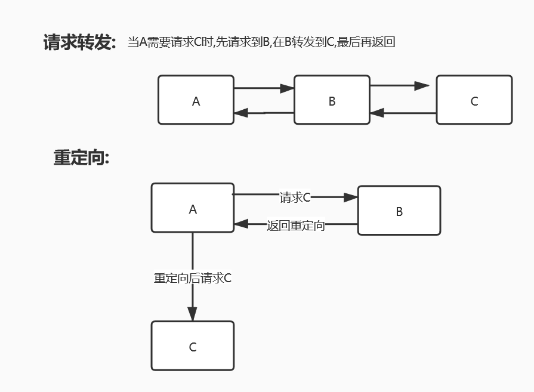
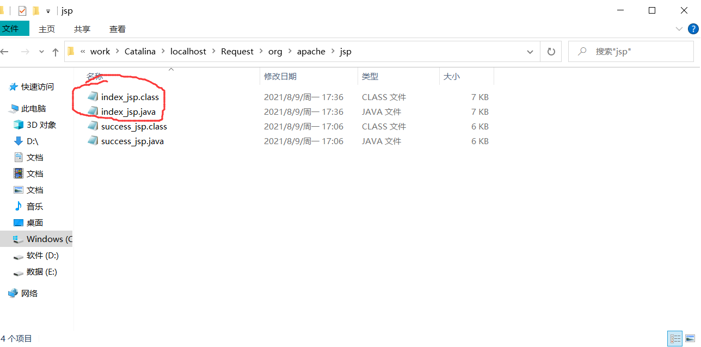
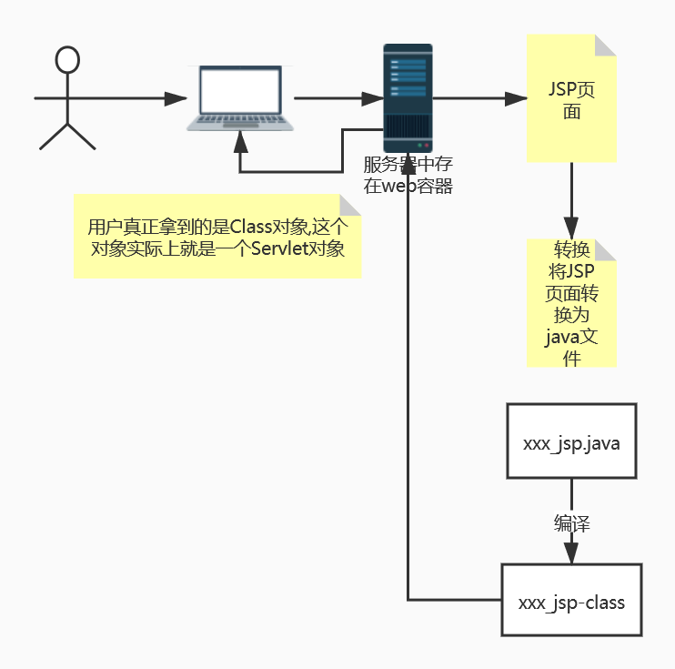

# JavaWeb

## 1、基本概念

### Web开发

#### 静态web

html ,css,提供可所有人看的数据不会发生变化

##### 缺点

* web页面无法动态更新
* 无法与数据库交互

#### 动态web

提供可别人的数据会发生变化

* 技术栈:Servlet/JSP ,ASP, PHP

##### 缺点

* 加入服务器的动态web资源出现了错误,我们需要编写**后他程序**重新发布

### web 应用程序

可以提供浏览器访问的程序

* html文件,css文件...等许多web资源
* 访问的资源或者页面都存在于世界上某个角落的计算机上
* URL
* JSP(Servlet)
* java程序
* jar包
* 配置文件(properties)

**web应用程序编写完毕之后,若想提供给外界访问,需要一个服务器来统一管理**


2、web服务器

### 1.技术简介

#### ASP

* 微软开发:国内最早流行的,使用C# IIS
* 在html 嵌入了VB脚本 ASP+COM
* 在ASP开发中基本一个页面都会有几千行页面代码
* 维护成本高

#### PHP

* PHP开发速度快,功能强大,跨平台,代码简单
* **无法承载大访问量的情况(局限性)**

#### JSP/Servlet

* sun公司主推的B/S架构 (B/S 浏览器和服务端,C/S 客户端和服务端)
* 基于java语言
* 可以承载三高(高并发,高性能,高可用)问题
* 语法像ASP

## 2.web服务器

### IIS 

微软的服务器,用来处理用户的一些请求和响应

### Tomcat

开源免费,属于轻量级服务器,适合java web初学者,是Servlet/JSP的容器,运行的实际上Servle和JS页面
*目录说明:*
**服务器核心配置文件位于conf/server.xml**


#### server.xml文件

#### 可配置端口号

* tomcat(默认端口号): 8080
* MySQL:3306
* http：80
* https:443

默认端口号在配置文件的


#### 可设置主机的名称

默认主机名在配置文件中的

**除此之外**还应该在修改主机名时还需要修改window的系统配置（即还要修改C盘:下的Windows目录下的System32目录下的drivers目录下的etc目录下的hosts文件)**才能成功**

**面试题：谈谈网站是如何进行访问的？**

1.输入域名，回车
2.检查本机的系统配置文件中有无此域名的隐射
有：直接返回对应的IP地址，在我们需要访问的web程序，直接可以访问
无：去DNS服务器找，找到就返回，没有就404

#### 发布一个网站

（1）将写的**网站放到webapps文件夹**下
（2）网站该有的结构
=> webapps 
　　->ROOT
　　->自己网站文件夹
　　　+WEB-INF
　　　　－classes:java程序
　　　　－lib :java所依赖的jar
　　　　－web.xml: 网站的配置文件
　　　＋index.html ：网站默认首页
　　　＋网站的其他文件

## 3、Http

**Http:**超文本传输协议（Hyper Text Transfer Protocol，HTTP）**是一个简单的请求-响应协议**，**它通常运行在TCP之上。**它指定了客户端可能发送给服务器什么样的消息以及得到什么样的响应。请求和响应消息的头以ASCII形式给出；而消息内容则具有一个类似MIME的格式。

* 文本:html,字符串
* 超文本:图片,音乐,时间,定位,地图...
  **Https:安全的http**  (safety 安全的)

#### 两个时代

* http 1.0 (即HTTP/1.0):客户端与web端链接后,只能获得一个web资源,然后断开链接
* http 2.0 (即HTTP/1.1):客户端与web端链接后,可以获得多个web资源

### 3.1 http请求

* 客户端->发请求(Request)->服务器

#### 1.1请求行

请求行包括了**http版本信息,请求方式,和资源路径**

* 请求方式**:get Post** , head,delete,put,tract
* 区别: 
  **->get请求能携带的参数少,大小有限制,会在URL地址栏显示数据内容,不安全,但是高效一点**
  　　　**->pose请求恰好与get相反　**
  　　如访问百度:

```apl
Request URL:https://www.baidu.com/        请求地址
Request Method:GET     get方法/pose方法
Status Code:200 OK       状态码
Remote Address:183.232.231.174:443   远程地址(即百度的地址加端口)
```

#### 1.2消息头

```apl
Accept:text/html  告诉浏览器,他所支持的数据类型
Accept-Encoding:gzip, deflate, br    支持哪种编码
Accept-Language:en-US,en;q=0.9   语言
Cache-Control:max-age=0      缓存控制
Connection:keep-alive    请求完成是断开还是保持连接
```

### 3.2 http响应

服务器->响应->客户端

#### 1.1响应头

```apl
Cache-Control:private   缓存控制
Connection:keep-alive   连接:保持链接
Content-Encoding:gzip   编码
Content-Type:text/html;charset=utf-8   响应体类型以及编码,
#当设置内容类型为 application/octet-stream时,设置如下响应头为下载文件的响应
Content-Disposition: attachment; filename=myfile.tx
```

#### 1.2响应体(和请求消息头差不多)

```apl
Accept:text/html  告诉浏览器,他所支持的数据类型
Accept-Encoding:gzip, deflate, br    支持哪种编码, 常用编码 GBK ,UTF-8 ,GB2312,ISO8850-1
Accept-Language:en-US,en;q=0.9   语言
Cache-Control:max-age=0      缓存控制
Connection:keep-alive    请求完成是断开还是保持连接
reFresh:告诉客户端多久刷新一次,如 reFresh: 3;url=http://www.itcast.cn ,三秒后跳转到指定的url
Location:让网页重新定位
```

#### 响应状态码

* 2xx: 请求响应成功
* 3xx:请求重定向
* 4xx:找不到资源 如404
* 5xx:服务器代码错误,如502,网关错误

## 4、Maven

#### 作用一：

maven主要是用来解决导入java类依赖的jar,编译java项目主要问题。(最早手动导入jar，使用Ant之类的编译java项目)
以pom.xml文件中dependency属性管理依赖的jar包，而jar包包含class文件和一些必要的资源文件。当然它可以构建项目，管理依赖，生成一些简单的单元测试报告。

#### 作用二：

比如之前项目导入jar。是通过copy方式导入项目中，而且还会存在jar之间的依赖和冲突。而maven解决了这些问题，只是网速不好的时候有点烦。使用私服nexus解决这个问题。

#### 作用三：

jar 包管理，防止jar之间依赖起冲突 。小组之间建立个私服务，大家都用通用 的maven配置文件，不用自己手动去下载jar ，pom文件会自动管理下载好的jar包。

#### 作用四：

Maven是基于项目对象模型，可以通过一小段描述信息来管理项目的构建，报告和文档的软件项目管理工具。Maven能够很方便的帮你管理项目报告，生成站点，管理jar文件，等等。例如：项目开发中第三方jar引用的问题，开发过程中合作成员引用的jar版本可能不同，还有可能重复引用相同jar的不同版本，使用maven关联jar就可以配置引用jar的版本，避免冲突。

### Maven的配置以及在idea中的设置

https://blog.csdn.net/lqy5679/article/details/119345758

### Maven 配置文件详解

https://www.cnblogs.com/zhoudaxing/p/11338183.html

## 5、Servlet

一种由sun公司开发的用动态web的技术


### Servlet生命周期


#### 初始化阶段(init)

当客户端向Servlet容器发出HTTP请求访问Servlet时，Servlet容器首先会解析请求，检查内存中是否已经有了该Servlet对象，如果有，直接使用该Servlet对象；如果没有，就创建Servlet实例对象，然后通过调用init()方法完成Servlet的初始化。需要注意的是，==在Servlet的整个生命周期内，它的init()方法只被调用一次。==


#### 运行阶段(service)

在这个阶段，Servlet容器会**为客户端请求创建请求对象和响应对象**，然后将**它们作为参数传递给Servlet的service()方法。service()方法从请求对象中获得客户端请求信息并处理该请求，通过响应对象生成响应结果。**

在Servlet的整个生命周期内，对于Servlet的每一次访问请求，Servlet容器都会调用一次Servlet的service()方法，并且创建新的请求和响应对象，也就是说，==service()方法在Servlet的整个生命周期中会被调用多次。==


#### 销毁阶段(destroy)

**当服务器关闭或web应用被移除出容器时**，Servlet随着web应用的销毁而销毁。在销毁Servlet之前，**Servlet容器会调用Servlet的destroy()方法，以便让Servlet对象释放它所占用的资源**。在Servlet的整个生命周期中，==destroy()方法也只被调用一次。==


1.创建一个普通的Maven项目,删除里面的src目录,新建Moudel;这个空
2.关于Maven父子工程的理解
父项目的xml配置文件中会有

```xml
<modules>
    <module>javaweb01_helloServlet</module>
  </modules>
```

子项目中会有parent标签(新版本会没有如Maven3.6)
*修改好pos.xml和web.xml配置文件*

**编写servlet一定要记得改配置文件web.xml注册servlet和映射**

标准模板如下:

```xml
<?xml version="1.0" encoding="UTF-8"?>

<web-app xmlns="http://xmlns.jcp.org/xml/ns/javaee"
  xmlns:xsi="http://www.w3.org/2001/XMLSchema-instance"
  xsi:schemaLocation="http://xmlns.jcp.org/xml/ns/javaee
                      http://xmlns.jcp.org/xml/ns/javaee/web-app_4_0.xsd"
  version="4.0"
  metadata-complete="true">
 
</web-app>
```


3.创建一个类,编写HelloServl程序

```java
public class HelloServlet extends HttpServlet {
//  由于get或者只是请求实现的不同方式,可以相互调用
    @Override
    protected void doGet(HttpServletRequest req, HttpServletResponse resp) throws ServletException, IOException {
        //获得响应输出流
        PrintWriter write = resp.getWriter();
        writer.print("Hello,Servlet");
    }

    @Override
    protected void doPost(HttpServletRequest req, HttpServletResponse resp) throws ServletException, IOException {
        super.doGet(req, resp);
    }
}
```

4.在web.xml中注册Servlet,编写Servlet的映射
  为什么要编写映射,我们写的是Java程序,而要通过浏览器需要链接web服务器,所以我们需要在web服务器器中注册我们写的Servlet,还需要给他一个浏览器能够访问的路径


### 5.1 Servlet Mapping映射

#### 方式一:在web.xml配置文件中注册servlet

1. 一个servlet 可以指定一个或多个映射,并且可以使用通配符(*)
2. 每个映射路径代表了浏览器URL地址栏的首页下的路径,Servlet用于接受这些请求,并且绑定一个用于处理请求做出响应的java程序
3. **注意:尽量不要使用 /* 这种映射路径,因为这样会覆盖掉首页**

```xml
<!--  注册Servle,可以注册多个,一个servlet代表一个请求响应-->;
  <servlet>;
    <servlet-name>hello</servlet-name>;
    <servlet-class>HelloServlet</servlet-class>;  <!--注意:有包名需要写包名    -->;
  </servlet>;
<!--  Servlet的映射,一个Servlet对应一个Servlet映射-->;
  <servlet-mapping>;
    <servlet-name>;hello</servlet-name>;
    <!--这个是路径是指 首页/hello,注意区分    -->;
    <url-pattern>;/hello</url-pattern>;
  </servlet-mapping>;

  <servlet-mapping>;
    <servlet-name>;hello</servlet-name>;
    <url-pattern>;/hello2</url-pattern>;
  </servlet-mapping>;
<!--使用通配符*-->;
  <servlet-mapping>;
    <servlet-name>;hello</servlet-name>;
    <url-pattern>;/hello/*</url-pattern>;
  </servlet-mapping>;
<!--  不要使用/*这种映射路径-->;
<!--  <servlet-mapping>;-->;
<!--    <servlet-name>;hello</servlet-name>;-->;
<!--    <url-pattern>;/*</url-pattern>;-->;
<!--  </servlet-mapping>;-->;
```

#### 方式二:使用注解@WebServlet注解注册servlet

**@WebServelt的属性:**

| String name              | 指定Servlet的name属性。如果没有显式指定，则该Servlet的取值即为类的全限定名。 |
| ------------------------ | ------------------------------------------------------------ |
| **String[] value**       | **该属性等价于urlPatterns属性。urlPatterns和value属性不能同时使用。** |
| **String[] urlPatterns** | **指定一组Servlet的URL匹配模式。**                           |
| int loadOnStartup        | 指定Servlet的加载顺序，                                      |
| WebInitParam[]           | 指定一组Servlet初始化参数。                                  |

例如: 下面的两段代码等效

在web.xml中

```xml
 <!--注册servlet -->
<servlet>
    <servlet-name>hello</servlet-name>
    <servlet-class>HelloServlet</servlet-class>  <!--注意:有包名需要写包名    -->
  </servlet>
<!--  Servlet的映射,一个Servlet可以对应多个Servlet映射-->
  <servlet-mapping>;
    <servlet-name>hello</servlet-name>;
    <!--这个是路径是指 应用上下文/hello,注意区分    -->
    <url-pattern>/hello</url-pattern>
  </servlet-mapping>
```

在servlet中

```java
 // 使用注解来注册servlet 
@WebServlet(name = "hello" ,value = "/hello")
public class HelloServlet extends HttpServlet {
//  由于get或者只是请求实现的不同方式,可以相互调用
    @Override
    protected void doGet(HttpServletRequest req, HttpServletResponse resp) throws ServletException, IOException {
        req.setCharacterEncoding("utf-8");
        //获得响应输出流
        resp.setCharacterEncoding("UTF-8");
        resp.setContentType("text/html;utf-8");
        PrintWriter writer = resp.getWriter();
        writer.print("java后台输出流!");
        System.out.println("进入了get方法");
    }
    @Override
    protected void doPost(HttpServletRequest req, HttpServletResponse resp) throws ServletException, IOException {
        super.doGet(req, resp);
    }
}

```


### 5.2 ServletContext

####  1.共享数据(用多了服务器会崩)

web容器启动的时候,他会为每个web程序都创建一个对应的ServletContext对象,他代表了当前的web应用:

* 共享数据:多个Servlet可以共享同一个ServletContext对象
  

如:HelloServlet中有一数据,而GetServlet中需要拿到并且打印此数据,代码如下

```java
public class HelloServlet extends HttpServlet {
    @Override
    protected void doGet(HttpServletRequest req, HttpServletResponse resp) throws ServletException, IOException {
//        this.getInitParameter()  //初始化参数, 也可以通过注解来配置
//        this.getServletConfig()  // 获得Servlet配置
//        this.getServletContext() //获得Servlet上下文
        //获得Servlet上下文对象
        ServletContext context = this.getServletContext();
        //数据
        String value = "雯雯";
        //注意! 其中第一个String参数为 属性名 , 第二个Object类型参数为属性的值
        context.setAttribute("username",value);

        System.out.println("Hello");
    }
    @Override
    protected void doPost(HttpServletRequest req, HttpServletResponse resp) throws ServletException, IOException {
        super.doGet(req, resp);
    }
}
```

```java
public class GetServlet extends HttpServlet {
    @Override
    protected void doGet(HttpServletRequest req, HttpServletResponse resp) throws ServletException, IOException {
        //获得共享的Servlet对象
        ServletContext context  = this.getServletContext();
        //设置响应头的文本类型
        resp.setContentType("text/html");
        //设置响应头的字符编码
        resp.setCharacterEncoding("UTF-8");
        //获得属性名为 username 的值
        String name = (String) context.getAttribute("username");
        //在响应页面打印数据
        resp.getWriter().println("名字:"+name);
    }
    @Override
    protected void doPost(HttpServletRequest req, HttpServletResponse resp) throws ServletException, IOException {
        super.doGet(req, resp);
    }
}
```

**配置文件web.xml为:**

```xml
<?xml version="1.0" encoding="UTF-8"?>;

<web-app xmlns="http://xmlns.jcp.org/xml/ns/javaee"
         xmlns:xsi="http://www.w3.org/2001/XMLSchema-instance"
         xsi:schemaLocation="http://xmlns.jcp.org/xml/ns/javaee
                      http://xmlns.jcp.org/xml/ns/javaee/web-app_4_0.xsd"
         version="4.0"
         metadata-complete="true">;
<!--注册HelloServlet的Servlet和其映射-->;
    <servlet>;
        <servlet-name>;hello</servlet-name>;
        <servlet-class>;ServletContext01.HelloServlet</servlet-class>;
    </servlet>;
    <servlet-mapping>;
        <servlet-name>;hello</servlet-name>;
        <url-pattern>;/hello</url-pattern>;
    </servlet-mapping>;
 <!--注册GetServlet的Servlet和其映射-->;   
    <servlet>;
        <servlet-name>;get</servlet-name>;
        <servlet-class>;ServletContext01.GetServlet</servlet-class>;
    </servlet>;
    <servlet-mapping>;
        <servlet-name>;get</servlet-name>;
        <url-pattern>;/get</url-pattern>;
    </servlet-mapping>;

</web-app>;
```

##### 2.获得初始化参数

1.首先在**web.xml**中配置初始化参数

```xml
 <!--设置web应用的初始化参数参数-->;
    <context-param>;
        <param-name>;url</param-name>;
        <param-value>;jdbc:mysql://localhost:3306/mybatis</param-value>;
    </context-param>;
```

2.编写Java程序

```java
public class ContextGetParameter extends HttpServlet {
    @Override
    protected void doGet(HttpServletRequest req, HttpServletResponse resp) throws ServletException, IOException {
    //获得上下文对象
        ServletContext con = this.getServletContext();
    //获得 参数名为 url 的 值
        String url = con.getInitParameter("url");
        // 使用响应页面的输入流打印 参数 url 的值
        resp.getWriter().println(url);
    }
    @Override
    protected void doPost(HttpServletRequest req, HttpServletResponse resp) throws ServletException, IOException {
        this.doGet(req, resp);
    }
}
```

3.在**web.xml**中注册Servlet以及参数

```xml
<servlet>;        
    <servlet-name>getParameter</servlet-name>;        
    <servlet-class>ServletContext01.ContextGetParameter</servlet-class>;    
</servlet>;    
<servlet-mapping>        
    <servlet-name>getParameter</servlet-name>
    <url-pattern>/getParam</url-pattern>  
</servlet-mapping>;
```

#### 3.请求转发



如下代码将通过 请求 /rd 转发到请求 /param
1.首先编写java程序

```java
public class ContextRequestDispatcher extends HttpServlet {    
    @Override    
    protected void doGet(HttpServletRequest req, HttpServletResponse resp) throws ServletException, IOException {        
        ServletContext con = this.getServletContext();        
        // 获得 /getParam 的请求转发        
        RequestDispatcher requestDispatcher = con.getRequestDispatcher("/getParam");        // 将本次请求响应转发 为 /getParam ,即本次请求相当于请求到 /Param 
        requestDispatcher.forward(req,resp);    
    }    
        @Override    
    protected void doPost(HttpServletRequest req, HttpServletResponse resp) throws ServletException, IOException {        
        this.doGet(req, resp);;    
    }
}
```

2.配置文件**web.xml**注册Servlet以及映射

```xml
<servlet>;        <
    servlet-name>;ResquestDispatcher</servlet-name>;       
    <servlet-class>;ServletContext01.ContextRequestDispatcher</servlet-class>;    </servlet>;    
<servlet-mapping>;        
    <servlet-name>;ResquestDispatcher</servlet-name>;        
    <url-pattern>;/rd</url-pattern>;    
</servlet-mapping>;
```

#### 4.获取资源

可能会出现的问题:
当配置文件 如aa.properties文件可能**不在resource目录下(在java目录下)时**,可能在打包的时候无法将其打包
**解决方案: **在本项目的配置文件pom,xml下build标签下的resources标签中添加配置

```xml
<resource>;              
    <filtering>;true</filtering>;              
    <directory>;src/main/java</directory>;              
  <includes>;                  	     
      <include>;**/*.properties</include>;                  
      <include>;**/*.xml</include>;             
    </includes>;          
</resource>;
```

如下所示代码,为获取 db.properties中的数据(此文件在src/resource目录下),并且打印在响应页面下

1.首先编写java程序

```java
public class ServletProperties extends HttpServlet {    @Override    protected void doGet(HttpServletRequest req, HttpServletResponse resp) throws ServletException, IOException {        ServletContext con = 					this.getServletContext();        
// 获得 db 配置文件的输入流,注意! ,配置文件在打包后一定是在相对路径 classes 目录下的
	InputStream in = con.getResourceAsStream("/WEB-INF/classes/db.properties");        
//创建一个配置文件
	Properties properties = new Properties();        
// 将 db输入流写入 新建的配置文件        
properties.load(in);        
//在响应页面打印配置文件的数据        
	String name = properties.getProperty("username");       String password = properties.getProperty("password");     resp.getWriter().println(name+":"+password);    
}    
                                                    @Override                                                 protected void doPost(HttpServletRequest req, HttpServletResponse resp) throws ServletException, 	IOException {                                                   his.doGet(req, resp);    
  }
}
```

2.在配置文件web.xml中注册servlet以及映射

```xml
<servlet>;        
    <servlet-name>;getResource</servlet-name>;       	       <servlet-class>
    ServletContext01.ServletProperties
    </servlet-class> 
</servlet>;    
<servlet-mapping>;        
    <servlet-name>;getResource</servlet-name>;        		<url-pattern>;/resource</url-pattern>;    
</servlet-mapping>;
```


### 5.3 HttpServletRequest

HttpServletRequest代表客户端的请求,用户通过Htt协议访问服务器,HTTP请求中的所有信息会被封装到HttpServletRequest中,通过HttpServel的方法获得客户端的一些信息

#### 1.获取前端传递的参数

```java
String username = req.getParameter("username");       
String password = req.getParameter("password");        
String[] hobbies = req.getParameterValues("hobby");
```

#### 2.请求转发

```java
RequestDispatcher requestDispatcher=request.getRequestDispatcher(path);
requestDispatcher.forward(request,response);
```


### 5.4 HttpServletRespond

web服务器接受到客户端的http请求,针对这个请求,分别创建一个代表请求和响应的的对象,即HttpServletRequest和HttpServletRespond

* 如果要获取客户端请求过来的参数找:HttpServletRequest
* 如果要给客户端响应一些信息,找:HttpServletRespond

#### 1.简单分类

负责向浏览器发送数据的方法

```java
ServletOutputStream getOutputStream();
PrintWriter getWriter();
```

负责向浏览器发送响应头的方法

```java
void setCharacterEncoding(String var1);
void setContentLength(int var1);
void setContentLengthLong(long var1);
void setContentType(String var1);
void addDateHeader(String var1, long var2);
```

#### **2.下载文件**

```java
public class DemoRespond  extends HttpServlet{
    @Override    
  protected void doGet(HttpServletRequest req, HttpServletResponse resp) throws IOException {
      //        String realPath = this.getServletContext().getRealPath("\常用命令.txt");  //不能这样,因为这是Tomcat的相对路径        
      String realPath = "E:/Code/Java_idea/HellServlet/Respond/src/main/resources/常用命令.txt";        
      System.out.println("文件路径:"+realPath);        
      //重点!!!!:确定文件名,截取路径下最后一个/下的内容肯定是文件名        
      String filename = realPath.substring(realPath.lastIndexOf("/")+1);        
      //百度上找.下载文件的消息头,不过要注意文件名是中文的问题               
      resp.setHeader("Content-Disposition", "attachment; filename="+URLEncoder.encode(filename,"utf-8"));         
      //获得文件的输入流        
      FileInputStream in_file= new FileInputStream(realPath);       
      //获得响应页面的输出流        
      OutputStream out = resp.getOutputStream();        
      int len;        byte[] buf = new byte[1024];        			            	           while((len=in_file.read(buf))!=-1){   
          //将文件信息暂存到缓存数组中            
          out.write(buf,0,len);       
          //将缓存数组中文件信息输出到响应页面        
      }        
      out.close();        
      in_file.close();    
  }    
    @Override    
  protected void doPost(HttpServletRequest req, HttpServletResponse resp) throws ServletException, IOException {        
      this.doGet(req, resp);    
  }
}
```

在编写好后在web.xml文件中注册servlet以及其映射

#### 3.实现图片验证码

```java
public class Demo extends HttpServlet {    
    @Override    
protected void doGet(HttpServletRequest req, HttpServletResponse resp) throws ServletException, IOException {       
    //每隔5秒刷新一次        
    resp.setHeader("refresh","5");        
    BufferedImage image = new BufferedImage(80,20,BufferedImage.TYPE_3BYTE_BGR);             //设置图片底部颜色        
    Graphics2D g = (Graphics2D) image.getGraphics();  //画笔        
    g.setColor(Color.white);        
    g.fillRect(0,0,80,20);  //填充形状        
    //设置画验证码的画笔格式        
    g.setColor(Color.CYAN);        
    g.setFont(new Font(null,Font.BOLD,20)); //设置字体         
    g.drawString(makeNum(),0,20); //画字符串        
    //告诉浏览器用图片格式打开        
    resp.setContentType("image/jpeg");       
    //不让浏览器缓存        
    resp.setDateHeader("expires",-1);       
    resp.setHeader("Cache-Control","no-cache");    
    resp.setHeader("Pragma","no-cache");        
    //向响应页面输出图片        
    ImageIO.write(image,"jpg",resp.getOutputStream());    }    
    //生成随机数验证码    
    String makeNum(){
        Random random = new Random();        
        String num =  random.nextInt(999999)+"";        
        //补齐为6位数的验证码        
        StringBuffer sb = new StringBuffer();        
        for (int i = 0; i < 6-num.length(); i++) {           
            sb.append("0");        
        }        
        num = sb.toString()+num;        
        return num;    }    
    @Override    
    protected void doPost(HttpServletRequest req, HttpServletResponse resp) throws ServletException, IOException {        
        this.doGet(req, resp);    
    }
}
```

在编写好java程序后在web.xml文件中注册Servlet以及其映射

#### 4.实现响应重定向


常见场景: 用户登陆

```java
public class Respond_Redirect extends HttpServlet {    @Override    
    protected void doGet(HttpServletRequest req, HttpServletResponse resp) throws ServletException, IOException {    
        //注意重定向一定要写出项目路径
        resp.sendRedirect("/Respond/down");        
        /* 重定向拆分 */       
        /*resp.setHeader("Location","/Respond/down"); resp.setStatus(302);*/          
       
    }    
  @Override   
    protected void doPost(HttpServletRequest req, HttpServletResponse resp) throws ServletException, IOException {        
        this.doGet(req, resp);    
    }
}
```


### 重定向与请求转发的区别

* 相同点: 两者都会发生跳转
* 不同点: 请求转发url地址栏不会发生变化;而重定向会发生变化

**重定向和请求转发路径问题总结：**

1、重定向的 / 表示：http://服务器ip:端口/

2、请求转发的 / 表示：http://服务器ip:端口/项目名

怎么记忆呢，很简单，重定向是浏览器发来的，只知道发到某个服务器，但是不知道发到服务器的哪个project，所以需要自己用代码声明； 而请求转发是服务器某个project内部的转发，转来转去都是在某个project内部，所以不需要手动声明项目名。


## 7. Cookie、Session

### 7.1 Cookie


#### 7.1.1 简述

**客户端技术(响应,请求)**
**cookie::一般保存在本地的用户路径下如appdata;**

#### 7.1.2 注意事项:

上限大小问题:
* 一个cookie只能保存一个信息;
* 一个web网站点可以给浏览器发送多个cookie,最多存放20个cookie
* cookie有大小限制4kb
* 300个cookie浏览器上限
删除cookie:
* 不设置有效期(maxAge),关闭浏览器,自动失效;
* 设置有效器时间为0;

#### 7.1.3 应用

##### 常用方法

1.从请求中拿到cookie信息
2.服务器响应给客户端cookie
**3.Cookie中的的内容有 Cookie(String name, String value)**

```java
cookie.setMaxAge(int expiry); //设置有效期
cookie.getName(); 
cookie.getVaule;
```
如下是测试访问网站的时间的Deom
```java
 //设置编码
req.setCharacterEncoding("utf-8");
resp.setCharacterEncoding("utf-8");
resp.setContentType("text/html");
//过去响应页面的输出流
ServletOutputStream out = resp.getOutputStream();
//获得浏览器请求发送的cookie
Cookie[] cookies = req.getCookies();
//判断是否为第一次访问次网站.如果不是第一次则显示上次访问的时间,是第一次次则显示第一次访问
        if (cookies!=null){
            for (int i = 0; i < cookies.length; i++) {
                Cookie cookie = cookies[i];
                if(cookie.getName().equals("LastLogin")){  //判断cookie是否为自己上一次添加的,是则向响应写入cookie中记录的时间
                    long time = Long.parseLong(cookie.getValue());  //将cookie中的值解析为 long
                    Date date = new Date(time);  //根据cookie中解析的值创建一个时间
                    out.write(date.toString().getBytes(StandardCharsets.UTF_8));  //向响应页面写入时间,并且注意编码
                }
            }
        }
        else{
            byte[] str = "这是您第一次访问本站!".getBytes("utf-8");
            out.write(str);
        }
        //每次访问之后会添加一个cookie,代表本次已经访问过,并且记录访问时的时间 
resp.addCookie(new Cookie("LastLogin",System.currentTimeMillis()+""));
```
#### 拓展:编码解码解决中文乱码问题
```java
URLEncoder.encode("中文","utf-8");  //编码
URLDecoder.decode(cookie.getValue(),"utf-8");  //解码
```

### 7.2 Session(重点)


#### 7.2.1 简述

什么是session:
* 浏览器一旦访问服务端就会创建一个Session对象
* 一个Session独占一个浏览器,只有浏览器没关,这个Session就存在
* 用户登陆后,整个网站都会处于登陆状态如:保存用户信息,保留购物车信息...
* 服务端技术,利用这个技术,可以保存用户的会话信息,我们可以把信息或者数据放在Session中


#### 获取Session

```java
request.getSession(); // 获取请求头的Session

request.getSession(boolean create); 
//当 create为true时,等同于 request.getSession(), 会创建一个Session返回
//当 create为false时, 若当前会话状态已经过过期或者不存在,则返回一个null
```

使用建议: 

**存数据:**使用`getSession()`

**取数据:** `getSession(boolean create)`


#### 7.2.2应用

#### 1.使用场景:

* 保存一个登陆用户的信息;
* 购物车信息
* 在整个网站中经常会使用的数据

#### 2.常用方法

1.Session 浏览器会存在一个JSESSIONID,用于标识唯一的Session对象
2.Session中存储的内容是 Session(String name,Object value),**可以存储对象**

```java
session.setAttribute(String name,Object value);  //设置属性,属性包括name , value
session.getAttribute(String name)  //根据参数name属性名返回对象属性的value
 setMaxInactiveInterval(int s);  //设置有效期,单位为秒!!!
 session.invalidate();  //注销session
 session.isNew(); //判断的是否为新创建的
```
此外还可以**通过配置web.xml文件定时注销Session** , Tomcat的默认销毁时间是30分钟
```xml
<session-config> 
<!--注意:这种方式注销的单位为分钟-->
    <session-timeout>1440</session-timeout></session-config>
```
#### 3.创建
```java
//在创建一个Session时做了哪些事
Cookie cookie = new Cookie("JSESSIONID",sessionId);
resp.addCookie(cookie);
```
如下Demo,第一个Servlet是创建一个Session,第二个是获取Session的属性值,第三个是注销Session
```java
public class SessionDemo extends HttpServlet {
    @Override
    protected void doGet(HttpServletRequest req, HttpServletResponse resp) throws ServletException, IOException {
        //设置编码
        req.setCharacterEncoding("utf-8");
        resp.setCharacterEncoding("utf-8");
        resp.setContentType("text/html");
        //获得请求的Session
        HttpSession session = req.getSession();
        //设置属性
        session.setAttribute("name","南城");
        //判断Session是不是新创建了
        if(session.isNew()){
            resp.getWriter().println("session已经创建成功"+session.getId());
        }
        else {
            resp.getWriter().println("session在服务器存在:"+session.getId());
        }
    }
    @Override
    protected void doPost(HttpServletRequest req, HttpServletResponse resp) throws ServletException, IOException {
        this.doGet(req, resp);
    }
/*************************分割线**************************/
public class Session_get extends HttpServlet {
    @Override
    protected void doGet(HttpServletRequest req, HttpServletResponse resp) throws ServletException, IOException {
       req.setCharacterEncoding("utf-8");
       resp.setCharacterEncoding("utf-8");
       resp.setContentType("text/html");
       //获得请求的Session
       HttpSession session = req.getSession();
        //得到Session属性名为 name 的value
       Object name =(String) session.getAttribute("name");
       System.out.println(name);
       resp.getWriter().println("服务器中session中name属性的值为:"+name);
    }
    @Override
    protected void doPost(HttpServletRequest req, HttpServletResponse resp) throws ServletException, IOException {
        this.doGet(req, resp);
    }
}
/*************************分割线**************************/
public class Session_invalidate extends HttpServlet {
    @Override
    protected void doGet(HttpServletRequest req, HttpServletResponse resp) throws ServletException, IOException {
        HttpSession session = req.getSession();
        //session.removeAttribute("name"); //注意!移除属性名为name 的属性,session还是原来那个session
        //注销session
        session.invalidate();
    }
    @Override
    protected void doPost(HttpServletRequest req, HttpServletResponse resp) throws ServletException, IOException {
        this.doGet(req, resp);
    }
}
```
### 7.3 Session和Cookie的区别

* Cookie是把用户的数据写给用户的浏览器,浏览器保存(可保存多个)
* Session是把用户的数据写到用户独占的Session中,服务端保存(保存重要信息,减少服务器资源的浪费)
* Session对象由服务器创建


## 8、JSP

### 8.1 JSP简述

#### 什么是JSP

Java Server Pages:java服务端页面,也和Servlet一样,用于动态web技术
最大的特点:
* 写JSP就像写HTML
* 区别:
 - HTML只给用户提供静态信息
 - JSP页面中可以嵌入java代码,为用户提供动态数据

#### JSP原理

思路:JSP怎么执行的
* 服务器内部工作
tomcat中有一个word目录;
idea中使用Tomcat会在Idea中的tomcat中的生成一个项目的word下目录,目录如下:
**发现页面index.jsp转换成了java程序**
```java
C:＼Users＼Lenovo＼AppData＼Local＼JetBrains＼IntelliJIdea2021.1＼tomcat＼f25921c3-8f82-45ba-a1a3-0cd5e3df0ff2＼work＼Catalina＼localhost＼w1＼org＼apache＼jsp
```


**浏览器向服务器中发送请求,不管访问什么资源,其实都是在访问Servlet!**
JSP最终也会被转换成java类!
JSP本质上就是个Servlet *源码如下*

1.判断请求

```java
//初始化
public void _jspInit() {
    }
//销毁
public void _jspDestroy() {
    }
public void _jspService(final javax.servlet.http.HttpServletRequest request, final javax.servlet.http.HttpServletResponse response)
      throws java.io.IOException, javax.servlet.ServletException {
    if (!javax.servlet.DispatcherType.ERROR.equals(request.getDispatcherType())) {
      final java.lang.String _jspx_method = request.getMethod();
      if ("OPTIONS".equals(_jspx_method)) {
        response.setHeader("Allow","GET, HEAD, POST, OPTIONS");
        return;
      }
      if (!"GET".equals(_jspx_method) && !"POST".equals(_jspx_method) && !"HEAD".equals(_jspx_method)) {
        response.setHeader("Allow","GET, HEAD, POST, OPTIONS");
        response.sendError(HttpServletResponse.SC_METHOD_NOT_ALLOWED, "JSP 只允许 GET、POST 或 HEAD。Jasper 还允许 OPTIONS");
        return;
      }
    }
```
2.内置一些对象下面的对象我们可以直接在JSP页面中直接使用!

```java
final javax.servlet.jsp.PageContext pageContext;  //页面上下文
javax.servlet.http.HttpSession session = null;  //Session会话
final javax.servlet.ServletContext application;    //本质就是ServletContext
final javax.servlet.ServletConfig config;
javax.servlet.jsp.JspWriter out = null;     //输出到页面的对象
final java.lang.Object page = this;            //当前
final javax.servlet.http.HttpServletRequest request
final javax.servlet.http.HttpServletResponse response
```

3.输出页面前加了的代码
```java
//设置响应类型
response.setContentType("text/html");
pageContext = _jspxFactory.getPageContext(this, request, response,null, true, 8192, true);
_jspx_page_context = pageContext;
application = pageContext.getServletContext();
config = pageContext.getServletConfig();
session = pageContext.getSession();
out = pageContext.getOut();
_jspx_out = out;
```

在JSP页面中,只要是Java代码,就会原封不动的输出:
如果是HTML代码,就会被转换为:
```java
out.write("＜html＞＼r＼n");
```
这样的格式输出到前端

### 8.3 JSP基础语法

JSP作为Java的技术除了必须支持Java的所有语法外,还有自己的语法

#### 1.jsp表达式

用来将程序的输出,输出到客户端 
相当于在Servlet中书写了 out.print(变量或者表达式),为了查看清晰,通常可用${变量或者表达式代替}
```java
<%  Java代码 %>     //可在html中嵌入Java代码
<%= 变量或者表达式 %>   // 会在html中打印变量或者表达式的值
<%= new Date()%>  //在html页面打印时间
<%! 声明,相当于在jsp的类里声明一些东西,如方法和成员变量和静态变量 %>
<%-- 注释 --%>
```
#### 2.jsp的脚本片段
```java
<%
    int sum = 1;
    for (int i = 1; i <= 100; i++) {
      sum+=i;
    }
// 内置对象 out 相当于 resp.getWriter
    out.println("<h2>sum="+sum+"</h2>");
%>
<%--脚本拼接,可将多个脚本片段拼接起来--%>
  <%
    int x = 10;
    out.print(x);
  %>
<p>脚本片段</p>
  <%
    int y=20;
    out.print(y);
  %>
```
#### 3.JSP的声明(作用域)
```java
<!％　
此处的代相当于放在Servelt中的类体里面,其他脚本代码放在 _jspService()方法中
％>
```
#### 4.JSP语法小结

```java
<%java代码%>  
<!% 声明 %>
<%=变量或者表达式%>  通常可用${变量或者表达式代替}
<%--注释--%>  JSP中的注释在前端页面不可见,只在源码中可见
```

### 8.4 JSP指令

#### 1.定制错误页面

```jsp
<%--定制错误页面,其中error为文件路径--%>
<%@page errorPage="error/500.jsp" %>   
```
此外还可以通过配置web.xml配置来定制
```xml
<!--定制错误页面-->
    <error-page>
        <error-code>404</error-code>
        <location>/error/404.jsp</location>
    </error-page>
    <error-page>
        <error-code>500</error-code>
        <location>/error/500.jsp</location>
    </error-page>
```
#### 2.设置网站头部尾部

引入文件指令
```jsp
<%--不常用,讲其他包含文件的内容直接out.write(文件内容)的形式合并,本质上已经合并成一个文件,耦合度较高--%>
    <%@include file="common/header.jsp" %>
    <h1>我是网站主体</h1>
    <%@include file="common/footer.jsp"%>
```
如上代码在jsp.java源码中的的实现原理为将要包含文件的内容以**out.write()的方式**解析到jsp
```java
out.write("  <h1>我是头部</h1>\r\n");
      out.write("</body>\r\n");
      out.write("</html>\r\n");
      out.write("\r\n");
      out.write("    <h1>我是网站主体</h1>\r\n");
      out.write("    ");
      out.write("\r\n");
      out.write("\r\n");
      out.write("<html>\r\n");
      out.write("<head>\r\n");
      out.write("    <title>Title</title>\r\n");
      out.write("</head>\r\n");
      out.write("<body>\r\n");
      out.write("    <h1>我是尾部</h1>\r\n");
```
使用JSP标签引入文件
```jsp
<%--JPS标签,本质上还是三个页面,页面直接不相互影响--%>
<%--    <jsp:include page="文件路径"></jsp:include>--%>
    <jsp:include page="common/header.jsp"></jsp:include>
    <h1>我是网站主体</h1>
    <jsp:include page="common/footer.jsp"></jsp:include>
```
其源码实现为:
```java
org.apache.jasper.runtime.JspRuntimeLibrary.include(request, response, "common/header.jsp", out, false);
      out.write("\r\n");
      out.write("    <h1>我是网站主体</h1>\r\n");
      out.write("    ");
      org.apache.jasper.runtime.JspRuntimeLibrary.include(request, response, "common/footer.jsp", out, false);
```

### 8.5 内置对象和作用域
#### 9大内置对象
* PageContext
* Request
* Respond
* Session
* Application(即ServletContext)
* config (即ServletConfig)
* out
* page  (不常用)
* exception

#### 四大作用域
如在一个页面中设置一些信息如下
```java
pageContext.setAttribute("name1", "object1");   //数据只在一个页面中有效
    request.setAttribute("name2", "object2");    //在一个请求中有效,转发请求会携带这个数据
    session.setAttribute("name3", "object3");   //有一次会话中有效.从打开浏览器到关闭
    application.setAttribute("name4", "object4");  //只在服务器中有效,从打开服务器到关闭服务器,相当于ServletContext对象,整个web应用共享的对象
```
在另一个页面获取前上面页面设置的信息:
```jsp
<%--发现只能取出3和4,是双亲委派机制,即先从父级作用域获取没有,在从自己作用域获取--%>
<h1>取出的值为:</h1>
<h3>${name1}</h3>
<h3>${name2}</h3>
<h3>${name3}</h3>
<h3>${name4}</h3>
<h3>${name5}</h3>
```
request:比如新闻,用户看完就没用了
Session:用户用完一会还有用,如购物车,登陆信息
application:一个用户用完了其他用户还能用,如在某网站下载一些文件

### 8.6 JSP标签,JSTL标签,EL表达式

#### EL表达式${}
* 获取数据
* 执行运算
* 获取web开发的常用对象

#### JSP标签
```jsp
<jsp:forward page="jsptag2.jsp">   <%--请求转发--%>
    <jsp:param name="name1" value="value1"/>    <%--设置参数--%>
    <jsp:param name="name2" value="value2"/>
</jsp:forward>
```
#### JSTL 标准标签库
**核心标签库**
*了解就够即可*
菜鸟教程:https://www.runoob.com/jsp/jsp-jstl.html
使用步骤:
(1)引入核心标签库对应的taglib(报错可能是因为服务器没有jstl标签的依赖包)

```jsp
<%@ taglib prefix="c" uri="http://java.sun.com/jsp/jstl/core" %>
```
(2)使用其中的if和out 标签
```jsp
<form action="JSTLDemo01.jsp" method="get">
<%--    EL表达式获取表单中的数据--%>
    <input type="text" name="username" value="${param.username}">
    <input type="submit" value="登陆">
</form>
<%--判断参数username的值,并且定义一个变量 名为:isAdmin.值为这个if语句的值--%>
<c:if test="${param.username=="admin"}" var="isAdmin"/>
    <c:out value="管理员欢迎您!" />
<c:out value="${isAdmin}"></c:out>
```


## 9、javaBean

实体类要求
JavaBean有特定的写法

* 必须有无参构造
* 属性必须私有化（private）
一般用来和数据库的字段做映射
ORM : 对象关系映射
* 表 -->类
* 字段-->属性
* 行记录-->对象
```jsp
<jsp:useBean id="Student" class="com.pojo.Student"/>
    <jsp:setProperty name="Student" property="stuNO" value="001"></jsp:setProperty>
    <jsp:setProperty name="Student" property="name" value="lili"></jsp:setProperty>
    <jsp:setProperty name="Student" property="age" value="18"></jsp:setProperty>

    学号:<jsp:getProperty name="Student" property="stuNO"/>
    姓名:<jsp:getProperty name="Student" property="name"/>
    年龄:<jsp:getProperty name="Student" property="age"/>
```

*(存在一个小问题！找不到实体类)*


## JDBC(重点)

***


#### JDBC介绍

Sun公司为了简化开发人员的(对数据库的统一)操作,提供了(Java操作数据库的)规范,俗称JDBC,这些规范的由具体由具体的厂商去做
对于开发人员来说,我们只需要掌握JDBC接口的操作即可

#### 所需要的jar包

* java.sql(默认有)
* javax.sql(默认有)
  还需要导入数据库驱动包

#### java程序链接mySQL

**步骤:**

1. 加载驱动
2. 登陆链接数据库对象
3. 创建statement对象,用于执行sql语句   statement(清单)
4. 执行sql语句
5. 返回结果集,结果集中封装了我们查询的所有结果
6. 释放链接

```java
 // 1.加载驱动
        Class.forName("com.mysql.cj.jdbc.Driver");
                      //协议://主机:端口/数据库名?编码设置&使用安全的链接
        String url = "jdbc:mysql://localhost:3306/db01?useUnicode=true&characterEncoding=utf8&useSSL=true";
        String use = "root";  //用户名
        String password = "123456";  //密码
        //2.登陆链接数据库对象
        Connection connection = DriverManager.getConnection(url, use, password);
        //3.创建statement对象,用于执行sql语句   statement(清单)
        Statement statement = connection.createStatement();
        //4.执行sql语句
        String sql = "SELECT * from class"; //sql语句
        //5.返回结果集,结果集中封装了我们查询的所有结果
        ResultSet resultSet = statement.executeQuery(sql);

        while (resultSet.next()){
            System.out.println("classno:"+resultSet.getNString("classno"));
            System.out.println("classname:"+resultSet.getNString("classname"));
            System.out.println("department:"+resultSet.getNString("department"));
            System.out.println("monitor(班长):"+resultSet.getNString("monitor(班长)"));
            System.out.println("==========================================================");
        }
        //6.释放链接
        resultSet.close();
        statement.close();
        connection.close();
    }
}
```

#### 几个重要对象

**DirverManager 驱动管理**                    

```java
Class.forName("com.mysql.jdbc.Driver");
DriverManager.registerDriver(new Driver()); //这是Driver源码
```

**URL 资源地址**

```java
//协议://主机:端口/数据库名?编码设置&使用安全的链接
String url = "jdbc:mysql://localhost:3306/db01?useUnicode=true&characterEncoding=utf8&useSSL=true";
```

**Connection 链接对象,操作数据库的对象**

```java
connection.commit();  //提交事务
connection.rollback();   //回滚事务
connection.setAutoCommit();  //自动提交事务

**Statemen 清单,执行sql的对象**
```java
statement.executeQuery("sql");   //执行查询,返回结果集
statement.executeUpdate("sql");  //执行更新(插入和删除也算更新),返回受影响的行数
statement.execute("sql");  //执行全部的sql语句
```

**ResultSet:查询后的结果集**

获取数据:

```java
resultSet.getNString();
resultSet.getObject();  //不知道什么类型的情况下使用
resultSet.getInt();
resultSet.getDate();
resultSet.getFloat();
```

指针移动:

```java
resultSet.next();
resultSet.previous();
resultSet.absolute();
resultSet.beforeFirst();
resultSet.afterLast();
```

关闭链接

```java
resultSet.close();
statement.close();
connection.close();
```


### JDBC工具类

为了方便使用,我们一般会将其封装成一个工具类

```java
package jdbcUtility;

import java.io.IOException;
import java.io.InputStream;
import java.sql.*;
import java.util.Properties;

public class JdbcUtilityDemo {
//从配置文件db.properties中加载信息
    static InputStream in = JdbcUtilityDemo.class.getClassLoader().getResourceAsStream("db.properties");
    static Properties pro = new Properties();
    static Statement statement;
    static Connection con;
    //从配置文件中初始化配置
    static {
        try {
            pro.load(in);   //将配置文件的信息加载到 pro对象中
            Class.forName(pro.getProperty("driver"));  //通过类反射加载驱动
            //获得参数
            String url = pro.getProperty("url");
            String user = pro.getProperty("user");
            String password = pro.getProperty("password");
            //设置链接参数
            con = DriverManager.getConnection(url,user,password);
            statement = con.createStatement();
        } catch (Exception e) {
            e.printStackTrace();
        }
    }
    //查询
    public  ResultSet select(String sql)  {
        ResultSet resultSet  = null;
        try {
            resultSet = statement.executeQuery(sql);
            if (resultSet.next()) {
                System.out.println("查询成功!");
            }
            else{
                System.out.println("查询失败!"); return null;
            }
        } catch (SQLException throwable) {
            System.out.println(throwable.toString());
        }
        while (true){
            if(resultSet==null) return null;
            try {
                System.out.print("id:"+resultSet.getObject(1)+"\t");
                System.out.print("password:"+resultSet.getObject(2)+"\t");
                System.out.print("name:"+resultSet.getObject(3)+"\t");
                System.out.print("sex:"+resultSet.getObject(4)+"\t");
                System.out.print("birthday:"+resultSet.getObject(5)+"\t");
                System.out.println("\n");
                if (!resultSet.next()) break;
            } catch (SQLException throwable) {
                System.out.println(throwable.toString());
            }
        }
        return resultSet;
    }

    //更新,包括插入和删除
    public int update(String sql) {
        int n = 0;
        try {
            n = statement.executeUpdate(sql);
        } catch (SQLException throwables) {
            throwables.printStackTrace();
        }
        if(n>0){
            System.out.println("修改成功!"+"\n");
        }
        else System.out.println("修改失败");
        return n;
    }
    public void execSQL(String sql){
        try {
            if (statement.execute(sql)) {
                System.out.println("执行成功!");
            }
            else System.out.println("执行失败");
        } catch (SQLException throwable) {
            System.out.println(throwable.toString());
        }
    }
    public static void close(){
        try {
            statement.close();
            con.close();
            in.close();
        } catch (Exception throwables) {
            throwables.printStackTrace();
        }
    }
}
```

其中db.properties文件信息如下:

```properties
driver=com.mysql.cj.jdbc.Driver
url=jdbc:mysql://localhost:3306/db01?useUnicode=true&characterEncoding=utf-8&useSSL=true
user=root
password=123456
```


### SQL注入的问题

SQL注入即是指web应用程序对用户输入数据的合法性没有判断或过滤不严，攻击者可以在web应用程序中事先定义好的查询语句的结尾上添加额外的SQL语句，在管理员不知情的情况下实现非法操作，以此来实现欺骗数据库服务器执行非授权的任意查询，从而进一步得到相应的数据信息。
**即:通过sql语句的漏洞来实现一些非法操作.**

```sql
// 欲根据用户id来进行获取用户的其他信息,但是使用如下语句就会将所有用户的信息都查询到
select * from db01.user where (id =' 'or 1=1)";   --sql注入
```

#### PreparedStatement对象

可以防止sql注入,并且效率更高,如:**在编辑sql语句时使用?代表占位符,并且预编译sql语句,随后在设置参数防止sql注入**

##### 常用方法:

```java
preparedStatement.executeQuery();
preparedStatement.executeUpdate();
preparedStatement.setString(); //给参数传递字符串类型的值
preparedStatement.setInt();  //给参数传递 int 类型的值
preparedStatement.setDate();  //给参数传递 Date 类型的值
... 等等
```

例子:

```java
//带参数的sql语句
String sql = "select * from db01.user where(id = ?)" ;
//预编译sql语句并且返回一个PreparedStatement对象
preparedStatement = con.prepareStatement(sql);
//给参数传递值(适当的使用对应类型的方法能提高效率)
preparedStatement.setString(1,id);
//运行sql语句
resultSet = preparedStatement.executeQuery();
```

### JDBC操作事务

#### 常用方法

```java
connection.setAutoCommit(boolean flag); //设置事务是否自动提交,默认是提交的
connection.commit(); //提交事务
connection.rollback(); //回滚事务,一般不用设置,事务一般发送错误会自动回滚
```

下面代码是模拟一笔转账操作,A账户减少100元,B账户增加100元,两个sql操作为一个事务,同时执行成功或者失败(失败事务发生回滚)

```java
 JdbcUtility jdbc = new JdbcUtility();
 try {
     //关闭自动提交事务
     jdbc.con.setAutoCommit(false);
     //进行一笔转账操作,其中update()方法,参数1代表付款或者收款人,参数2代表是否收款
     jdbc.update("A",true);
     jdbc.update("B",false);
     //提交一笔转账事务
     jdbc.con.commit();
     
 } catch (SQLException throwables) {
     try {
         //实际上事务会自动回滚当出现错误时
         jdbc.con.rollback();
     } catch (SQLException e) {
         e.printStackTrace();
     }
     throwables.printStackTrace();
 }
```

### 数据库链接池


## 10、MVC三层架构

什么是MVC: Model View Controller 模型 ,视图,控制器
### 早期建架构

用户直接访问控制层,控制层就可以直接操作数据库

### MVC架构介绍


#### Model
* 业务处理:业务逻辑(Service)
* 数据持久层: CRUD (Dao)

#### View 
* 展示数据
* 提供连接发起Servlet请求(a , form, img)

#### Controller (Servlet)
* 接收用户请求: (req: 请求参数,Session信息...)
* 交给业务层处理对应的代码
* 控制视图的跳转

## 11、Filter过滤器与监听器

Filter: 过滤器,用来过滤网站的数据
* 处理中文乱码
* 登陆验证...


### 编写过滤器实现过滤中文乱码问题

### 过滤器中FilterChain过滤链对象

FilterChain对象用于让请求继续执行,如果使用过滤将会导致过滤执行就就会停止执行后面语句

**编写过滤器需要实现javax.servlet包下得Filter接口**

```java
public class CharacterEncodingFilter implements Filter {
    @Override
    //初始化:在web服务启动时就会对过滤进行初始化
    public void init(FilterConfig filterConfig) throws ServletException {
        Filter.super.init(filterConfig);
    }
    //执行
    @Override
    public void doFilter(ServletRequest servletRequest, ServletResponse servletResponse, FilterChain filterChain) throws IOException, ServletException {
        servletRequest.setCharacterEncoding("utf-8");
        servletResponse.setCharacterEncoding("utf-8");
        servletResponse.setContentType("text/html;charset=utf-8");

        System.out.println("过滤器执行前...");
        //过滤链:  让请求继续执行,不写则在程序此处停止
        filterChain.doFilter(servletRequest,servletResponse);
        System.out.println("过滤器执行后...");
    }
    //销毁: 在web服务器关闭时才会销毁
    @Override
    public void destroy() {
        Filter.super.destroy();
        System.out.println("销毁!");
    }
}
```

**同时还需要在web.xml文件中配置Filter,类似servle一样,也可以使用注解`@WebFilter(value="url")`注册**

```xml
<!--配置过滤器-->
    <filter>
        <filter-name>CharacterEncodingFilter</filter-name>
        <filter-class>DemoFilter.CharacterEncodingFilter</filter-class>
    </filter>
    <filter-mapping>
        <filter-name>CharacterEncodingFilter</filter-name>
<!--        注意! 这样在这个目录下过滤器才会生效-->
        <url-pattern>/show/servlet</url-pattern>  
    </filter-mapping>
```

### 监听器

类似GUI中的监听器，用于监听各种事件，如下例子使用Session监听器来实现统计在线人数的Demo

即:每开启一个对话则认为有一个用户在线,并且在前端页面打印出来人数

编写监听器(实现Session接口的servlet)

```java
package DemoListener;

import javax.servlet.ServletContext;
import javax.servlet.http.HttpSessionEvent;
import javax.servlet.http.HttpSessionListener;

public class SessionListener implements HttpSessionListener {
    @Override
    public void sessionCreated(HttpSessionEvent se) {
//        获得context对象
        ServletContext context = se.getSession().getServletContext();
//        获得 上下文存储的在线人数
        Integer count = (Integer) context.getAttribute("onlineCount");
//        如果此次访问为第一个用户
        if(count == null){
            count = 1;
        }
        else{
            //        让 公用上下文对象的属性值+1
            count++;
        }
//  更新在线人数
        context.setAttribute("onlineCount",count);
    }
/*注意！关闭浏览器并不会导致Session销毁，浏览器关闭只会导致cookie消失,
平常我们退出浏览器后要重新登陆是因为一般cookie中保存了SessionID

Session销毁只能是会话结束:
(1)服务器关闭
(2)Sesion会话超时(到达Seesion 有效期)
(3)手动结束 session.invalidate();
 */
    @Override
    public void sessionDestroyed(HttpSessionEvent se) {
      ServletContext context = se.getSession().getServletContext();
        Integer count = (Integer) context.getAttribute("onlineCount");
      context.setAttribute("onlineCount",--count);
    }
}
```

编写配置文件 web.xml 注册监听器

```xml
  <listener>
        <listener-class>DemoListener.SessionListener</listener-class>
    </listener>
```

jsp响应页面

```jsp

<%@ page contentType="text/html;charset=UTF-8" language="java" %>
<html>
<head>
    <title>Title</title>
</head>
<body>
<h3>使用Session和监听器来查看访问的人数</h3>
<p>
    <span>
    当前在线人数为:
<%--   方式一     --%>
 <%=this.getServletConfig().getServletContext().getAttribute("onlineCount")%>
<%--    EL表达式    --%>
<%--   注意!!!     通过 页面上下文获取  这样获取不到--%>
     <br>EL表达式1:   ${pageContext.getAttribute("onlineCount")}
<%--        通过应用程序对象直接获取,即application相当于ServletContext--%>
     <br>EL表达式2:    ${applicationScope.onlineCount}
        人!
    </span>
</p>
</body>
</html>

```


​	

## 文件上传处理

### 文件上传原理

当浏览器通过表单提交上传文件时，**文件数据都附带在HTTP请求消息体中**，并且**采用MIME类型（多用途互联网邮件扩展类型）进行描述**，在**后台可以使用request对象提供的`getInputStream()`方法读取客户端提交过来的数据**。但**由于用户可能会同时上传多个文件，而在Servlet端直接读取上传数据，并分别解析出相应的文件数据是一项非常麻烦的工作。**

为了方便处理用户上传的数据，Apache组织提供了一个开源组件**Commons- FileUpload**，该组件可以**方便地将“multipart/form-data”类型请求中的各种表单域解析出来，并实现一个或多个文件的上传，同时也可以限制上传文件的大小等。Commons-FileUpload组件性能十分优异，并且使用非常简单。**


### 前端页面上传表单

**注意点:**

- 要设置`name`属性
- 请求方式`post没有大小限制`, `get有`
- 需要将`enctype`属性设置为`multipart/form-date`

```jsp
 <form method="post" action="/fileUpload" enctype="multipart/form-data">
    <input type="file" name="uploadFile" >
    <input type="submit" value="确定提交">
  </form>
```


### Commons- FileUpload组件

#### 需要的依赖包

使用的jar包：

1. commons-fileupload-1.4.jar
2. commons-io-2.6.jar

maven依赖:

```xml
<!-- https://mvnrepository.com/artifact/commons-fileupload/commons-fileupload -->
<dependency>
    <groupId>commons-fileupload</groupId>
    <artifactId>commons-fileupload</artifactId>
    <version>1.4</version>
</dependency>

<!-- https://mvnrepository.com/artifact/commons-io/commons-io -->
<dependency>
    <groupId>commons-io</groupId>
    <artifactId>commons-io</artifactId>
    <version>2.11.0</version>
</dependency>
```


#### 工作流程:


**上传到服务器的具体流程如下:**


#### DiskFileItemFactory类

DiskFileItemFactory类用于将**请求消息实体中的每一个文件封装成单独的FileItem对象。**如果**上传的文件比较小，将直接保存在内存中**，如果**上传的文件比较大，则会以临时文件的形式，保存在磁盘的临时文件夹中**。默认情况下，不管文件保存在内存还是磁盘临时文件夹，**文件存储的临界值是10240字节，即10KB。**


##### 构造器:

| **方法声明**                                            | **功能描述**                                         |
| ------------------------------------------------------- | ---------------------------------------------------- |
| DiskFileItemFactory()                                   | 采用默认临界值和系统临时文件夹构造文件项工厂对象     |
| DiskFileItemFactory(int sizeThreshold，File repository) | 采用参数指定临界值和系统临时文件夹构造文件项工厂对象 |

sizeThreshold:表示文件保存在内存还是磁盘临时文件夹中的临界值.

repository表示临时文件的存储路径

##### 常用方法:

| **方法声明**                          | **功能描述** ****                 |
| ------------------------------------- | --------------------------------- |
| **setDefaultCharset(String charset)** | **设置编码集**                    |
| setSizeThreshold(int sizeThreshold)   | 设置缓存区的最大临界值,单位是字节 |
| setRepository(File repository)        | 临时文件的存储路径                |


#### ServletFileUpload类

**`ServletFileUpload`类是Apache组件处理文件上传的核心高级类**，通过**调用`parseRequest(HttpServletRequest) `**方法可以将HTML中每个**表单提交的数据封装成一个FileItem对象**，然后以**List列表的形式返回。**

##### 构造器:

| **方法声明**                                       | **功能描述**                                                 |
| -------------------------------------------------- | ------------------------------------------------------------ |
| ServletFileUpload()                                | 构造一个**未初始化的ServletFileUpload实例对象**              |
| ServletFileUpload(FileItemFactory fileItemFactory) | 根据参数**指定的FileItemFactory 对象创建一个ServletFileUpload对象** |

##### 常用方法:

| **方法声明**                             | **功能描述** ****                                  |
| ---------------------------------------- | -------------------------------------------------- |
| **setHeaderEncoding(String encoding)**   | **设置请求头编码,防止文件乱码**                    |
| **setFileSizeMax(int byte)**             | **限制单个文件上传的最大文件大小**                 |
| **setSizeMax(int byte)**                 | **限制本次请求最大能上传的所有文件总大小**         |
| **parseRequest(HttpServletRequest req)** | **返回请求把每个表单封装成FileItem对象的List集合** |


#### FileItem

FileItem接口主要用于封装单个表单字段元素的数据，**一个表单字段元素对应一个FileItem对象。**Commons-FileUpload组件在处理文件上传的过程中，将**每一个表单域（包括普通的文本表单域和文件域）封装在一个FileItem对象中。**为了便于讲解，在此将FileItem接口的实现类称为FileItem类

##### 常用方法:

| **方法声明**                       | **功能描述**                                                 |
| ---------------------------------- | ------------------------------------------------------------ |
| `  `boolean isFormField()          | `isFormField()`方法用于**判断FileItem类对象封装的数据是一个普通文本表单字段，还是一个文件表单字段，如果是普通文本表单字段则返回true，否则返回false。** |
| String getName()                   | `getName()`方法用于**获取文件上传字段中的文件名**。如果FileItem类对象对应的是**普通文本表单字段，getName()方法将返回null**，否则，只要浏览器**将文件的字段信息传递给服务器**，getName()方法就会返回一**个字符串类型的结果**，如C:\Sunset.jpg。 |
| String getFieldName()              | `getFieldName()`方法用于**获取表单type类型为file的字段元素描述头的name属性值**，也是表单标签name属性的值。例如“name=file1”中的“file1”。  type不为file则返回null |
| String getString()                 | `getString()`方法用于**将FileItem对象中保存的数据流内容以一个字符串形式返回。**它有两个重载的定义形式：①public String getString()②public String getString(java.lang.String encoding)**前者使用默认的字符集编码将主体内容转换成字符串，后者使用参数指定的字符集编码将主体内容转换成字符串。** |
| String getContentType()            | `getContentType()`方法用于**获得上传文件的类型，**即表单字段元素描述头属性“Content-Type”的值，如“image/jpeg”。如果FileItem类对象对应的是普通表单字段，该方法将返回null。 |
| void write(File file)   不好用!!!! | write()方法用于将FileItem对象中保存的主体内容保存到某个指定的文件中。如果FileItem对象中的主体内容是保存在某个临时文件中，那么该方法顺利完成后，临时文件有可能会被清除。另外，该方法也可将普通表单字段内容写入到一个文件中，但它主要用于将上传的文件内容保存到本地文件系统中。 |


### 基础使用测试用例:

```java
import org.apache.commons.fileupload.*;
import org.apache.commons.fileupload.disk.DiskFileItemFactory;
import org.apache.commons.fileupload.servlet.ServletFileUpload;
import javax.servlet.*;
import javax.servlet.http.*;
import java.io.*;
import java.util.List;

@WebServlet("/fileUpload")
public class FileUploadServlet extends HttpServlet {

    @Override
    protected void doPost(HttpServletRequest req, HttpServletResponse resp) throws IOException {

        if (!ServletFileUpload.isMultipartContent(req)) {  //判断是否为上传文件的请求
            System.out.println("不是上传文件请求!");
            return;
        }
        /* 关于上传的路径问题,需要永久保存的文件最好别放在web应用目录里
        因为每次重新部署项目或者重启Tomcat都会刷新webapp的目录,到时候存放的文件就会被删除
        临时文件就无所谓咯
         */
        String uploadPath = "E:\\Code\\Java_idea\\java-web\\上传文件\\File";
//        String uploadPath = this.getServletContext().getRealPath("WEB-INF/upload"); //注意部署的不是jar包会为null
        System.out.println(uploadPath);

        // 创建文件对象
        File uploadFile = new File(uploadPath);
        if (!uploadFile.exists()) {  // 上传路径不存在就创建
            uploadFile.mkdirs();
        }

        // 1.创建 文件项工厂
        DiskFileItemFactory fileItemFactory = new DiskFileItemFactory();
        fileItemFactory.setSizeThreshold(1024);  // 设置缓存区为1M
        File tempFile = new File(uploadFile+"temp");
        fileItemFactory.setRepository(tempFile); // 设置文件临时存储路径
        fileItemFactory.setDefaultCharset("utf-8"); // 设置文件编码

        // 2.获取Servlet文件上传对象,通过 文件项工厂获取
        ServletFileUpload fileUpload = new ServletFileUpload(fileItemFactory);
        fileUpload.setHeaderEncoding("utf-8");  //设置编码
        fileUpload.setFileSizeMax(1024*1024*60); // 限制单个文件上传的最大文件大小(单位是字节,下同)
        fileUpload.setSizeMax(1024*1024*20); // 设置本次请求最大能上传的所有文件总大小

        // 3.根据Servlet文件上传对象获取本次请求的 文件项集合
        List<FileItem> fileItems = null;
        try {
            fileItems = fileUpload.parseRequest(req);
        } catch (FileUploadException e) {  // 如果因为超过大小限制等原因导致抛出异常
            resp.getWriter().write("滚!超过文件大小限制了");
        }

        // 4.使用IO流通过 文件项 中获取文件的数据信息
        InputStream fileInputStream = null;
        FileOutputStream fileOutputStream = null;
        byte[] buffer = new byte[1024];  //缓存字节数组
        for (FileItem item : fileItems) {  //遍历 文件项集合
            if (item.isFormField()) {  //判断是普通表单还是文件上传表单
                System.out.print("表单name属性值:" + item.getFieldName() +
                        "对对应属性value为" + req.getParameter(item.getFieldName()));
                System.out.println();

            } else { // 文件项是上传文件的表单
                try {
                    System.out.print("表单name属性值:" + item.getFieldName());
                    System.out.print("-文件名为:" + item.getName());
                    System.out.print("-文件类型:" + item.getContentType());
                    System.out.println();

                    if (item.getName().trim().equals("")||item.getName()==null){
                        //如果有一个表单没上传或者文件名为空
                        continue;
                    }

                    //创建文件
                    uploadFile = new File(uploadPath, item.getName());
                    uploadFile.createNewFile();
                    //获取该文件的输出流
                    fileOutputStream = new FileOutputStream(uploadFile);

                    //数据流传输
                    fileInputStream = item.getInputStream();  //获取FileItem的输入流
                    int len = 0;
                    while ((len = fileInputStream.read(buffer)) > 0) {
                        fileOutputStream.write(buffer, 0, len);
                    }

                } catch (Exception e) {
                    e.printStackTrace();
                }
            }
        }
        try {
//            关闭流
            fileInputStream.close();
            fileOutputStream.close();
        } catch (IOException e) {
            e.printStackTrace();
        }
        // 删除临时文件
        for (File f:tempFile.listFiles()){
            if (!f.isDirectory()){
                f.delete();
            }
        }
    }
}
```


### 文件上传进度监听器

```java
 ServletFileUpload fileUpload = new ServletFileUpload(fileItemFactory);
        // 监听进度
fileUpload.setProgressListener((pBytesRead, lpContentLength, n)->{
            //pBytesRead:已读取到的文件大小
            //pContentLenght：文件大小
            System.out.println("总大小："+lpContentLength+"已上传："+	      (float)pBytesRead/lpContentLength*100+"%");
        });
// 注意!  实现监听器接口一定要在设置文件上传类属性之前 , 不然w生效
        fileUpload.setHeaderEncoding("utf-8");  //设置编码
        fileUpload.setFileSizeMax(1024*1024*5); // 限制单个文件上传的最大文件大小(单位是字节,下同)
        fileUpload.setSizeMax(1024*1024*6); // 设置本次请求最大能上传的所有文件总大小
```


## 邮件发送

### 邮件服务器与传输协议

要在网络上实现邮件功能，必须要有专门的邮件服务器。这些邮件服务器类似于现实生活中的邮局，它主要负责接收用户投递过来的邮件，并把邮件投递到邮件接收者的电子邮箱中。

SMTP服务器地址：一般是 `smtp.xxx.com`，比如163邮箱是smtp.163.com，qq邮箱是smtp.qq.com。

**SMTP协议:**

通常把处理用户smtp请求(**邮件发送**请求)的服务器称之为SMTP服务器(邮件发送服务器)。

**POP3协议:**

通常把处理用户pop3请求(**邮件接收**请求)的服务器称之为POP3服务器(邮件接收服务器)。


#### 工作原理:


**步骤:**

①发信人**调用用户代理来撰写和编辑要发送的邮件**。用户代理**用SMTP协议把邮件传送给发送方邮件服务器**。
②**发送方邮件服务器**将邮件放**入邮件缓存队列中，等待发送**。
③运行在发送方邮件服务器的SMTP客户进程，发现邮件缓存中有待发送的邮件，就**向运行在接收方邮件服务器的SMTP服务器进程发起建立TCP连接**
④**TCP连接建立后，SMTP客户进程开始向远程SMTP服务器进程发送邮件。当所有待发送邮件发完后，SMTP就关闭所建立的TCP连接。**
⑤运行在接收方邮件服务器中的SMTP服务器进程收到邮件后，将邮件放入收信人的用户邮箱，等待收信人在方便时进行读取。
⑥**收信人打算收信时，调用用户代理，使用POP3(或IMAP）协议将自己的邮件从接收方邮件服务器的用户邮箱中取回**（如果邮箱中有来信的话）。


### 邮箱提供的支持:

我们需要到邮箱设置中开**开启POP3/SMTP服务 , 获取授权码**  , 如下以QQ邮箱为例, 

QQ邮箱–>邮箱设置–>账户–>POP3/IMAP/SMTP/Exchange/CardDAV/CalDAV服务 开启POP3/SMTP服务，然后获取16位授权码（注意不要将授权码泄露，一个账户可以拥有多个授权码） 


### Java第三方库

我们可以调用`activation-1.1.1.jar , mail-1.4.7.jar` **第三方库使用java实现发送邮箱功能**

#### Maven导入:

```xml
 <dependency>
      <groupId>com.sun.mail</groupId>
      <artifactId>javax.mail</artifactId>
      <version>1.6.2</version>
    </dependency>
    
    <!-- https://mvnrepository.com/artifact/javax.mail/javax.mail-api -->
    <dependency>
      <groupId>javax.mail</groupId>
      <artifactId>javax.mail-api</artifactId>
      <version>1.6.2</version>
    </dependency>
  </dependencies>
```


#### 工作流程:


#### 代码实现:

##### 普通文本邮件发送:

```java
import javax.mail.*;
import javax.mail.internet.InternetAddress;
import javax.mail.internet.MimeMessage;
import java.util.Properties;

public class Demo1 {
    public static void main(String[] args) throws MessagingException {
        Properties properties = new Properties();
        properties.setProperty("mail.host","smtp.qq.com");///设置QQ邮件SMTP服务器
        properties.setProperty("mail.transport.protocol","smtp");//邮件发送协议
        properties.setProperty("mail.smtp.auth","true");//需要验证用户密码 authentication

        //以前QQ邮箱需要设置SSL加密 , 现在不需要了
//        MailSSLSocketFactory sf=new MailSSLSocketFactory();
//        sf.setTrustAllHosts(true);
//        properties.put("mail.smtp.ssl.enable","true");
//        properties.put("mail.smtp.ssl.socketFactory",sf);

        //1.创建定义整个应用程序所需要的环境信息的session对象
        Session session = Session.getDefaultInstance(properties, new Authenticator() {
            @Override
            protected PasswordAuthentication getPasswordAuthentication() {
                // 设置链接SMTP服务器的用户邮箱,即发送者的邮箱
                return new PasswordAuthentication("318482536@qq.com","邮箱厂商提供的校验码"); 
            }
        });

        //开启session的debug模式，这样可以查看到程序发送Email的运行状态
        session.setDebug(true);
        //2.通过session得到transport对象
        Transport ts=session.getTransport();
        //3.使用邮箱的用户名和授权码连上邮件服务器 
        ts.connect("smtp.qq.com","318482536@qq.com","邮箱厂商提供的校验码");

        //4.创建邮件：写文件
        //注意需要传递session
        MimeMessage message=new MimeMessage(session);
        //指明邮件的发件人
        message.setFrom(new InternetAddress("318482536@qq.com"));
        //指明邮件的收件人
        message.setRecipient(Message.RecipientType.TO,new InternetAddress("318482536@qq.com"));
        //邮件标题
        message.setSubject("邮件标题");
        //邮件的文本内容
        message.setContent("文件内容","text/html;charset=UTF-8");
        //5.发送邮件
        ts.sendMessage(message,message.getAllRecipients());
        //6.关闭连接
        ts.close();
    }
}
```


##### 文本内嵌图片邮件发送:

**多用途互联网邮件扩展**（英语：**M**ultipurpose **I**nternet **M**ail **E**xtensions，缩写：**MIME**）是一个[互联网标准](https://zh.wikipedia.org/wiki/互联网标准)，它扩展了[电子邮件](https://zh.wikipedia.org/wiki/电子邮件)标准，使其能够支持：

- 非[ASCII](https://zh.wikipedia.org/wiki/ASCII)字符文本；
- 非文本格式附件（[二进制](https://zh.wikipedia.org/wiki/二进制)、声音、图像等）；
- 由多部分（multiple parts）组成的消息体；
- 包含非[ASCII](https://zh.wikipedia.org/wiki/ASCII)字符的头信息（Header information）。这个标准被定义在 [RFC 2045](https://tools.ietf.org/html/rfc2045)、[RFC 2046](https://tools.ietf.org/html/rfc2046)、[RFC 2047](https://tools.ietf.org/html/rfc2047)、[RFC 2048](https://tools.ietf.org/html/rfc2048)、[RFC 2049](https://tools.ietf.org/html/rfc2049) 等[RFC](https://zh.wikipedia.org/wiki/RFC)中。


在上面普通文本文件的基础上,**在设置邮件内容时,追加如下代码即可**

```java
//设置邮件的文本内容
        //=================================准备图片数据=======================================
        MimeBodyPart image=new MimeBodyPart();
        //图片需要经过数据化的处理
        DataHandler dh=new DataHandler(new FileDataSource("E:\\幼年神里凌华.jpeg"));
        //在part中放入这个处理过图片的数据
        image.setDataHandler(dh);
        //给这个part设置一个ID名字
        image.setContentID("bz.jpg");

        //准备正文的数据
        MimeBodyPart text=new MimeBodyPart();
        text.setContent("这是一张正文","text/html;charset=UTF-8");

        //描述数据关系
        MimeMultipart mm=new MimeMultipart();
        mm.addBodyPart(text);
        mm.addBodyPart(image);
        mm.setSubType("related");

        //设置消息内容, 并且保存数据关系
        message.setContent(mm);
        message.saveChanges();

        //5.发送邮件
        ts.sendMessage(message,message.getAllRecipients());
        //6.关闭连接
        ts.close();
```


##### 附件邮件发送:

**在普通本文邮件的基础上添加如下内容即可:**

```java
/*************设置邮件的文本内容***********************/
        //正文
        MimeBodyPart text = new MimeBodyPart();
        text.setContent("这是一封带有附件的邮件","text/html;charset=utf-8");

        //附件
        MimeBodyPart appendix = new MimeBodyPart();
        appendix.setDataHandler(new DataHandler(new FileDataSource("E:\\幼年神里凌华.jpeg")));
        appendix.setFileName("附件文件名.jpeg");

//      拼接邮件内容
        MimeMultipart allContent = new MimeMultipart();
        allContent.addBodyPart(appendix);//附件
        allContent.addBodyPart(text);//正文
        allContent.setSubType("mixed"); //正文和附件都存在邮件中，所有类型设置为mixed
        
        message.setContent(allContent);
        message.saveChanges();

        //5.发送邮件
        ts.sendMessage(message,message.getAllRecipients());
        //6.关闭连接
        ts.close();
```


##### 封装好的工具类:

```java
import javax.mail.*;
import javax.mail.internet.AddressException;
import javax.mail.internet.InternetAddress;
import javax.mail.internet.MimeMessage;
import java.util.Properties;

public class MailUtil {

    public String addresser; //发送者邮箱名
    public String hostName;  // 邮箱主机名

    private String checkCode;  // 校验码
    private Properties properties;  // 配置
    private Session session;
    private Transport transport;
    private boolean isDebug = false;


    // 默认用QQ发送
    public void properties(){
        properties("smtp.qq.com");
    }
    //配置需要发送的邮箱类型,QQ ,163等
    public  void properties(String mailHost){
        this.hostName = mailHost;
        properties = new Properties();
        properties.setProperty("mail.host",mailHost);///设置QQ邮件SMTP服务器
        properties.setProperty("mail.transport.protocol","smtp");//邮件发送协议
        properties.setProperty("mail.smtp.auth","true");//需要验证用户密码 authentication
    }

    //设置发送者的邮箱信息,如邮箱名, 校验码,是否打印deBug日志
    public void senderInfo(String addresser,String checkCode,boolean isDebug) throws MessagingException {
        this.addresser = addresser;
        this.checkCode = checkCode;
        this.session = Session.getDefaultInstance(properties, new Authenticator() {
            @Override
            protected PasswordAuthentication getPasswordAuthentication() {
                return new PasswordAuthentication(addresser,checkCode);
            }
        });
        this.transport = session.getTransport();
        this.transport.connect(addresser,checkCode);
    }

    // 发送普通文本邮件
    public void sendTextMailMessage(String recipients,String mailTitle,String mailContent) throws MessagingException {
        MimeMessage message=new MimeMessage(this.session);
        //设置邮件的发件人
        message.setFrom(new InternetAddress(this.addresser));
        //设置邮件的收件人
        message.setRecipient(Message.RecipientType.TO,new InternetAddress(recipients));
        //邮件标题
        message.setSubject(mailTitle);
        //邮件的文本内容
        message.setContent(mailContent,"text/html;charset=UTF-8");
        //5.发送邮件
        this.transport.sendMessage(message,message.getAllRecipients());
        //6.关闭连接
        this.transport.close();
    }

}
```

通过工具类使用:

```Java
// 1.创建工具类对象
MailUtil mailUtil = new MailUtil();
// 2.设置服务器主机名
mailUtil.properties();  //默认用QQ邮箱发送,也可以通过有参方法设置别的邮箱发送,设置成别的邮箱服务器主机名即可
//mailUtil.properties("服务器主机名");
// 3.设置发送邮件的相关信息
mailUtil.senderInfo("发送者的邮箱名","邮箱服务厂商提供的校验码",true); //设置发送者的信息
mailUtil.sendTextMailMessage("收件人的邮箱名","邮件标题","邮件内容");  // 设置需要发送的内容标题等信息
```


