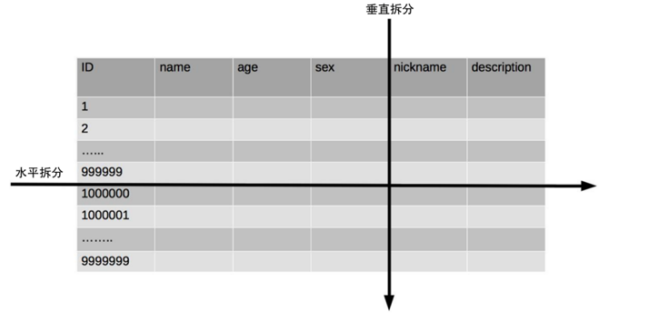
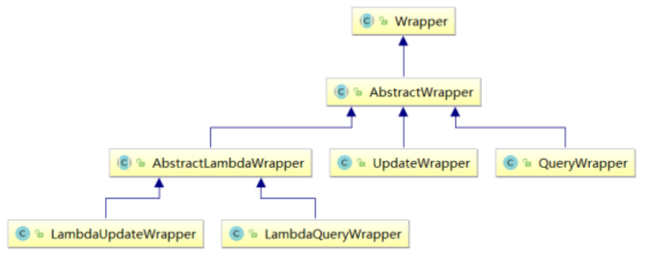
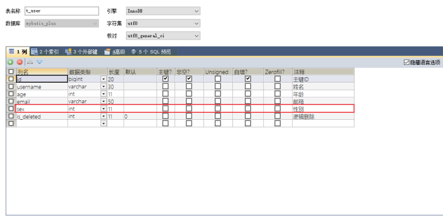

# MyBatis-Plus

## MyBatis-Plus简介

**注: 本文是在SpringBoot中演示使用Mybatis-Puls**

#### 1 、简介

MyBatis-Plus （简称 MP）是一个 MyBatis的增强工具 ，在 MyBatis 的基础上 只做增强不做改变 ，为简化开发、提高效率而生 。

#### 2 、特性

- 无侵入 ：只做增强不做改变，引入它不会对现有工程产生影响，如丝般顺滑

- 损耗小 ：启动即会自动注入基本 CURD，性能基本无损耗，直接面向对象操作

- 强大的 CRUD 操作 ：内置通用 Mapper、通用 Service，仅仅通过少量配置即可实现单表大部分

- CRUD 操作，更有强大的条件构造器，满足各类使用需求

- 支持 Lambda 形式调用 ：通过 Lambda 表达式，方便的编写各类查询条件，无需再担心字段写错

- 支持主键自动生成 ：支持多达 4 种主键策略（内含分布式唯一 ID 生成器 - Sequence），可自由

- 配置，完美解决主键问题

- 支持 ActiveRecord 模式 ：支持 ActiveRecord 形式调用，实体类只需继承 Model 类即可进行强

- 大的 CRUD 操作

- 支持自定义全局通用操作 ：支持全局通用方法注入（ Write once, use anywhere ）

- 内置代码生成器 ：采用代码或者 Maven 插件可快速生成 Mapper 、 Model 、 Service 、

- Controller 层代码，支持模板引擎，更有超多自定义配置等您来使用

- 内置分页插件 ：基于 MyBatis 物理分页，开发者无需关心具体操作，配置好插件之后，写分页等

- 同于普通 List 查询

- 分页插件支持多种数据库 ：支持 MySQL、MariaDB、Oracle、DB2、H2、HSQL、SQLite、

- Postgre、SQLServer 等多种数据库

- 内置性能分析插件 ：可输出 SQL 语句以及其执行时间，建议开发测试时启用该功能，能快速揪出
  慢查询

- 内置全局拦截插件 ：提供全表 delete 、 update 操作智能分析阻断，也可自定义拦截规则，预防
  误操作

#### 3 、支持数据库

任何能使用MyBatis进行 CRUD, 并且支持标准 SQL 的数据库，具体支持情况如下 MySQL，Oracle，DB2，H2，HSQL，SQLite，PostgreSQL，SQLServer，Phoenix，Gauss ，ClickHouse，Sybase，OceanBase，Firebird，Cubrid，Goldilocks，csiidb 达梦数据库，虚谷数据库，人大金仓数据库，南大通用(华库)数据库，南大通用数据库，神通数据库，瀚高数据库

#### 4 、代码及文档地址

- 官方地址: http://mp.baomidou.com

- 代码发布地址:

- Github: https://github.com/baomidou/mybatis-plus

- Gitee: https://gitee.com/baomidou/mybatis-plus

- 文档发布地址: https://baomidou.com/pages/24112f


## 入门案例

依赖:

```xml
<dependency>
	<groupId>com.baomidou</groupId>
	<artifactId>mybatis-plus-boot-starter</artifactId>
	<version>3.5.1</version>
</dependency>
    
<dependency>
	<groupId>mysql</groupId>
	<artifactId>mysql-connector-java</artifactId>
	<scope>runtime</scope>
</dependency>
```

**在application.yaml中配置好JDBC连接信息**

a>创建表

```sql
CREATE DATABASE `mybatis_plus` /*!40100 DEFAULT CHARACTER SET utf8mb4 */;
use `mybatis_plus`;
CREATE TABLE `user` (
`id` bigint(20) NOT NULL COMMENT '主键ID',
`name` varchar(30) DEFAULT NULL COMMENT '姓名',
`age` int(11) DEFAULT NULL COMMENT '年龄',
`email` varchar(50) DEFAULT NULL COMMENT '邮箱',
PRIMARY KEY (`id`)
) ENGINE=InnoDB DEFAULT CHARSET=utf8;
```

b>添加数据

```sql
INSERT INTO user (id, name, age, email) VALUES
(1, 'Jone', 18, 'test1@baomidou.com'),
(2, 'Jack', 20, 'test2@baomidou.com'),
(3, 'Tom', 28, 'test3@baomidou.com'),
(4, 'Sandy', 21, 'test4@baomidou.com'),
(5, 'Billie', 24, 'test5@baomidou.com');
```

c>添加实体

```java
@Data //lombok注解
public class User {
	private Long id;
	private String name;
	private Integer age;
	private String email;
}
```

d>添加mapper

BaseMapper是MyBatis-Plus提供的模板mapper，其中包含了基本的CRUD方法，泛型为操作的 实体类型

```java
public interface UserMapper extends BaseMapper<User> {
}

```

e>测试

```java
@SpringBootTest
public class MybatisPlusTest {
	@Autowired
	private UserMapper userMapper;
	@Test
	public void testSelectList(){
		//selectList()根据MP内置的条件构造器查询一个list集合，null表示没有条件，即查询所有
		userMapper.selectList(null).forEach(System.out::println);
	}
}

```

#### 显示日志与关闭

在`application.yml`中配置mp的sql执行日志

```yaml
## 配置MyBatis日志
mybatis-plus:
  configuration:
    log-impl: org.apache.ibatis.logging.stdout.StdOutImpl
```

tips: 再开发测试时,还可以将Mybatis和SpringBoot的banner以及debug日志关闭, 避免影响干扰结果:

在`application.yaml`中:

```yaml
mybatis-plus:
  banner: false
  
spring:
  main:
    banner-mode: off
```


## 基本CRUD

### 1 、BaseMapper

MyBatis-Plus中的**基本CRUD在内置的BaseMapper中都已得到了实现，我们可以直接使用，通过观察BaseMapper中的方法，大多方法中都有Wrapper类型的形参，此为条件构造器，可针 对于SQL语句设置不同的条件，若没有条件，则可以为该形参赋值null，即查询（删除/修改）所有**, 数据接口如 下：

```java
public interface BaseMapper<T> extends Mapper<T> {
    /**
* 插入一条记录
* @param entity 实体对象
*/
	int insert(T entity);
/**
* 根据 ID 删除
* @param id 主键ID
*/
	int deleteById(Serializable id);

    /**
* 根据 columnMap 条件，删除记录
* @param columnMap 表字段 map 对象
*/
	int deleteByMap(@Param(Constants.COLUMN_MAP) Map<String, Object> columnMap);
    
/**
* 根据 entity 条件，删除记录
* @param queryWrapper 实体对象封装操作类（可以为 null,里面的 entity 用于生成 where
语句）
*/
	int delete(@Param(Constants.WRAPPER) Wrapper<T> queryWrapper);
    
/**
* 删除（根据ID 批量删除）
* @param idList 主键ID列表(不能为 null 以及 empty)
*/
	int deleteBatchIds(@Param(Constants.COLLECTION) Collection<? extends Serializable> idList);
    
/**
* 根据 ID 修改
* @param entity 实体对象
*/
int updateById(@Param(Constants.ENTITY) T entity);
    
/**
* 根据 whereEntity 条件，更新记录
* @param entity 实体对象 (set 条件值,可以为 null)
* @param updateWrapper 实体对象封装操作类（可以为 null,里面的 entity 用于生成
where 语句）
*/
int update(@Param(Constants.ENTITY) T entity, @Param(Constants.WRAPPER)
Wrapper<T> updateWrapper);
    
/**
* 根据 ID 查询
* @param id 主键ID
*/
T selectById(Serializable id);
    
/**
* 查询（根据ID 批量查询）
* @param idList 主键ID列表(不能为 null 以及 empty)
*/
List<T> selectBatchIds(@Param(Constants.COLLECTION) Collection<? extends Serializable> idList);
    
/**
* 查询（根据 columnMap 条件）
* @param columnMap 表字段 map 对象
*/
List<T> selectByMap(@Param(Constants.COLUMN_MAP) Map<String, Object>columnMap);

/* 根据 entity 条件，查询一条记录
* 查询一条记录，例如 qw.last("limit 1") 限制取一条记录, 注意：多条数据会报异常
* @param queryWrapper 实体对象封装操作类（可以为 null）
*/
default T selectOne(@Param(Constants.WRAPPER) Wrapper<T> queryWrapper) {
	List<T> ts = this.selectList(queryWrapper);
	if (CollectionUtils.isNotEmpty(ts)) {
		if (ts.size() != 1) {
			throw ExceptionUtils.mpe("One record is expected, but the query result is multiple records");
		}
	return ts.get(0);
	}
	return null;
}
    
/**
* 根据 Wrapper 条件，查询总记录数
* @param queryWrapper 实体对象封装操作类（可以为 null）
*/
Long selectCount(@Param(Constants.WRAPPER) Wrapper<T> queryWrapper);
    
/**
* 根据 entity 条件，查询全部记录
* @param queryWrapper 实体对象封装操作类（可以为 null）
*/
List<T> selectList(@Param(Constants.WRAPPER) Wrapper<T> queryWrapper);
    
/**
* 根据 Wrapper 条件，查询全部记录
* @param queryWrapper 实体对象封装操作类（可以为 null）
*/
List<Map<String, Object>> selectMaps(@Param(Constants.WRAPPER), Wrapper<T>queryWrapper);
    
/**
* 根据 Wrapper 条件，查询全部记录
* <p>注意： 只返回第一个字段的值</p>
* @param queryWrapper 实体对象封装操作类（可以为 null）
*/
List<Object> selectObjs(@Param(Constants.WRAPPER) Wrapper<T> queryWrapper);
    
/**
* 根据 entity 条件，查询全部记录（并翻页）
* @param page 分页查询条件（可以为 RowBounds.DEFAULT）
* @param queryWrapper 实体对象封装操作类（可以为 null）
*/
<P extends IPage<T>> P selectPage(P page, @Param(Constants.WRAPPER)Wrapper<T> queryWrapper);
    
/**
* 根据 Wrapper 条件，查询全部记录（并翻页）
* @param page 分页查询条件
* @param queryWrapper 实体对象封装操作类
*/
<P extends IPage<Map<String, Object>>> P selectMapsPage(P page,@Param(Constants.WRAPPER) Wrapper<T> queryWrapper);

```

### 2、插入

```java
@Test
public void testInsert(){
User user = new User(null, "张三", 23, "zhangsan@atguigu.com");
//INSERT INTO user ( id, name, age, email ) VALUES ( ?, ?, ?, ? )
	int result = userMapper.insert(user);
	System.out.println("受影响行数："+result);
	//1475754982694199298
	System.out.println("id自动获取："+user.getId());
}

```

最终执行的结果，所获取的id为1475754982694199298, 这是因为MyBatis-Plus在实现插入数据时，**会默认基于雪花算法的策略生成id**


### 3、删除

通过id删除记录

```java
@Test
public void testDeleteById(){
//通过id删除用户信息
//DELETE FROM user WHERE id=?
	int result = userMapper.deleteById(1475754982694199298L);
	System.out.println("受影响行数："+result);
}
```

通过id批量删除记录

```java
@Test
public void testDeleteBatchIds(){
//通过多个id批量删除
//DELETE FROM user WHERE id IN ( ? , ? , ? )
	List<Long> idList = Arrays.asList(1L, 2L, 3L);
	int result = userMapper.deleteBatchIds(idList);
	System.out.println("受影响行数："+result);
}
```

通过map条件删除记录

```java
@Test
public void testDeleteByMap(){
//根据map集合中所设置的条件删除记录
//DELETE FROM user WHERE name = ? AND age = ?
	Map<String, Object> map = new HashMap<>();
	map.put("age", 23);
	map.put("name", "张三");
	int result = userMapper.deleteByMap(map);
	System.out.println("受影响行数："+result);
}
```

### 4、修改

```java
@Test
public void testUpdateById(){
User user = new User(4L, "admin", 22, null);
//UPDATE user SET name=?, age=? WHERE id=?
	int result = userMapper.updateById(user);
	System.out.println("受影响行数："+result);
}
```

### 5、查询

根据id查询用户信息

```java
@Test
public void testSelectById(){
//根据id查询用户信息
//SELECT id,name,age,email FROM user WHERE id=?
	User user = userMapper.selectById(4L);
	System.out.println(user);
}
```

根据多个id查询多个用户信息

```java
@Test
public void testSelectBatchIds(){
//根据多个id查询多个用户信息
//SELECT id,name,age,email FROM user WHERE id IN ( ? , ? )
	List<Long> idList = Arrays.asList(4L, 5L);
	List<User> list = userMapper.selectBatchIds(idList);
	list.forEach(System.out::println);
}
```

通过map条件查询用户信息

```java
@Test
public void testSelectByMap(){
//通过map条件查询用户信息
//SELECT id,name,age,email FROM user WHERE name = ? AND age = ?
Map<String, Object> map = new HashMap<>();
map.put("age", 22);
map.put("name", "admin");
List<User> list = userMapper.selectByMap(map);
list.forEach(System.out::println);
}
```

查询所有数据

```java
@Test
public void testSelectList(){
//查询所有用户信息
//SELECT id,name,age,email FROM user
	List<User> list = userMapper.selectList(null);
	list.forEach(System.out::println);
}
```

### 6、通用Service

通用 Service CRUD 封装Service接口，进一步封装 CRUD 采用` get 查询单行` `remove 删除` `list 查询集合` `page 分页` 前缀命名方式**区分 Mapper 层避免混淆**

泛型 T 为任意实体对象 

**建议如果存在自定义通用 Service 方法的可能，请创建自己的 IBaseService 继承 Mybatis-Plus 提供的基类**

api细节请参考官网: [CRUD 接口 | MyBatis-Plus (baomidou.com)](https://baomidou.com/pages/49cc81/##service-crud-接口)

#### IService

MyBatis-Plus中**有一个接口 IService和其实现类 ServiceImpl，封装了常见的业务层逻辑**

创建Service接口

```java
/**
* UserService继承IService模板提供的基础功能
*/
public interface UserService extends IService<User> {
}
```

Service实现类

```java
/**
* ServiceImpl实现了IService，提供了IService中基础功能的实现
* 若ServiceImpl无法满足业务需求，则可以使用自定的UserService定义方法，并在实现类中实现
*/
@Service
public class UserServiceImpl extends ServiceImpl<UserMapper, User> implements UserService {
}
```

#### 测试实例:

测试查询记录数

```java
	@Autowired
	private UserService userService;
	@Test
	public void testGetCount(){
		long count = userService.count();
		System.out.println("总记录数：" + count);
	}
```

测试批量插入

```java
@Autowired
private UserService userService;

@Test
public void testSaveBatch(){
// SQL长度有限制，海量数据插入单条SQL无法实行，
// 因此MP将批量插入放在了通用Service中实现，而不是通用Mapper
	ArrayList<User> users = new ArrayList<>();
	for (int i = 0; i < 5; i++) {
		User user = new User();
		user.setName("ybc" + i);
		user.setAge(20 + i);
		users.add(user);
	}
//SQL:INSERT INTO t_user ( username, age ) VALUES ( ?, ? )
	userService.saveBatch(users);
}
```


## 常用注解

#### 1 、@TableName

此注解主要是用来解决实体类与数据库的数据表名称不一致的情况, 通过在实体类上加上该注解即可解决该问题

```java
@TableName("t_user")
public class User{
    ....
}
```

**此外,如果数据表有规定的前缀, 我们还可以通过配置文件`applcation.yaml`设置数据表的全局前缀:**

```yaml
mybatis-plus:
  configuration:
 ## 配置MyBatis日志
    log-impl: org.apache.ibatis.logging.stdout.StdOutImpl
  global-config:
    db-config:
 ## 配置MyBatis-Plus操作表的默认前缀
      table-prefix: t_
```

#### 2、@TableId

MyBatis-Plus在实现CRUD时，会默认将id作为主键列，并在插入数据时，默认基于雪花算法的策略生成id, 若实体类和表中表示主键的不是id，而是其他字段，例如uid，**MyBatis-Plus不会自动识别uid为主键, 我们可以通过在实体类中uid属性上通过`@TableId`将其标为主键解决该问题**

**实体类主属性名与数据表主键字段名不一致解决方案:** 

若**实体类中主键对应的属性为id**，而**表中表示主键的字段为uid**，此时若只在属性id上添加注解 @TableId，则抛出异常Unknown column 'id' in 'field list'，即MyBatis-Plus仍然会将id作为表的 主键操作，而表中表示主键的是字段uid 此时需要通过@TableId注解的value属性，**指定表中的主键字段，@TableId("uid")或 @TableId(value="uid")**

###### 主键策略:

**@TableId的type属性用来定义主键策略:**

|值 |描述|
|---|---|
|IdType.ASSIGN_ID（默 认）| 基于雪花算法的策略生成数据id，与数据库id是否设置自增无关| 
|IdType.AUTO | 使用数据库的自增策略，注意，该类型请确保数据库设置了id自增， 否则无效|

此外,还可以通过配置文件`application.yaml`全局配置主键策略: 

```yaml
mybatis-plus:
  configuration:
## 配置MyBatis日志
    log-impl: org.apache.ibatis.logging.stdout.StdOutImpl
  global-config:
    db-config:
## 配置MyBatis-Plus操作表的默认前缀
      table-prefix: t_
## 配置MyBatis-Plus的主键策略为自增
      id-type: auto
```

######## 拓展-雪花算法:

需要选择合适的方案去应对数据规模的增长，以应对逐渐增长的访问压力和数据量。 数据库的扩展方式主要包括：**业务分库、主从复制，数据库分表。**

**数据库分表:**

将不同业务数据分散存储到不同的数据库服务器，能够支撑百万甚至千万用户规模的业务，但如果业务继续发展，同一业务的单表数据也会达到单台数据库服务器的处理瓶颈。例如，淘宝的几亿用户数据， 如果全部存放在一台数据库服务器的一张表中，肯定是无法满足性能要求的，此时就需要对单表数据进 行拆分。 单表数据拆分有两种方式：垂直分表和水平分表。示意图如下：



- 垂直分表

垂直分表**适合将表中某些不常用且占了大量空间的列拆分出去。**例如，前面示意图中的 nickname 和 description 字段，假设我们是一个婚恋网站，用户在筛选其他用户的时候，主要是用 age 和 sex 两个字段进行查询，而 nickname 和 description 两个字段主要用于展示，一般不会在业务查询中用到。description 本身又比较长，因此我们可以将这两个字段独立到另外 一张表中，这样在查询 age 和 sex 时，就能带来一定的性能提升。

- 水平分表

**水平分表适合表行数特别大的表**，有的公司要求单表行数超过 5000 万就必须进行分表，这个数字可以作为参考，但并不是绝对标准，关键还是要看表的访问性能。对于一些比较复杂的表，可能超过 1000 万就要分表了；而对于一些简单的表，即使存储数据超过 1 亿行，也可以不分表。 但不管怎样，当看到表的数据量达到千万级别时，作为架构师就要警觉起来，因为这很可能是架构的性能瓶颈或者隐患。

水平分表相比垂直分表，会引入更多的复杂性，例如要求全局唯一的数据id该如何处理, 如下是一些常见的处理策略:

> 主键自增

①以最常见的用户 ID 为例，可以按照 1000000 的范围大小进行分段，1 ~ 999999 放到表 1中， 1000000 ~ 1999999 放到表2中，以此类推。 

②复杂点：分段大小的选取。分段太小会导致切分后子表数量过多，增加维护复杂度；分段太大可能会 导致单表依然存在性能问题，一般建议分段大小在 100 万至 2000 万之间，具体需要根据业务选取合适 的分段大小。 

③优点：可以随着数据的增加平滑地扩充新的表。例如，现在的用户是 100 万，如果增加到 1000 万， 只需要增加新的表就可以了，原有的数据不需要动。

④缺点：分布不均匀。假如按照 1000 万来进行分表，有可能某个分段实际存储的数据量只有 1 条，而 另外一个分段实际存储的数据量有 1000 万条。

> 取模

①同样以用户 ID 为例，假如我们一开始就规划了 10 个数据库表，可以简单地用 user_id % 10 的值来 表示数据所属的数据库表编号，ID 为 985 的用户放到编号为 5 的子表中，ID 为 10086 的用户放到编号 为 6 的子表中。 

②复杂点：初始表数量的确定。表数量太多维护比较麻烦，表数量太少又可能导致单表性能存在问题。 

③优点：表分布比较均匀。 

④缺点：扩充新的表很麻烦，所有数据都要重分布。

> 雪花算法

雪花算法是由Twitter公布的分布式主键生成算法，它能够保证不同表的主键的不重复性，以及相同表的 主键的有序性。

①核心思想： 长度共64bit（一个long型）。首先是一个符号位，1bit标识，由于long基本类型在Java中是带符号的，最高位是符号位，正数是0，负 数是1，所以id一般是正数，最高位是0。41bit时间截(毫秒级)，存储的是时间截的差值（当前时间截 - 开始时间截)，结果约等于69.73年。 10bit作为机器的ID（5个bit是数据中心，5个bit的机器ID，可以部署在1024个节点）。 12bit作为毫秒内的流水号（意味着每个节点在每毫秒可以产生 4096 个 ID）。

②优点：整体上按照时间自增排序，并且整个分布式系统内不会产生ID碰撞，并且效率较高。


#### 3、@TableField

若实体类中的属性使用的是驼峰命名风格，而表中的字段使用的是下划线命名风格 例如实体类属性userName，表中字段user_name 此时**MyBatis-Plus会自动将下划线命名风格转化为驼峰命名风格** 相当于在MyBatis中配置进行了大驼峰转下划线配置, 但如果实体类属性与数据表字段名无法进行大驼峰转下划线映射时, 就需要通过在实体类字段上添加`@TableField("数据库字段名")`来解决映射字段名不一致的问题, 例如: 实体类属性name，表中字段username 

```java
public class User{
//@TableId(type IdType.ASSIGN_ID)
	private Long id;
	@TableField("username")
	private string name;
	private Integer age;
    private string email;
}
```

#### 4、@TableLogic

引入一个逻辑删除的概念: 

- **物理删除**：真实删除，将对应数据从数据库中删除，之后查询不到此条被删除的数据 
- **逻辑删除**：假删除，将对应数据中代表是否被删除字段的状态修改为“被删除状态”，之后在数据库 中仍旧能看到此条数据记录, 常用与可能需要进行数据恢复的场景

mybatis提供的`@TableLogic`注解可以为我们实现逻辑删除功能提供遍历.

**`@TableLogic` 支持所有数据类型（推荐使用 Integer、Boolean、LocalDateTime）如果数据库字段使用 datetime，字符串 null，另一个值支持配置为函数来获取值如now()**

附录：

（1）逻辑删除是为了方便数据恢复和保护数据本身价值等等的一种方案，但实际就是删除。

（2）如果你需要频繁查出来看就不应使用逻辑删除，而是以一个状态去表示。

**该注解有两个属性值: **

- `value`: 用来指定逻辑未删除值，默认为空字符串

- `delval`: 用来指定逻辑删除值，默认为空字符串。

==注意，该注解只对自动注入的 sql 起效==

###### @TableLogic 对于 CIUD 的限制

> 插入（insert）

不作限制


> 查找（select）

@TableLogic 注解将会在 select 语句的 where 条件添加条件，**自动过滤掉已删除数据, 且使用 wrapper.entity 生成的 where 条件会忽略该字段**,例如:

```sql
SELECT user_id,name,sex,age,deleted FROM user WHERE user_id=1 AND deleted='0'
```


> 更新（update）

@TableLogic 注解将会在 update 语句的 where 条件后追加条件，防止更新到已删除数据, 且使用 wrapper.entity 生成的 where条件会忽略该字段,例如:

```sql
update user set deleted=1 where id = 1 and deleted=0
```


> 删除（delete）

@TableLogic 注解会将 delete 语句转变为 update 语句,例如:

```sql
update user set deleted=1 where id = 1 and deleted=0
```


###### 测试实例:

添加表字段sql:

```sql
-- 添加一个 deleted 字段，实现逻辑删除
ALTER TABLE `user`
ADD COLUMN `deleted`  varchar(1) NULL DEFAULT 0 COMMENT '是否删除（1-删除；0-未删除）';
```

实体类:

```java
@TableName(value = "user")
public class AnnotationUser7Bean {
   @TableId(value = "user_id", type = IdType.AUTO)
   private int userId;
     
   @TableField("name")
   private String name;
     
   @TableField("sex")
   private String sex;
     
   @TableField("age")
   private Integer age;
    
   // 也可以不指定属性值,那将按照默认的规则进行判断(Integer->0,1 Boolean->true,false, 其他的null为假,具体可以查阅资料) 
   @TableLogic(value = "0", delval = "1"), 
   private String deleted; 
   // getter,setter....
}
```


###### 全局配置逻辑删除

当然，你也可以不在 @TableLogic 注解中指定 value 和 delval 属性的值。使用全局逻辑删除配置信息，配置如下：

```yaml
## application.yml
mybatis-plus:
  global-config:
    db-config:
      ## 全局逻辑删除的实体字段名 (since 3.3.0, 配置后可以忽略 @TableLogic 中的配置)
      logic-delete-field: flag
      ## 逻辑已删除值(默认为 1)
      logic-delete-value: 1
      ## 逻辑未删除值(默认为 0)
      logic-not-delete-value: 0

```


## 条件构造器和常用接口

### 1 、wapper介绍




- Wrapper ： 条件构造抽象类，最顶端父类

  - AbstractWrapper ： 用于查询条件封装，生成 sql 的 where 条件

    - QueryWrapper ： 查询条件封装 

    - UpdateWrapper ： Update 条件封装 

    - AbstractLambdaWrapper ： 使用Lambda 语法 

      - LambdaQueryWrapper ：用于Lambda语法使用的查询Wrapper 

      - LambdaUpdateWrapper ： Lambda 更新封装Wrapper


### 2 、QueryWrapper

#### 模糊匹配

```java
LambdaQueryWrapper<User> lqw = new LambdaQueryWrapper<User>();
//模糊匹配 like
lqw.likeLeft(User::getName, "J");  // likeLeft 表示通配符 % 在左边(默认), 也可以设置到右边
List<User> userList = userDao.selectList(lqw);
System.out.println(userList);
```

#### 组装查询条件

```java
@Test
public void test01(){
//查询用户名包含a，年龄在20到30之间，并且邮箱不为null的用户信息
//SELECT id,username AS name,age,email,is_deleted FROM t_user WHERE is_deleted=0 AND (username LIKE ? AND age BETWEEN ? AND ? AND email IS NOT NULL)
	QueryWrapper<User> queryWrapper = new QueryWrapper<>();
	queryWrapper.like("username", "a").between("age", 20, 30).isNotNull("email");
	List<User> list = userMapper.selectList(queryWrapper);
	list.forEach(System.out::println);
}
```

#### 组装排序条件

```java
@Test
public void test02(){
//按年龄降序查询用户，如果年龄相同则按id升序排列
//SELECT id,username AS name,age,email,is_deleted FROM t_user WHERE is_deleted=0 ORDER BY age DESC,id ASC
	QueryWrapper<User> queryWrapper = new QueryWrapper<>();
	queryWrapper.orderByDesc("age").orderByAsc("id");
	List<User> users = userMapper.selectList(queryWrapper);
	users.forEach(System.out::println);
}
```

#### 组装删除条件

```java
@Test
public void test03(){
//删除email为空的用户
//DELETE FROM t_user WHERE (email IS NULL)
	QueryWrapper<User> queryWrapper = new QueryWrapper<>();
	queryWrapper.isNull("email");
	//条件构造器也可以构建删除语句的条件
	int result = userMapper.delete(queryWrapper);
	System.out.println("受影响的行数：" + result);
}
```

#### 条件的优先级

```java
@Test
public void test04() {
	QueryWrapper<User> queryWrapper = new QueryWrapper<>();
	//将（年龄大于20并且用户名中包含有a）或邮箱为null的用户信息修改
	//UPDATE t_user SET age=?, email=? WHERE (username LIKE ? AND age > ? OR email IS NULL)
	queryWrapper.like("username", "a").gt("age", 20).or().isNull("email");
	User user = new User();
	user.setAge(18);
	user.setEmail("user@atguigu.com");
	int result = userMapper.update(user, queryWrapper);
	System.out.println("受影响的行数：" + result);
}
```

Lambda表达式的逻辑最优先进行运算,如:

```java
@Test
public void test04() {
	QueryWrapper<User> queryWrapper = new QueryWrapper<>();
//将用户名中包含有a并且（年龄大于20或邮箱为null）的用户信息修改
//UPDATE t_user SET age=?, email=? WHERE (username LIKE ? AND (age > ? OR email IS NULL))
//lambda表达式内的逻辑优先运算
queryWrapper.like("username", "a").and(i -> i.gt("age", 20).or().isNull("email"));
	User user = new User();
	user.setAge(18);
	user.setEmail("user@atguigu.com");
	int result = userMapper.update(user, queryWrapper);
	System.out.println("受影响的行数：" + result);
}
```

#### 组装select子句

```java
@Test
public void test05() {
//查询用户信息的username和age字段
//SELECT username,age FROM t_user
	QueryWrapper<User> queryWrapper = new QueryWrapper<>();
	queryWrapper.select("username", "age");
	//selectMaps()返回Map集合列表，通常配合select()使用，避免User对象中没有被查询到的列值为null
	List<Map<String, Object>> maps = userMapper.selectMaps(queryWrapper);
	maps.forEach(System.out::println);
}
```

#### 实现子查询

```java
@Test
public void test06() {
//查询id小于等于3的用户信息
//SELECT * FROM t_user WHERE (id IN (select id from t_user where id <= 3))
	QueryWrapper<User> queryWrapper = new QueryWrapper<>();
	queryWrapper.inSql("id", "select id from t_user where id <= 3");
	List<User> list = userMapper.selectList(queryWrapper);
	list.forEach(System.out::println);
}
```

### 3、UpdateWrapper

```java
@Test
public void test07() {
//将（年龄大于20或邮箱为null）并且用户名中包含有a的用户信息修改
//组装set子句以及修改条件
	UpdateWrapper<User> updateWrapper = new UpdateWrapper<>();
//lambda表达式内的逻辑优先运算
	updateWrapper
		.set("age", 18)
		.set("email", "user@atguigu.com")
		.like("username", "a")
		.and(i -> i.gt("age", 20).or().isNull("email"));
//这里必须要创建User对象，否则无法应用自动填充。如果没有自动填充，可以设置为null
	//UPDATE t_user SET username=?, age=?,email=? WHERE (username LIKE ? AND (age > ? OR email IS NULL))
	//User user = new User();
	//user.setName("张三");
	//int result = userMapper.update(user, updateWrapper);
	//UPDATE t_user SET age=?,email=? WHERE (username LIKE ? AND (age > ? OR email IS NULL))
	int result = userMapper.update(null, updateWrapper);
	System.out.println(result);
}
```

### 4、condition

在真正开发的过程中，组装条件是常见的功能，而这些条件数据来源于用户输入，是可选的，因 此我们在组装这些条件时，**必须先判断用户是否选择了这些条件，若选择则需要组装该条件，若没有选择(结果为null)则一定不能组装，以免影响SQL执行的结果**

```java
@Test
public void test08() {
	//定义查询条件，有可能为null（用户未输入或未选择）
	String username = null;
	Integer ageBegin = 10;
	Integer ageEnd = 24;
	QueryWrapper<User> queryWrapper = new QueryWrapper<>();
//StringUtils.isNotBlank()判断某字符串是否不为空且长度不为0且不由空白符(whitespace)构成
	if(StringUtils.isNotBlank(username)){
		queryWrapper.like("username","a");
	}
	if(ageBegin != null){
		queryWrapper.ge("age", ageBegin);
	}
	if(ageEnd != null){
		queryWrapper.le("age", ageEnd);
	}
//SELECT id,username AS name,age,email,is_deleted FROM t_user WHERE (age >= ? AND age <= ?)
	List<User> users = userMapper.selectList(queryWrapper);
	users.forEach(System.out::println);
}
```

上面的实现方案虽然没有问题，但是代码比较复杂，我们可以使用带condition参数的重载方法构建查 询条件，简化代码的编写

```java
@Test
public void test08UseCondition() {
//定义查询条件，有可能为null（用户未输入或未选择）
	String username = null;
	Integer ageBegin = 10;
	Integer ageEnd = 24;
	QueryWrapper<User> queryWrapper = new QueryWrapper<>();
	//StringUtils.isNotBlank()判断某字符串是否不为空且长度不为0且不由空白符(whitespace)构成
	queryWrapper
        .like(StringUtils.isNotBlank(username), "username", "a")
        .ge(ageBegin != null, "age", ageBegin)
		.le(ageEnd != null, "age", ageEnd);
//SELECT id,username AS name,age,email,is_deleted FROM t_user WHERE (age >= ? AND age <= ?)
	List<User> users = userMapper.selectList(queryWrapper);
	users.forEach(System.out::println);
}
```


### 5、LambdaQueryWrapper

```java
@Test
public void test09() {
//定义查询条件，有可能为null（用户未输入）
	String username = "a";
	Integer ageBegin = 10;
	Integer ageEnd = 24;
	LambdaQueryWrapper<User> queryWrapper = new LambdaQueryWrapper<>();
//避免使用字符串表示字段，防止运行时错误
    /* 查询username含有a字符,年龄小于ageBegin,大于的ageEnd的所有用户信息 */
	queryWrapper
		.like(StringUtils.isNotBlank(username), User::getName, username)
		.ge(ageBegin != null, User::getAge, ageBegin)
		.le(ageEnd != null, User::getAge, ageEnd);
	List<User> users = userMapper.selectList(queryWrapper);
	users.forEach(System.out::println);
}
```

### 6、LambdaUpdateWrapper

```java
@Test
public void test10() {
	//组装set子句
	LambdaUpdateWrapper<User> updateWrapper = new LambdaUpdateWrapper<>();
	updateWrapper
		.set(User::getAge, 18)
		.set(User::getEmail, "user@atguigu.com")
		.like(User::getName, "a")
		.and(i -> i.lt(User::getAge, 24).or().isNull(User::getEmail)); //lambda表达式内的逻辑优先运算
	User user = new User();
	int result = userMapper.update(user, updateWrapper);
	System.out.println("受影响的行数：" + result);
}
```


## 投影,聚合,分组

投影:

```java
/*LambdaQueryWrapper<User> lqw = new LambdaQueryWrapper<User>();
lqw.select(User::getId, User::getName, User::getAge);*/
//或者
QueryWrapper<User> lqw = new QueryWrapper<User>();
lqw.select("id", "name", "age", "tel");
List<User> userList = userDao.selectList(lqw);
System.out.println(userList);
```

聚合:

```java
QueryWrapper<User> lqw = new QueryWrapper<User>();
lqw.select("count(*) as count, tel");
lqw.groupBy("tel");
List<Map<String, Object>> userList = userDao.selectMaps(lqw);
System.out.println(userList);
```

分组:

```java
QueryWrapper<User> qw = new QueryWrapper<User>();
qw.select("gender","count(*) as nums");
qw.groupBy("gender");
List<Map<String, Object>> maps = userDao.selectMaps(qw);
System.out.println(maps);
```


## mp插件(拦截器)

#### 1 、分页插件

MyBatis Plus自带分页插件，只要简单的配置即可实现分页功能,使用步骤如下:

1.添加配置类

```java
@Configuration
@MapperScan("com.atguigu.mybatisplus.mapper") //可以将主类中的注解移到此处
public class MybatisPlusConfig {
	@Bean
	public MybatisPlusInterceptor mybatisPlusInterceptor() {
		MybatisPlusInterceptor interceptor = new MybatisPlusInterceptor();
		interceptor.addInnerInterceptor(new PaginationInnerInterceptor(DbType.MYSQL));
		return interceptor;
	}
}
```
2.测试

```java
@Test
public void testPage(){
	//设置分页参数
	Page<User> page = new Page<>(1, 5);
	userMapper.selectPage(page, null);
	//获取分页数据
	List<User> list = page.getRecords();
	list.forEach(System.out::println);
	System.out.println("当前页："+page.getCurrent());
	System.out.println("每页显示的条数："+page.getSize());
	System.out.println("总记录数："+page.getTotal());
	System.out.println("总页数："+page.getPages());
	System.out.println("是否有上一页："+page.hasPrevious());
	System.out.println("是否有下一页："+page.hasNext());
}
```

#### 2 、xml自定义分页

`UserMapper`中定义接口方法

```java
/**
* 根据年龄查询用户列表，分页显示
* @param page 分页对象,xml中可以从里面进行取值,传递参数 Page 即自动分页,必须放在第一位
* @param age 年龄
* @return
*/
IPage<User> selectPageVo(@Param("page") Page<User> page, @Param("age")Integer age);
```

`UserMapper.xml`中编写SQL

```xml
<!--SQL片段，记录基础字段-->
<sql id="BaseColumns">id,username,age,email</sql>
	<!--IPage<User> selectPageVo(Page<User> page, Integer age);-->
	<select id="selectPageVo" resultType="User">
		SELECT <include refid="BaseColumns"></include> FROM t_user WHERE age > ##{age}
	</select
```

测试:

```java
@Test
public void testSelectPageVo(){
//设置分页参数
	Page<User> page = new Page<>(1, 5);
	userMapper.selectPageVo(page, 20);
//获取分页数据
	List<User> list = page.getRecords();
	list.forEach(System.out::println);
	System.out.println("当前页："+page.getCurrent());
	System.out.println("每页显示的条数："+page.getSize());
	System.out.println("总记录数："+page.getTotal());
	System.out.println("总页数："+page.getPages());
	System.out.println("是否有上一页："+page.hasPrevious());
	System.out.println("是否有下一页："+page.hasNext());
}
```


#### 3 、乐观锁

假设有这么一个场景:  一件商品，成本价是 80 元，售价是 100 元。老板先是通知小李，说你去把商品价格增加 50 元。小李正在玩游戏，耽搁了一个小时。正好一个小时后，老板觉得商品价格增加到 150 元，价格太高，可能会影响销量。又通知小王，你把商品价格降低 30 元。此时，小李和小王同时操作商品后台系统。小李操作的时候，系统先取出商品价格 100 元；小王也在操作，取出的商品价格也是 100 元。小李将价格加了 50 元，并将100+50=150元存入了数据库；小王将商品减了 30 元，并将100-30=70元存入了数据库。是的，如果没有锁，小李的操作就完全被小王的覆盖了。现在商品价格是 70 元，比成本价低 10 元。几分钟后，这个商品很快出售了 1 千多件商品，老板亏 1万多。

**如果是乐观锁，小王保存价格前，会检查下价格是否被人修改过了。如果被修改过了，则重新取出的被修改后的价格，150元，这样他会将120元存入数据库。** 

**如果是悲观锁，小李取出数据后，小王只能等小李操作完之后，才能对价格进行操作，也会保证 最终的价格是120元。**


下面的例子将模拟模拟修改冲突

数据库中增加商品表

```sql
CREATE TABLE t_product
(
	id BIGINT(20) NOT NULL COMMENT '主键ID',
	NAME VARCHAR(30) NULL DEFAULT NULL COMMENT '商品名称',
	price INT(11) DEFAULT 0 COMMENT '价格',
	VERSION INT(11) DEFAULT 0 COMMENT '乐观锁版本号',
	PRIMARY KEY (id)
);

```

添加数据:

```java
INSERT INTO t_product (id, NAME, price) VALUES (1, '外星人笔记本', 100);
```

实体类:

```java
@Data
public class Product {
	private Long id;
	private String name;
	private Integer price;
	private Integer version;
}
```

dao层mapper

```java
public interface ProductMapper extends BaseMapper<Product> {
}
```

测试:

```java
@Test
public void testConcurrentUpdate() {
	//1、小李
	Product p1 = productMapper.selectById(1L);
	System.out.println("小李取出的价格：" + p1.getPrice());
	//2、小王
	Product p2 = productMapper.selectById(1L);
	System.out.println("小王取出的价格：" + p2.getPrice());
    //3、小李将价格加了50元，存入了数据库
	p1.setPrice(p1.getPrice() + 50);
	int result1 = productMapper.updateById(p1);
	System.out.println("小李修改结果：" + result1);
	//4、小王将商品减了30元，存入了数据库
	p2.setPrice(p2.getPrice() - 30);
	int result2 = productMapper.updateById(p2);
	System.out.println("小王修改结果：" + result2);
	//最后的结果
	Product p3 = productMapper.selectById(1L);
	//价格覆盖，最后的结果：70
	System.out.println("最后的结果：" + p3.getPrice());
}
```

###### 乐观锁实现

######## 实现思路:

**数据库中添加version字段 取出记录时，获取当前version **

```sql
SELECT id,`name`,price,`version` FROM product WHERE id=1
```

**更新时，version + 1，如果where语句中的version版本不对，则更新失败**

```sql
UPDATE product SET price=price+50, `version`=`version` + 1 WHERE id=1 AND `version`=1
```

######## Mybatis-puls实现:

修改实体类,添加版本属性字段

```java
@Data
	public class Product {
	private Long id;
	private String name;
	private Integer price;
    // Mybatis-puls 版本字段注解
	@Version
	private Integer version;
}
```

添加乐观锁插件配置, 并且注入到Spring管理, 最后在Mybatis-puls配置类里注入,方便管理

```java
@Configuration
@MapperScan("com.atguigu.mybatisplus.mapper") //可以将主类中的注解移到此处
public class MybatisPlusConfig {
	@Bean
	public MybatisPlusInterceptor mybatisPlusInterceptor(){
		MybatisPlusInterceptor interceptor = new MybatisPlusInterceptor();
		//添加分页插件
		interceptor.addInnerInterceptor(new PaginationInnerInterceptor(DbType.MYSQL));
		//添加乐观锁插件
		interceptor.addInnerInterceptor(new OptimisticLockerInnerInterceptor());
		return interceptor;
	}
}
```

*预期效果:* 

小李查询商品信息： `SELECT id,name,price,version FROM t_product WHERE id=?` 

小王查询商品信息：` SELECT id,name,price,version FROM t_product WHERE id=?` 

**小李修改商品价格，自动将version+1** `UPDATE t_product SET name=?, price=?, version=? WHERE id=? AND version=?` Parameters: 外星人笔记本(String), 150(Integer), 1(Integer), 1(Long), 0(Integer) 

**小王修改商品价格，此时version已更新，条件不成立，修改失败** `UPDATE t_product SET name=?, price=?, version=? WHERE id=? AND version=?` Parameters: 外星人笔记本(String), 70(Integer), 1(Integer), 1(Long), 0(Integer) 最终，小王修改失败，

查询价格：150  `SELECT id,name,price,version FROM t_product WHERE id=?`

*代码实现:*

```java
@Test
public void testConcurrentVersionUpdate() {
	//小李取数据
	Product p1 = productMapper.selectById(1L);
	//小王取数据
	Product p2 = productMapper.selectById(1L);
    
	//小李修改 + 50
	p1.setPrice(p1.getPrice() + 50);
	int result1 = productMapper.updateById(p1);
	System.out.println("小李修改的结果：" + result1);
    
	//小王修改 - 30
	p2.setPrice(p2.getPrice() - 30);
	int result2 = productMapper.updateById(p2);
	System.out.println("小王修改的结果：" + result2);
    
	if(result2 == 0){
	//失败重试，重新获取version并更新
		p2 = productMapper.selectById(1L);
    	p2.setPrice(p2.getPrice() - 30);
		result2 = productMapper.updateById(p2);
	}
	System.out.println("小王修改重试的结果：" + result2);
    
	//老板看价格
	Product p3 = productMapper.selectById(1L);
	System.out.println("老板看价格：" + p3.getPrice());
}

```


## 通用枚举

表中的**有些字段值是固定的，例如性别（男或女），此时我们可以使用MyBatis-Plus的通用枚举类型来实现**,(其实也可以通过MySQL数据库约束实现)

如下案例将演示使用mybatis-puls的通用枚举类型:



实体类创建通用枚举类型

```java
@Getter
public enum SexEnum {
	MALE(1, "男"),
	FEMALE(2, "女");
	@EnumValue
	private Integer sex;
	private String sexName;
	SexEnum(Integer sex, String sexName) {
		this.sex = sex;
		this.sexName = sexName;
    }
}
```

在`application.yaml`中配置扫描通用枚举

```yaml
mybatis-plus:
  configuration:
## 配置MyBatis日志
    log-impl: org.apache.ibatis.logging.stdout.StdOutImpl
  global-config:
    db-config:
## 配置MyBatis-Plus操作表的默认前缀
      table-prefix: t_
## 配置MyBatis-Plus的主键策略
      id-type: auto
## 配置扫描通用枚举
  type-enums-package: com.atguigu.mybatisplus.enums
```

测试: 

```java
@Test
public void testSexEnum(){
	User user = new User();
	user.setName("Enum");
	user.setAge(20);
	//设置性别信息为枚举项，会将@EnumValue注解所标识的属性值存储到数据库
	user.setSex(SexEnum.MALE);
	//INSERT INTO t_user ( username, age, sex ) VALUES ( ?, ?, ? ) 
    // Parameters: Enum(String), 20(Integer), 1(Integer)
	userMapper.insert(user);
}
```


## 代码生成器

Mybatis-Puls为了更高效快速的进行CURD操作,还提供了代码生成器,**能够根据数据库中的数据表快速生成实体类和Dao层代码**

引入依赖: 

```xml
<dependency>
	<groupId>com.baomidou</groupId>
	<artifactId>mybatis-plus-generator</artifactId>
	<version>3.5.1</version>
</dependency>


<dependency>
	<groupId>org.freemarker</groupId>
	<artifactId>freemarker</artifactId>
	<version>2.3.31</version>
</dependency>


<!--默认使用velocity模板引擎-->
<!--
<dependency>
	<groupId>org.apache.velocity</groupId>
	<artifactId>velocity-engine-core</artifactId>
	<version>2.3</version>
</dependency>
-->
```

代码生成器类: 

```java
public class Generator {
	public static void main(String[] args) {
		//1. 创建代码生成器对象，执行生成代码操作
		AutoGenerator autoGenerator = new AutoGenerator();
		//2. 数据源相关配置：读取数据库中的信息，根据数据库表结构生成代码
		DataSourceConfig dataSource = new DataSourceConfig();
		dataSource.setDriverName("com.mysql.cj.jdbc.Driver");
		dataSource.setUrl("jdbc:mysql://localhost:3306/mybatisplus_db?serverTimezone=UTC");
		dataSource.setUsername("root");
		dataSource.setPassword("root");
		autoGenerator.setDataSource(dataSource);
        /* 这里可以根据需要对生成器类进行一些配置... */
    	//3. 执行生成操作
		autoGenerator.execute();
  	}
}
```

### 自定义配置

下面是对生成器的配置的一些补充:

### 设置全局配置

```java
//设置全局配置
GlobalConfig globalConfig = new GlobalConfig();
globalConfig.setOutputDir(System.getProperty("user.dir")+"/mybatisplus_04_generator/src/main/java"); //设置代码生成位置
globalConfig.setOpen(false); //设置生成完毕后是否打开生成代码所在的目录
globalConfig.setAuthor("程序员"); //设置作者
globalConfig.setFileOverride(true); //设置是否覆盖原始生成的文件
globalConfig.setMapperName("%sDao"); //设置数据层接口名，%s为占位符，指代模块名称
globalConfig.setIdType(IdType.ASSIGN_ID); //设置Id生成策略

autoGenerator.setGlobalConfig(globalConfig);
```

### 设置包名相关配置

```java
//设置包名相关配置
PackageConfig packageInfo = new PackageConfig();
packageInfo.setParent("com.aaa"); //设置生成的包名，与代码所在位置不冲突，二者叠加组成完整路径
packageInfo.setEntity("domain"); //设置实体类包名
packageInfo.setMapper("dao"); //设置数据层包名

autoGenerator.setPackageInfo(packageInfo);
```

### 策略设置

```java
//策略设置
StrategyConfig strategyConfig = new StrategyConfig();
strategyConfig.setInclude("tbl_user"); //设置当前参与生成的表名，参数为可变参数
strategyConfig.setTablePrefix("tbl_"); //设置数据库表的前缀名称，模块名 = 数据库表名 - 前缀名 例如： User = tbl_user - tbl_
strategyConfig.setRestControllerStyle(true); //设置是否启用Rest风格
strategyConfig.setVersionFieldName("version"); //设置乐观锁字段名
strategyConfig.setLogicDeleteFieldName("deleted"); //设置逻辑删除字段名
strategyConfig.setEntityLombokModel(true); //设置是否启用lombok

autoGenerator.setStrategy(strategyConfig);
```


## 多数据源

多数据源适用于多种场景：**纯粹多库、 读写分离、 一主多从、 混合模式等** 

目前我们就来模拟一个纯粹多库的一个场景，其他场景类似 场景说明： 我们创建两个库，**分别为：mybatis_plus（以前的库不动）与mybatis_plus_1（新建），将 mybatis_plus库的product表移动到mybatis_plus_1库，这样每个库一张表，通过一个测试用例 分别获取用户数据与商品数据，如果获取到说明多库模拟成功**

创建数据库mybatis_plus_1和表product

```sql
-- 建库建表
CREATE DATABASE `mybatis_plus_1` /*!40100 DEFAULT CHARACTER SET utf8mb4 */;
use `mybatis_plus_1`;
CREATE TABLE product
(
	 id BIGINT(20) NOT NULL COMMENT '主键ID',
	 name VARCHAR(30) NULL DEFAULT NULL COMMENT '商品名称',
	 price INT(11) DEFAULT 0 COMMENT '价格',
	 version INT(11) DEFAULT 0 COMMENT '乐观锁版本号',
	 PRIMARY KEY (id)
);

INSERT INTO product (id, NAME, price) VALUES (1, '外星人笔记本', 100);
use mybatis_plus;
DROP TABLE IF EXISTS product;
```

引入依赖:

```xml
<dependency>
  <groupId>com.baomidou</groupId>
  <artifactId>dynamic-datasource-spring-boot-starter</artifactId>
  <version>3.5.0</version>
</dependency>
```

在`application.yaml`中配置多数据源

```yaml
spring:
 ## 配置数据源信息
datasource:
 dynamic:
   ## 设置默认的数据源或者数据源组,默认值即为master
  primary: master
   ## 严格匹配数据源,默认为false, 为true时未匹配到指定数据源时抛异常,false使用默认数据源
  strict: false
  datasource:
   master:
    url: jdbc:mysql://localhost:3306/mybatis_plus?characterEncoding=utf-8&useSSL=false
    driver-class-name: com.mysql.cj.jdbc.Driver
    username: root
    password: 123456
   slave_1:
    url: jdbc:mysql://localhost:3306/mybatis_plus_1?characterEncoding=utf-8&useSSL=false
    driver-class-name: com.mysql.cj.jdbc.Driver
    username: root
    password: 123456
```

创建用户Service

```java
public interface UserService extends IService<User> {
}
```

实现类: 

```java
@DS("master") //指定所操作的数据源
@Service
public class UserServiceImpl extends ServiceImpl<UserMapper, User> implements
UserService {
}
```

创建商品service

```java
public interface ProductService extends IService<Product> {
}
```

实现类: 

```java
@DS("slave_1")
@Service
public class ProductServiceImpl extends ServiceImpl<ProductMapper, Product>implements ProductService {
}
```

测试:

```java
@Autowired
private UserService userService;
@Autowired
private ProductService productService;
@Test
public void testDynamicDataSource(){
  System.out.println(userService.getById(1L));
  System.out.println(productService.getById(1L));
}
```

**结果：**
1、都能顺利获取对象，则测试成功
2、如果我们实现读写分离，将写操作方法加上主库数据源，读操作方法加上从库数据源，自动切
换，是不是就能实现读写分离？


## MyBatisX插件

MyBatis-Plus为我们提供了强大的mapper和service模板，能够大大的提高开发效率, 但是在真正开发过程中，MyBatis-Plus并不能为我们解决所有问题，例如一些复杂的SQL，多表联查，我们就需要自己去编写代码和SQL语句，我们该如何快速的解决这个问题呢，这个时候可以使用MyBatisX插件

> MyBatisX插件用法参考官方文档：https://baomidou.com/pages/ba5b24/

